# prosper — progress blog

**Newest first.** Every screenshot checked into this repository, and the story around the ones worth
a story. Read down from the top and stop when you reach something you have already seen.

**This file is written by hand.** It used to be generated from git history, which meant its captions
were commit subject lines — they said what the *change* was, never what the *picture* is, and there
was nowhere to put "we finally reached gameplay in this one, look." That is the whole point of a
blog, so the generator and its CI gate are gone.

[`COMPATIBILITY.md`](COMPATIBILITY.md) remains the per-title overview and
[`PROGRESS_TRACKER.md`](PROGRESS_TRACKER.md) the per-title rung table — that one *is* still generated
from the tracker issues, and still gated, because it is a projection of state rather than a story.

<!-- How to add an entry: see CLAUDE.md, the BLOG.md bullet under PR verification.
     Image-heavy, text-light. Pictures: as many as you have. Words: one sentence. -->

> An entry is evidence of what rendered **on the day it was written**. It is not a claim about the
> title's current state — for that, read the tracker. Nothing is ever removed when a title moves on,
> because the point of a blog is that it records *when* things happened.

## 2026-09-01

### Astro Bot's world map stops killing the GPU, and the draw that does it has a name

No picture: what the world map renders is still the nebula backdrop we already published. What
changed is that the run no longer dies there.

Loading the world map took the whole GPU down — a driver-level hard recovery, after which every
frame was the same frozen picture for the rest of the run. The message blamed a compute program,
but that program was just the first thing to fail *after* the device was already gone. It was a
single **draw**, and there was no way to ask which one: prosper could decline a compute program by
name but not a graphics one. It can now, and bisecting thirty-two candidates took four runs — with
one draw declined, a five-minute run has zero device losses and keeps producing new frames the whole
way. ([#3193](https://github.com/mattias800/prosper/issues/3193))

### The three getenv calls the profiler pointed at were the three we could not fix

No picture — this one is pure CPU time. `getenv` costs 1.24% of Blue Prince's gameplay frame
because a per-draw guard like `if (getenv("PROSPER_GFXLOG"))` rescans the whole environment block
for every draw, to answer a question whose answer never changes.

The interesting part is what the sweep found. Every one of the four call sites [#3094][i3094]
nominated as the obvious fix turns out to be unsafe to cache: three are armed at runtime by tests
that toggle them between phases, and caching those does not make a test fail — it makes it go
*vacuous*, still printing `[ok]` against a stale value. A fourth class is worse, because no gate
can currently see it: `gpu_replay` re-applies a whole allowlist of renderer switches once per
bundle submit, through a variable rather than a literal. So the sweep became a screening problem
rather than a mechanical one. Forty-two sites across the renderer backend, the draw executor and
the live frontend now read once instead of per draw, measured at 30% fewer `getenv` calls across
the render test suite, and the sites are pinned so they cannot quietly grow back.

[i3094]: https://github.com/mattias800/prosper/issues/3094

### The compute path waits 19-38% of its wall clock on a fence, and pipelining it cannot help

No picture — this is a negative, and an expensive one to have found the slow way.

Three UE titles spend a fifth to a third of their wall clock inside `vkWaitForFences` on the compute
path, with `vkQueueSubmit` at about 1% everywhere. That reads as an obvious win: stop waiting on each
dispatch, overlap them, take the time back. A dispatch ring was built for it and works correctly.

It buys nothing, for a reason no tuning changes. On these routes the guest submits roughly **one
dispatch per batch** — 23,294 dispatches across ~23,400 batches on *Stray* — and the drain at the end
of each batch is mandatory, because the guest may read its own memory as soon as the submit returns.
Every slot is emptied immediately after it is filled, so the ring never overlaps anything. Throughput
moved 67.5 → 68.5 fps, which is noise; the only real effect was less variance.

The falsification is written down rather than the code being merged, because a default-off switch
whose own measurement says it can never fire is worse than no switch. What is *not* ruled out is
deferring across batches — that is where the sized win still lives, and nobody has tried it.

### The Stray vertex shaders that "the recompiler can't compile" compile fine

No picture — this one is a correction, not a rung.

Two of Stray's title-screen vertex shaders are dropped at a vertex attribute fetch, which reads like
a missing shader lowering. It is not: the instruction is implemented, the stage has its resource
table, and the fetch's descriptor is the only thing missing. The shader builds that descriptor by
dereferencing a user-data pointer that is outside the eight-register window the pipeline actually
loads, so the pointer it reads is the tail of the previous descriptor — the same `0x0004dfac…` value
[#305](https://github.com/mattias800/prosper/issues/305) has been chasing on two other UE4 titles.
Stray is the third, and the first where one replay shows both halves. The reject line now says which
of those two stories it is, so the next reader does not have to re-run the game to find out.

## 2026-08-31

### Stray's splash runs 66% faster, and the title screen now holds 65 fps

No picture: the title screen still renders black, so there is nothing new to look at yet. But the
sequence in front of it stopped crawling.

One 4K surface was being de-swizzled from scratch thousands of times — 241 GiB of tiling work in
under two minutes — because DCC-compressed textures were barred from the compute image cache. The
bar was checking the wrong thing: nothing on that path ever reads the compression metadata it
inspected, so the cache could have held those textures all along. Five detiles now do what 3,860 did.

Splash goes 37 → 62 fps; carried through to the title screen, a run averages 65. ([#3150](https://github.com/mattias800/prosper/pull/3150))

## 2026-08-30

### Stray's black title screen is not a loading failure — the data arrives, then leaves

No picture in this one: the title screen still renders black, so there is nothing new to look at. But
we now know what is *not* wrong, and that took four instruments.

The 4K background reads its texture from the game's pak. That read works. It delivers the bytes
byte-for-byte — verified by re-reading each destination immediately after the write and `memcmp`ing
it against the source, 21,499 of 21,499 writes on the title route — and a plain `dd` of the pak from
outside the emulator agrees with what landed in memory, exactly. Sixty-five seconds later, when the
shader samples that same address, it is entirely zero. Another surface is already zero **two seconds**
after its write, and stays zero across five samples and 152 seconds.

So something reclaims these ranges between load and use, and the pak reader — where this
investigation spent its first day — was never the place to look.

Two things nearly sent us the wrong way, and both are worth repeating. We argued the read finished
first because it appeared 1,428 log lines earlier; that is not evidence at all, since those lines come
from different threads sharing one stderr. And the write-verifier initially compared *counts* of
non-zero values rather than the values themselves, so it would have called a completely different
buffer a match — and it passed its own mutation test while doing so. Both are now recorded as
instrument traps, because the failure that survives a green test is the expensive kind.

[#3142](https://github.com/mattias800/prosper/issues/3142)

## 2026-08-29

### Tactics Ogre: Reborn comes back from 25 days of black

<p align="center">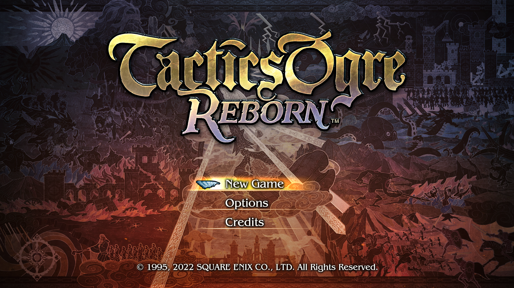</p>

One save-data call did it. `sceSaveDataDirNameSearchPs4` was registered in #2302 and answered
`NOT_FOUND` instead of the old success — a well-argued change whose own commit message noted it was
"not observed being CALLED at any boot depth reached so far". This title calls it, once, and on the
error it drew a single frame and then waited forever.

Nine automated bisect steps over 700 commits found it. The fix answers the question the way the PS5
sibling already does: zero hits, written explicitly, and success.
[#3124](https://github.com/mattias800/prosper/issues/3124)

### Grand Theft Auto V renders its world again

A regression took GTA V's lighting for a day — the bank heist still drew, but unlit and under a grid
artifact. Restored.

<p align="center">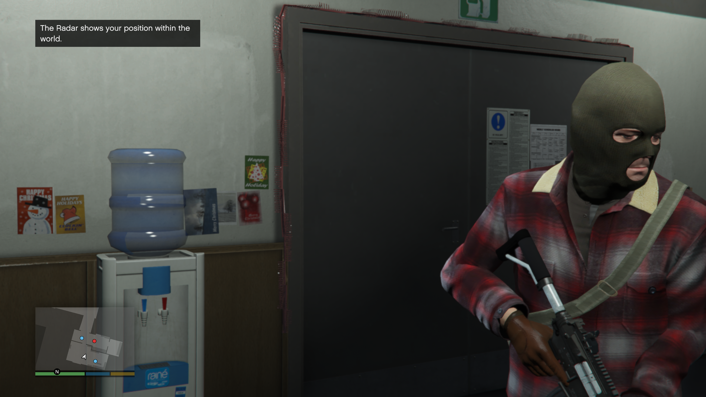</p>

The cause was one line, and the reason it got through is worth more than the fix. #3093 made every
HTILE write discard retained depth, to cure Blue Prince's black frame. It checked GTA and cleared
it on **peak colour coverage — 99.78% in both arms** — but a world drawn with no lighting still
covers 99.78% of the frame. The metric could not see the defect it was chosen to rule out.

Restoring the exception fixes GTA and leaves Blue Prince exactly where it was: 0.2085 non-black in
both arms, the same figure #3093 called healthy. There was never a trade-off between the two titles.

Two hypotheses died on the way, both by measurement rather than argument. A "uniform HTILE plane
means a fast clear" discriminator was checked before being written and is false — GTA's writes are
6,500/6,500 uniform and Blue Prince's 62,000/62,000, all-zero, zero transitions, indistinguishable.
So we still do not know why two identical-looking writes need opposite handling.
[#3121](https://github.com/mattias800/prosper/issues/3121)

## 2026-08-29

### Unbound: Worlds Apart was never rendering-broken — it was reading a stale save

Its whole intro cinematic plays in full colour once the run gets a save directory of its own; the
black screens we had been reading as a broken composite came from a leftover save on the shared box
that made the title resume into a state it draws nothing for.


The title screen also renders continuously now — 40 of 40 samples across 200 s, where the survey a
week ago caught it on about 9%.

## 2026-08-28

### Dragon Quest VII reaches the field

The field HUD is live — minimap, party status, the Pilchard Bay banner — and the player is standing
in the harbour rather than watching it.


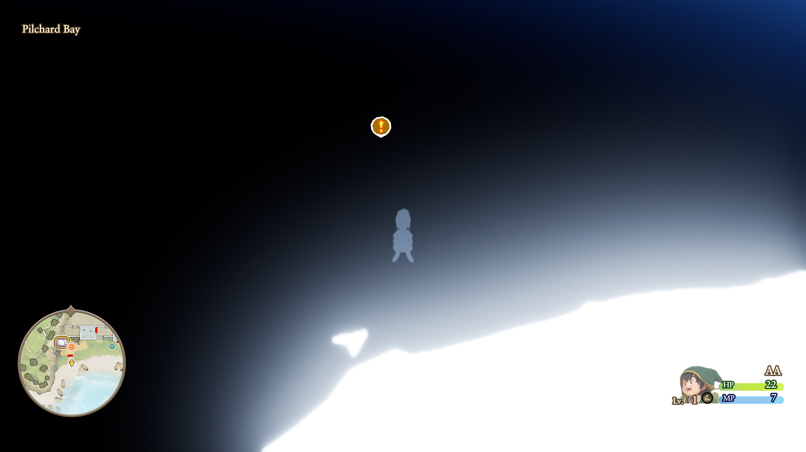

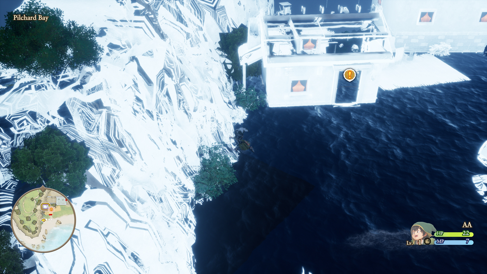

The colour is plainly wrong, and depending on the run a quarter to a half of the frames still lose
the world to the composite — geometry and the HUD are fine; it is the lit-material shading that is
broken.
Nothing was blocking control, though: the opening chapter is simply very long, and every route we
had gave it about forty confirms before deciding it was a wall.

### Blue Prince is back

Master had been rendering a pure black frame; the title screen and its desk of curiosities are
whole again, and the fix costs GTA V nothing.

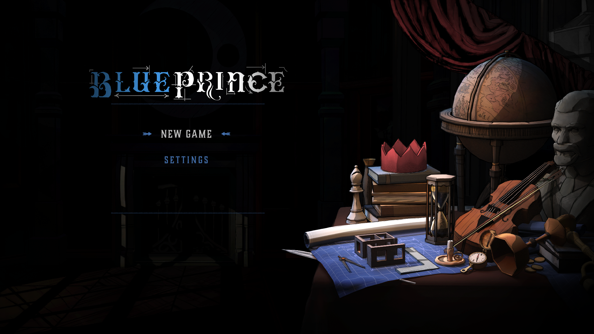

One line in the GTA V rendering foundation stopped prosper from discarding a depth buffer when the
guest rewrote its HTILE metadata with identical bytes — sound-looking, because identical bytes ought
to mean nothing changed. But prosper never writes rendered HiZ back into that guest plane, so the
plane is a constant the game keeps rewriting, and "unchanged" was equally true of Blue Prince's
per-frame depth *clear*. Its depth was never cleared, stale depth rejected every piece of geometry,
and the screen went black. ([#3089](https://github.com/mattias800/prosper/issues/3089))

## 2026-08-27

### Tomb Raider's world really is textured now

Croft Manor's assault course — brickwork, sandstone, mossy wooden platforms, gravel, ivy, Lara, and
Winston bringing the tea.

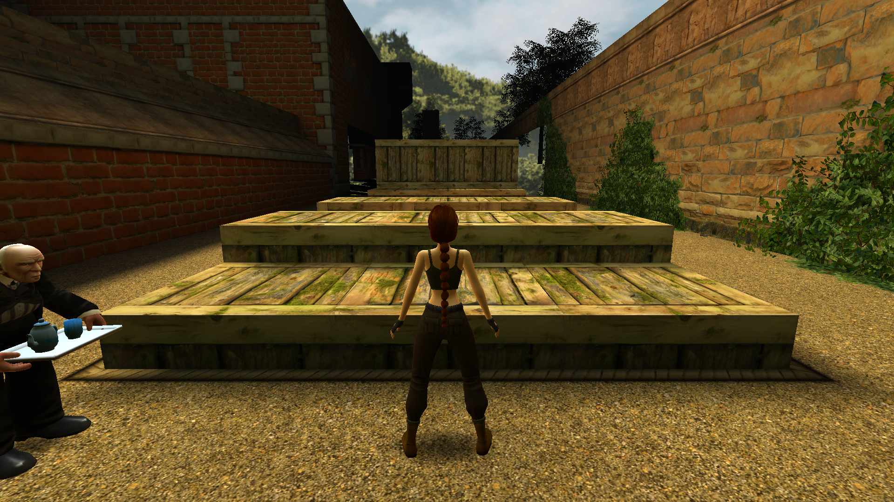

The decode cache was validating 262144 of 90177536 bytes — 0.29% — of the 256-layer world atlas, so
a decode taken while the atlas was nearly empty was reused all run and the walls wore whatever had
been in that memory earlier.
[#2998](https://github.com/mattias800/prosper/issues/2998)


### Windows audio: the underruns are not a pacing bug

Every title crackles on Windows and only on Windows, and the obvious cause — the sink hands the
sound card too little cushion — is wrong. Blasphemous 2's guest produces **84 audio grains a
second against the 187 that continuous playback needs**, so the device queue holds zero bytes at
53% of the moments it is sampled, however carefully the sink paces the half it does get.

Holding a deeper cushion, which is the fix everyone reaches for first, measures *worse*: 69%
empty, matching the pre-fix pacer it was meant to improve on. Removing the pacing makes the
guest deliver less often, not more.

No picture — this one is a number. #3072 has the hunt.


### ~~Tomb Raider's world is textured~~ — RETRACTED, that was a loading screen

**This entry was wrong and its picture is withdrawn.** The image published as Croft Manor's textured
brickwork was the game blitting its own pre-rendered loading picture, `2/PIX/HD/MANSION.DDS` —
pixel-identical to the checked-in capture (mean abs diff 0.02/255, 100% of pixels within 8/255).
Displaying a full-screen 2D image requires no world rendering at all, so it never showed what it was
captioned as showing. The project owner spotted it; no automated check did, and none could have.

It is left here rather than deleted because the blog's own rule is that it records what was claimed
and when. Recorded as instrument trap 230 — it looked *better* than the emulator could plausibly
render, and that is the tell.

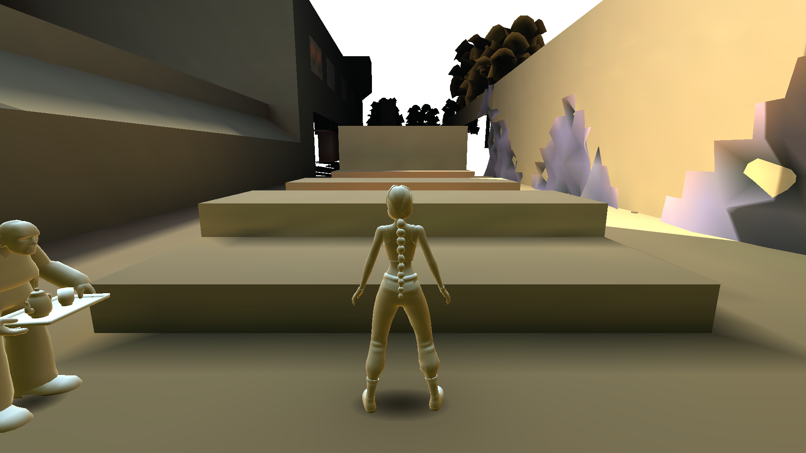

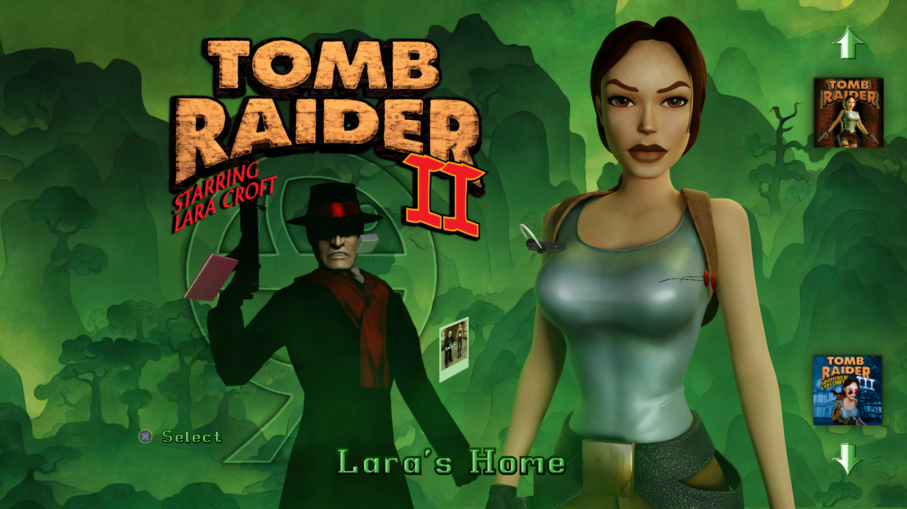

[#325](https://github.com/mattias800/prosper/issues/325) · [#2998](https://github.com/mattias800/prosper/issues/2998)


### What "the wrong surfaces" actually looks like

Lara's Home, and every wall and floor is wearing something real from elsewhere in the game — her
passport, the Game Boy collectibles, an inventory document page.

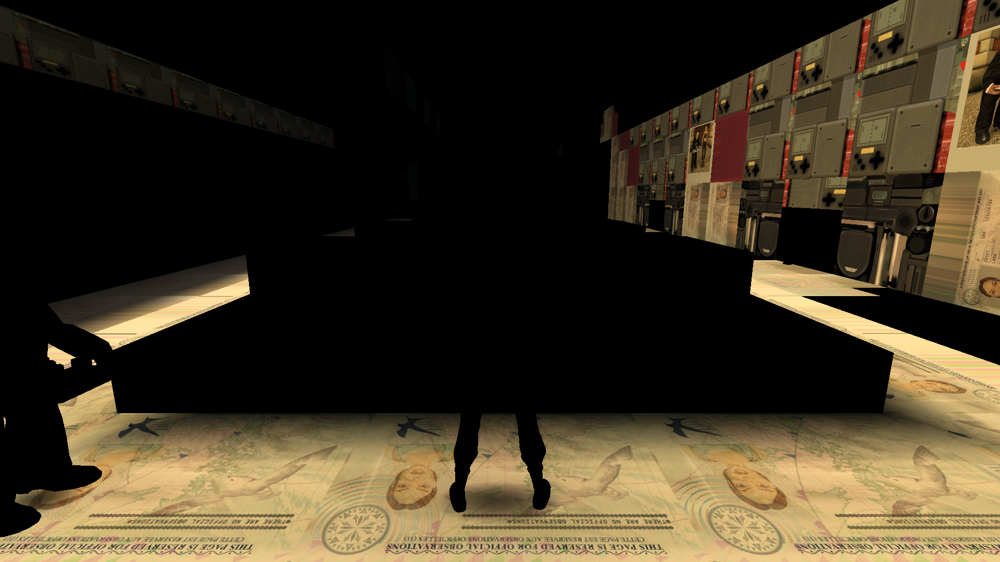

The textures decode correctly and the geometry is right; the wrong content is being selected.
[#2998](https://github.com/mattias800/prosper/issues/2998)


### The Messenger's first level runs at about 156 fps, not 24

Windowed and uncapped on current master — the charter's long-standing "roughly 24 FPS" predates a
change to how frames reach the screen and has not described this title since July.

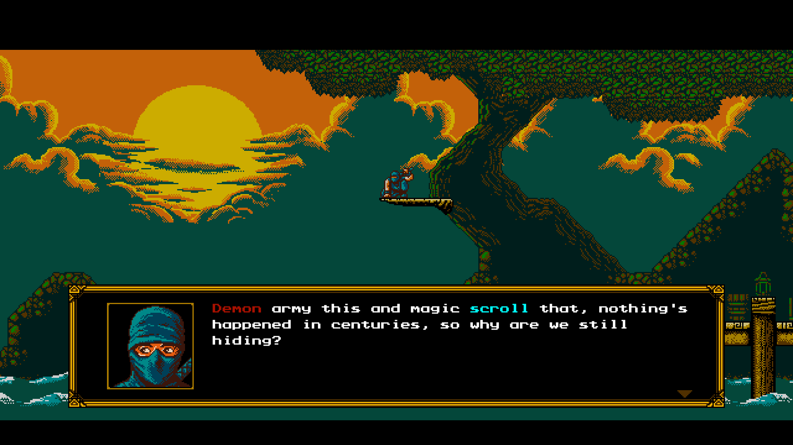

That is a presented rate rather than a count of new frames, so treat it as an upper bound.
[#3083](https://github.com/mattias800/prosper/issues/3083)


### A frame checker that would have called Stray's working menu "nothing rendered"

No picture in this one, because the finding *is* the picture we nearly got wrong. A classifier we
were about to rely on downsamples frames before counting colours — and at 160x90 a 4K frame loses
white menu text on black entirely. It reported Stray's main menu, with START GAME / SETTINGS /
CREDITS and a legible build stamp on it, as flat black with 61 colours. One edit away from writing
that title up as not rendering.

The replacement checks frames at full size, and the thing it looks for is a HUD or notice drawn over
a world that never appeared — which is what separates "this title renders nothing" from "this title
is at rung 2". Pointed at every screenshot in the repo it finds four, three of them the Sonic
Frontiers and Metaphor frames already on record as exactly that.

It also refuses to guess above that line. Coverage and colour count cannot tell a logo from a scene:
in our own screenshots a flat Gameloft splash covers more of the frame than The Messenger's title
art, and that title art uses 36 colours against the splash's 2,159.
[#3059](https://github.com/mattias800/prosper/pull/3059)
## 2026-08-26

### Grand Theft Auto V renders its world

The prologue bank heist on a default launch, with the game's own Performance graphics mode selected —
until now the HUD and radar drew over nothing.

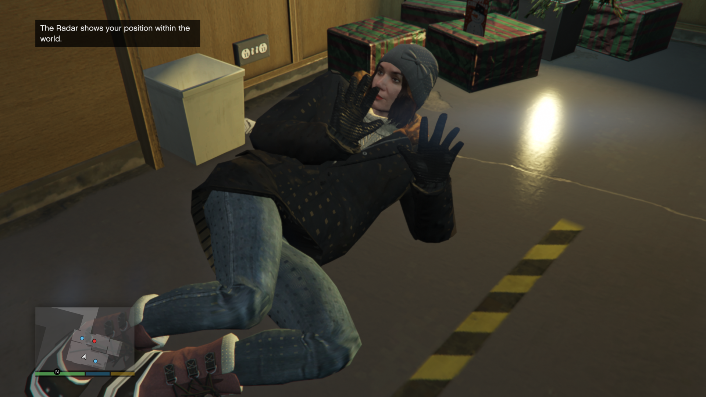

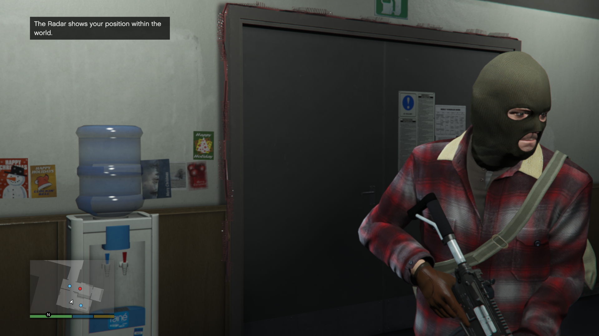

Gameplay runs at a few frames a second, and the texture path is most of the frame.
[#1873](https://github.com/mattias800/prosper/issues/1873)


### Tomb Raider's world stopped being a pile of shards

Croft Manor now renders with correct geometry — same route, same scene, same build, before and after.

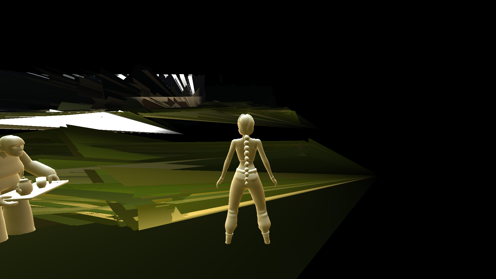

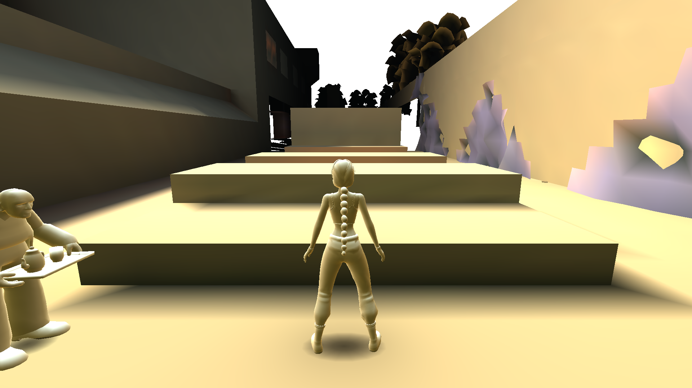

Surfaces are still untextured — that is the next thing. [#2990](https://github.com/mattias800/prosper/issues/2990)

### The fps counter works now, and it can tell a frozen picture from a running one

`--fps` read `no frames published yet` for the whole life of every real game boot, on every platform.
It now shows the presented rate and the rate the picture actually *changes* at, and says
`picture not changing` when those disagree -- which is what a hung title looks like from outside,
since a frozen picture still presents at 60.

No picture: it is a number on a HUD, easier to see by running `--fps` than to photograph.

### Tomb Raider I-III Remastered boots for the first time, and reaches its title screen

We now reach the rendered Tomb Raider I title screen. This title had never been launched in prosper
before today, and it needed no code change at all — only a pad route to clear the game's own 40-page
EULA, which Cross refuses to accept until you have scrolled to the last page.

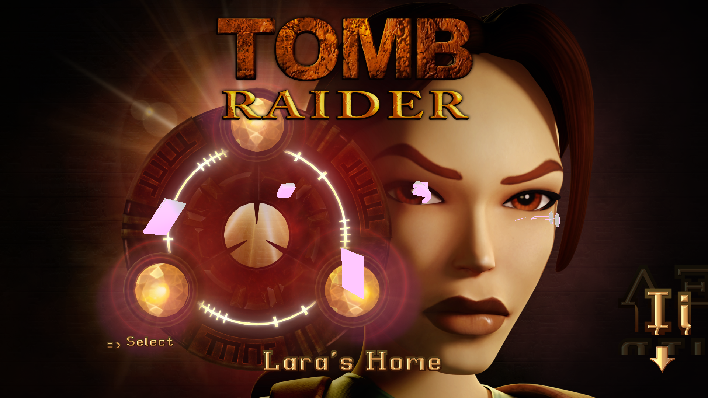

## 2026-08-25

### GRIS has sound now

GRIS used to run in complete silence — no title music, no intro-movie audio, no gameplay music.
The game was asking the console's audio hardware to decompress its music, and prosper was quietly
dropping every single one of those requests. The requests are answered now: the intro movie plays
with its soundtrack, and the music keeps playing through gameplay for the whole session.

No picture for this one — it's audio. Start GRIS and listen.

## 2026-08-23

### Metaphor: ReFantazio can read its own font now, and the first thing it wanted to say was hello in twelve languages

<p align="center">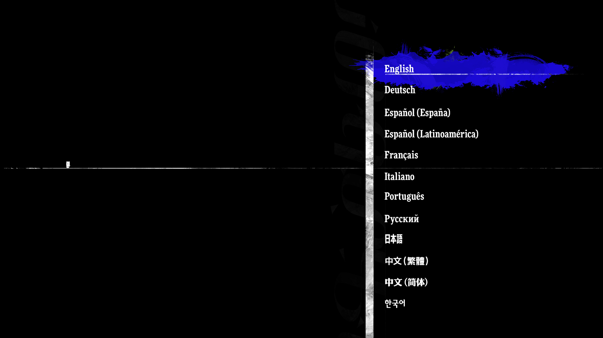</p>

<p align="center"></p>

Sony's font library has a call that draws one letter and then tells you how big the letter it drew
was; prosper had never implemented it, so it politely reported success and left the answer blank.
The game read the blank — whatever the last function to use that piece of stack had left behind,
which happened to be 285,196,807 — decided its letters were two hundred and eighty-five million
pixels wide, ordered a texture that size, got one that was never really built, and divided by its
zero pixel format. Five seconds into every boot, forty minutes of tracing away from the font code.

The fix is not a better number, because there is no honest number to invent: it is a real
rasterizer. The game hands us its own 180 KB font file when it starts, so prosper now reads that
file and draws the actual outlines out of it — which is why the Cyrillic, Japanese, Chinese and
Korean above are all correct. Nothing here is a guess; it is the game's own typeface
([#2951](https://github.com/mattias800/prosper/issues/2951)).

The same change made two facts measurable that had only been suspicions. *Sonic Frontiers* and
*Sonic Origins* both name this font library in their binaries, so it looked like a plausible cause
for Sonic Origins' missing wordmark — but neither title imports a single function from it, and
counting is what settled that rather than argument. And Astro Bot, which imports fifty-four of
them, was quietly missing one all along.

### Metaphor: ReFantazio was byte-reversing four gigabytes of its own heap

No picture — the frames it now produces are still black. We had been telling the game about memory
it could not actually reach, and it handled the resulting refusal by asking its endian converter to
byte-swap "however many bytes I just read", which was the error code. It now loads its assets,
opens its audio and publishes frames before dying of something else
([#2934](https://github.com/mattias800/prosper/issues/2934),
[#2951](https://github.com/mattias800/prosper/issues/2951)).

### Two Unreal titles were being quietly charged 2 GiB for memory they never got

No picture with this one — neither title renders yet. *Sifu* and *The First Berserker: Khazan* both
die a few seconds into boot with Unreal's own out-of-memory report, and the suspicion was that
prosper's direct-memory pool really had run dry. Half of that turned out to be true in a way nobody
had spotted: every time the guest asked us to place a buffer somewhere we had to refuse, we took the
physical memory for it anyway and then forgot we had it. Khazan does that 4,646 times per boot and
Sifu 31,716 times, so Sifu was losing nearly two gigabytes of the pool to allocations that never
existed. That is now fixed.

The other half is the more useful finding, and it is a negative one: with the leak gone, both titles
still assert — and at that moment prosper's pool still has a 230 MiB block free and has failed no
allocation the guest asked for. So the pool was never what stopped them, and whatever is really
going on is inside Unreal's own allocator. Those thousands of refused mappings are not a loss
either: prosper refuses them precisely because the guest already has memory there, and refusing is
what stops us overwriting it. Details in
[#2908](https://github.com/mattias800/prosper/issues/2908).

### The same captured frame, replayed twice, two different pictures

<p align="center">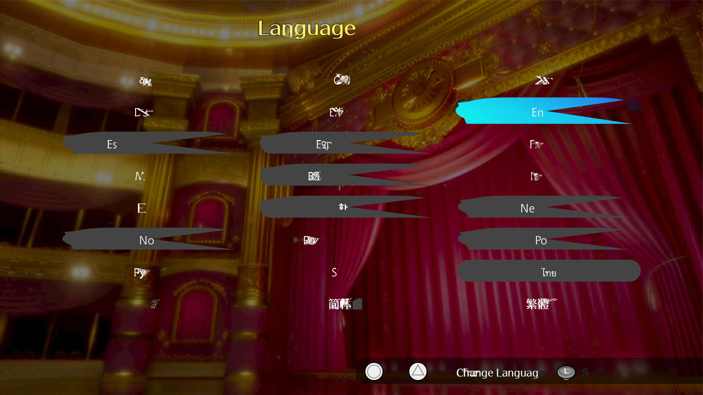</p>

<p align="center">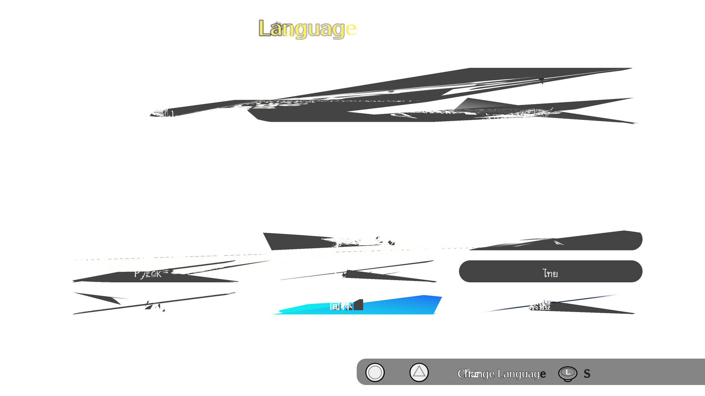</p>

Both of those came out of **one captured file**, replayed offline by `gpu_replay` on the same
binary minutes apart, with no game running. That is the defect: some of BALAN's menu draws
intermittently produce no geometry at all, so the panels and letters that should have covered the
screen shrink to slivers or disappear, taking the theatre backdrop with them - and it is the same
fault that leaves several other titles showing a flat white frame. It is now reproducible from a
single draw in about three seconds instead of a two-minute boot, and there is a long list of things
it is not: [#2945](https://github.com/mattias800/prosper/issues/2945).

## 2026-08-22

### New Joe & Mac: Caveman Ninja plays start to finish

<p align="center"></p>

<p align="center"></p>

We play this one through, and have done for a while — it is rung 6 with a reviewed `joe-mac-gameplay`
snapshot guard, and it had somehow never appeared here. Tracker
[#1876](https://github.com/mattias800/prosper/issues/1876).

## 2026-08-22

### BALAN's language menu was never waiting for Cross

<p align="center">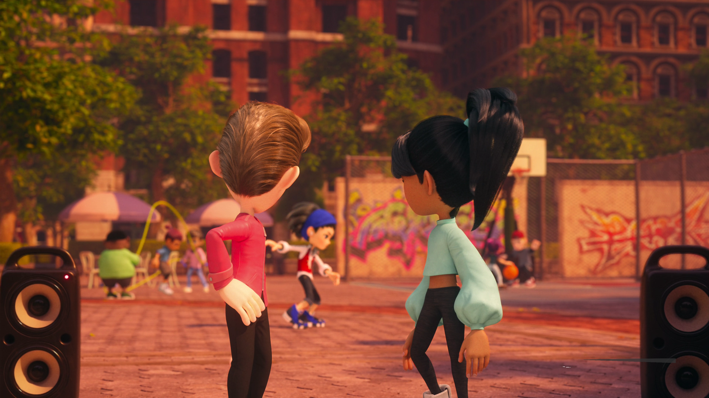</p>

Three titles sat on a screen whose own prompt named a button. Only one really was waiting for it.
BALAN's language menu answers Cross with a modal — *change the language to English?* — that 109
Cross presses never got past; **Down** does, and behind it are the title screen, the main menu, and
this, the opening cutscene — 3070 decoded 4K pictures. Unbound wanted **Square**, the button its
cinematic actually asks for. Trackers [#2882](https://github.com/mattias800/prosper/issues/2882), [#2883](https://github.com/mattias800/prosper/issues/2883),
[#2886](https://github.com/mattias800/prosper/issues/2886).

### The eight titles nobody had ever run

<p align="center">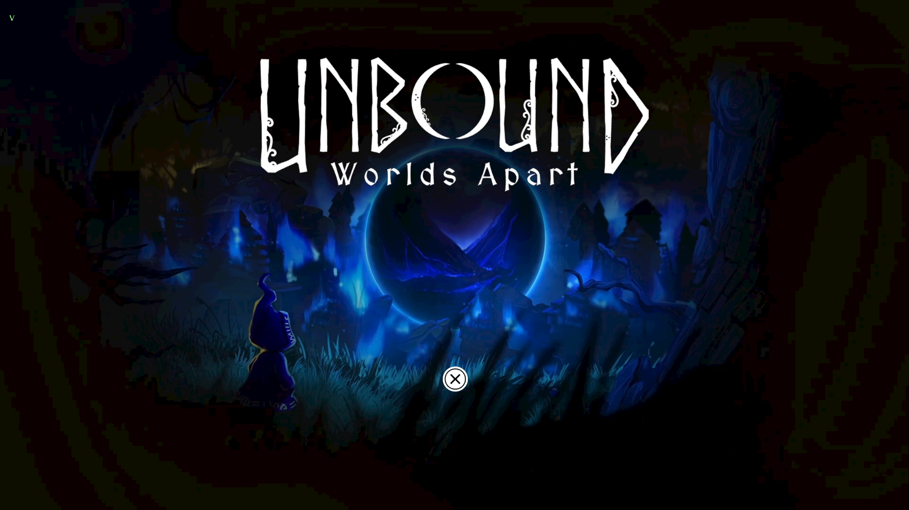</p>

<p align="center">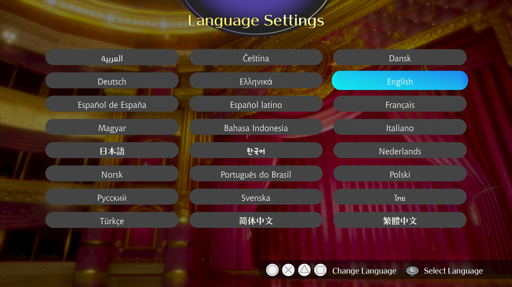</p>

<p align="center">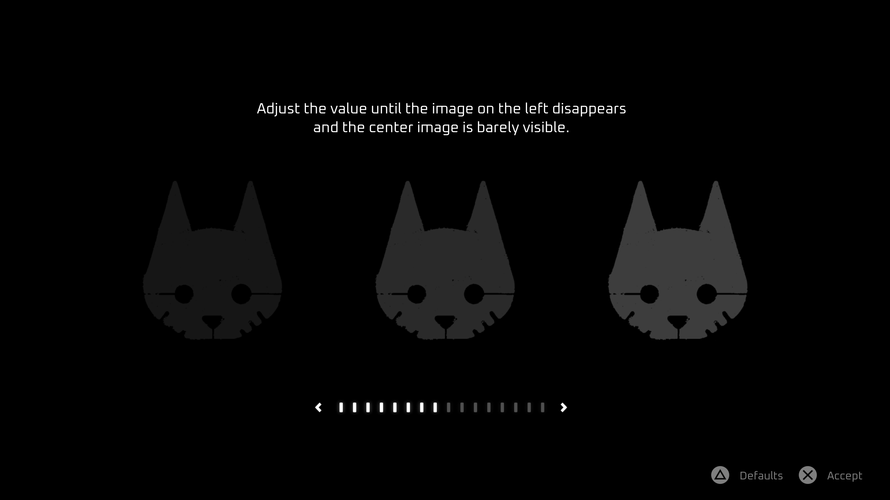</p>

<p align="center"></p>

Eight tracked titles had never been booted. All eight now have: three reach a menu or title screen,
one a logo sequence, four render nothing. *Unbound* is the best of them — that is its real title
screen, on 9% of frames. The point was the comparison, not the eight runs: what they share is
symptoms, and every rung-0 wall is its own.
[`NEVER_BOOTED_SURVEY_2026_08.md`](prosper/docs/NEVER_BOOTED_SURVEY_2026_08.md).

### Sonic Origins reaches its title screen, and the wall was a dialog box

<p align="center">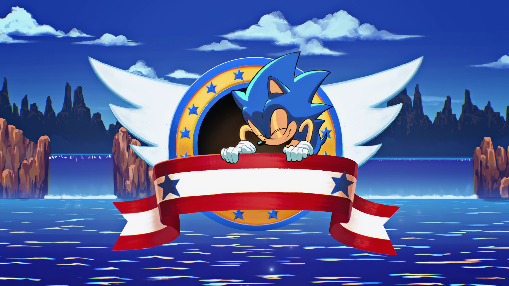</p>

<p align="center">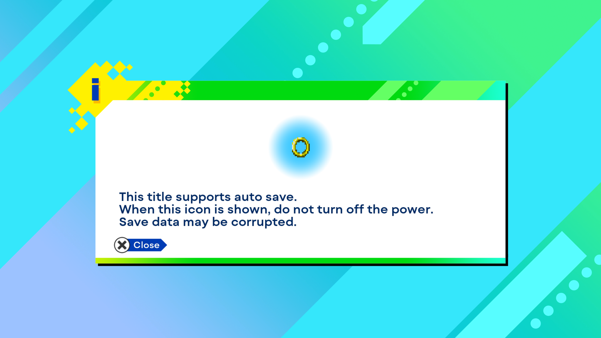</p>

The most-investigated title in this repository, and the last wall was a modal waiting for CROSS.
Nine lanes went at its black startup frame. What finally moved it was tonight's save-data fix — the
guest loops on `cmp eax,0x809f0018` and sleeps, and prosper returned exactly that. Rung 1 to rung 2.
The banner is empty because the wordmark never draws
([#2920](https://github.com/mattias800/prosper/issues/2920)).
### Sonic Origins' SONIC TEAM logo is blue

<p align="center">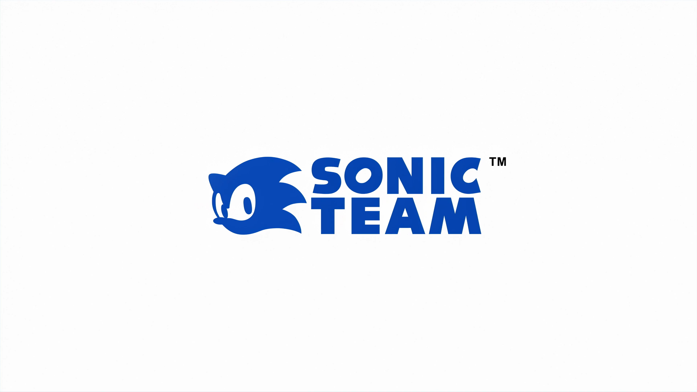</p>

The 2026-08-20 entry further down this page has the same frame in **purple**, and that was an
honest record of what prosper drew that day: every movie in the title composited with its two chroma
components collapsed onto one, so a gold ring rendered green and anything blue rendered magenta.
[#2731](https://github.com/mattias800/prosper/issues/2731) is fixed, and this is the same logo from
the same route on current master — a direct, unmodified `tools/screenshot` capture, default launch
with no input, sample 14 of a 420 s run at t=150 s. The old entry stays where it is.

Refs [#2904](https://github.com/mattias800/prosper/issues/2904).

### Beast of Reincarnation: the whole game was under a coat of white paint

<p align="center">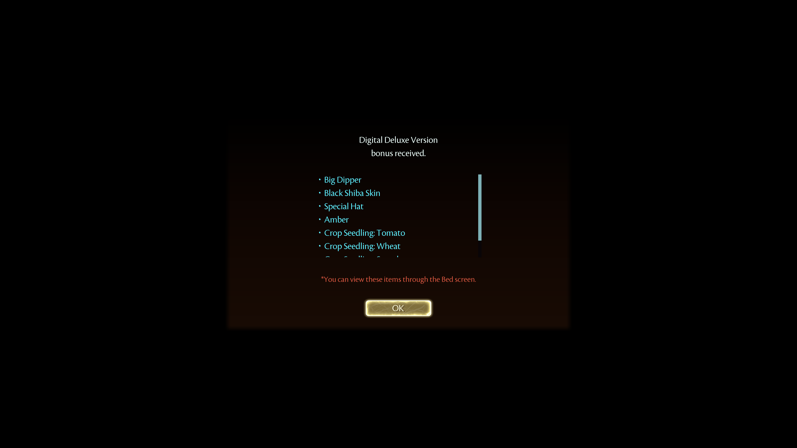</p>

<p align="center">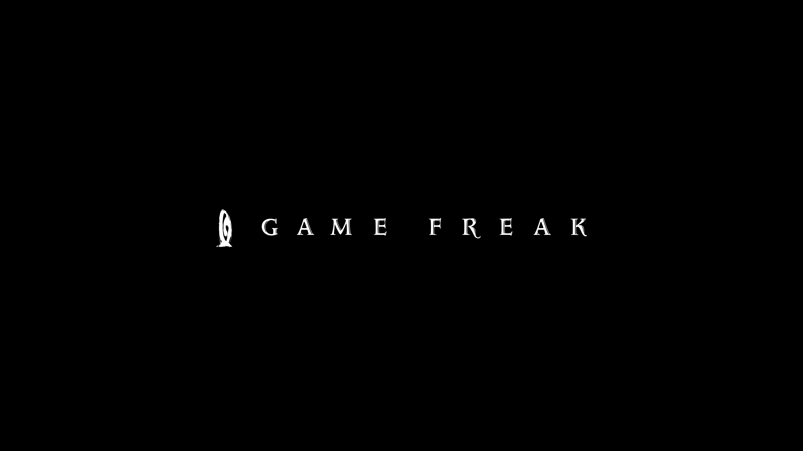</p>

Game Freak's first PS5 title, and the corpus's second confirmed UE5. A default launch shows a flat
white 4K frame for four minutes, while the guest runs happily and prosper renders hundreds of draw
batches a second. Two causes: a missing SDWA instruction form dropping 404 draws a run, and 8,192
fast-clear-eliminate draws painted as ordinary colour
([#1588](https://github.com/mattias800/prosper/issues/1588)). Under a default-off lever, this is
underneath.
### Gollum's boot was killed by a divide by zero, and the divisor was a channel count nobody wrote

`libSceAudiodec` was entirely unimplemented, so its nine entry points fell to the dispatcher's
`return 0` — which is `SCE_OK`. Unreal's Electra player believed it had an AAC decoder, ran a decode
that wrote nothing, and divided by the channel count nothing had written. Now implemented against the
real ABI, recovered from the title's own call sites. Still rung 0; next blocker
[#2898](https://github.com/mattias800/prosper/issues/2898).
### Hi-Fi RUSH reaches its title screen on the first try

<p align="center">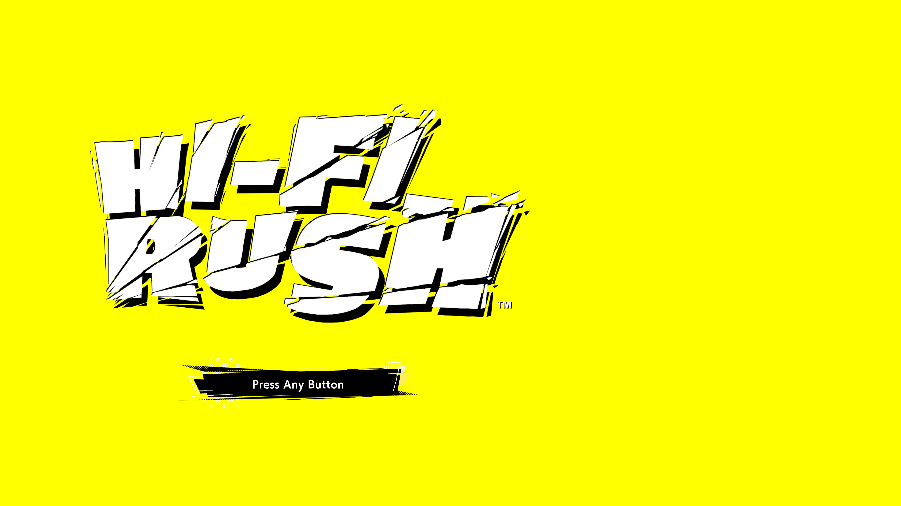</p>

<p align="center">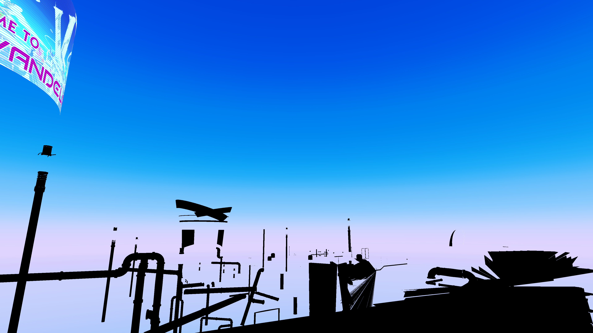</p>

Added to the library in the evening, at its title screen a few hours later — 281 ms to
`BOOT_COMPLETE`, default launch, no throttle, no pad. The second picture is the Vandelay rooftop,
where geometry, depth and the sky gradient are all correct and every opaque surface is a silhouette,
which narrows the defect nicely.
### Khazan spent four seconds booting and then waited forever for one wrong hexadecimal digit

All 79 threads parked in a syscall, `sceSaveDataGetEventResult` polled 5,020 times in 90 seconds.
The guest's wait loop accepts exactly one value; prosper answered the code meaning *"still in
flight"*, returned when nothing was in flight. Run as a control, *Earthion* turned out to have had
its whole save-data subsystem dead for the same reason.
### PGA TOUR 2K25 told us exactly what was wrong, in English, and it was not what it said

*"PSN is an old version that cannot be used by the current player runtime"* — and nothing was old,
and no module was missing. Unity's PSN native half links into the user-assemblies module, prosper
started it with a null parameter block, and the mismatch branch's own error message read the version
off that null pointer. The error handler was the crash.
### Yakuza Kiwami allocates its entire game heap through a Sony API nobody had implemented

No picture with this one — the title still does not render. The finding is what moved.

*Yakuza Kiwami* (`PPSA31334`) died **0.0 seconds** into every boot, writing to address `0x1d0000`.
That address is the tell: it is far too low to be a real guest pointer, and it is what you get when
an allocator is handed a base address of roughly nothing and starts walking.

The base came from `sceAmprAmmGetVirtualAddressRanges`. AMM is the memory-mapping half of
libSceAmpr — the same command-buffer construct prosper already used for asynchronous **file reads**,
pointed at pages instead of bytes — and this title runs its *whole* game heap through it: it asks
AMM for up to 512 GiB of address space, hands it 10 GiB of physical memory, and then maps 2 MiB
chunks in on demand for the rest of the run. All seven of the AMM entry points it needs fell to
prosper's unimplemented default, which returns 0 and writes nothing.

Returning 0 sounds harmless. It is not, when the guest is reading your *out-parameters*: the
initialiser reaches that call on a path that never zeroes its own struct, so "wrote nothing" meant
the allocator took its virtual-address window from whatever was left on the stack. Everything after
that was the allocator faithfully doing what it was told.

With AMM implemented the boot now reserves a real 68 GiB window, takes its 10 GiB pool, and services
23 map commands before it gets somewhere new — far enough to initialise save data and start loading
assets, where it stops with the game's own message:

```
Failed!! Load Devil2 Shader Archive
Failed!! Load Ptc Shader Archive
```

That is the next wall, and it is a different one: `sceAmprAprCommandBufferReadFileGatherScatter`
([#2872](https://github.com/mattias800/prosper/issues/2872)), the scatter/gather sibling of a file
read prosper already implements. The archives never arrive, so the object is null, so the next
method call dereferences it. Still rung 0 — but the fault moved from the memory allocator to the
asset loader, which is the direction that counts. Tracker
[#2864](https://github.com/mattias800/prosper/issues/2864).

One footnote worth having: this turned out not to be a one-title fix. *Judgment* (`PPSA02739`),
onboarded the same day, imports **all seven** of the same AMM entry points — and both of the follow-up
gaps too, the scatter/gather read and AMM's `Unmap`. Checked by NID against its own import table,
not inferred from the shared publisher.

### Our first CryEngine title deadlocks 81 ms in, on a library it never asked for

No picture this time — the interesting thing about *Sniper Ghost Warrior Contracts 2* (`PPSA03130`)
is that there was nothing to photograph, and *why* there was nothing.

The first boot attempt produced no screenshots, no log past the renderer line, and an empty
manifest. That is a shape worth recognising, because it reads like a defect and is not one: the run
had been killed from outside. `tools/screenshot --timeout` cannot fire during boot — the deadline is
checked inside the sampling loop, and that loop is only reached after `boot_program()` returns.
`boot_program()` ends by running the guest's own module initialisers, so a title can sit inside it
forever with the tool's own limit inoperative.

prosper has recorded seven boot phases for a long time. It turned out **no build the project ships
could print any of them** — the feature was compile-time optional, the default build excluded the
whole folder from `prosper_core`, `enable()` was never called anywhere in the tree, and nothing
subscribed to the event bus. Four independent reasons, any one sufficient. `PROSPER_BOOTPHASE=1` now
prints them, and the answer arrived in one run:

```text
[bootphase] +80.6ms MODULES_MAPPED
[bootphase] +81.0ms STUBS_INSTALLED
[bootphase] +81.1ms GUEST_INITS_RUNNING     <- and BOOT_COMPLETE never comes
```

Not slow, not starved — **stuck**. Over 221 s the process used 0.00 s of CPU and read 0 bytes, with
every thread parked in a futex. `guest_bt` named the frame: the `module_start` of
`sce_module/libSceNpCppWebApi.prx`, a library this title **does not import** (its own NP library is
the unrelated `libSceNpWebApi2`). prosper preloads it because the file exists, under a rule added for
*Sonic Origins*, which really does import it. Remove that one file from the tree and the same binary
reaches `BOOT_COMPLETE` in 70 ms and runs.

So a module preloaded for one title had been silently wedging another, and the fix is to preload it
only when something actually imports it.

Which raised the obvious question a reviewer asked and I had not: *how many titles does that change?*
I had checked two. The answer is a census — across the tracked titles, 42 ship that PRX, 40 keep it, and two
lose it: this title, and **Sonic Frontiers**, which nobody had looked at and which has no snapshot
guard to notice. It appears to be harmless (import resolution is by NID, and not one of the 41,638
NIDs that module exports is imported by anything in Frontiers' link graph) but "appears to be" is the
honest phrasing, and a confirming boot of Frontiers belongs to the lane that owns it. A flag on a
shared list is never a two-title question.

Behind that wall the title is still at rung 0, and honestly so. Unmodified, with the fix in, it
boots in 91 ms, streams its assets, and drives a 4K present loop at ~21 flips a second — while prosper
composites exactly nothing. Every sample is a raw guest scanout: one distinct colour, zero non-black
pixels, `published_frames=0`. Two runs on two different trees agree, so it is not an artifact. The
next wall is that no pass produces a present source at all — an ordinary graphics problem, and a much
better place to be than a deadlock.

One footnote worth keeping, because it nearly became a finding. Mid-run the thing looked *parked*: 1 %
CPU, no disk reads, eighteen threads asleep, and exactly one of them — Wwise's `AK::BankManager` —
blocked on a mutex while everything else waited on conditions. That asymmetry reads like a deadlock
with a culprit's name attached. It wasn't; the run resumed thirty seconds later. The box was 70-90 %
I/O-stalled by an unrelated archive extraction the whole time, and a warm page cache meant the "no
disk reads" number was measuring the wrong thing entirely — the read *syscalls* were climbing fine.
A mutex wait is not proof of a deadlock. The holder may just be slow.

### Sonic Frontiers' black world had two locks on the door, not one

No picture in this one — the world is still black. What changed is that we now know how far away it
is, and the number is smaller than it looked.

The Cyber Space stage reaches gameplay with a running clock, and the world behind the HUD is black
because sixteen of the stage's compute programs never execute. Three of them are the ones that
matter: screen-width passes over the frame the player is supposed to see. Their reject line has
named `image_load_mip` for a while, and the issue tracking it said so: *the* single remaining
blocker.

A reject line cannot say that. The recompiler stops at the **first** instruction it cannot lower and
reports that one; it has no way to tell you what is behind it. So we built a throwaway measurement
build — accept `image_load_mip` at LOD 0, knowingly wrong, never merged, run it where nothing is
submitted — purely to ask "and then what?". And then the same three programs stopped again, all of
them, on `s_getpc_b64`.

That second lock turned out to be a small one. The compiler had put a little constant table straight
into the shader blob and addressed it PC-relatively, which prosper already folds — but only when the
table is read back with an *untyped* load. Frontiers reads it with a typed one,
`tbuffer_load_format_x` at `32_FLOAT`, which is a 32-bit format that converts nothing, so the bytes
it fetches are the bytes that are there. The fold was already correct for it; a guard spelled
"untyped only" was the whole obstacle. That is what this PR fixes.

Two things nearly went wrong on the way, and both are the same shape — a check that looked like a
check. A typed fetch also honours the descriptor's channel routing, which the untyped one ignores,
and this game's table descriptor routes three of its four channels to a constant zero; the first
version of the fix only looked at the format, which would have been right here and silently wrong one
instruction over. And the test written to pin the *second* correction passed under a mutation that
deliberately broke the thing it was pinning — it was asserting "did the program compile", and that
program does not compile for an unrelated reason, so it could never have failed. It asks the detector
directly now.

With both cleared, all three programs vanish from the skipped list — they recompile and they run.
(Only one of the two is fixed here. The other is still open, so this measurement was taken with a
throwaway build that waves the mip instruction through at level zero — deliberately wrong output,
never merged, run where nothing is submitted. It answers "is anything else in the way", and the
answer is no.)

```text
before   [compute-census] 65536 dispatch decisions over 30 program(s)   13 programs listed, all executed=0
after    [compute-census] 65536 dispatch decisions over 30 program(s)   10 programs listed
         gone: 0x2005714000 (3840x135)  0x2005717e00 (3840x405)  0x200571bd00 (3840x270)
```

So the remaining work on those three really is one instruction now, which is what everyone thought
yesterday and was not true yesterday. And we know what it has to read: the guest builds itself a
2048x2048 two-channel float pyramid and binds **thirteen** descriptors to it — one per mip level to
write each one, plus one whole-chain view to read the finished thing back. The levels are sitting in
guest memory the whole time, at offsets prosper already computes correctly for each of those twelve
single-level descriptors. It just has never been able to look at them together.


### The Messenger's title screen runs at 206 fps and 0 fps at the same time

<p align="center">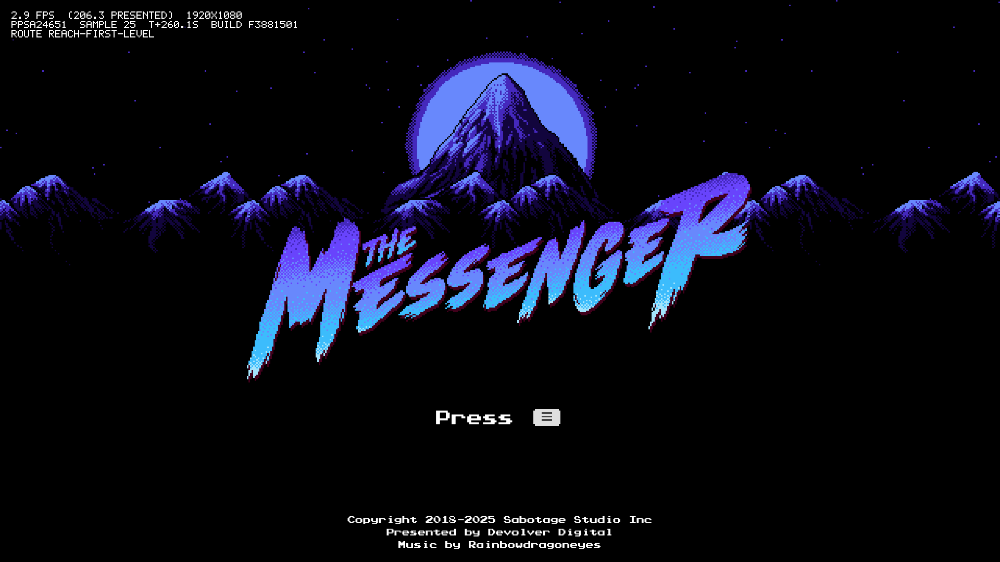</p>

That counter is burned in by the new `screenshot --fps-overlay`, and both numbers are true. prosper
handed this picture to the display **206 times a second**. Across one 120-second stretch of that run
it published **25,015 frames and exactly one of them differed** from the frame before it. It is a
still image being re-served at full speed.

Nothing is wrong here: it is a title screen, and a title screen is allowed to sit still. The point is
that **a framerate counted from presents cannot tell this apart from a hung game.** That is not
hypothetical — it is how R-Type Delta's regression (#2783) hid for nine days while the guest reached
stage 1 and every presented frame was the same retained one. Any counter we shipped that reported
"206 fps" here would have reported it there too.

So prosper now counts **distinct guest frames** — publications whose pixels actually changed — and
every place a framerate appears shows both, honest number first. `PROGRESS_TRACKER.md` has an FPS
column for it, sourced from a new `FPS record:` line in the game trackers.

### And the first real number: Blue Prince at 4.7 fps

<p align="center">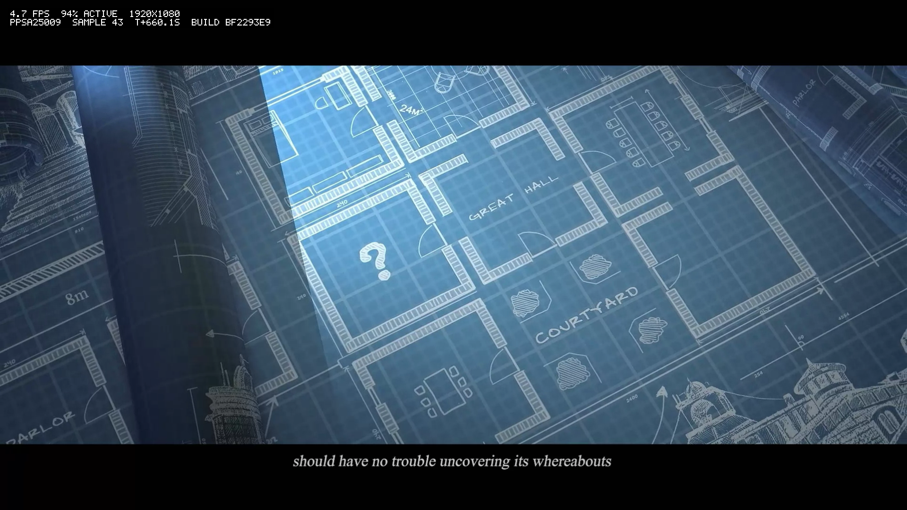</p>

The Day One opening cinematic, at native 1080p with no snapshot acceleration, over fifteen minutes.
**4.7 frames per second, and 95% of the run was spent producing them** — that second number is what
says the measurement is honest rather than an average of a fast stretch and a frozen one. The rate
never left the 4.53–4.80 band across all 59 windows. (The overlay in the shot reads 94%, because it
is the running figure at that moment; 95% is where the full run finished.)

This is the "we have work to do" end of the scale, and it is now written down where you can find it
without re-running anything. For comparison the same instrument reads The Messenger's animated
stretches at 15–23 fps.

### Why The Plucky Squire's cutscene never ends

No picture for this one — it is a measurement, and it replaced a guess that had been sitting in the
notes as the frontier.

The record said the route "stops driving input at 525 s", implying the cutscene was waiting for a
button. It is not waiting at all. It advances roughly **300x too slowly to finish**, and two facts
multiply into that:

- the guest's tick rate **collapses 147x** when the 3D world streams in — about 25 polls per second
  in the menus, **0.19** once the level loads;
- in-game time advances **per flip, not per second**. That is deliberate and correct — each flip is
  budgeted one refresh interval — but it means the game clock moves ~16.7 ms per flip however long
  that flip actually took.

At 0.19 flips per second, a 60-second intro needs hours. The 1,200-second run that "never reached
gameplay" had bought a few seconds of it.

It is demonstrated rather than argued: raising only the flip rate walks the guest straight past the
intro to the storybook camera. So the wall is throughput, and the title is CPU-bound in texture
realization — the GPU sits at 5-16% throughout.

### Two more titles reach gameplay — and one reaches it in the dark

**Beneath** (`PPSA27640`) plays. This is the opening dive aboard the science ship: the waypoint
marker counts down as you move, and the characters talk over it. A cutscene would not have a live
distance readout, which is how we know it is the real thing.

<p align="center">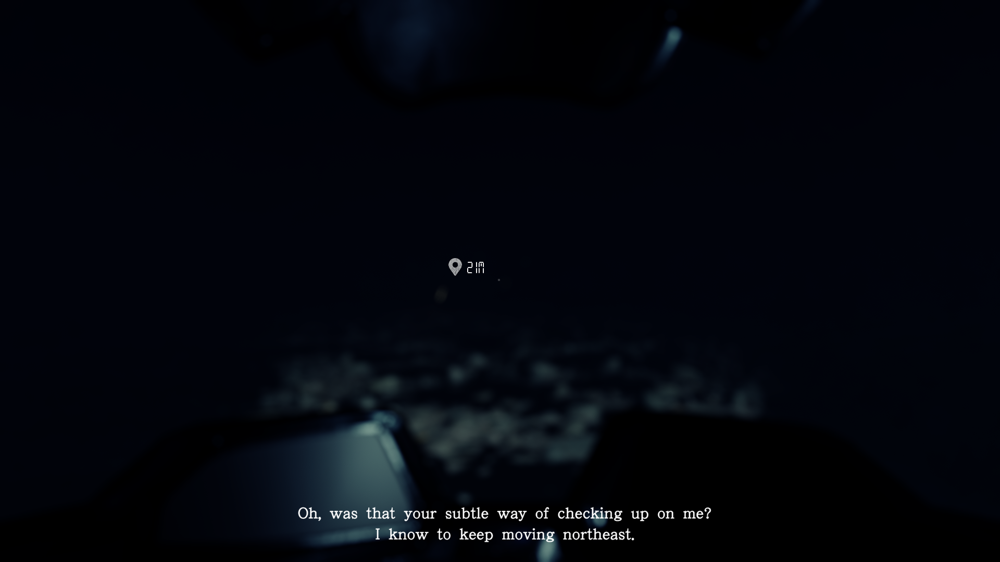</p>

It is very dark, and that is the game rather than us — but it is worth an eye-check when this one
comes up for manual verification. Getting here needed no renderer work at all; the title was one
input route away. What it *did* need was `PROSPER_NULL_PAGE=1`, and the reason is a nice one: the
game's stack unwinder walks one hop past the end of the frame-pointer chain **on purpose**, because
it stops on a null return address rather than a null frame pointer. We enter the guest with `rbp`
zeroed — which is correct — so that last read lands on address `0x8` and faults. The flag gives the
guest back a low page that reads as zero, which is what the console gave it.

### R-Type Delta, blank for nine days, draws stage 1 again

<p align="center">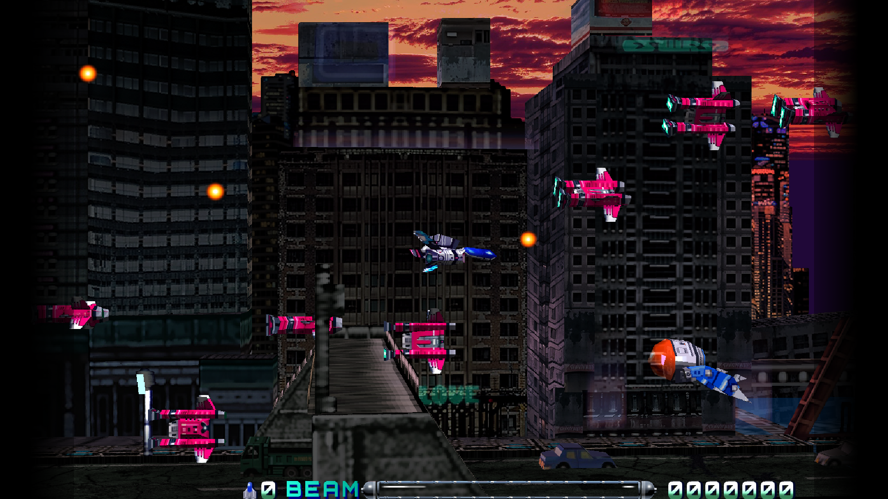</p>

The R-9, its Force pod, enemy formations, and a city at sunset. This one is a good story. For nine
days the title rendered its logo and its whole opening movie and then went blank forever — the guest
was fine, reaching stage 1 and writing its save, while prosper published the same retained frame on
every flip.

One shader did that. `sprite_i_vv.ags` is the title's **sprite vertex shader**, so it draws the
menus, the HUD and the gameplay — everything except the logo and the movie, which is exactly the
symptom. The recompiler had been refusing it since a change in August that saved a wave mask in a
register pair and never ended that lifetime; when the shader later reused the same pair for an
ordinary table address, the stale mask made it look like ballot bits and the read was refused.

Reaching it also needed a route, and the title screen taught us something: its prompt is the PS5
**OPTIONS** glyph, not Cross. A Cross-only route sits there forever.

### Sonic Frontiers reaches Cyber Space — and the world is black

<p align="center">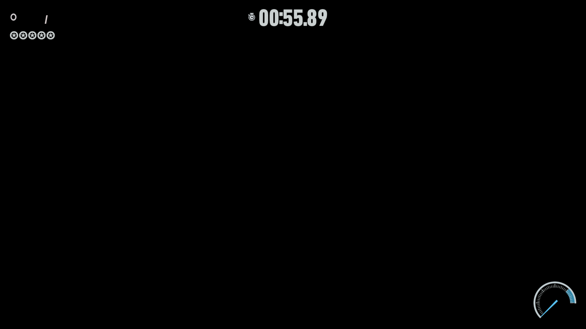</p>

Not a pretty picture, and it is here because it is honest. That is a real running stage — the clock
reads 55 seconds, the speedometer needle moves, the music plays — with a hundred streamed terrain
sectors behind a world that never draws. Sixteen of the stage's thirty-two compute programs never
execute.

Three separate recompiler fixes have now unblocked programs on this title and changed **zero
pixels**, so we have stopped assuming the next one will be different. It also prompted a rule
change: reaching gameplay is no longer enough for rung 3, which now asks that the scene actually
render. Frontiers and *Grand Theft Auto V* both sit at rung 2 because of it. Neither regressed —
we just stopped counting a black screen as a win.

## 2026-08-20

### dragon-quest-vii-opening-chapter.png

<p align="center">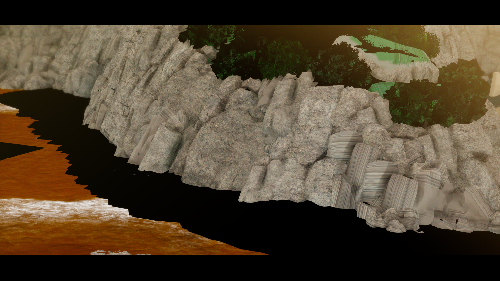</p>

feat(dq7): the route reaches the opening chapter in Estard, and Unreal titles get an IoStore package oracle (#2779)

`0ea7868c` · [`assets/screenshots/dragon-quest-vii-opening-chapter.png`](assets/screenshots/dragon-quest-vii-opening-chapter.png)

### bendy-dark-revival-gameplay.png

<p align="center">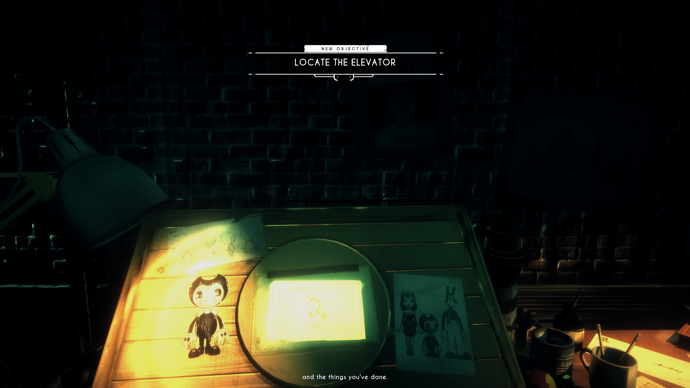</p>

feat(bendy-dark-revival): rung 2 -> rung 3 — a route reaches the PPSA27624 Chapter 1 sections (#2769)

`5501dd45` · [`assets/screenshots/bendy-dark-revival-gameplay.png`](assets/screenshots/bendy-dark-revival-gameplay.png)

### tales-graces-f-gameplay-dialogue.png

<p align="center">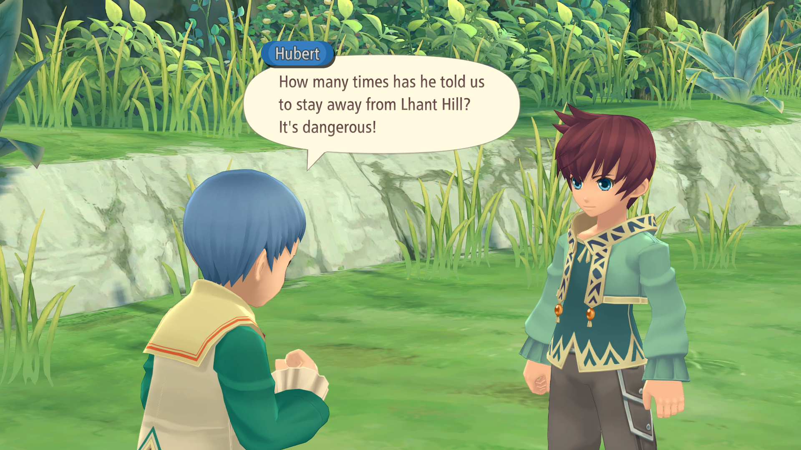</p>

feat(route): Tales of Graces f Remastered reaches gameplay -- the wall was two OPTIONS-button gates, not the renderer (#2763)

`f249929d` · [`assets/screenshots/tales-graces-f-gameplay-dialogue.png`](assets/screenshots/tales-graces-f-gameplay-dialogue.png)

### tales-graces-f-gameplay.png

<p align="center">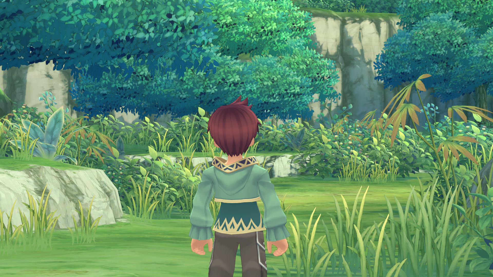</p>

feat(route): Tales of Graces f Remastered reaches gameplay -- the wall was two OPTIONS-button gates, not the renderer (#2763)

`f249929d` · [`assets/screenshots/tales-graces-f-gameplay.png`](assets/screenshots/tales-graces-f-gameplay.png)

### sonic-origins-sonic-team-logo.png

<p align="center">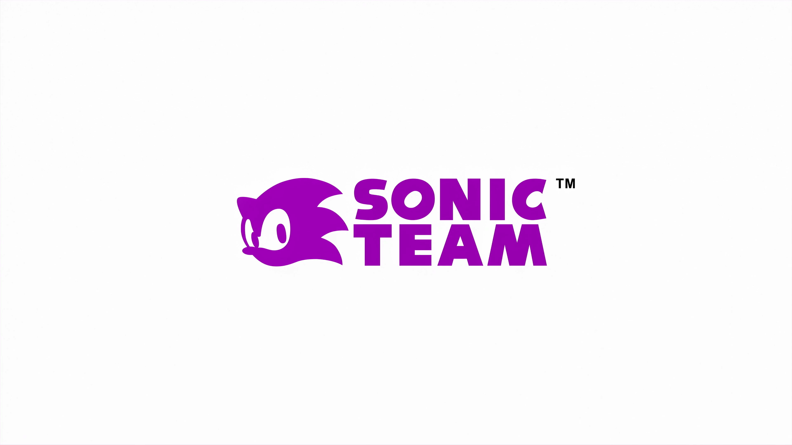</p>

docs(compat): refresh the checked-in visual evidence, and repair two trackers that deny screenshots already on master (#2737)

`29f4db65` · [`assets/screenshots/sonic-origins-sonic-team-logo.png`](assets/screenshots/sonic-origins-sonic-team-logo.png)

### tales-graces-f-title-no-input.png

<p align="center">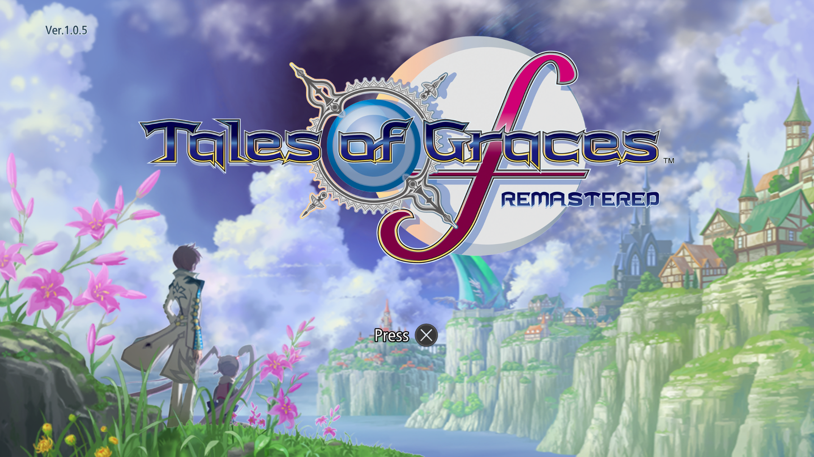</p>

docs(compat): refresh the checked-in visual evidence, and repair two trackers that deny screenshots already on master (#2737)

`29f4db65` · [`assets/screenshots/tales-graces-f-title-no-input.png`](assets/screenshots/tales-graces-f-title-no-input.png)

### issue-2731-tales-graces-f-movie-chroma.png

<p align="center">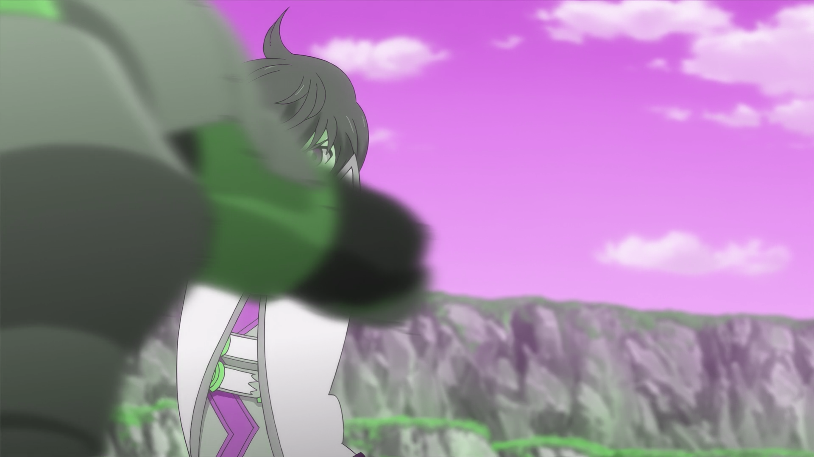</p>

docs(compat): refresh the checked-in visual evidence, and repair two trackers that deny screenshots already on master (#2737)

`29f4db65` · [`prosper/docs/screenshots/issue-2731-tales-graces-f-movie-chroma.png`](prosper/docs/screenshots/issue-2731-tales-graces-f-movie-chroma.png)

### issue-2734-little-nightmares-3-corrupt-save-modal.png

<p align="center">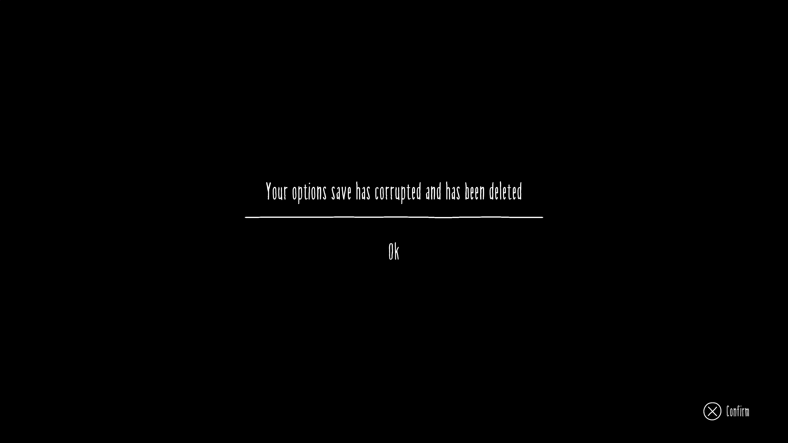</p>

docs(compat): refresh the checked-in visual evidence, and repair two trackers that deny screenshots already on master (#2737)

`29f4db65` · [`prosper/docs/screenshots/issue-2734-little-nightmares-3-corrupt-save-modal.png`](prosper/docs/screenshots/issue-2734-little-nightmares-3-corrupt-save-modal.png)

### asterix-babylon-gameplay.png

<p align="center">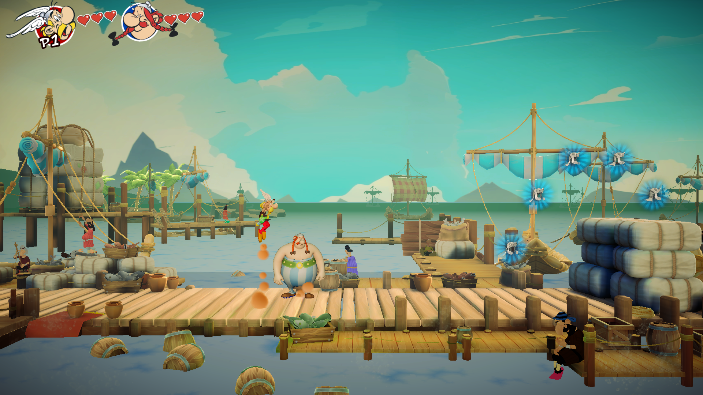</p>

bringup(asterix-babylon): a Triangle-aware input route reaches GAMEPLAY (rung 2 -> 3) (#2736)

`5404e173` · [`assets/screenshots/asterix-babylon-gameplay.png`](assets/screenshots/asterix-babylon-gameplay.png)

## 2026-08-19

### plucky-squire-chapter1-intro.png

<p align="center">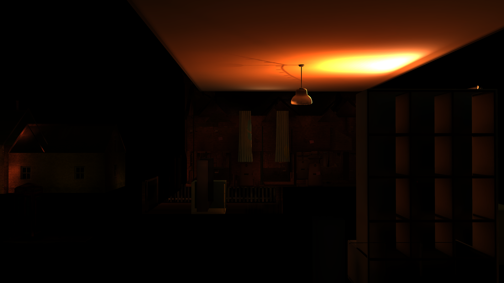</p>

docs(plucky): status doc — the chapter-one world renders, plus five falsified hypotheses (#2742)

`675ff2f6` · [`assets/screenshots/plucky-squire-chapter1-intro.png`](assets/screenshots/plucky-squire-chapter1-intro.png)

## 2026-08-08

### sonic-crossworlds-title.png

<p align="center"></p>

docs(crossworlds): rung 2 — the title screen renders completely, reproduced across two runs (#2360)

`a3a88356` · [`assets/screenshots/sonic-crossworlds-title.png`](assets/screenshots/sonic-crossworlds-title.png)

## 2026-08-07

### arcrunner-title-screen-default-route.png

<p align="center"></p>

ArcRunner: the per-fold account — the guest's builder is released mid-fold, and the contract that forbids it is version-gated off (#2219)

`a22cf8de` · [`assets/screenshots/arcrunner-title-screen-default-route.png`](assets/screenshots/arcrunner-title-screen-default-route.png)

## 2026-08-06

### sonic-frontiers-autosave-notice.png

<p align="center"></p>

fix(hle): sceSaveDataTransferringMountPs4 must report "no PS4 save", not SCE_OK — Sonic Frontiers reaches its title screen (#2208)

`7801a5bc` · [`assets/screenshots/sonic-frontiers-autosave-notice.png`](assets/screenshots/sonic-frontiers-autosave-notice.png)

### sonic-frontiers-main-menu.png

<p align="center"></p>

fix(hle): sceSaveDataTransferringMountPs4 must report "no PS4 save", not SCE_OK — Sonic Frontiers reaches its title screen (#2208)

`7801a5bc` · [`assets/screenshots/sonic-frontiers-main-menu.png`](assets/screenshots/sonic-frontiers-main-menu.png)

### sonic-frontiers-title-screen.png

<p align="center"></p>

fix(hle): sceSaveDataTransferringMountPs4 must report "no PS4 save", not SCE_OK — Sonic Frontiers reaches its title screen (#2208)

`7801a5bc` · [`assets/screenshots/sonic-frontiers-title-screen.png`](assets/screenshots/sonic-frontiers-title-screen.png)

### arcrunner-title-screen.png

<p align="center"></p>

docs(arcrunner): the title screen is behind the movie, and the throttle rescues by DELAY not by lock hold (#2205)

`40129122` · [`assets/screenshots/arcrunner-title-screen.png`](assets/screenshots/arcrunner-title-screen.png)

### sonic-origins-sega-logo.png

<p align="center"></p>

fix(savedata): sceSaveDataCreateTransactionResource must return a positive resource id (#2121)

`e404841c` · [`assets/screenshots/sonic-origins-sega-logo.png`](assets/screenshots/sonic-origins-sega-logo.png)

### arcrunner-default-route-logos.png

<p align="center"></p>

ArcRunner: the init-side generation census — the #1756 question answered, four falsifications, and real graphics off the throttle (#1226) (#2122)

`8c8e74f5` · [`assets/screenshots/arcrunner-default-route-logos.png`](assets/screenshots/arcrunner-default-route-logos.png)

### arcrunner-intro-city.png

<p align="center"></p>

ArcRunner renders its intro cinematic — the #1226 fault is a submit-timing race (follow-up to #2077) (#2086)

`0a6f82a8` · [`assets/screenshots/arcrunner-intro-city.png`](assets/screenshots/arcrunner-intro-city.png)

### arcrunner-intro-space-station.png

<p align="center"></p>

ArcRunner renders its intro cinematic — the #1226 fault is a submit-timing race (follow-up to #2077) (#2086)

`0a6f82a8` · [`assets/screenshots/arcrunner-intro-space-station.png`](assets/screenshots/arcrunner-intro-space-station.png)

### rtype-delta-force-select.png

<p align="center"></p>

fix(gpu): a saved-EXEC wave mask must survive the NGG fetch-index fold — R-Type Delta reaches its title screen (#2061)

`83e3383a` · [`assets/screenshots/rtype-delta-force-select.png`](assets/screenshots/rtype-delta-force-select.png)

### rtype-delta-title.png

<p align="center"></p>

fix(gpu): a saved-EXEC wave mask must survive the NGG fetch-index fold — R-Type Delta reaches its title screen (#2061)

`83e3383a` · [`assets/screenshots/rtype-delta-title.png`](assets/screenshots/rtype-delta-title.png)

### crisis-core-main-menu.png

<p align="center"></p>

Crisis Core (PPSA07809) reaches rung 2 — and its #1945 fault is a race the guest wins, not a late write (#2060)

`e311e6cd` · [`assets/screenshots/crisis-core-main-menu.png`](assets/screenshots/crisis-core-main-menu.png)

### crisis-core-title.png

<p align="center"></p>

Crisis Core (PPSA07809) reaches rung 2 — and its #1945 fault is a race the guest wins, not a late write (#2060)

`e311e6cd` · [`assets/screenshots/crisis-core-title.png`](assets/screenshots/crisis-core-title.png)

### crisis-core-voice-language.png

<p align="center"></p>

Crisis Core (PPSA07809) reaches rung 2 — and its #1945 fault is a race the guest wins, not a late write (#2060)

`e311e6cd` · [`assets/screenshots/crisis-core-voice-language.png`](assets/screenshots/crisis-core-voice-language.png)

### sonic-frontiers-middleware-credits.png

<p align="center"></p>

fix(present): publish the flipped VideoOut buffer when no pass ever targets it — with a real guest-authorship test and the composited-frame gate intact (#2068)

`33dac763` · [`assets/screenshots/sonic-frontiers-middleware-credits.png`](assets/screenshots/sonic-frontiers-middleware-credits.png)

### sonic-frontiers-sega-logo.png

<p align="center"></p>

fix(present): publish the flipped VideoOut buffer when no pass ever targets it — with a real guest-authorship test and the composited-frame gate intact (#2068)

`33dac763` · [`assets/screenshots/sonic-frontiers-sega-logo.png`](assets/screenshots/sonic-frontiers-sega-logo.png)

### rtype-delta-opening-movie-colour.png

<p align="center"></p>

fix(gpu): recognise an AvPlayer chroma plane declared as a one-layer 2D array (#2037)

`08d75128` · [`assets/screenshots/rtype-delta-opening-movie-colour.png`](assets/screenshots/rtype-delta-opening-movie-colour.png)

### issue-1946-health-warning-before-after.png

<p align="center">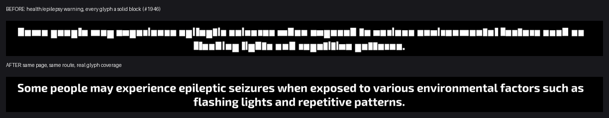</p>

fix(agc): offer the render-target-0 blend key on every SDK version — The Oregon Trail's whole UI layer was unblended (#1946) (#2031)

`beeff2ab` · [`prosper/docs/screenshots/issue-1946-health-warning-before-after.png`](prosper/docs/screenshots/issue-1946-health-warning-before-after.png)

### issue-1946-slate-blend-before-after.png

<p align="center">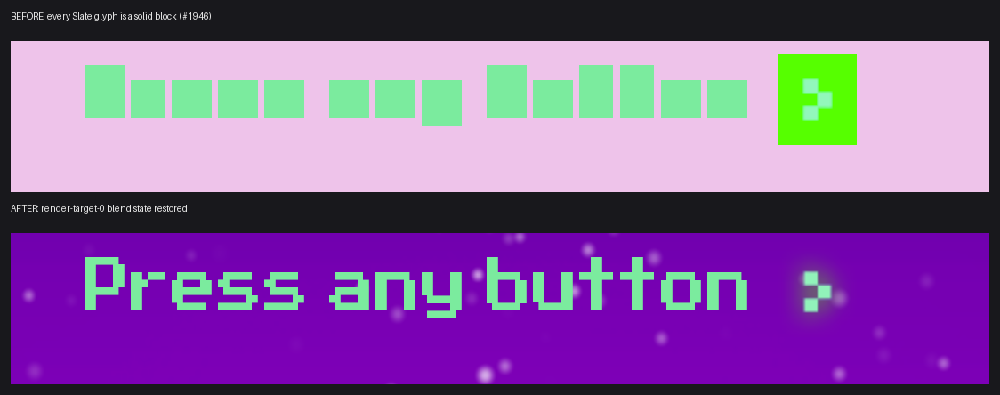</p>

fix(agc): offer the render-target-0 blend key on every SDK version — The Oregon Trail's whole UI layer was unblended (#1946) (#2031)

`beeff2ab` · [`prosper/docs/screenshots/issue-1946-slate-blend-before-after.png`](prosper/docs/screenshots/issue-1946-slate-blend-before-after.png)

### sonic-crossworlds-sega-logo.png

<p align="center"></p>

docs(crossworlds): Sonic Racing: CrossWorlds reaches rung 1 — the SEGA logo renders (#2039)

`f8b0f040` · [`assets/screenshots/sonic-crossworlds-sega-logo.png`](assets/screenshots/sonic-crossworlds-sega-logo.png)

### little-nightmares-3-eula.png

<p align="center">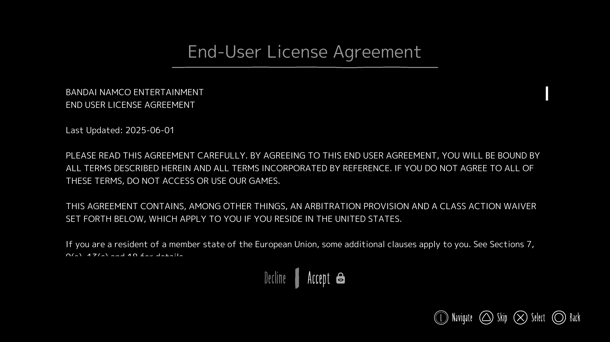</p>

docs(little-nightmares-3): #2014 is a wrong background clear, not a channel map — plus the first input route (#2041)

`f811615a` · [`assets/screenshots/little-nightmares-3-eula.png`](assets/screenshots/little-nightmares-3-eula.png)

## 2026-08-05

### little-nightmares-3-title-screen.png

<p align="center"></p>

docs(little-nightmares-3): rung 2 — the title screen renders; land the ruled-out record (#2017)

`080263cf` · [`assets/screenshots/little-nightmares-3-title-screen.png`](assets/screenshots/little-nightmares-3-title-screen.png)

### rtype-delta-rung1-logo-and-opening-movie.png

<p align="center"></p>

docs(rtype): R-Type Delta reaches rung 1 — the #1746 startup race is host CPU speed, not a prosper defect (#2009)

`c3614f51` · [`assets/screenshots/rtype-delta-rung1-logo-and-opening-movie.png`](assets/screenshots/rtype-delta-rung1-logo-and-opening-movie.png)

### oregon-trail-title-screen.png

<p align="center"></p>

diag(fault): probe every guest-pointer register at a worker fault, not just rdx/rax (#1992)

`034f959a` · [`assets/screenshots/oregon-trail-title-screen.png`](assets/screenshots/oregon-trail-title-screen.png)

### oregon-trail-gameloft-splash.png

<p align="center"></p>

fix(hle): scePthread* must return libkernel-encoded errors — Oregon Trail advances three checkpoints (#1984)

`38619f29` · [`assets/screenshots/oregon-trail-gameloft-splash.png`](assets/screenshots/oregon-trail-gameloft-splash.png)

### oregon-trail-health-warning.png

<p align="center"></p>

fix(hle): scePthread* must return libkernel-encoded errors — Oregon Trail advances three checkpoints (#1984)

`38619f29` · [`assets/screenshots/oregon-trail-health-warning.png`](assets/screenshots/oregon-trail-health-warning.png)

### bendy-dark-revival-title.png

<p align="center"></p>

fix(avplayer): end a source nobody consumes on its own media clock (#1981)

`afe4a2b0` · [`assets/screenshots/bendy-dark-revival-title.png`](assets/screenshots/bendy-dark-revival-title.png)

### asterix-babylon-intro-cutscene.png

<p align="center"></p>

feat(avplayer): implement sceAvPlayerJumpToTime and honour the guest file-replacement reader (#1974)

`ff72e77c` · [`assets/screenshots/asterix-babylon-intro-cutscene.png`](assets/screenshots/asterix-babylon-intro-cutscene.png)

### asterix-babylon-title.png

<p align="center"></p>

feat(avplayer): implement sceAvPlayerJumpToTime and honour the guest file-replacement reader (#1974)

`ff72e77c` · [`assets/screenshots/asterix-babylon-title.png`](assets/screenshots/asterix-babylon-title.png)

### little-nightmares-3-boot-splash.png

<p align="center"></p>

fix(ajm): accept the config revision — Little Nightmares III reaches rung 1 (#1966)

`1fc8ece9` · [`assets/screenshots/little-nightmares-3-boot-splash.png`](assets/screenshots/little-nightmares-3-boot-splash.png)

### sonic-frontiers-opening-sequence.png

<p align="center"></p>

docs(sonic-frontiers): rung 1 — it renders; the rung-0 reading was a failure-only diagnostic (#1969)

`440d84d2` · [`assets/screenshots/sonic-frontiers-opening-sequence.png`](assets/screenshots/sonic-frontiers-opening-sequence.png)

### sonic-frontiers-sonic-team-logo.png

<p align="center"></p>

docs(sonic-frontiers): rung 1 — it renders; the rung-0 reading was a failure-only diagnostic (#1969)

`440d84d2` · [`assets/screenshots/sonic-frontiers-sonic-team-logo.png`](assets/screenshots/sonic-frontiers-sonic-team-logo.png)

## 2026-08-04

### oregon-trail-legal-popup.png

<p align="center">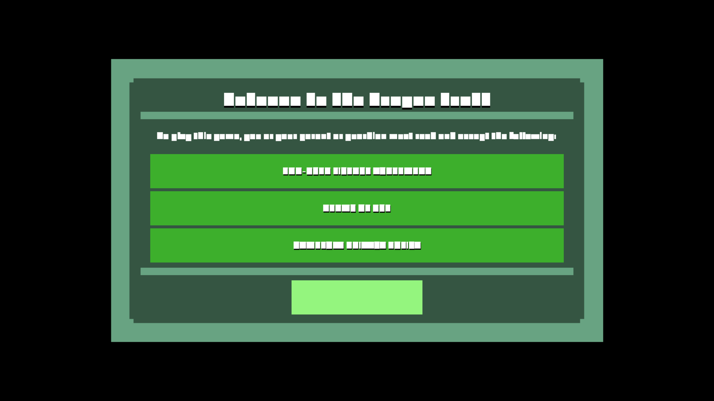</p>

feat(oregon): reach rung 1 — the startup legal popup renders on a default launch (#1950)

`e92d2f7f` · [`assets/screenshots/oregon-trail-legal-popup.png`](assets/screenshots/oregon-trail-legal-popup.png)

### beneath-title.png

<p align="center"></p>

docs: record Beneath title screen

`0dafd22d` · [`assets/screenshots/beneath-title.png`](assets/screenshots/beneath-title.png)

### forgotten-city-title.png

<p align="center"></p>

docs: record first-run compatibility baselines

`1640bb30` · [`assets/screenshots/forgotten-city-title.png`](assets/screenshots/forgotten-city-title.png)

### tactics-ogre-hevc-movie.png

<p align="center"></p>

docs(tactics-ogre): record restored HEVC presentation

`0d2f9a9f` · [`assets/screenshots/tactics-ogre-hevc-movie.png`](assets/screenshots/tactics-ogre-hevc-movie.png)

### tactics-ogre-reborn-gameplay.png

<p align="center"></p>

Document Tactics Ogre tutorial battle

`038c166d` · [`assets/screenshots/tactics-ogre-reborn-gameplay.png`](assets/screenshots/tactics-ogre-reborn-gameplay.png)

## 2026-08-03

### tactics-ogre-reborn-opening-scene.png

<p align="center"></p>

Document Tactics Ogre opening scene

`4c8e3997` · [`assets/screenshots/tactics-ogre-reborn-opening-scene.png`](assets/screenshots/tactics-ogre-reborn-opening-scene.png)

### house-of-the-dead-2-remake-gameplay.png

<p align="center"></p>

Document House of the Dead 2 gameplay

`b01e057c` · [`assets/screenshots/house-of-the-dead-2-remake-gameplay.png`](assets/screenshots/house-of-the-dead-2-remake-gameplay.png)

### tactics-ogre-title.png

<p align="center"></p>

Add Tactics Ogre title milestone

`4d192dc1` · [`assets/screenshots/tactics-ogre-title.png`](assets/screenshots/tactics-ogre-title.png)

### house-of-the-dead-2-remake-title.png

<p align="center"></p>

Document newly tested game compatibility

`fbde2b4c` · [`assets/screenshots/house-of-the-dead-2-remake-title.png`](assets/screenshots/house-of-the-dead-2-remake-title.png)

### rtype-delta-movie-coordinate-progress.png

<p align="center"></p>

fix(gpu): honor unnormalized sample coordinates

`d4fa07a8` · [`assets/screenshots/rtype-delta-movie-coordinate-progress.png`](assets/screenshots/rtype-delta-movie-coordinate-progress.png)

### blue-prince-hall.png

<p align="center">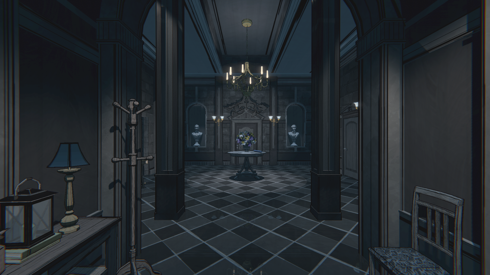</p>

Fix Blue Prince hall snapshot guard (#1813)

`730d434e` · [`assets/screenshots/blue-prince-hall.png`](assets/screenshots/blue-prince-hall.png)

## 2026-08-02

### earthion-title-menu.png

<p align="center"></p>

feat(earthion): route past the intro — the "missing picture" was a black text page (#1590) (#1775)

`3d1a7480` · [`assets/screenshots/earthion-title-menu.png`](assets/screenshots/earthion-title-menu.png)

### tales-graces-f-options.png

<p align="center"></p>

feat(talesgraces): routes to the title screen and the new-game Options screen (PPSA19991 rung 2) (#1759)

`30477a2d` · [`assets/screenshots/tales-graces-f-options.png`](assets/screenshots/tales-graces-f-options.png)

### tales-graces-f-title.png

<p align="center"></p>

feat(talesgraces): routes to the title screen and the new-game Options screen (PPSA19991 rung 2) (#1759)

`30477a2d` · [`assets/screenshots/tales-graces-f-title.png`](assets/screenshots/tales-graces-f-title.png)

### bendy-gameplay.png

<p align="center"></p>

docs(compat): boot sweep of fourteen titles on 3a473bca — corrected rungs, four new rows, and a frame-rate census (#1740)

`8fc79ca0` · [`assets/screenshots/bendy-gameplay.png`](assets/screenshots/bendy-gameplay.png)

### bendy-title.png

<p align="center"></p>

docs(compat): boot sweep of fourteen titles on 3a473bca — corrected rungs, four new rows, and a frame-rate census (#1740)

`8fc79ca0` · [`assets/screenshots/bendy-title.png`](assets/screenshots/bendy-title.png)

### pathless-title.png

<p align="center"></p>

docs(compat): boot sweep of fourteen titles on 3a473bca — corrected rungs, four new rows, and a frame-rate census (#1740)

`8fc79ca0` · [`assets/screenshots/pathless-title.png`](assets/screenshots/pathless-title.png)

### plucky-squire-title.png

<p align="center"></p>

docs(compat): boot sweep of fourteen titles on 3a473bca — corrected rungs, four new rows, and a frame-rate census (#1740)

`8fc79ca0` · [`assets/screenshots/plucky-squire-title.png`](assets/screenshots/plucky-squire-title.png)

### astro-bot-opening-cinematic.png

<p align="center"></p>

docs(astro): Astro Bot enters COMPATIBILITY.md at rung 2 — the title screen renders (#1736)

`6d7b69e9` · [`assets/screenshots/astro-bot-opening-cinematic.png`](assets/screenshots/astro-bot-opening-cinematic.png)

### astro-bot-title.png

<p align="center"></p>

docs(astro): Astro Bot enters COMPATIBILITY.md at rung 2 — the title screen renders (#1736)

`6d7b69e9` · [`assets/screenshots/astro-bot-title.png`](assets/screenshots/astro-bot-title.png)

### astro-bot-worldmap-background.png

<p align="center"></p>

fix(gpu): CB_COLOR_CONTROL.MODE must not override the guest's colour write mask (#1728)

`c8fe4afd` · [`assets/screenshots/astro-bot-worldmap-background.png`](assets/screenshots/astro-bot-worldmap-background.png)

## 2026-08-01

### tales-graces-f-criware.png

<p align="center"></p>

fix(hle): deliver the APR completion event for a zero-tag binding (#1666) (#1667)

`fa1f07b3` · [`assets/screenshots/tales-graces-f-criware.png`](assets/screenshots/tales-graces-f-criware.png)

### tales-graces-f-publisher.png

<p align="center"></p>

fix(hle): deliver the APR completion event for a zero-tag binding (#1666) (#1667)

`fa1f07b3` · [`assets/screenshots/tales-graces-f-publisher.png`](assets/screenshots/tales-graces-f-publisher.png)

### issue-1630-grid-after.png

<p align="center">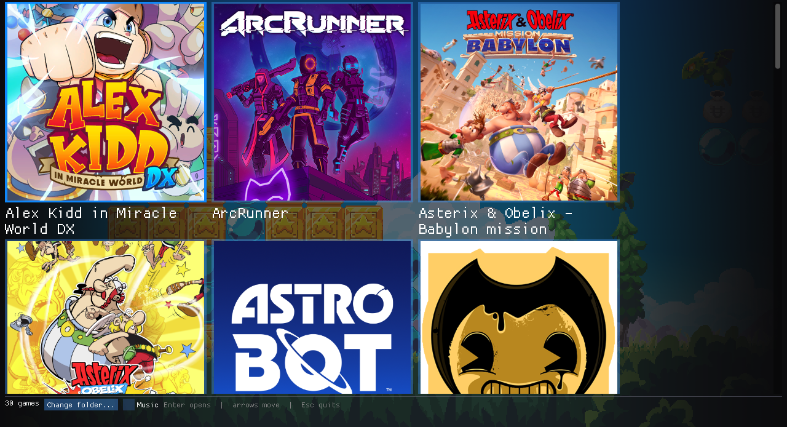</p>

feat(app): per-title background art and focus music in the library (#1647)

`7da42075` · [`prosper/docs/screenshots/issue-1630-grid-after.png`](prosper/docs/screenshots/issue-1630-grid-after.png)

### issue-1630-grid-before.png

<p align="center">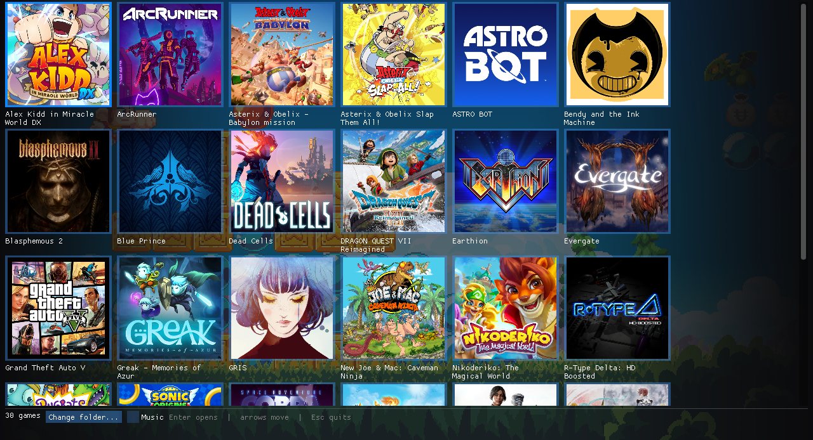</p>

feat(app): per-title background art and focus music in the library (#1647)

`7da42075` · [`prosper/docs/screenshots/issue-1630-grid-before.png`](prosper/docs/screenshots/issue-1630-grid-before.png)

### issue-1630-library-background-1.png

<p align="center">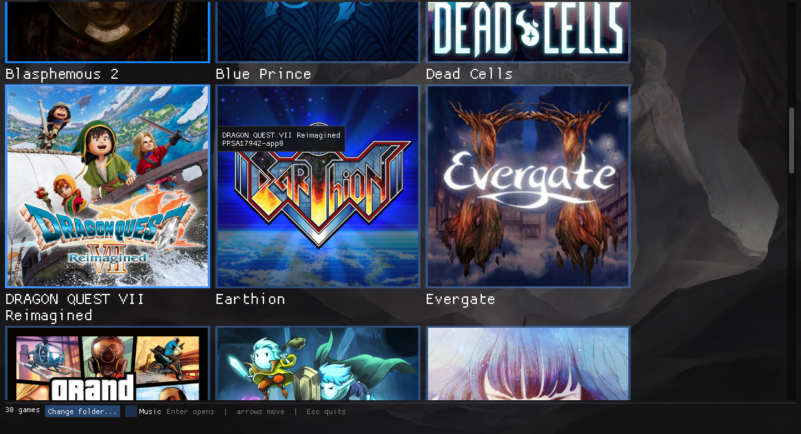</p>

feat(app): per-title background art and focus music in the library (#1647)

`7da42075` · [`prosper/docs/screenshots/issue-1630-library-background-1.png`](prosper/docs/screenshots/issue-1630-library-background-1.png)

### issue-1630-library-background-2.png

<p align="center"></p>

feat(app): per-title background art and focus music in the library (#1647)

`7da42075` · [`prosper/docs/screenshots/issue-1630-library-background-2.png`](prosper/docs/screenshots/issue-1630-library-background-2.png)

### issue-1630-library-background-3.png

<p align="center"></p>

feat(app): per-title background art and focus music in the library (#1647)

`7da42075` · [`prosper/docs/screenshots/issue-1630-library-background-3.png`](prosper/docs/screenshots/issue-1630-library-background-3.png)

### syberia-gameplay.png

<p align="center"></p>

docs(syberia): validated route to gameplay, and localize the black scene to one format gap (#1622)

`5ee5e785` · [`assets/screenshots/syberia-gameplay.png`](assets/screenshots/syberia-gameplay.png)

### syberia-title.png

<p align="center"></p>

docs(syberia): validated route to gameplay, and localize the black scene to one format gap (#1622)

`5ee5e785` · [`assets/screenshots/syberia-title.png`](assets/screenshots/syberia-title.png)

### worms-armageddon-gameplay.png

<p align="center"></p>

fix(pad): scePadGetHandle looks up an open handle instead of fabricating one (#1623)

`823c9670` · [`assets/screenshots/worms-armageddon-gameplay.png`](assets/screenshots/worms-armageddon-gameplay.png)

## 2026-07-31

### syberia-profile.png

<p align="center"></p>

fix(agc): register sceAgcAcbWriteData — Syberia goes from hard hang to its profile menu (#1610)

`961a6cdd` · [`assets/screenshots/syberia-profile.png`](assets/screenshots/syberia-profile.png)

### nikoderiko-title.png

<p align="center"></p>

docs(compat): add Nikoderiko at title screen and The Oregon Trail at research tier (#1608)

`a933091d` · [`assets/screenshots/nikoderiko-title.png`](assets/screenshots/nikoderiko-title.png)

### greak-title.png

<p align="center"></p>

feat(recompiler): lower s_ttracedata — Greak and Rugrats reach gameplay (#1600)

`5a0eb7b6` · [`assets/screenshots/greak-title.png`](assets/screenshots/greak-title.png)

### greak.png

<p align="center"></p>

feat(recompiler): lower s_ttracedata — Greak and Rugrats reach gameplay (#1600)

`5a0eb7b6` · [`assets/screenshots/greak.png`](assets/screenshots/greak.png)

### rugrats-title.png

<p align="center"></p>

feat(recompiler): lower s_ttracedata — Greak and Rugrats reach gameplay (#1600)

`5a0eb7b6` · [`assets/screenshots/rugrats-title.png`](assets/screenshots/rugrats-title.png)

### rugrats.png

<p align="center"></p>

feat(recompiler): lower s_ttracedata — Greak and Rugrats reach gameplay (#1600)

`5a0eb7b6` · [`assets/screenshots/rugrats.png`](assets/screenshots/rugrats.png)

### asterix-slap-them-all.png

<p align="center"></p>

docs(compat): add Asterix Slap Them All and Summer Sports Games at gameplay (#1604)

`2421d503` · [`assets/screenshots/asterix-slap-them-all.png`](assets/screenshots/asterix-slap-them-all.png)

### summer-sports-games.png

<p align="center"></p>

docs(compat): add Asterix Slap Them All and Summer Sports Games at gameplay (#1604)

`2421d503` · [`assets/screenshots/summer-sports-games.png`](assets/screenshots/summer-sports-games.png)

### joe-mac-menu.png

<p align="center"></p>

docs(compat): record five newly triaged titles, two of them rendering (#1596)

`bb5a11a2` · [`assets/screenshots/joe-mac-menu.png`](assets/screenshots/joe-mac-menu.png)

### joe-mac.png

<p align="center"></p>

docs(compat): record five newly triaged titles, two of them rendering (#1596)

`bb5a11a2` · [`assets/screenshots/joe-mac.png`](assets/screenshots/joe-mac.png)

### worms-armageddon-title.png

<p align="center"></p>

docs(compat): record five newly triaged titles, two of them rendering (#1596)

`bb5a11a2` · [`assets/screenshots/worms-armageddon-title.png`](assets/screenshots/worms-armageddon-title.png)

### alex-kidd.png

<p align="center"></p>

test(snapshot): reviewed alexkidd-gameplay content guard — PPSA02664 reaches ladder rung 6 (#1582)

`a6d995fa` · [`assets/screenshots/alex-kidd.png`](assets/screenshots/alex-kidd.png)

### dragon-quest-vii-onboarding.png

<p align="center"></p>

docs: record Dragon Quest VII onboarding

`aeee4d48` · [`assets/screenshots/dragon-quest-vii-onboarding.png`](assets/screenshots/dragon-quest-vii-onboarding.png)

### dragon-quest-vii-name-confirmation.png

<p align="center"></p>

Document DQ7 name confirmation milestone

`d2fe1c66` · [`assets/screenshots/dragon-quest-vii-name-confirmation.png`](assets/screenshots/dragon-quest-vii-name-confirmation.png)

### dragon-quest-vii-name-entry.png

<p align="center"></p>

Document Dragon Quest name entry

`297ec493` · [`assets/screenshots/dragon-quest-vii-name-entry.png`](assets/screenshots/dragon-quest-vii-name-entry.png)

### space-adventure-cobra.png

<p align="center"></p>

fix(runtime): preserve guest TLS across write-watch faults

`82eadf58` · [`assets/screenshots/space-adventure-cobra.png`](assets/screenshots/space-adventure-cobra.png)

### gris.png

<p align="center"></p>

docs: record GRIS opening gameplay

`b08f0a94` · [`assets/screenshots/gris.png`](assets/screenshots/gris.png)

### issue-1459-astrobot-blue-fmv-gpu-present.png

<p align="center">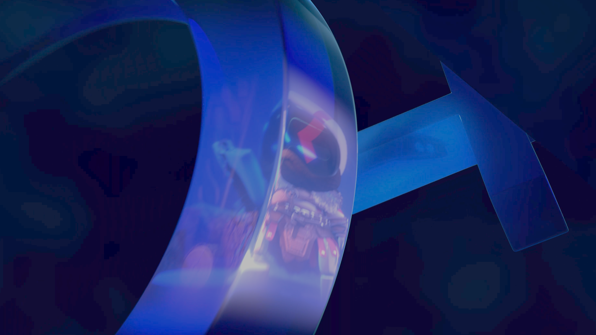</p>

docs: capture Astro Bot blue intro

`3f72a8ce` · [`prosper/docs/screenshots/issue-1459-astrobot-blue-fmv-gpu-present.png`](prosper/docs/screenshots/issue-1459-astrobot-blue-fmv-gpu-present.png)

## 2026-07-30

### issue-1471-library-empty.png

<p align="center">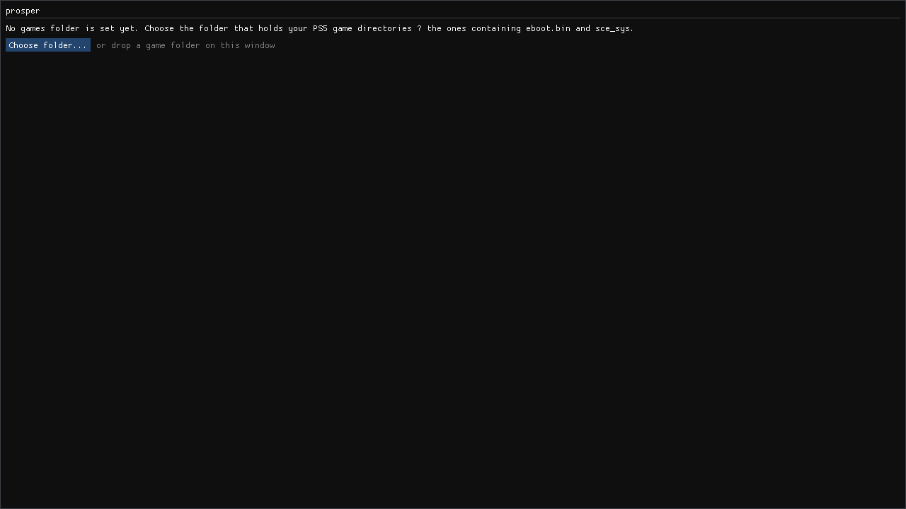</p>

fix(app): address review findings on the library view

`44d1689d` · [`prosper/docs/screenshots/issue-1471-library-empty.png`](prosper/docs/screenshots/issue-1471-library-empty.png)

### issue-1471-library-scrolled.png

<p align="center">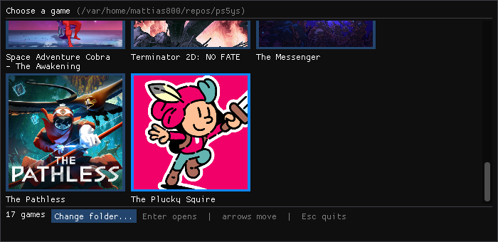</p>

fix(app): address review findings on the library view

`44d1689d` · [`prosper/docs/screenshots/issue-1471-library-scrolled.png`](prosper/docs/screenshots/issue-1471-library-scrolled.png)

### issue-1471-library-grid.png

<p align="center">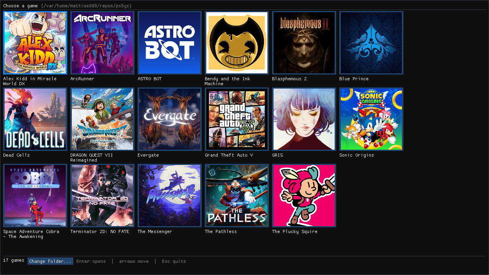</p>

feat(app): draw the game library with Dear ImGui

`7cf767fe` · [`prosper/docs/screenshots/issue-1471-library-grid.png`](prosper/docs/screenshots/issue-1471-library-grid.png)

### issue-1459-astrobot-linux-indirect-title.png

<p align="center"></p>

gpu: execute AGC indirect work after producers

`e85c527c` · [`prosper/docs/screenshots/issue-1459-astrobot-linux-indirect-title.png`](prosper/docs/screenshots/issue-1459-astrobot-linux-indirect-title.png)

## 2026-07-29

### issue-1469-drop-messenger.png

<p align="center">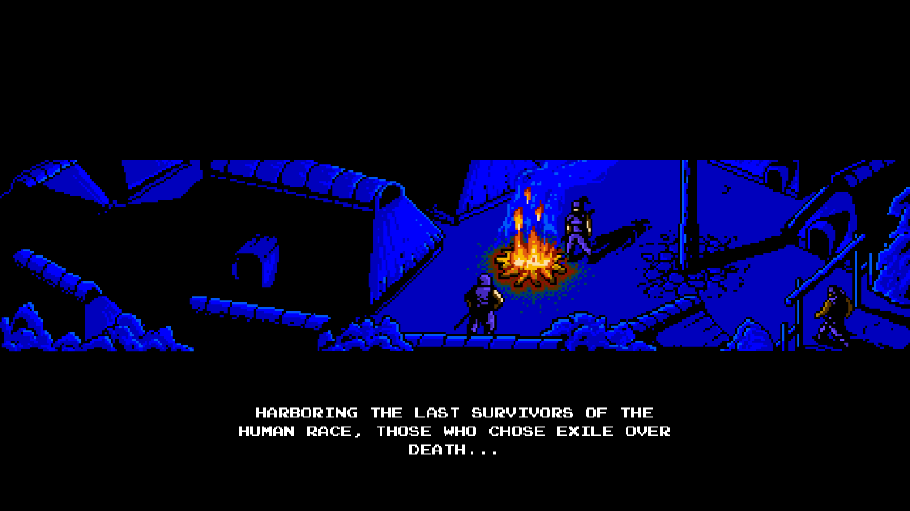</p>

docs(app): interactive-open evidence screenshots (#1469)

`3f7f9929` · [`prosper/docs/screenshots/issue-1469-drop-messenger.png`](prosper/docs/screenshots/issue-1469-drop-messenger.png)

### issue-1469-picker-messenger.png

<p align="center">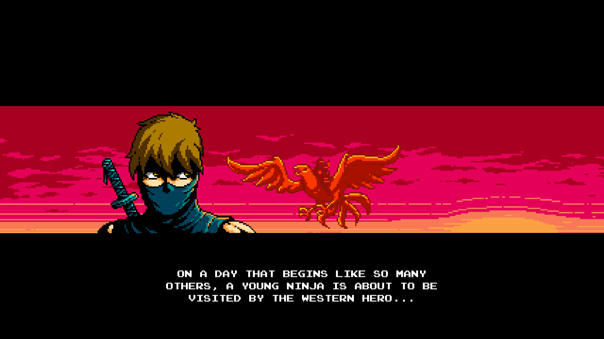</p>

docs(app): interactive-open evidence screenshots (#1469)

`3f7f9929` · [`prosper/docs/screenshots/issue-1469-picker-messenger.png`](prosper/docs/screenshots/issue-1469-picker-messenger.png)

### issue-1469-reject-not-a-title.png

<p align="center">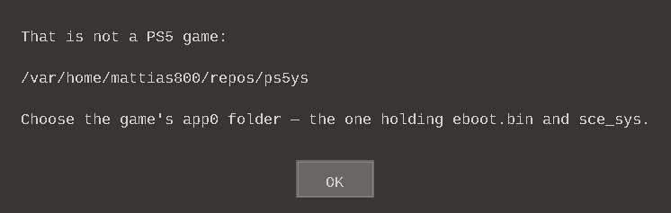</p>

docs(app): interactive-open evidence screenshots (#1469)

`3f7f9929` · [`prosper/docs/screenshots/issue-1469-reject-not-a-title.png`](prosper/docs/screenshots/issue-1469-reject-not-a-title.png)

### issue-1469-relaunch-blasphemous2.png

<p align="center">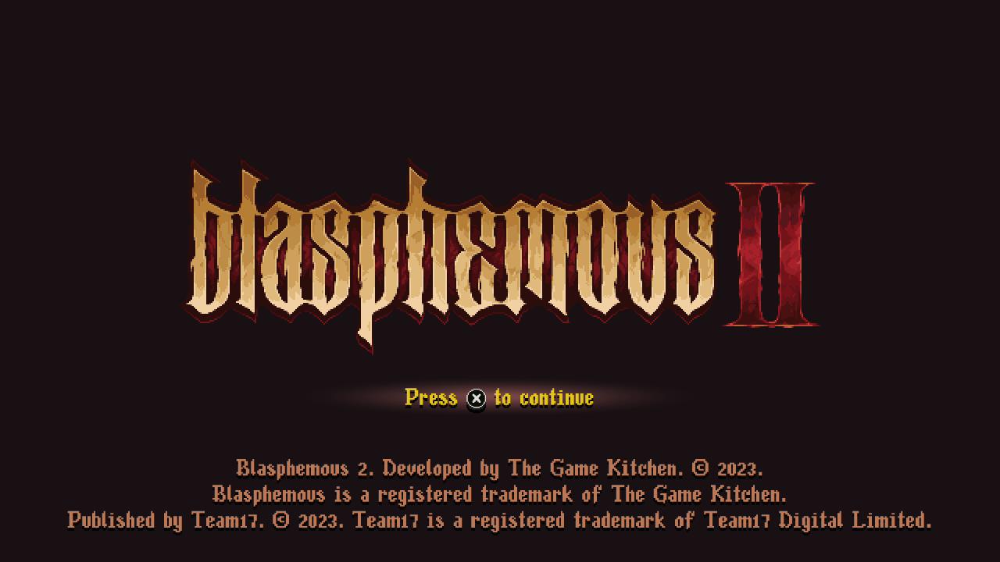</p>

docs(app): interactive-open evidence screenshots (#1469)

`3f7f9929` · [`prosper/docs/screenshots/issue-1469-relaunch-blasphemous2.png`](prosper/docs/screenshots/issue-1469-relaunch-blasphemous2.png)

### issue-1459-astrobot-worldmap-current.png

<p align="center"></p>

docs: capture current Astro Bot world map

`2e83d1ea` · [`prosper/docs/screenshots/issue-1459-astrobot-worldmap-current.png`](prosper/docs/screenshots/issue-1459-astrobot-worldmap-current.png)

### issue-1466-astrobot-direct-tile.png

<p align="center">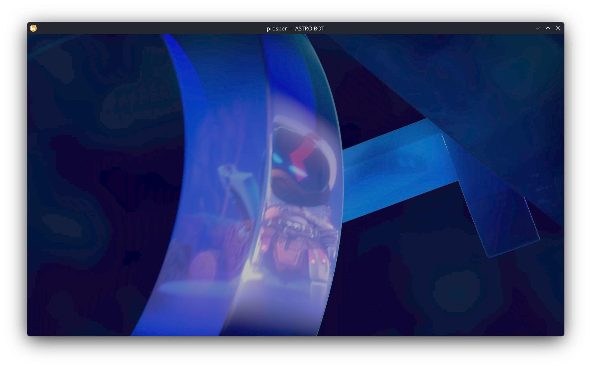</p>

perf(gpu): tile mapped storage images directly

`1b8eeed6` · [`prosper/docs/screenshots/issue-1466-astrobot-direct-tile.png`](prosper/docs/screenshots/issue-1466-astrobot-direct-tile.png)

## 2026-07-26

### issue-1287-hall-live-fixed.png

<p align="center">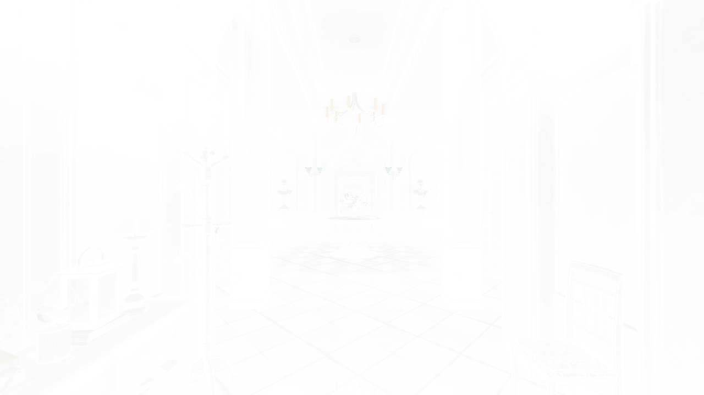</p>

docs: live Blue Prince gameplay at oracle parity (#1287 rung-5 evidence) (#1438)

`ffbb7d74` · [`prosper/docs/screenshots/issue-1287-hall-live-fixed.png`](prosper/docs/screenshots/issue-1287-hall-live-fixed.png)

### issue-1287-hall-live-vs-oracle.png

<p align="center">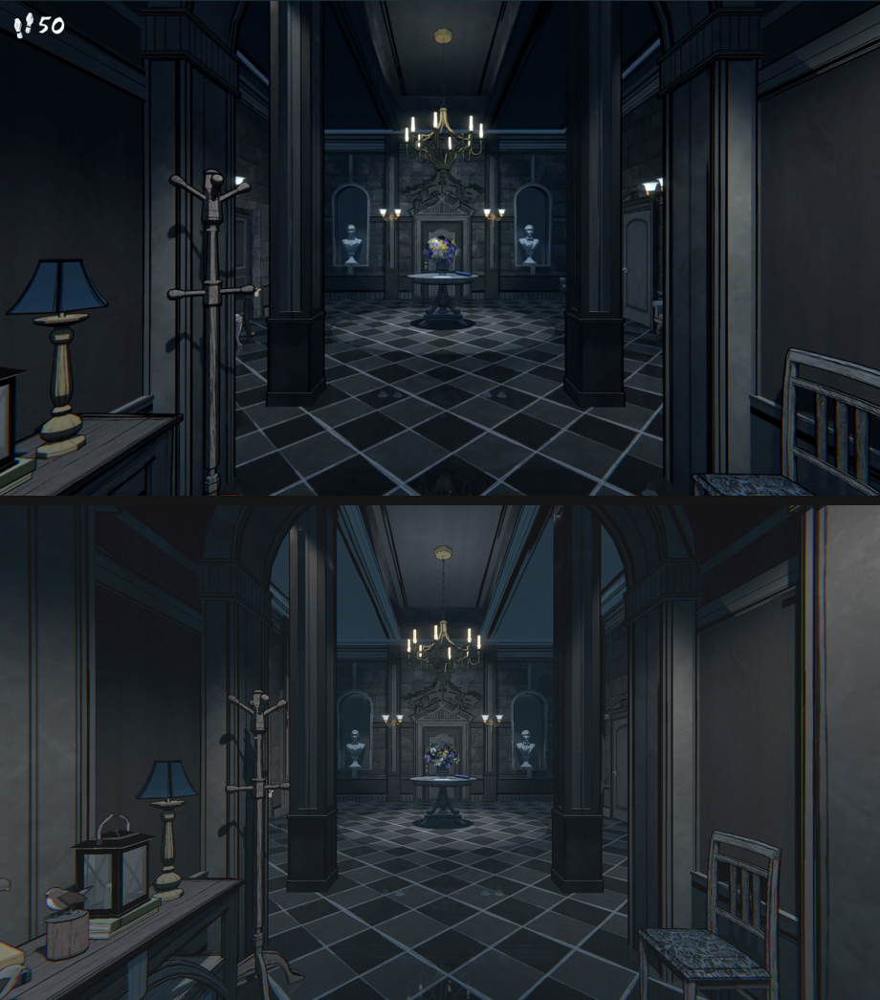</p>

docs: live Blue Prince gameplay at oracle parity (#1287 rung-5 evidence) (#1438)

`ffbb7d74` · [`prosper/docs/screenshots/issue-1287-hall-live-vs-oracle.png`](prosper/docs/screenshots/issue-1287-hall-live-vs-oracle.png)

### issue-1287-manor-approach-live.png

<p align="center">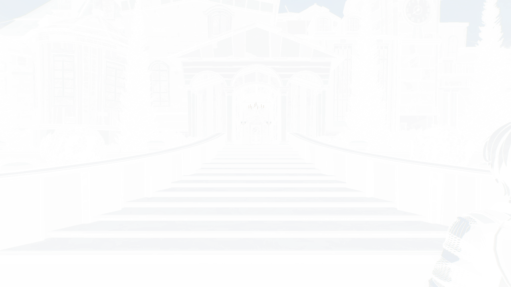</p>

docs: live Blue Prince gameplay at oracle parity (#1287 rung-5 evidence) (#1438)

`ffbb7d74` · [`prosper/docs/screenshots/issue-1287-manor-approach-live.png`](prosper/docs/screenshots/issue-1287-manor-approach-live.png)

### issue-1427-hall-geometry-restored.png

<p align="center">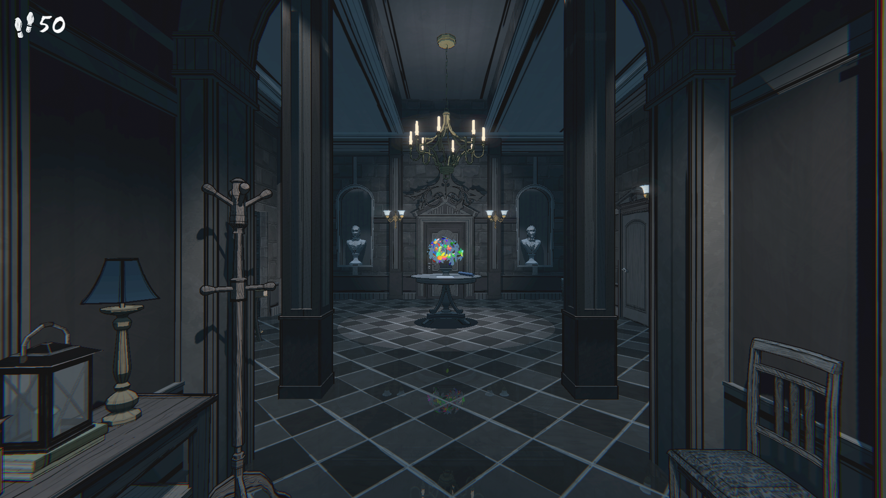</p>

fix(render): upload a buffer binding's whole declared range, not the first 1 MiB (#1429)

`ad5a840a` · [`prosper/docs/screenshots/issue-1427-hall-geometry-restored.png`](prosper/docs/screenshots/issue-1427-hall-geometry-restored.png)

### issue-1427-oracle-before-after.png

<p align="center">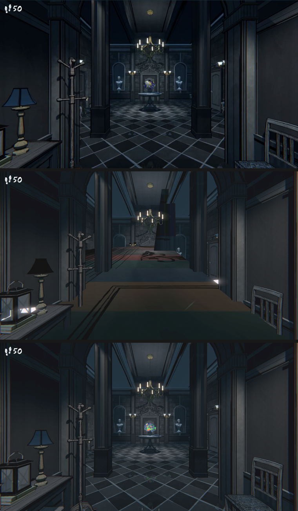</p>

fix(render): upload a buffer binding's whole declared range, not the first 1 MiB (#1429)

`ad5a840a` · [`prosper/docs/screenshots/issue-1427-oracle-before-after.png`](prosper/docs/screenshots/issue-1427-oracle-before-after.png)

### issue-1287-hall-materials-fixed.png

<p align="center">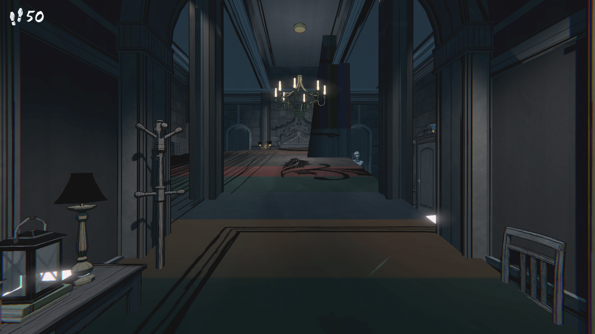</p>

docs: Blue Prince hall with correct materials (#1287 milestone frame) (#1418)

`0f7d9310` · [`prosper/docs/screenshots/issue-1287-hall-materials-fixed.png`](prosper/docs/screenshots/issue-1287-hall-materials-fixed.png)

## 2026-07-25

### issue-1334-hall-default-tonemapped.png

<p align="center">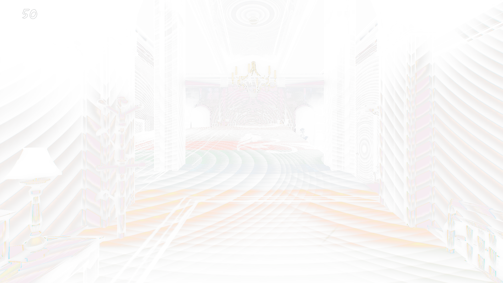</p>

fix(gpu): GPU-copy the MSAA resolve into the destination persistent image (#1382)

`6479cd5f` · [`prosper/docs/screenshots/issue-1334-hall-default-tonemapped.png`](prosper/docs/screenshots/issue-1334-hall-default-tonemapped.png)

### issue-1287-hall-bundle-tonemapped.png

<p align="center">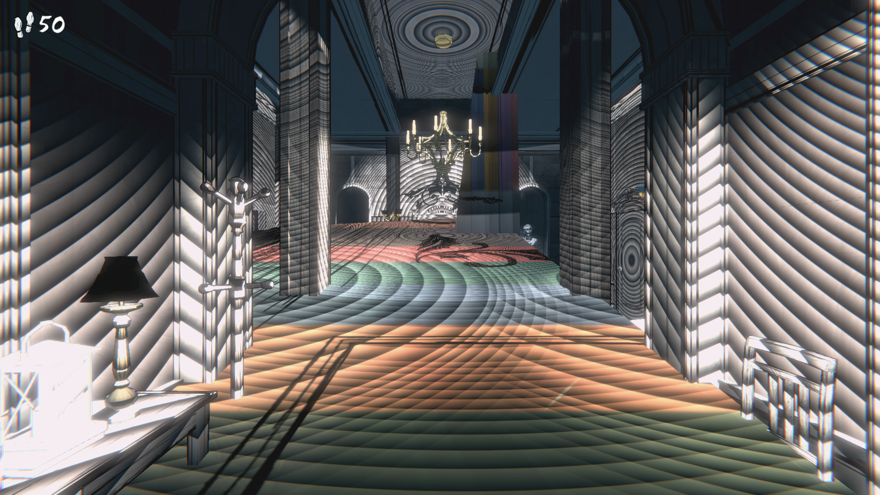</p>

docs: current Blue Prince hall frames for the #1287 oracle request (#1375)

`a3613436` · [`prosper/docs/screenshots/issue-1287-hall-bundle-tonemapped.png`](prosper/docs/screenshots/issue-1287-hall-bundle-tonemapped.png)

### issue-1287-hall-magenta-prosper.png

<p align="center">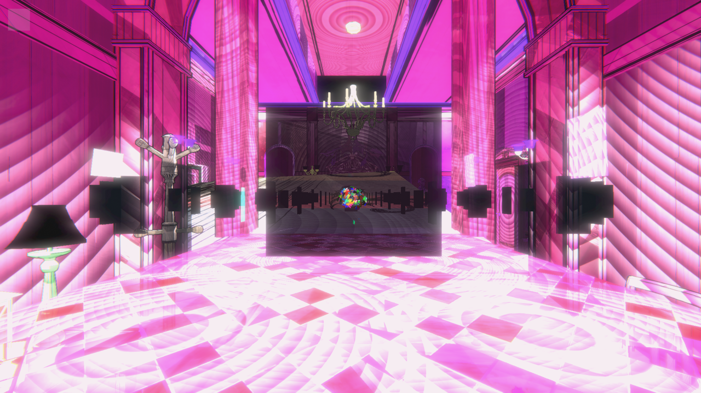</p>

docs: current Blue Prince hall frames for the #1287 oracle request (#1375)

`a3613436` · [`prosper/docs/screenshots/issue-1287-hall-magenta-prosper.png`](prosper/docs/screenshots/issue-1287-hall-magenta-prosper.png)

### issue-1287-hall-night-prosper.png

<p align="center">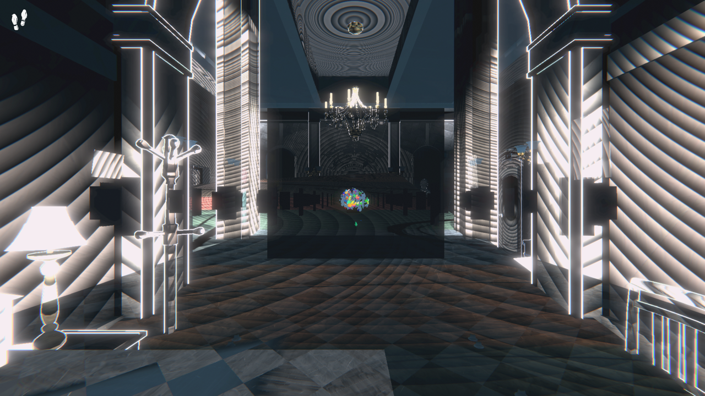</p>

docs: current Blue Prince hall frames for the #1287 oracle request (#1375)

`a3613436` · [`prosper/docs/screenshots/issue-1287-hall-night-prosper.png`](prosper/docs/screenshots/issue-1287-hall-night-prosper.png)

### issue-1287-hall-nobatch-live.png

<p align="center">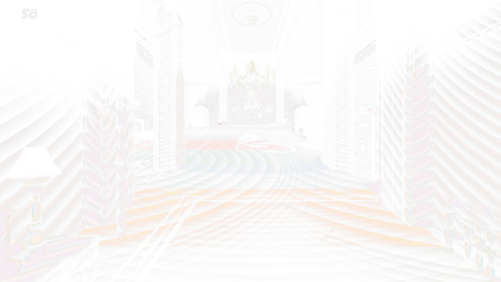</p>

docs: current Blue Prince hall frames for the #1287 oracle request (#1375)

`a3613436` · [`prosper/docs/screenshots/issue-1287-hall-nobatch-live.png`](prosper/docs/screenshots/issue-1287-hall-nobatch-live.png)

### issue-1287-vestibule-prosper.png

<p align="center">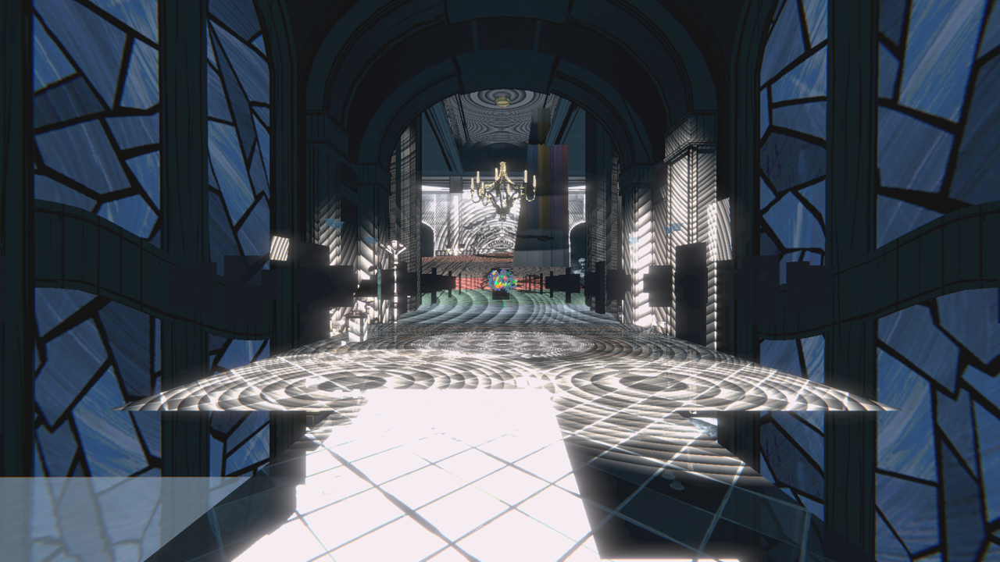</p>

docs: current Blue Prince hall frames for the #1287 oracle request (#1375)

`a3613436` · [`prosper/docs/screenshots/issue-1287-vestibule-prosper.png`](prosper/docs/screenshots/issue-1287-vestibule-prosper.png)

### issue-1356-gris-title.png

<p align="center"></p>

feat: bring GRIS and Cobra to title with audio (#1368)

`8b37be95` · [`prosper/docs/screenshots/issue-1356-gris-title.png`](prosper/docs/screenshots/issue-1356-gris-title.png)

### issue-1356-space-adventure-cobra-title.png

<p align="center"></p>

feat: bring GRIS and Cobra to title with audio (#1368)

`8b37be95` · [`prosper/docs/screenshots/issue-1356-space-adventure-cobra-title.png`](prosper/docs/screenshots/issue-1356-space-adventure-cobra-title.png)

### dragon-quest-vii-title.png

<p align="center"></p>

docs: publish Dragon Quest VII title capture

`18abdf28` · [`assets/screenshots/dragon-quest-vii-title.png`](assets/screenshots/dragon-quest-vii-title.png)

### issue-1352-wall-shading-after.png

<p align="center">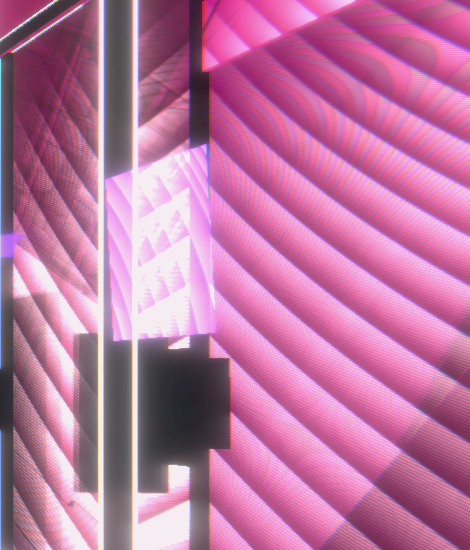</p>

fix(gpu): DEPTH_CLEAR_ENABLE acts only through the enabled depth-write path (#1354)

`feb5822d` · [`prosper/docs/screenshots/issue-1352-wall-shading-after.png`](prosper/docs/screenshots/issue-1352-wall-shading-after.png)

### issue-1352-wall-shading-before.png

<p align="center">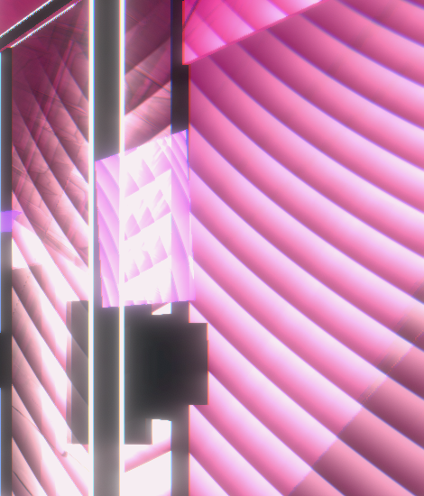</p>

fix(gpu): DEPTH_CLEAR_ENABLE acts only through the enabled depth-write path (#1354)

`feb5822d` · [`prosper/docs/screenshots/issue-1352-wall-shading-before.png`](prosper/docs/screenshots/issue-1352-wall-shading-before.png)

## 2026-07-24

### blue-prince-title.png

<p align="center"></p>

Add Blue Prince and Terminator docs screenshots (#1342)

`5e11d900` · [`assets/screenshots/blue-prince-title.png`](assets/screenshots/blue-prince-title.png)

### terminator-title.png

<p align="center"></p>

Add Blue Prince and Terminator docs screenshots (#1342)

`5e11d900` · [`assets/screenshots/terminator-title.png`](assets/screenshots/terminator-title.png)

### terminator.png

<p align="center"></p>

Add Blue Prince and Terminator docs screenshots (#1342)

`5e11d900` · [`assets/screenshots/terminator.png`](assets/screenshots/terminator.png)

### gta5-main-menu.png

<p align="center"></p>

docs: show GTA V current renderer state (#1339)

`e6b8fb06` · [`assets/screenshots/gta5-main-menu.png`](assets/screenshots/gta5-main-menu.png)

### gta5-title.png

<p align="center"></p>

docs: show GTA V current renderer state (#1339)

`e6b8fb06` · [`assets/screenshots/gta5-title.png`](assets/screenshots/gta5-title.png)

### blasphemous2-title.png

<p align="center"></p>

docs: refresh public README + COMPATIBILITY with screenshots and current status

`958979f6` · [`assets/screenshots/blasphemous2-title.png`](assets/screenshots/blasphemous2-title.png)

### blasphemous2.png

<p align="center"></p>

docs: refresh public README + COMPATIBILITY with screenshots and current status

`958979f6` · [`assets/screenshots/blasphemous2.png`](assets/screenshots/blasphemous2.png)

### dead-cells-title.png

<p align="center"></p>

docs: refresh public README + COMPATIBILITY with screenshots and current status

`958979f6` · [`assets/screenshots/dead-cells-title.png`](assets/screenshots/dead-cells-title.png)

### dead-cells.png

<p align="center"></p>

docs: refresh public README + COMPATIBILITY with screenshots and current status

`958979f6` · [`assets/screenshots/dead-cells.png`](assets/screenshots/dead-cells.png)

### evergate-title.png

<p align="center"></p>

docs: refresh public README + COMPATIBILITY with screenshots and current status

`958979f6` · [`assets/screenshots/evergate-title.png`](assets/screenshots/evergate-title.png)

### evergate.png

<p align="center"></p>

docs: refresh public README + COMPATIBILITY with screenshots and current status

`958979f6` · [`assets/screenshots/evergate.png`](assets/screenshots/evergate.png)

### messenger-title.png

<p align="center"></p>

docs: refresh public README + COMPATIBILITY with screenshots and current status

`958979f6` · [`assets/screenshots/messenger-title.png`](assets/screenshots/messenger-title.png)

### messenger.png

<p align="center"></p>

docs: refresh public README + COMPATIBILITY with screenshots and current status

`958979f6` · [`assets/screenshots/messenger.png`](assets/screenshots/messenger.png)

## 2026-07-19

### issue-897-astrobot-linux-natural-opening-midfade.png

<p align="center"></p>

docs(astrobot): attach natural Linux graphics captures

`2a09b44d` · [`prosper/docs/screenshots/issue-897-astrobot-linux-natural-opening-midfade.png`](prosper/docs/screenshots/issue-897-astrobot-linux-natural-opening-midfade.png)

### issue-897-astrobot-linux-natural-opening-visible.png

<p align="center"></p>

docs(astrobot): attach natural Linux graphics captures

`2a09b44d` · [`prosper/docs/screenshots/issue-897-astrobot-linux-natural-opening-visible.png`](prosper/docs/screenshots/issue-897-astrobot-linux-natural-opening-visible.png)

## 2026-07-18

### issue-825-astrobot-windows-sony-presents.png

<p align="center"></p>

docs(astrobot): attach Windows progress captures

`815a84b2` · [`prosper/docs/screenshots/issue-825-astrobot-windows-sony-presents.png`](prosper/docs/screenshots/issue-825-astrobot-windows-sony-presents.png)

### issue-825-astrobot-windows-title.png

<p align="center"></p>

docs(astrobot): attach Windows progress captures

`815a84b2` · [`prosper/docs/screenshots/issue-825-astrobot-windows-title.png`](prosper/docs/screenshots/issue-825-astrobot-windows-title.png)

## 2026-07-17

### issue-825-astrobot-linux-sony-presents.png

<p align="center"></p>

docs(astrobot): attach Linux loading screenshot

`a1395e75` · [`prosper/docs/screenshots/issue-825-astrobot-linux-sony-presents.png`](prosper/docs/screenshots/issue-825-astrobot-linux-sony-presents.png)
