# Game compatibility

prosper is an experimental compatibility layer, not a general-purpose game runner. The results below
describe specific, user-supplied PS5 dumps tested primarily on Linux. A milestone means that the
documented route is reproducible; it does **not** mean that the entire game is playable or free of
bugs. Different title revisions may behave differently.

Detailed investigation notes, measurements, known defects, and next steps live in the linked
[game-tracker issues](https://github.com/mattias800/prosper/issues?q=is%3Aissue+%22%5BGame+tracker%5D%22).

Last updated: 2026-08-06

## Summary

| Title | Title ID | Engine | User-visible milestone | Tracker |
| --- | --- | --- | --- | --- |
| *The Messenger* | `PPSA24651` | Unity / IL2CPP | ✅ First level gameplay | [#1865](https://github.com/mattias800/prosper/issues/1865) |
| *Dead Cells* | `PPSA15552` | Custom | ✅ Prisoners' Quarters gameplay | [#1866](https://github.com/mattias800/prosper/issues/1866) |
| *Blasphemous 2* | `PPSA13579` | Unity | ✅ First playable room | [#1867](https://github.com/mattias800/prosper/issues/1867) |
| *Evergate* | `PPSA01885` | Unity | ✅ First tutorial-room gameplay | [#1868](https://github.com/mattias800/prosper/issues/1868) |
| *GRIS* | `PPSA09804` | Unity / IL2CPP | ✅ Opening gameplay | [#1869](https://github.com/mattias800/prosper/issues/1869) |
| *Space Adventure Cobra — The Awakening* | `PPSA17337` | Unity / IL2CPP | ✅ Tutorial combat | [#1870](https://github.com/mattias800/prosper/issues/1870) |
| *Sonic Origins* | `PPSA05325` | Hedgehog Engine | 🔬 4K SEGA logo; the boot sequence then holds on a white screen before a title screen | [#1871](https://github.com/mattias800/prosper/issues/1871) |
| *Sonic Frontiers* | `PPSA03831` | Hedgehog Engine 2 (Needle) | 🚧 Full 4K opening sequence, title screen and main menu; the menu heading draws the wrong string | [#1891](https://github.com/mattias800/prosper/issues/1891) |
| *Sonic Racing: CrossWorlds* | `PPSA08804` | Unreal Engine 5 | 🔬 4K SEGA logo; the composite goes uniform before a title screen | [#1895](https://github.com/mattias800/prosper/issues/1895) |
| *Terminator 2D: NO FATE* | `PPSA25872` | Unity / IL2CPP | ✅ Main menu and attract-mode gameplay | [#1872](https://github.com/mattias800/prosper/issues/1872) |
| *Blue Prince* | `PPSA25009` | Unity | 🚧 Manor entrance-hall gameplay | [#1808](https://github.com/mattias800/prosper/issues/1808) |
| *Grand Theft Auto V* | `PPSA04263` | RAGE | 🚧 Title and main menu | [#1873](https://github.com/mattias800/prosper/issues/1873) |
| *Dragon Quest VII Reimagined* | `PPSA17942` | Unreal Engine 4 | 🚧 Title and first-run setup | [#1874](https://github.com/mattias800/prosper/issues/1874) |
| *Alex Kidd in Miracle World DX* | `PPSA02664` | Unity / IL2CPP | ✅ First-level gameplay | [#1875](https://github.com/mattias800/prosper/issues/1875) |
| *New Joe &amp; Mac: Caveman Ninja* | `PPSA02801` | Unity / IL2CPP | ✅ Level 1 gameplay | [#1876](https://github.com/mattias800/prosper/issues/1876) |
| *Asterix &amp; Obelix: Slap Them All!* | `PPSA08576` | Unity / IL2CPP | ✅ First forest level | [#1877](https://github.com/mattias800/prosper/issues/1877) |
| *Summer Sports Games* | `PPSA03416` | Unity / IL2CPP | ✅ Live 3D athletics | [#1878](https://github.com/mattias800/prosper/issues/1878) |
| *Worms Armageddon: Anniversary Edition* | `PPSA20052` | Custom | ✅ Live match gameplay | [#1879](https://github.com/mattias800/prosper/issues/1879) |
| *Earthion* | `PPSA28061` | Custom (Ancient) | 🚧 Title screen and menus | [#1880](https://github.com/mattias800/prosper/issues/1880) |
| *Bendy and the Ink Machine* | `PPSA27616` | Unity / IL2CPP | 🚧 Chapter 1 gameplay | [#1881](https://github.com/mattias800/prosper/issues/1881) |
| *The Plucky Squire* | `PPSA15319` | Unreal Engine 4 | 🚧 Title and save/play-style menus | [#1882](https://github.com/mattias800/prosper/issues/1882) |
| *The Pathless* | `PPSA01826` | Unreal Engine 4 | 🚧 Title screen | [#1883](https://github.com/mattias800/prosper/issues/1883) |
| *ArcRunner* | `PPSA21406` | Unreal Engine 4 | 🚧 Intro cinematic and title screen, on a throttled route | [#1817](https://github.com/mattias800/prosper/issues/1817) |
| *Asterix &amp; Obelix: Babylon Mission* | `PPSA30490` | Unity 6 / IL2CPP | 🚧 Logo movies, intro cutscene, and title menu | [#1884](https://github.com/mattias800/prosper/issues/1884) |
| *R-Type Delta: HD Boosted* | `PPSA26414` | Custom | 🚧 Title screen and attract mode | [#1810](https://github.com/mattias800/prosper/issues/1810) |
| *Nikoderiko: The Magical World* | `PPSA23760` | Unreal Engine 4 | 🚧 Title screen and EULA | [#1885](https://github.com/mattias800/prosper/issues/1885) |
| *The Oregon Trail* | `PPSA19244` | Unreal Engine 4 | 🚧 Title screen reached and rendered | [#1886](https://github.com/mattias800/prosper/issues/1886) |
| *Greak: Memories of Azur* | `PPSA02849` | Unity / IL2CPP | ✅ First-level gameplay | [#1887](https://github.com/mattias800/prosper/issues/1887) |
| *Rugrats: Adventure in Gameland* | `PPSA23396` | Unity / IL2CPP | ✅ First nursery level | [#1888](https://github.com/mattias800/prosper/issues/1888) |
| *Syberia: Remastered* | `PPSA30140` | Unity / IL2CPP | 🚧 First playable scene | [#1811](https://github.com/mattias800/prosper/issues/1811) |
| *Tales of Graces f Remastered* | `PPSA19991` | Unity / IL2CPP | 🚧 Title, EULA, menu, and options | [#1889](https://github.com/mattias800/prosper/issues/1889) |
| *Astro Bot* | `PPSA21564` | ASOBI (in-house) | 🚧 Opening sequence and title screen | [#1809](https://github.com/mattias800/prosper/issues/1809) |
| *The Forgotten City* | `PPSA03026` | Unreal Engine | 🚧 Title screen | [#1890](https://github.com/mattias800/prosper/issues/1890) |
| *Tactics Ogre: Reborn* | `PPSA03839` | — | 🚧 First tutorial battle | [#1892](https://github.com/mattias800/prosper/issues/1892) |
| *Little Nightmares III* | `PPSA05143` | Unreal Engine 4 | 🚧 Boot splash sequence and title screen; most title frames carry a yellow tint | [#1893](https://github.com/mattias800/prosper/issues/1893) |
| *Crisis Core –Final Fantasy VII– Reunion* | `PPSA07809` | Unreal Engine 4 | 🚧 Title screen, on a throttled route — a default run still dies in the guest allocator within seconds | [#1894](https://github.com/mattias800/prosper/issues/1894) |
| *The House of the Dead 2: Remake* | `PPSA24203` | — | 🚧 Training 1 gameplay | [#1896](https://github.com/mattias800/prosper/issues/1896) |
| *Bendy and the Dark Revival* | `PPSA27624` | Unity / IL2CPP | 🚧 Health warning and title screen; the menu's background video is not composited | [#1897](https://github.com/mattias800/prosper/issues/1897) |
| *Beneath* | `PPSA27640` | Unity / IL2CPP | 🚧 Title screen | [#1898](https://github.com/mattias800/prosper/issues/1898) |

## Screenshots and short descriptions

The images below are representative user-visible checkpoints. The linked tracker issue for each game
is the authoritative place for current compatibility status and development history.

## The Messenger — `PPSA24651`

<p align="center"></p>
<p align="center"></p>

The opening route reaches the first level with player, terrain, effects, dialogue, and foreground
composition at native 1920×1080. See the [tracker](https://github.com/mattias800/prosper/issues/1865).

## Dead Cells — `PPSA15552`

<p align="center"></p>
<p align="center"></p>

The route reaches a controllable, full-colour Prisoners' Quarters scene. See the [tracker](https://github.com/mattias800/prosper/issues/1866).

## Blasphemous 2 — `PPSA13579`

<p align="center"></p>
<p align="center"></p>

The opening route passes the cinematic and reaches a complete first room at native 1920×1080. See the [tracker](https://github.com/mattias800/prosper/issues/1867).

## Evergate — `PPSA01885`

<p align="center"></p>
<p align="center"></p>

The scripted route reaches the first tutorial room. See the [tracker](https://github.com/mattias800/prosper/issues/1868).

## GRIS — `PPSA09804`

<p align="center"></p>
<p align="center"></p>

The opening fall leads into native 1920×1080 gameplay with scripted input and audio. See the [tracker](https://github.com/mattias800/prosper/issues/1869).

## Space Adventure Cobra — The Awakening — `PPSA17337`

<p align="center"></p>
<p align="center"></p>

The route reaches the native 1920×1080 desert tutorial combat scene with audio. See the [tracker](https://github.com/mattias800/prosper/issues/1870).

## Sonic Origins — `PPSA05325`

<p align="center">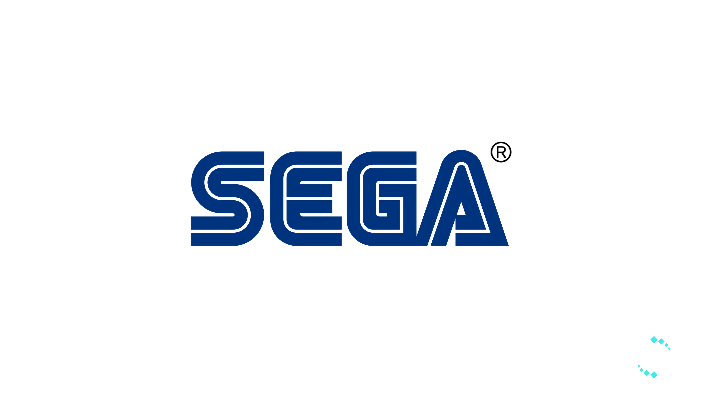</p>

The `scripts/sonic/reach-title-or-gameplay.pad` route reaches the game's SEGA logo, composited by the
live renderer at 3840×2160. The title had previously produced nothing but black: its boot state
machine waits for a save-data job that could never finish, because
`sceSaveDataCreateTransactionResource` returned 0 when it must return the id of the transaction
resource it creates. With a real id the boot advances,
the frontend loads its menu resource set and opens its logo movie, and the SEGA logo renders. **No
title screen is reached:** after the logo fades the composite holds on white. See
[`prosper/docs/GRIS_SONIC_COBRA_BRINGUP.md`](prosper/docs/GRIS_SONIC_COBRA_BRINGUP.md) and the
[tracker](https://github.com/mattias800/prosper/issues/1871).

## Sonic Frontiers — `PPSA03831`

<p align="center">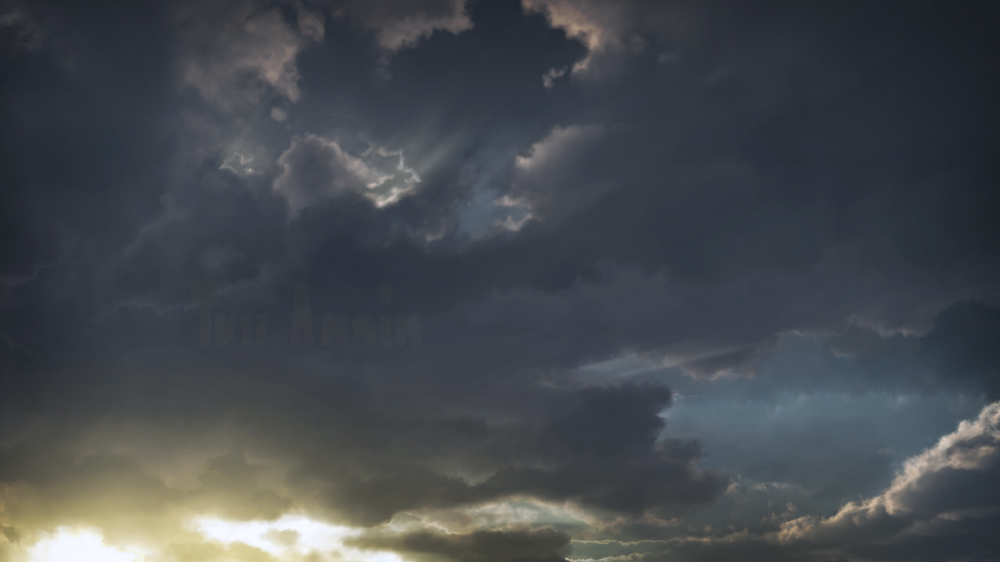</p>
<p align="center">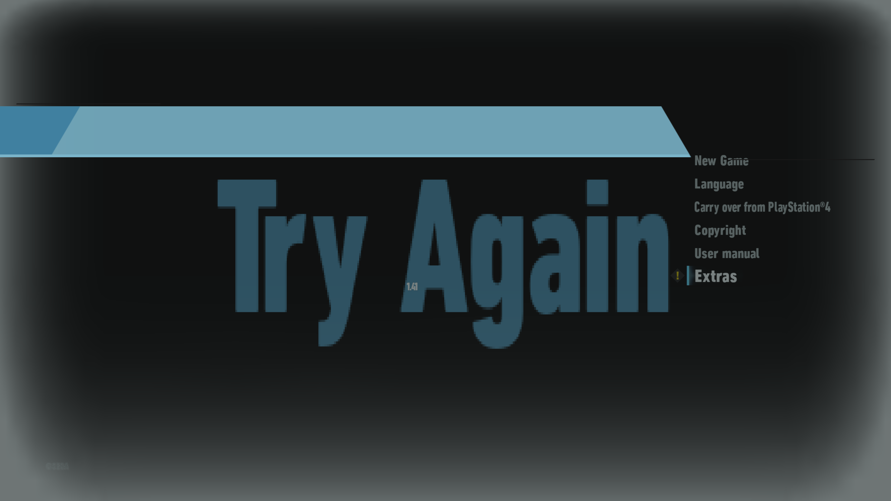</p>
<p align="center">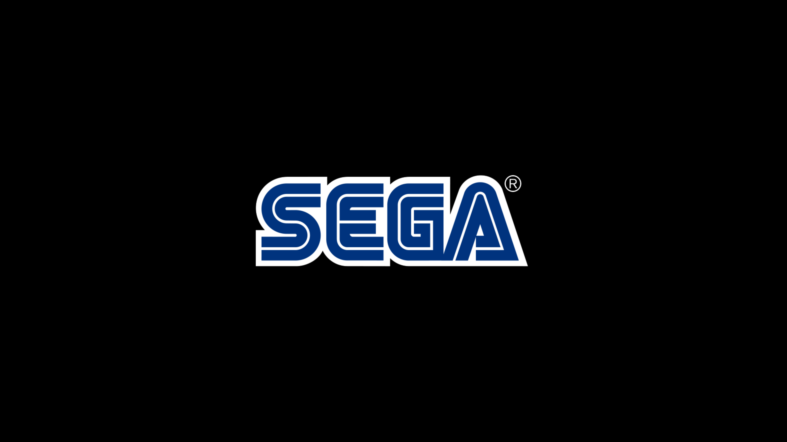</p>
<p align="center">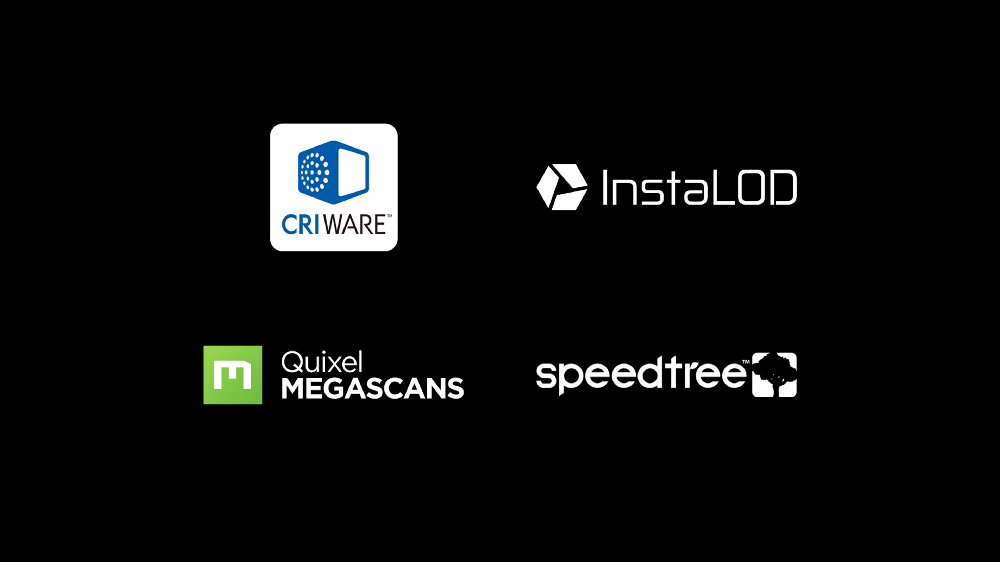</p>
<p align="center">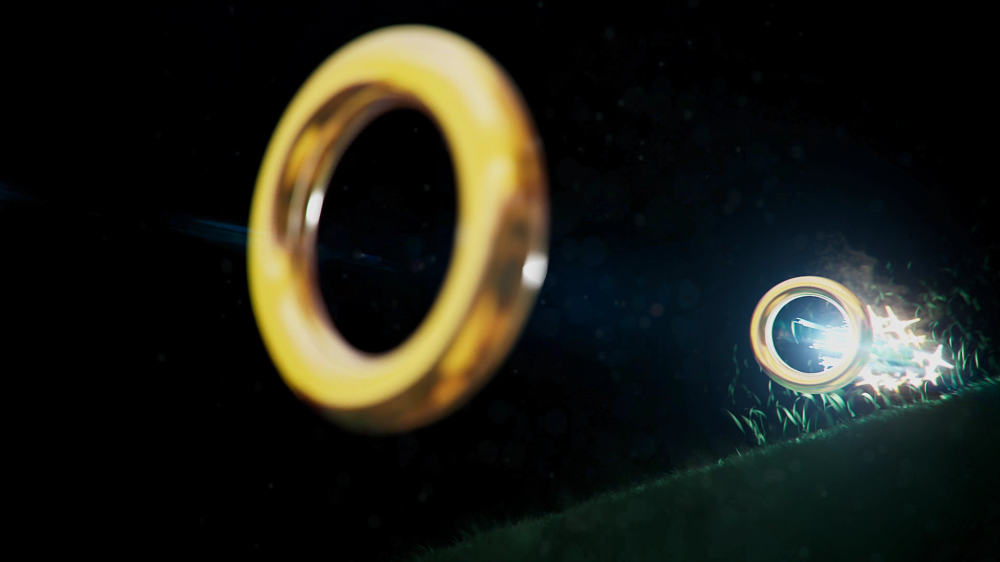</p>
<p align="center">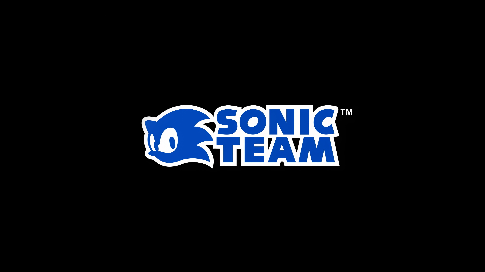</p>
<p align="center">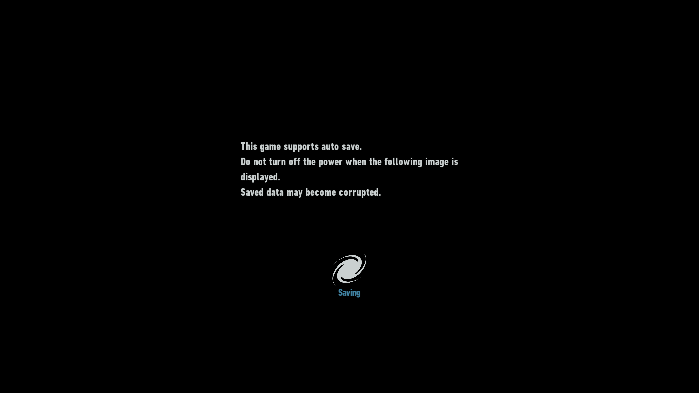</p>

A default launch with no input reaches the game's whole opening sequence at 3840×2160 — the SEGA
logo, the Cyber Space intro, the Sonic Team logo and the middleware credits — then the auto-save
notice, the title screen and the main menu. The title composites into the display buffer it flips
rather than through render passes, so publishing it needs the flipped buffer itself to be a present
source.

The boot previously stopped dead after the opening sequence, at a black screen. It was waiting on
`sceSaveDataTransferringMountPs4` — the call behind the menu's own "Carry over from PlayStation®4"
entry. prosper did not implement it, and the unimplemented default answers `SCE_OK`, so the title
believed a PS4 save had been mounted and spent every frame trying to open a mount point that was
never created. **Known defects:** the menu heading draws the string "Try Again" where the game's
logo belongs, and a panel that opens over the menu renders almost none of its text
([#2206](https://github.com/mattias800/prosper/issues/2206)). See
[`docs/SONIC_FRONTIERS_STATUS.md`](prosper/docs/SONIC_FRONTIERS_STATUS.md) and the
[tracker](https://github.com/mattias800/prosper/issues/1891).

## Sonic Racing: CrossWorlds — `PPSA08804`

<p align="center">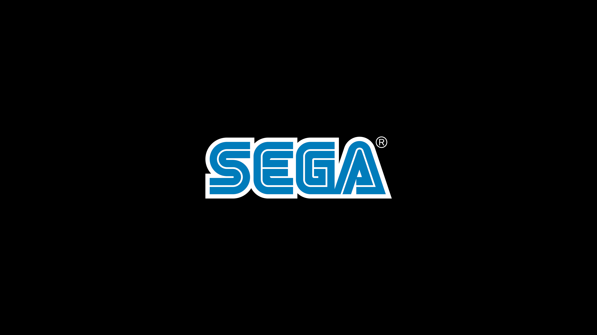</p>

A default launch reaches the game's SEGA logo, composited by the live renderer at 3840×2160. The
engine keeps producing frames afterwards, but the composite becomes a single uniform colour before a
title screen is reached. See [`docs/SONIC_CROSSWORLDS_STATUS.md`](prosper/docs/SONIC_CROSSWORLDS_STATUS.md)
and the [tracker](https://github.com/mattias800/prosper/issues/1895).

## Terminator 2D: NO FATE — `PPSA25872`

<p align="center"></p>
<p align="center"></p>

The main menu and attract-mode gameplay are verified. See the [tracker](https://github.com/mattias800/prosper/issues/1872).

## Blue Prince — `PPSA25009`

<p align="center"></p>

The manor entrance hall renders with real 3D gameplay content. See the [tracker](https://github.com/mattias800/prosper/issues/1808).

## Grand Theft Auto V — `PPSA04263`

<p align="center"></p>
<p align="center"></p>

The title and STORY/ONLINE main menu render. See the [tracker](https://github.com/mattias800/prosper/issues/1873).

## Dragon Quest VII Reimagined — `PPSA17942`

<p align="center"></p>
<p align="center"></p>
<p align="center"></p>
<p align="center"></p>

The title, new-save flow, and first-run setup render at native 3840×2160 with audio. Gameplay is not yet validated. See the [tracker](https://github.com/mattias800/prosper/issues/1874).

## Alex Kidd in Miracle World DX — `PPSA02664`

<p align="center"></p>

The first level renders at native 1920×1080. See the [tracker](https://github.com/mattias800/prosper/issues/1875).

## New Joe &amp; Mac: Caveman Ninja — `PPSA02801`

<p align="center"></p>
<p align="center"></p>

The title, menus, and level 1 render at native 1920×1080. See the [tracker](https://github.com/mattias800/prosper/issues/1876).

## Asterix &amp; Obelix: Slap Them All! — `PPSA08576`

<p align="center"></p>

The first forest level renders on the initial route with no title-specific changes. See the [tracker](https://github.com/mattias800/prosper/issues/1877).

## Summer Sports Games — `PPSA03416`

<p align="center"></p>

The mode-select flow reaches live 3D athletics at native 3840×2160. See the [tracker](https://github.com/mattias800/prosper/issues/1878).

## Worms Armageddon: Anniversary Edition — `PPSA20052`

<p align="center"></p>
<p align="center"></p>

The scripted route reaches a live match at native 1920×1080. See the [tracker](https://github.com/mattias800/prosper/issues/1879).

## Earthion — `PPSA28061`

<p align="center"></p>

The route reaches the title screen, main menu, and HOW TO PLAY page in full colour at native 3840×2160. See the [tracker](https://github.com/mattias800/prosper/issues/1880).

## Bendy and the Ink Machine — `PPSA27616`

<p align="center"></p>
<p align="center"></p>

The route reaches first-person Chapter 1 gameplay at native 3840×2160. See the [tracker](https://github.com/mattias800/prosper/issues/1881).

## The Plucky Squire — `PPSA15319`

<p align="center"></p>

The title and save-file/play-style menus render at native 3840×2160; the current route does not reach chapter one. See the [tracker](https://github.com/mattias800/prosper/issues/1882).

## The Pathless — `PPSA01826`

<p align="center"></p>

The title screen renders at native 2560×1440. Gameplay has not yet been reached. See the [tracker](https://github.com/mattias800/prosper/issues/1883).

## ArcRunner — `PPSA21406`

<p align="center">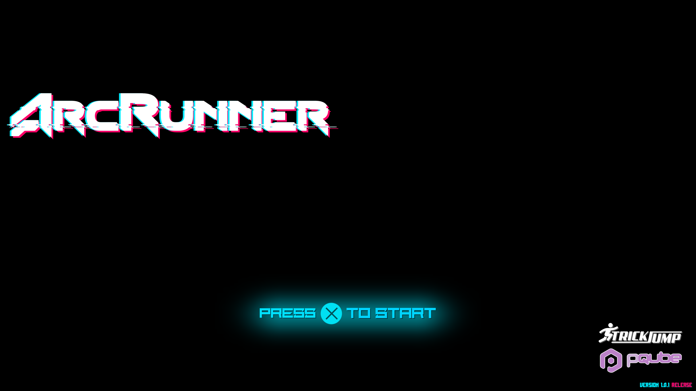</p>
<p align="center"></p>
<p align="center">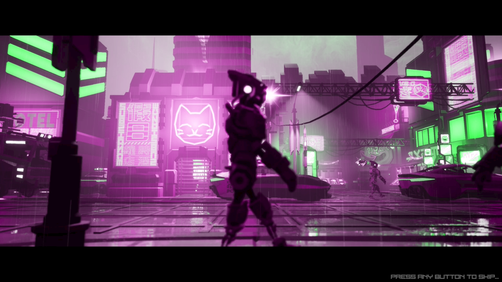</p>

The whole intro cinematic renders at 4K — the Titan-class station against its nebula, the rainy neon street, and the population card — with 1,901 of 1,908 video frames succeeding. **Past the cinematic the title reaches its title screen and holds it**, unchanged for 176 s of a 288 s run.

**The colours in these frames are wrong.** Decoding the same movie outside prosper gives an *orange* nebula with *cyan* thrusters; prosper produces green and magenta. Geometry, composition, timing and frame pacing are correct, so the images are valid evidence for those — but not for colour. Tracked in [#2094](https://github.com/mattias800/prosper/issues/2094).

**This needs `PROSPER_SUBMIT_STALL_US=1500`, and that is a diagnostic lever rather than a fix.** On the default route the title faults before the cinematic: 17 runs out of 17, against 0 out of 4 with the stall applied. Every graphics subsystem the cinematic exercises works; what remains is a submit-timing race, tracked as [#1226](https://github.com/mattias800/prosper/issues/1226) with a dose-response experiment in [#2084](https://github.com/mattias800/prosper/issues/2084). See the [tracker](https://github.com/mattias800/prosper/issues/1817).

## Asterix &amp; Obelix: Babylon Mission — `PPSA30490`

<p align="center"></p>
<p align="center">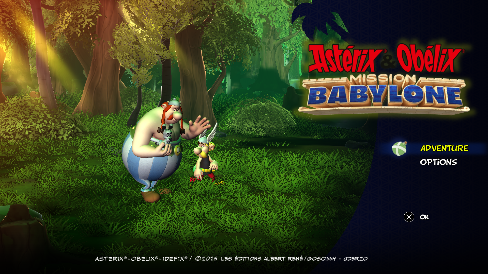</p>

A direct, unmodified native 1920×1080 capture plays both publisher logo movies, renders the narrated
intro cutscene, and reaches the title screen with its `ADVENTURE` / `OPTIONS` menu. Gameplay has not
yet been reached. See the [tracker](https://github.com/mattias800/prosper/issues/1884).

## R-Type Delta: HD Boosted — `PPSA26414`

<p align="center"></p>
<p align="center">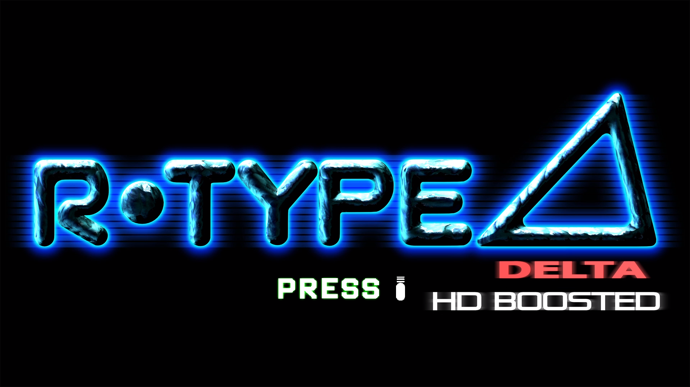</p>
<p align="center">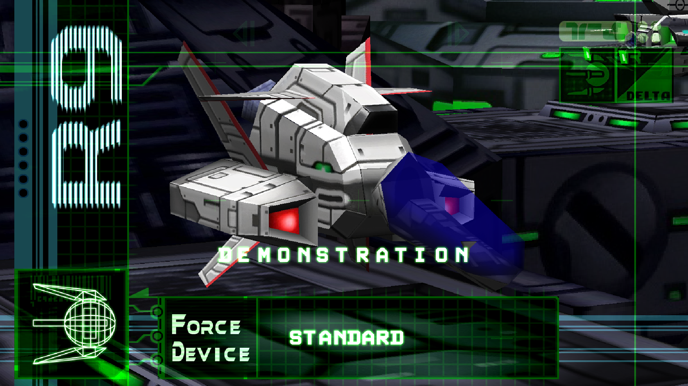</p>

The Clear River Games publisher logo and the full opening movie — the R-9 fighter in its hangar — render live at 1920×1080 from the real GPU command stream, in full colour, and the run continues into the **title screen** and the attract-mode demonstration. Gameplay has not yet been reached.

Reaching this needs the game's files **evicted from the host page cache** first, which takes one command and no change to how the title is launched:

```bash
python3 prosper/tools/dropcache.py <DUMP_ROOT>/PPSA26414-app0    # then launch normally
```

The title's input worker sleeps 400 ms before its first `sceUserServiceGetEvent` drain, and on a fast host prosper finishes the asset load well inside that window — so the shell runs first, dereferences an empty user vector and dies. Reading the assets from storage rather than from cache stretches the load past the 400 ms mark and the title survives its own race. (Repeat the eviction before each launch: the run itself re-warms the cache.) Every guest sleep is honoured exactly and every service answer is faithful — a PS5's slower core is what makes this title ship working, and prosper simply executes the game's own loader faster than the console it is emulating. See the [tracker](https://github.com/mattias800/prosper/issues/1810) and [#1746](https://github.com/mattias800/prosper/issues/1746).

## Nikoderiko: The Magical World — `PPSA23760`

<p align="center"></p>

The warning screen, publisher logo, title screen, and EULA render at native 3840×2160. See the [tracker](https://github.com/mattias800/prosper/issues/1885).

## The Oregon Trail — `PPSA19244`

<p align="center"></p>
<p align="center">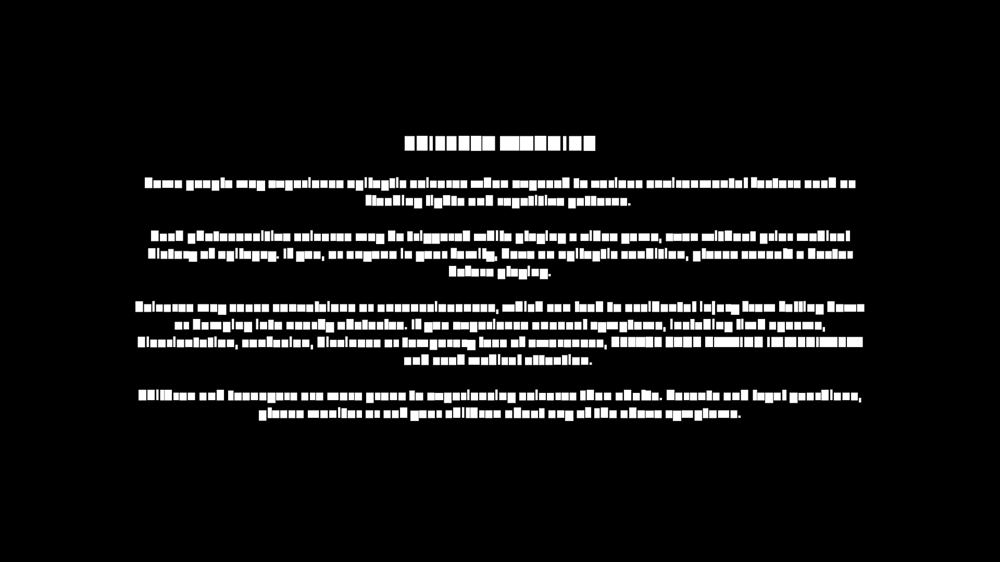</p>
<p align="center">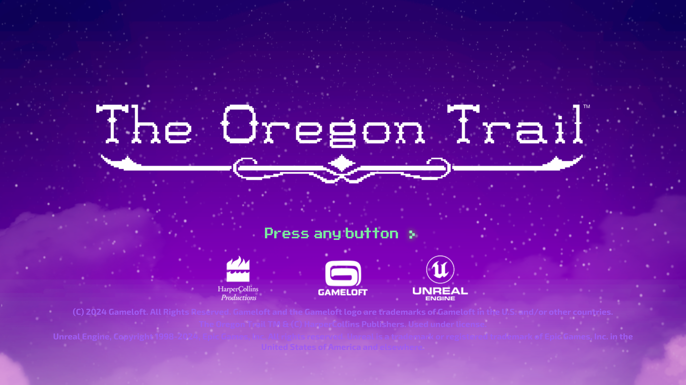</p>

The startup sequence renders at native 3840×2160 and now runs past the EULA stage: the legal popup, the Gameloft splash, then the health/epilepsy warning screen. It then reaches and renders the **title screen** with its "Press any button" prompt; the ordered-DMA submit that used to stall the boot there is fixed. The whole UI layer used to render unblended — text drew as solid blocks, the logo sat on an opaque black panel and the sky was a flat field — because the title's render-target-0 blend state never reached the GPU; with that fixed the title screen composites correctly, including its glyphs, gradient sky and publisher logos. See the [tracker](https://github.com/mattias800/prosper/issues/1886).

## Greak: Memories of Azur — `PPSA02849`

<p align="center"></p>
<p align="center"></p>

The scripted route reaches sustained first-level gameplay at native 1920×1080. See the [tracker](https://github.com/mattias800/prosper/issues/1887).

## Rugrats: Adventure in Gameland — `PPSA23396`

<p align="center"></p>
<p align="center"></p>

The route reaches the first nursery level at native 1920×1080. See the [tracker](https://github.com/mattias800/prosper/issues/1888).

## Syberia: Remastered — `PPSA30140`

<p align="center"></p>
<p align="center"></p>
<p align="center"></p>

The validated route reaches the title screen and first playable scene with real GPU draws. See the [tracker](https://github.com/mattias800/prosper/issues/1811).

## Tales of Graces f Remastered — `PPSA19991`

<p align="center"></p>
<p align="center"></p>
<p align="center">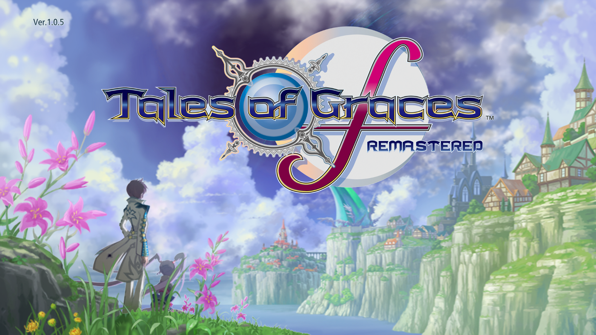</p>
<p align="center">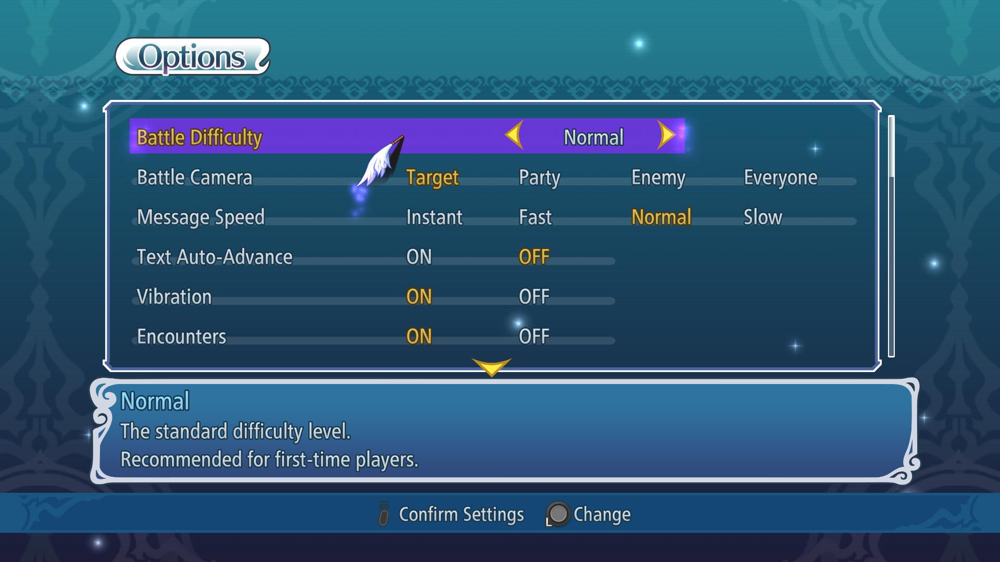</p>

The title, EULA, main menu, and new-game Options screen render at native 1920×1080. See the [tracker](https://github.com/mattias800/prosper/issues/1889).

## Astro Bot — `PPSA21564`

<p align="center"></p>
<p align="center"></p>
<p align="center"></p>

The opening sequence and ASTRO BOT title card render at native 3840×2160. See the [tracker](https://github.com/mattias800/prosper/issues/1809) for current visual and performance work.

## The Forgotten City — `PPSA03026`

<p align="center"></p>

The direct native 3840×2160 frontend capture reaches the title screen and its `Press Any Button` prompt, through the full white splash, Unreal Engine and Film Victoria logo cards, legal text and autosave notice. Gameplay has not yet been reached, and the run is bounded by two intermittent guest-heap faults. See the [tracker](https://github.com/mattias800/prosper/issues/1890).

## Tactics Ogre: Reborn — `PPSA03839`

<p align="center"></p>
<p align="center"></p>

The route reaches the first tutorial battle with real GPU draws at native 1920×1080. See the [tracker](https://github.com/mattias800/prosper/issues/1892).

## Little Nightmares III — `PPSA05143`

<p align="center">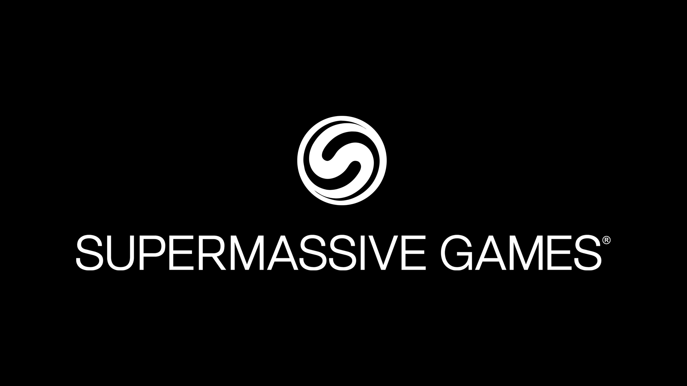</p>
<p align="center">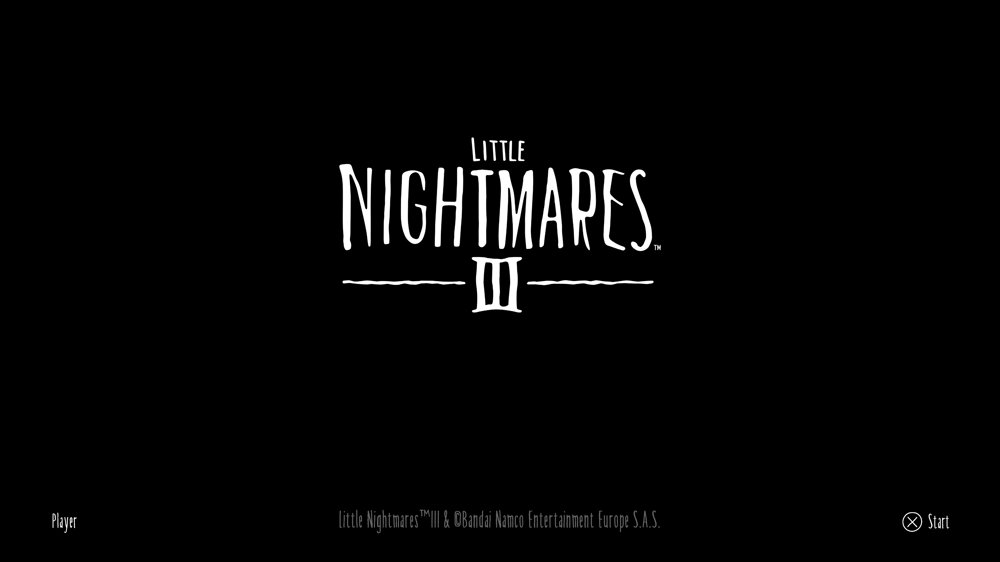</p>

The boot splash sequence and the title screen render at native 3840×2160 on a default launch, with the
logo, the player slot and the Start prompt all legible. The render-thread stall that used to end the run
before the title is gone.

The title screen is still degraded: most composited frames arrive with the red and green channels forced
to maximum, which reads as a flat yellow background under otherwise-correct content. See the
[tracker](https://github.com/mattias800/prosper/issues/1893).

## Crisis Core –Final Fantasy VII– Reunion — `PPSA07809`

<p align="center"></p>
<p align="center">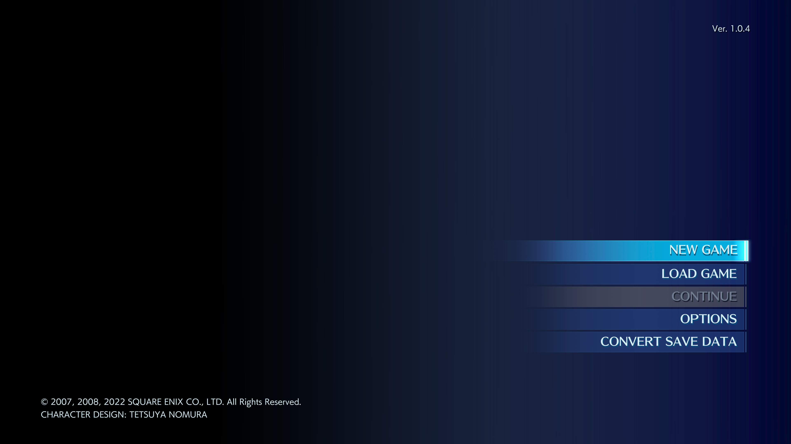</p>
<p align="center"></p>

The title is Unreal Engine 4.27 with IoStore packaging. It boots into a native Linux/Vulkan run, completes
engine bootstrap, and streams real content from the 8.49 GB IoStore container. The declined-GPU-submit freeze
that used to stop it here is gone, fixed by [#1987](https://github.com/mattias800/prosper/pull/1987). It now
reaches the white splash, the autosave-notice dialog and then the **title screen** — "Press Any Button" with the
version string and the Square Enix copyright — which holds stably. One button press opens the main menu
(`NEW GAME` / `LOAD GAME` / `CONTINUE`, correctly greyed with no save present / `OPTIONS` / `CONVERT SAVE DATA`),
and pressing on through it opens the new-game settings flow: voice-language selection and the "Begin game with
selected settings?" prompt both render correctly.

**This is rung 2 on a throttled route, not on a default launch.** What ends a default run is a guest memory
fault a few seconds into the boot — on the render thread, the RHI thread or a worker pool thread depending on
the run, and in some runs the game's own allocator catches it first. Holding the guest's own submit call for a
few extra milliseconds avoids it, which is how the captures above were taken; that is a stopgap while the race
is fixed. Two rendering defects remain on the reached screens: the title screen's key art never draws, and most
published frames select a non-scanout composite source while the real screen exists. See
[`docs/CRISIS_CORE_STATUS.md`](prosper/docs/CRISIS_CORE_STATUS.md) and the
[tracker](https://github.com/mattias800/prosper/issues/1894).

## The House of the Dead 2: Remake — `PPSA24203`

<p align="center"></p>
<p align="center"></p>

The route reaches Training 1 with a live rail-shooter camera, HUD, crosshair, and interaction effects at native 1920×1080. See the [tracker](https://github.com/mattias800/prosper/issues/1896).

## Bendy and the Dark Revival — `PPSA27624`

<p align="center"></p>

A default launch reaches the multi-language photosensitivity warning and then the title screen and its BEGIN menu at
native 3840×2160. The title had previously stopped on Unity's empty transition scene, waiting on an opening movie
that could not finish: the guest starts the clip and never collects a frame, and prosper's decode worker only
advances when someone pulls, so playback never ended. The player now runs the source on its own media clock, the
movie plays out, and the boot proceeds. The menu's background video decodes and is delivered to the guest but is not
composited, so the menu sits on a flat grey background. See the
[tracker](https://github.com/mattias800/prosper/issues/1897).

## Beneath — `PPSA27640`

<p align="center"></p>

A direct, unmodified native 1920×1080 frontend capture reaches the title screen and its `Press Any Button To Start`
prompt. Gameplay has not yet been reached. See the [tracker](https://github.com/mattias800/prosper/issues/1898).

## Reproducible routes

Where available, reusable input routes live under [`prosper/scripts`](prosper/scripts). The tracker
issue for each title identifies the current route and the exact tested revision.
