# Game compatibility

prosper is an experimental compatibility layer, not a general-purpose game runner. The results below
describe specific, user-supplied PS5 dumps tested primarily on Linux. A milestone means that the
documented route is reproducible; it does **not** mean the entire game is playable or free of bugs.
Different title revisions may behave differently.

Last updated: 2026-08-02

## Summary

| Title | Title ID | Engine | Tested milestone |
| --- | --- | --- | --- |
| *The Messenger* | `PPSA24651` | Unity / IL2CPP | ✅ Complete first level renders at native 1920×1080 |
| *Dead Cells* | `PPSA15552` | Custom | ✅ Controllable Prisoners' Quarters scene renders in full color |
| *Blasphemous 2* | `PPSA13579` | Unity | ✅ Opening route reaches and renders the first playable room |
| *Evergate* | `PPSA01885` | Unity | ✅ Reaches and renders the first tutorial-room gameplay |
| *GRIS* | `PPSA09804` | Unity / IL2CPP | ✅ Native 1920×1080 opening gameplay reached; scripted input and audio verified; `gris-gameplay` guard |
| *Space Adventure Cobra — The Awakening* | `PPSA17337` | Unity / IL2CPP | ✅ Native 1920×1080 tutorial combat and audio verified; `cobra-gameplay` guard |
| *Sonic Origins*&nbsp;² | `PPSA05325` | Hedgehog Engine | 🔬 Frontend loop reached; supplied update-only dump lacks its base title assets |
| Terminator (2D)&nbsp;¹ | `PPSA25872` | Unity / IL2CPP | ✅ Main menu and attract-mode gameplay reached (user-verified) |
| *Blue Prince* | `PPSA25009` | Unity | 🚧 Day One gameplay renders; the manor entrance hall matches the hardware reference |
| *Grand Theft Auto V* | `PPSA04263` | RAGE | 🚧 Title and STORY/ONLINE main menu render; known UI and composition defects remain |
| *Dragon Quest VII Reimagined* | `PPSA17942` | Unreal Engine 4 | 🚧 Native 3840×2160 title, name entry, name confirmation, and first-run `System Settings 1/4` onboarding reached, with audio; gameplay is not yet validated |
| *Alex Kidd in Miracle World DX* | `PPSA02664` | Unity / IL2CPP | ✅ First level reached and rendered at native 1920×1080; colour matches the hardware reference, with a minor title-overlay contrast defect |
| *New Joe &amp; Mac: Caveman Ninja* | `PPSA02801` | Unity / IL2CPP | ✅ Title screen, menus and level 1 gameplay render at native 1920×1080 — reached on the first boot with no code changes |
| *Asterix &amp; Obelix: Slap Them All!* | `PPSA08576` | Unity / IL2CPP | ✅ Title screen and first forest level render at native 1920×1080 — reached on unmodified master with no code changes |
| *Summer Sports Games* | `PPSA03416` | Unity / IL2CPP | ✅ Mode select and live 3D athletics render at native 3840×2160 with no code changes |
| *Worms Armageddon: Anniversary Edition* | `PPSA20052` | Custom (Digital Eclipse) | ✅ Scripted route reaches a live Quickstart match at native 1920×1080; `worms-armageddon-gameplay` guard |
| *Earthion* | `PPSA28061` | Custom (Ancient) | 🚧 Developer logo, intro story text and CRT bezel render; the 320×224 game picture inside the bezel is still missing |
| *Bendy and the Ink Machine* | `PPSA27616` | Unity / IL2CPP | 🚧 Main menu renders and a scripted route reaches first-person Chapter 1 gameplay at native 3840×2160; about 8 fps in the level |
| *The Plucky Squire* | `PPSA15319` | Unreal Engine 4 | 🚧 Title screen and the save-file/play-style menus render at native 3840×2160; the route then holds a black loading screen and does not reach chapter one |
| *The Pathless* | `PPSA01826` | Unreal Engine 4 | 🚧 Title screen (`NEW GAME` / `OPTIONS`) renders at native 2560×1440; gameplay not reached |
| *ArcRunner* | `PPSA21406` | Unreal Engine 4 | 🔬 Boots into the UE4 render bring-up and submits real GPU work, then the render thread faults after about 10 s with no frame composited |
| *Asterix &amp; Obelix - Babylon Mission* | `PPSA30490` | Unity 6 / IL2CPP | 🔬 Boots and submits real GPU work, but every presented frame is black and a guest thread dies at about 125 s, after which the renderer publishes nothing |
| *R-Type Delta: HD Boosted* | `PPSA26414` | Custom | 🔬 Audio and sound bank initialise; the game's own code lives in a runtime-loaded PRX that prosper cannot yet load |
| *Nikoderiko: The Magical World* | `PPSA23760` | Unreal Engine 4 | 🚧 Warning screen, publisher logo, title screen and EULA render at native 3840×2160 with no code changes; the 3D world is dropped because the programmed user-data block is larger than the bound pipeline's user-SGPR window (#305) |
| *The Oregon Trail* | `PPSA19244` | Unreal Engine 4 | 🔬 Boots to a steady ~50 fps frame loop with a complete post-process chain, but the HDR scene colour is already black before tonemapping |
| *Greak: Memories of Azur* | `PPSA02849` | Unity / IL2CPP | ✅ Scripted route reaches sustained first-level gameplay at native 1920×1080 |
| *Rugrats: Adventure in Gameland* | `PPSA23396` | Unity / IL2CPP | ✅ Scripted route reaches the first nursery level at native 1920×1080 |
| *Syberia: Remastered* | `PPSA30140` | Unity / IL2CPP | 🚧 **Gameplay** — title screen and the first playable scene render with real GPU draws on a validated route; the profile menu's 3D layer and the gameplay composite are degraded (#1619) |
| *Tales of Graces f Remastered* | `PPSA19991` | Unity / IL2CPP | 🚧 Publisher and CRIWARE logos render at native 1920×1080; the opening movie stops it before the title screen |
| *Astro Bot* | `PPSA21564` | ASOBI (in-house) | 🚧 Opening sequence and the ASTRO BOT title screen render at native 3840×2160; the title is over-exposed, the world-map hub shows only its backdrop, and guest compute costs ~21× throughput (#1732) |

¹ Exact retail game name pending confirmation.

² No compatibility milestone is claimed for the incomplete Sonic dump. A merged base+update image is
required before its title, gameplay, or audio can be evaluated. The guest also consumes an authentic
Sonic 1 activity launch, but still needs the same base UI assets before entering the classic runtime.

## Boot sweep — 2026-08-02

Fourteen titles were booted on one build (`3a473bca`) through the headless `screenshot` frontend with
no render acceleration (`PROSPER_RENDER_SCALE=1`, `PROSPER_RENDER_EVERY=1`, no sampling window), to
establish where each one actually stops today rather than where its last write-up left it. Rungs are
the ladder in `CLAUDE.md`: 0 nothing, 1 any real graphics, 2 title screen, 3 gameplay.

**Read the frame rates as lower bounds, not as benchmarks.** Another lane held the same GPU for most
of the sweep, so every number below was measured under concurrent load of an unknown size. The figure
is guest flips per second — the rate the game itself advances — averaged over the sampled window.

| Title | Rung reached | Frames/s | Where it stops |
| --- | --- | --- | --- |
| *Grand Theft Auto V* `PPSA04263` | 2 | ~132 @ 4K | Title with the `Continue ✕` prompt; the menu needs input |
| *Bendy and the Ink Machine* `PPSA27616` | 3 | ~30 @ 4K menu, ~8 @ 4K in level | Routed Chapter 1 interior renders and the camera moves |
| *The Plucky Squire* `PPSA15319` | 2 | ~21 @ 4K | Menus render; after the play-style choice the route holds a black loading screen for 260 s |
| *The Pathless* `PPSA01826` | 2 | ~14 @ 1440p | Title screen holds; no input route tried |
| *Nikoderiko: The Magical World* `PPSA23760` | 2 | ~14 @ 4K | Title screen; the 3D world is dropped (#305 / #1607) |
| *Syberia: Remastered* `PPSA30140` | 3 | ~2 @ 1080p | Routed factory hall renders; composite degraded (#1619 / #1627) |
| *Dragon Quest VII Reimagined* `PPSA17942` | 1 without input | ~12 @ 4K | Ocean/sky pass and the save-created notice; the title needs the route |
| *Earthion* `PPSA28061` | 1 | ~139 @ 4K | Bezel and intro text; the picture area inside the bezel is missing (#1590) |
| *Tales of Graces f Remastered* `PPSA19991` | 1 | ~85 @ 1080p | Logos and the `Checking add-on…` dialog, then black (#1609 / #1688) |
| *The Oregon Trail* `PPSA19244` | 0 | ~42 @ 4K | Frame loop advances, every frame black (#1606 / #1641) |
| *Asterix &amp; Obelix - Babylon Mission* `PPSA30490` | 0 | ~124 @ 1080p until 125 s | All frames black, then a guest thread dies and the renderer stops (#1599) |
| *Sonic Origins* `PPSA05325` | 0 | ~5 @ 4K | One rendered frame; the supplied dump is update-only |
| *ArcRunner* `PPSA21406` | 0 | — | Guest render thread faults after about 10 s, before any composited frame (#1226) |
| *R-Type Delta: HD Boosted* `PPSA26414` | 0 | — | `GetProcAddress error 80020003`, then a guest fault at `rip=0` (#1591) |

Six titles that render real content are below the 30 fps bar: Syberia (~2), Bendy in level (~8),
Dragon Quest VII (~12), Nikoderiko (~14), The Pathless (~14) and The Plucky Squire (~21).

## The Messenger — `PPSA24651`

<p align="center">
  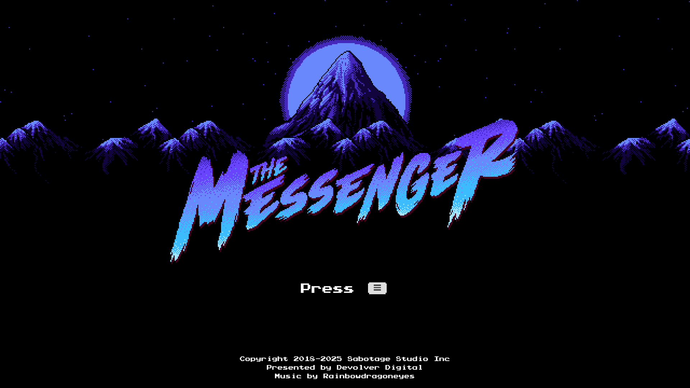
</p>
<p align="center">
  
</p>

The primary Unity 2022 / IL2CPP target boots through the engine, accepts scripted gamepad input, and
renders the intro, title, menus, save list, dialogue, player, terrain, water, structures, and
foreground composition through the complete first level at native 1920×1080. A full-resolution
scripted sequence was checked against PS5 hardware.

Reusable input routes are documented in
[`prosper/scripts/messenger/README.md`](prosper/scripts/messenger/README.md).

## Dead Cells — `PPSA15552`

<p align="center">
  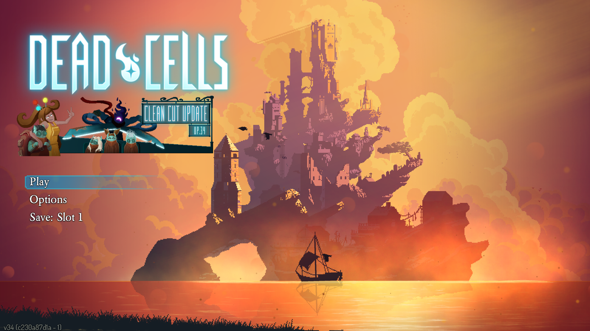
</p>
<p align="center">
  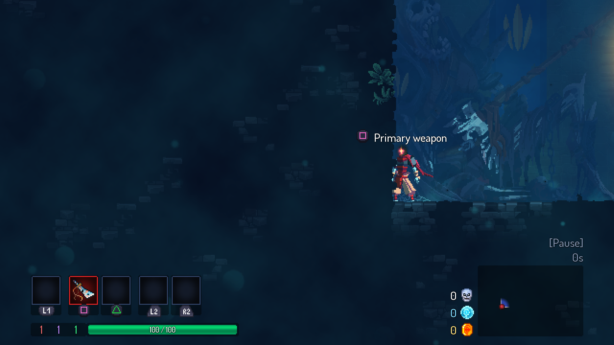
</p>

A deterministic input route passes the splash and menus and reaches the controllable Prisoners'
Quarters scene. The current renderer produces the colored atlas, lighting, player, terrain, effects,
tutorial prompt, and HUD.

Graphics and compute execute in retained PM4 order (#584), guest compute writes invalidate
overlapping depth-cache state (#611), and the remaining lighting loops recompile through a narrowly
proved wave-uniform form (#615). The final grayscale-world defect was MRT selection: shaders export
MRT3 through MRT0, while the single-attachment backend previously used the first export. MRT0 now
feeds color attachment 0 (#626). Capture v8 preserves the complete color/depth checkpoint and
source-image oracle for fast standalone regression replay (#569).

See the exact route, current state, and regression workflow in
[`prosper/docs/DEAD_CELLS_STATUS.md`](prosper/docs/DEAD_CELLS_STATUS.md).

## Blasphemous 2 — `PPSA13579`

<p align="center">
  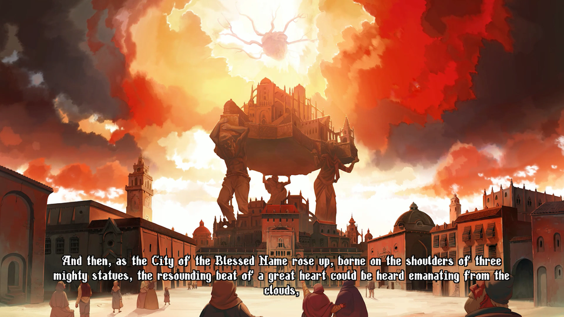
</p>
<p align="center">
  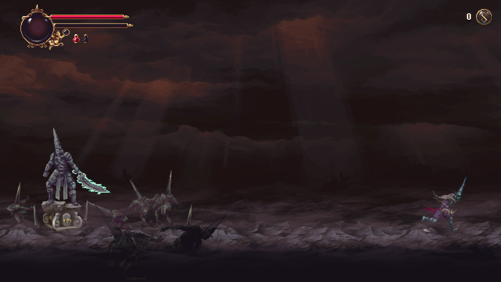
</p>

The FMOD plugin path, AGC marker contract, two-pass HTTP URI parser, and guest-thread return boundary
are implemented. A poll-safe scripted route traverses the EULA and opening cinematic into a complete
native 1920×1080 first room with the player, HUD, world layers, lighting, and interaction UI.

The last black-world defect was PS5 primitive type 7: it is a RectList used by transparent fullscreen
clears, while prosper treated it as three points. The observed procedural form now runs its fourth
corner and renders as a Vulkan triangle strip (#654).

The reproducible route and capture recipe are in
[`prosper/scripts/blasphemous2/README.md`](prosper/scripts/blasphemous2/README.md).

## Evergate — `PPSA01885`

<p align="center">
  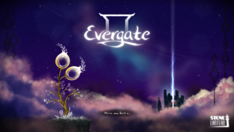
</p>
<p align="center">
  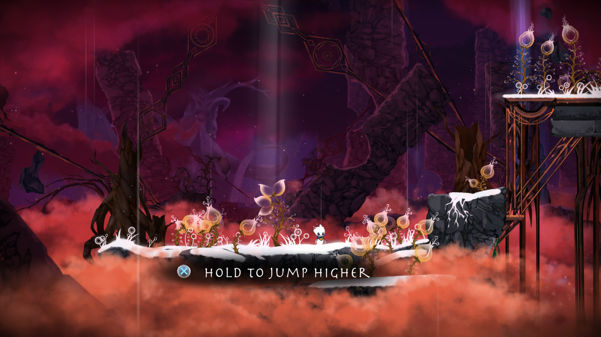
</p>

This Stone Lantern 2D puzzle-platformer boots through its intro and title, navigates the main menu with
scripted input, and reaches the first tutorial room: the masked spirit *Ki* on snow-capped platforms
among glowing bulb-plants, with the *"HOLD [X] TO JUMP HIGHER"* prompt. A crash when a keyboard key was
pressed at the menu — the guest's IME event handler ran on the host thread-local (`%fs`) base and read a
garbage per-thread allocator pointer — was fixed by restoring the caller's guest `%fs` around the callback
(#1288). A deterministic content-guard snapshot (`evergate-gameplay`) locks the tutorial-room milestone
against regressions.

The reproducible route is in
[`prosper/scripts/evergate/README.md`](prosper/scripts/evergate/README.md).

## GRIS — `PPSA09804`

<p align="center">
  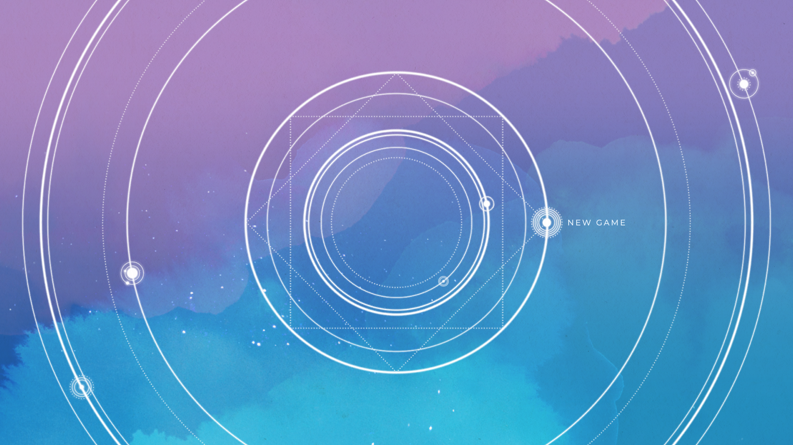
</p>
<p align="center">
  
</p>

The Unity/IL2CPP title reaches its animated **NEW GAME** screen at native 1920×1080, accepts the
scripted default selection, and continues through the opening fall into real gameplay. In an
exact-master native `screenshot` run, the player appeared on the opening ink-ground scene around
130 seconds, moved and animated while scripted Right input remained held, and settled after the route
returned to neutral at 150 seconds. All 85 samples in the 170-second run were pixel-distinct.

The original bring-up produced sustained clean Wwise PCM (`rms=0.1800`, no duplicated grains). The
2026-07-31 current-master route also produced non-zero, repetition-free port-1 PCM during its first
35 seconds (`rms=0.0082`, `peak=0.1173`, no duplicated grains); its later quiet gameplay window is
reported separately rather than treating one silent tail as a silent whole capture.

## Space Adventure Cobra — The Awakening — `PPSA17337`

<p align="center">
  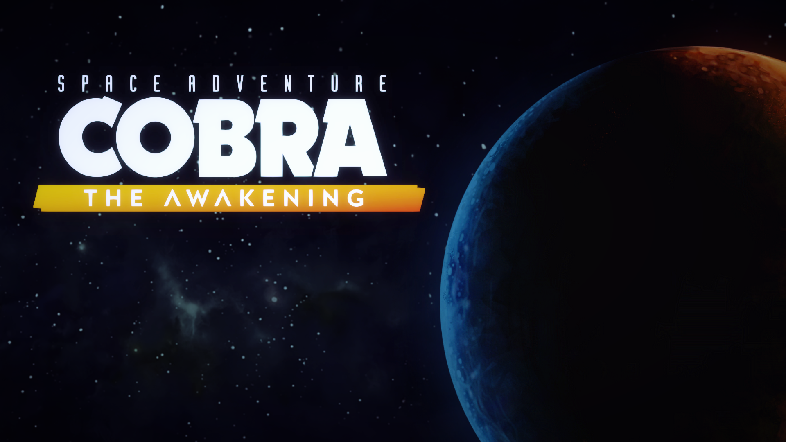
</p>
<p align="center">
  
</p>

This Unity/IL2CPP title boots through its opening flow, accepts the displayed hold-Square movie skip,
and reaches the opening desert tutorial at native 1920×1080. A fresh-save, default-configuration run
survived the complete 180-second scripted route with write watches enabled, displayed the readable
`Press R2 to shoot with the Psychogun.` prompt, and continued through full-color combat with Cobra,
enemies, projectiles, and HUD intact. This is a reproducible opening-gameplay milestone, not a claim
that the complete game is playable or performance-complete.

The route exercises guest write-watch faults from Unity worker threads. Write-watch handling now
temporarily restores host `%fs` while entering the host mutex and `mprotect`, then restores guest
`%fs` before the interrupted store resumes; this prevents host TLS operations from corrupting the
guest worker's TLS. Its captured audio also passes the objective repetition check (`rms=0.0436`, no
duplicated grains). Cobra additionally imports an SDK-revision alias of
`sceAgcCreateInterpolantMapping`; routing that alias to the real builder initializes all 32
advertised Cx records instead of exposing stale stack entries as register writes.

## Sonic Origins — `PPSA05325`

The supplied 02.002.000 directory is an update image targeting 02.001.000, rather than a merged
base+update app. Live file tracing shows that its only unresolved startup requests are
`raw/ui/ui_startup.pac` and `raw/ui/rpl_texture/ui_title_nocopy.dds`; both are absent from the dump.
The game otherwise initializes its renderer, connected pad, CRI sound banks, and AudioOut2 pump, but
correctly remains in a black startup loop and emits silence without those title assets. No screenshot,
audio, or compatibility success is claimed until a complete dump is available.

The update declares PS5 `launchActivity` support and contains the classic RSDK files. An exact
`TITLE_SONIC_1_CLASSIC` Game Intent is received by the guest and its `activityId` property is consumed,
but Sonic still requests both missing UI files before opening `raw/retro/Sonic1u.rsdk`. This rules out
the platform activity route as a way around the incomplete content while preserving truthful default
no-intent behavior.

Routes, capture commands, audio evidence, and the Sonic audit are recorded in
[`prosper/docs/GRIS_SONIC_COBRA_BRINGUP.md`](prosper/docs/GRIS_SONIC_COBRA_BRINGUP.md).

## Blue Prince — `PPSA25009`

<p align="center">
  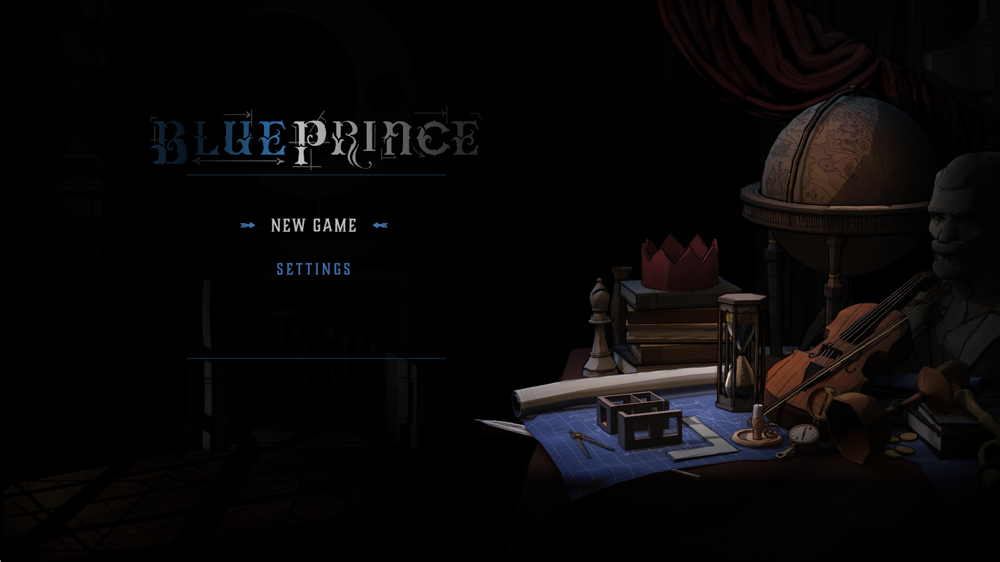
</p>

This Unity target boots to its menu, renders the full opening cinematic, completes the first-room
load, and plays the "Day One" opening: the Mt. Holly manor exterior and gardens, the approach path,
and the entrance hall inside. A default-config fresh-save route (scale 1, no sampling window,
native 1920x1080) produced 420 distinct frames over 2101 seconds with no render stalls.

The hall's composition now matches the PS5 hardware reference — checkered tile floor with
reflections, the round table and its bouquet, both busts in their niches, wall sconces, chandelier
and console-table props (`docs/screenshots/issue-1287-hall-live-vs-oracle.png`). Reaching that took
four defect families: the resolve/tonemap display chain (#1334/#1382), the material path
(#1411 virtual interpolant resolution, with #1399 sample gradients and #1401/#1404 shadow PCF), and
a silent 1 MiB buffer-upload clamp that had been erasing 44 of 248 draws in that room — the tile
floor and the far table among them (#1427/#1429). Two loading-phase performance defects were fixed
earlier: unbounded register-file growth (#1266) and per-draw full-buffer content hashing (#1269).

Open: a by-eye play-through confirmation is still outstanding, the snapshot guard for the hall
predates the geometry fix (#1433), floating black rectangles remain at the wall-lamp positions
(#1287), and boot remains intermittent (#1178). The 27 draws that still vanish at clip were
individually probed and confirmed as legitimate frustum culls (#1435).

## Dragon Quest VII Reimagined — `PPSA17942`

<p align="center">
  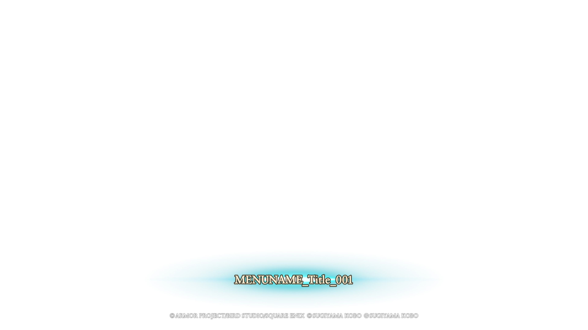
</p>

<p align="center">
  
</p>

<p align="center">
  
</p>

<p align="center">
  
</p>

This Unreal Engine 4 target renders its localized, animated title screen at native 3840×2160. A
current-master run with unique roots for both save backends reached it in about 34 seconds with seven
ordinary Cross pulses; the first image above is an unmodified native frontend capture of the
same validated title state. Title performance remains below full speed and varies with concurrent GPU work. Some
animation samples still show a dark/purple background behind the stable logo, so visual correctness and
full-speed performance remain open.

**Audio plays.** The title drives `sceAudioOut2` with a 12-channel MAIN bed; prosper used to discard
any port wider than 7.1, so a whole audio context never opened a host device (#1692/#1700). The bed
is now folded to the host's stereo sink, and a 147-second routed capture carries continuous
music-like content (peak 0.390, 90 % non-zero samples, no repeated grains). The project owner has
confirmed by ear that the title's music plays and sounds right — bring-up rung 4 for audio. That
confirms real audio reaches the device at sane levels through the guest's own path; it does **not**
confirm the multichannel fold's channel order, because ten of this bed's twelve channels are
measured empty, so every mapping that routes the front pair to the two sides sounds identical.

The apparently permanent black frame in no-input runs is authored UI state, not a lost final composite:
the complete sky/ocean scene exists underneath an opaque-black Slate background, and the routed input
changes the foreground lifecycle so the title becomes visible. Older work navigated the save-slot menu
and began content loading. A clean Cross-only continuation on current master now independently reaches
the new-save name keyboard without the historical allocator failure: Cross at 35 seconds left the title,
Cross at 55 seconds opened the slot prompt with `1: Unused` highlighted, and one deliberately delayed
Cross at 200 seconds confirmed the slot. The second image above is the direct, unmodified 3840x2160 Linux
`tools/screenshot` capture from that state. It is not gameplay: no normal game-save artifact was created.
The keyboard rendered at roughly 5.5 FPS in this shared-GPU run, and adjacent samples intermittently
washed white or blue. A later exact-master replay corrected #1553's temporal/flicker interpretation:
Cross at 55 seconds had already entered and highlighted `1: Unused`
with its slot prompt; Circle at 140 seconds canceled to the adventure-log list, and Circle at 270
seconds canceled to the title. Start/Options at 330 seconds and Circle at 350 seconds did not advance
the title. Cross is confirm and Circle is cancel in this flow.

A fresh-root follow-up on exact master continued through the keyboard controls: the validated route
selected `Back`, moved down to `OK`, and pressed Cross once at 160 seconds. That opened the name
confirmation prompt with `Yes` selected and `No` below. The third image above is the direct, unmodified
native 3840×2160 Linux `tools/screenshot` capture from that state. In that earlier checkpoint, no input
followed the confirming Cross, so `Yes` itself was not pressed.

A subsequent fresh-root run preserved the route, pressed the selected `Yes` once, and sent no later
input. The name was confirmed and the game advanced to its first-run `System Settings 1/4` onboarding
prompt. The fourth image above is the direct, unmodified native 3840×2160 Linux `tools/screenshot`
capture from that new milestone.

The current composition intermittently exposes an animated ocean/horizon pass beneath a severely white
upper field. The same pass appeared before `Yes` was pressed while name confirmation was still active,
and onboarding frames continued after later ocean samples. It is therefore an intermediate/background
render pass leaking into the presentation, not an authored camera transition, a first 3D scene, or
gameplay. The severe white/composition defect, save creation, gameplay, visual correctness, and full-speed
performance remain open. See the unchanged exact title route in
[`prosper/scripts/dragon-quest-vii/README.md`](prosper/scripts/dragon-quest-vii/README.md) and the renderer
analysis in [`prosper/docs/DRAGON_QUEST_STATUS.md`](prosper/docs/DRAGON_QUEST_STATUS.md).

## Grand Theft Auto V — `PPSA04263`

<p align="center">
  
</p>
<p align="center">
  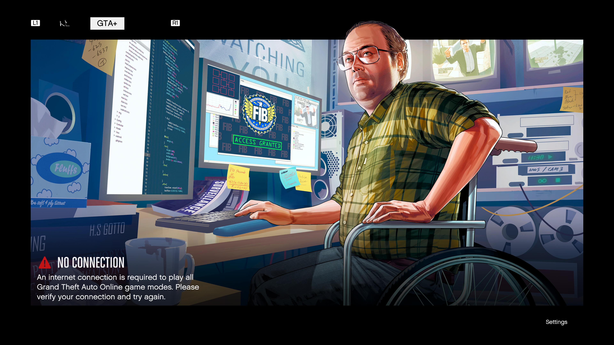
</p>

Rockstar's RAGE engine boots through the intro and reaches the title and the first-run/language-selection
menus, then continues to the STORY/ONLINE main menu. Reaching this required a series of service and ABI
fixes spanning the async-compute submit contract, the APR file/write primitives, and guest-`%fs`
restoration on fault-skip. These direct Linux `prosper-app` captures document the current renderer state,
not visual correctness: the main menu has substantial UI and composition glitches. The later in-game
loading path remains blocked at the legal-notice text pass, so no gameplay milestone is claimed.

The screenshot above still shows the title without the ✕ button icon beside **Continue**. That defect
is **fixed on current master**: in the 2026-08-02 boot sweep the same no-input state renders
`Continue ✕` with the glyph present, so only the caption's historical wording is preserved here.

## Terminator (2D) — `PPSA25872`

<p align="center">
  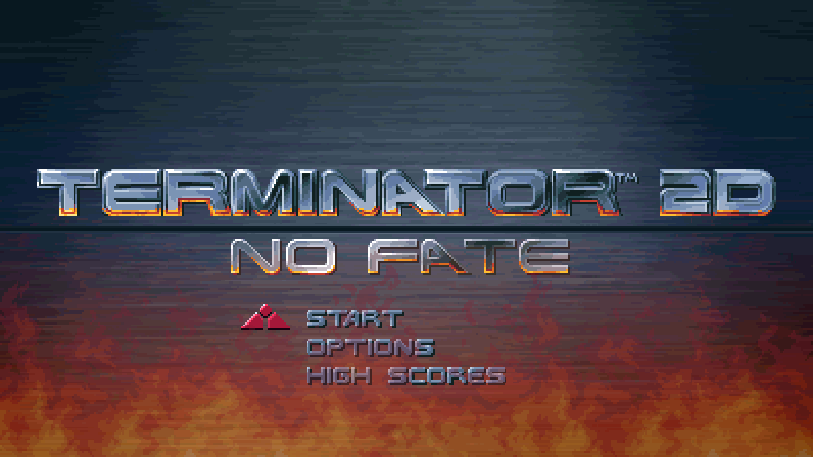
</p>
<p align="center">
  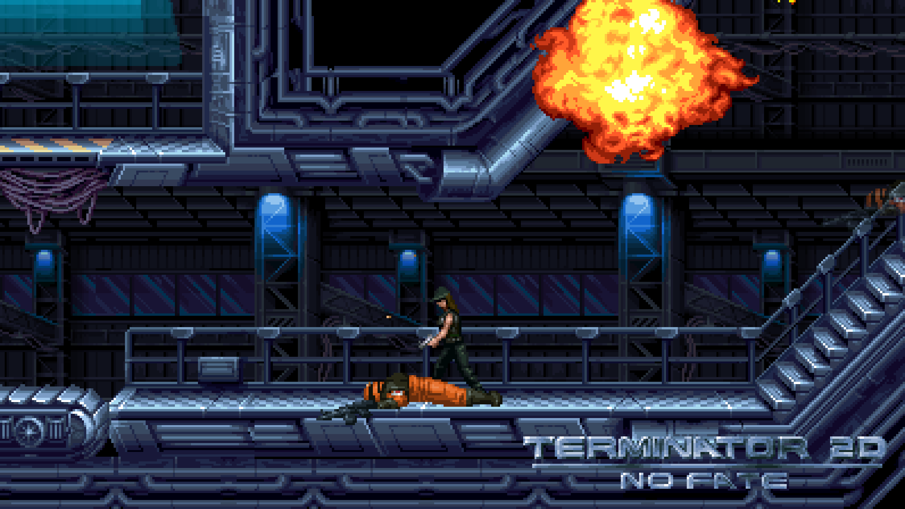
</p>

This 2D action title reaches its main menu and attract-mode gameplay, verified and recorded by the
project owner, with a menu-reach snapshot guard in place. The title ID is confirmed; the exact retail
name is pending confirmation.

## Rugrats: Adventure in Gameland — `PPSA23396`

<p align="center">
  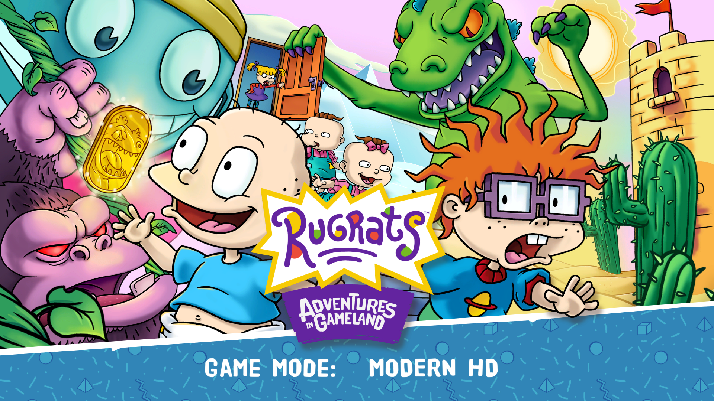
</p>
<p align="center">
  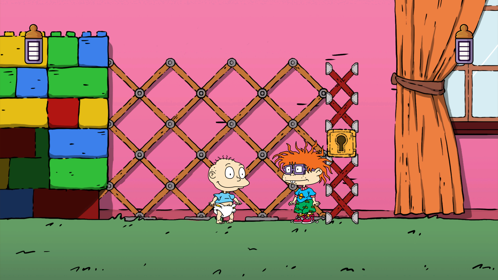
</p>

A Unity 2022.3 / IL2CPP title that boots on first attempt with **no rejected shader, no unimplemented
render-path NID, and no AGC gap** in a full routed run. The route crosses the splash logos, the
"GAME MODE: MODERN HD" selector and the menus into the first nursery level at native 1920×1080: Tommy
and Chuckie with their animation, the block platforms, the playpen gate, the locked door, the curtained
window, and the baby-bottle health HUD.

The route is `prosper/scripts/rugrats/reach-gameplay.pad`.

## Greak: Memories of Azur — `PPSA02849`

<p align="center">
  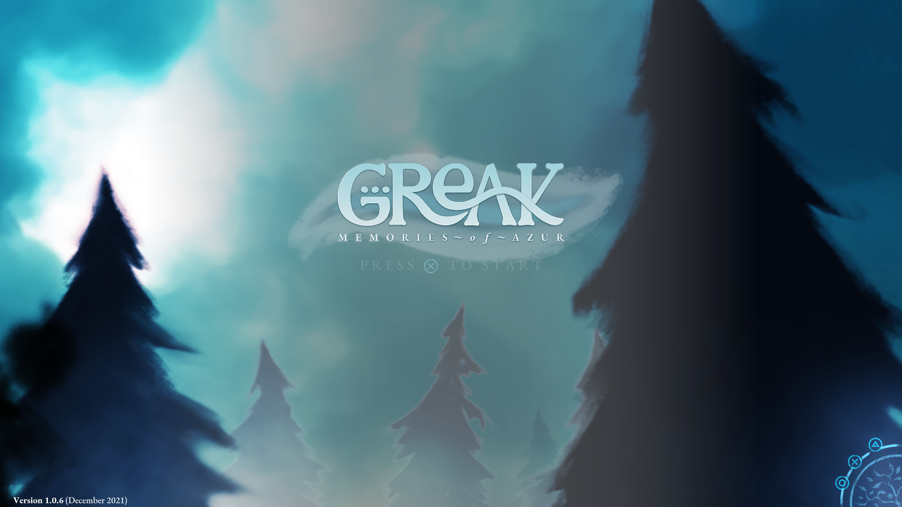
</p>
<p align="center">
  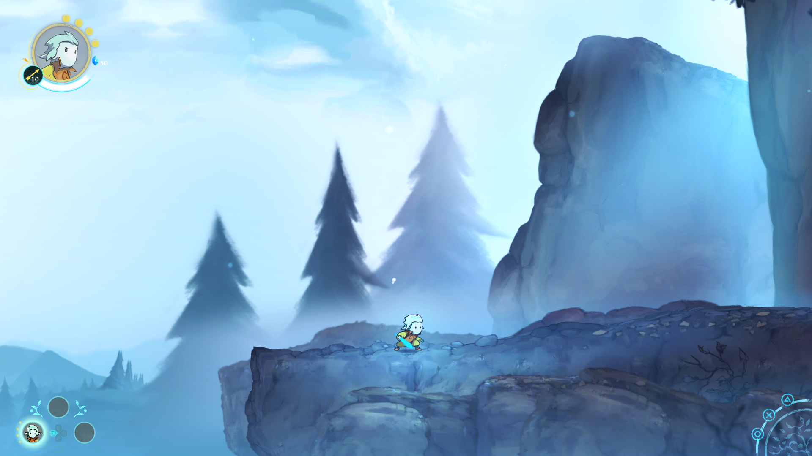
</p>

A Unity 2019.4 / IL2CPP title that boots cleanly on first attempt. The route crosses the publisher
logo, the full hand-drawn animated intro cutscene, a long asset-load phase, and the title screen into
sustained first-level gameplay at native 1920×1080: the player character and its animation, layered
parallax terrain and pine forest, volumetric fog, drifting particles, the portrait/health/ammo HUD, the
ability bar, and the button-prompt overlay.

The route is `prosper/scripts/greak/reach-gameplay.pad`, and gameplay is guarded by the
`greak-gameplay` snapshot. **A capture window placed too early lands in non-gameplay content, not in
gameplay** — profiling the route once per second across a 255-second boot measured boot and logos to
45 s, the hand-drawn intro cutscene 46-117 s, a short dark transition 118-122 s, a *letterboxed*
level-intro cinematic 123-130 s, and full-screen gameplay only from 131 s. Anything shorter than about
150 seconds therefore ends before the level.

Do **not** expect a long black phase while waiting: an earlier note here described "a roughly
70-second black asset-loading phase following the intro", but that span does not render black on
current master. 46-117 s measures 18,685-61,886 distinct colours at 0.99-1.0 non-black coverage and is
the intro cutscene playing normally. Reading that span as a black-screen defect or a hang is the
misdiagnosis to avoid.

One shared recompiler gap was found and closed during bring-up: `s_ttracedata` (SOPP `0x16`), a
thread-trace profiling instruction with no architectural effect, was rejecting the entire vertex stage
that carried it.

## Alex Kidd in Miracle World DX — `PPSA02664`

<p align="center">
  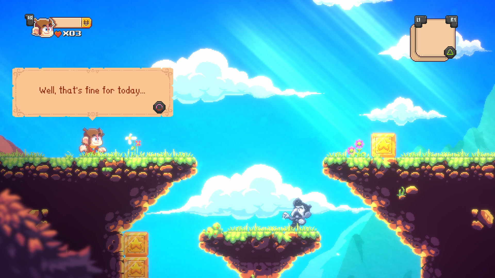
</p>

A scripted route reaches the first level (Mt. Eternal) and renders it in full colour at native
1920x1080: sky gradient and sun rays, parallax mountains, drifting clouds, terrain and floating
platforms, the player and enemy sprites, gold blocks, the lives and coin HUD, and the dialogue box.

The level previously rendered as a black screen behind the dialogue box. The cause was a **generic
tiling defect**, not a title-specific one: packed mip-tail levels in 4 KiB tile modes resolved to an
element origin four times too small, because the block-to-element multiplier was derived from the
macroblock rather than from the 256-byte block's element extent. Mipped 4x4 SpriteMask sprites then
decoded as fully transparent foreign texels, every mask fragment failed its alpha test, and a
legitimate "visible outside mask" fill covered the whole frame. Fixed in #1578, which also added an
origin-agreement invariant to the tile tests.

A reviewed content guard (`alexkidd-gameplay`) covers the route in `tools/snapshot`. One known
defect remains: the title screen's watermark overlay composites at roughly half the hardware
strength (#710).

## New Joe & Mac: Caveman Ninja — `PPSA02801`

<p align="center">
  
</p>
<p align="center">
  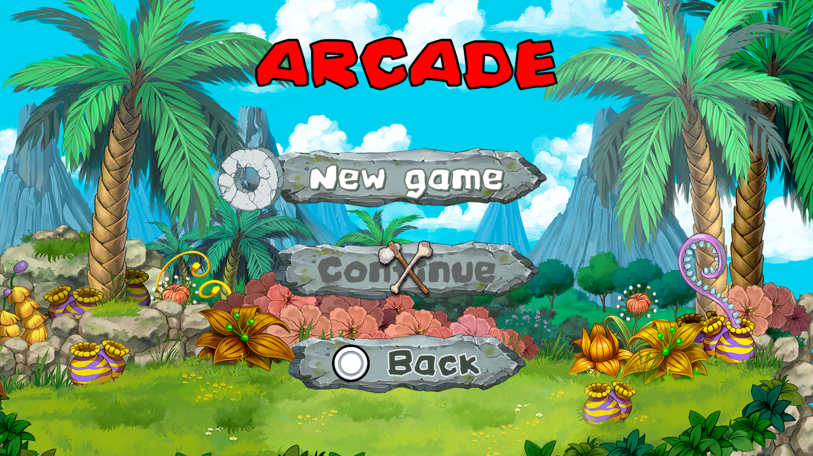
</p>

Reached **gameplay on the first boot ever attempted, with no code changes and no recompiler
rejections** — the only title so far to do so. A scripted controller press moves from the title
screen through the arcade menu into level 1: the player animates, the HUD shows name, score, health
and lives, and parallax jungle backgrounds, foreground foliage and enemies all composite correctly.
Over a routed run the score changes, the health bar drains, the lives counter decrements, and a
respawn banner appears, so guest logic and input are healthy end to end.

The route is `prosper/scripts/joe-mac/reach-gameplay.pad` — exactly the Cross anchors from the
tracking issue, with no directional input — and gameplay is guarded by the `joe-mac-gameplay`
snapshot. Because the route never moves Joe, he is killed roughly every 22 s and **respawns at the
same level-1 opening**, so the 52-125 s evidence window deliberately spans three lives instead of
trying to fit between them: every respawn returns to one visual state, and only the brief death fades
fail. A movement-based variant was tried first and rejected. Holding `left-stick-right` sustains more
convincing play, but then Joe's position at any wall-clock second depends on ~100 s of accumulated
progress; a window placed in it passed twice and then drifted onto a level transition and two death
fades, failing with 19 structural matches against 24 required. **For a snapshot guard the stationary
route is the more deterministic subject, even though it is the less impressive play.**

This title is also the clearest case of colour count being blind upward: the richest frame of the
whole run is the **arcade menu** at 79,167 distinct colours, **13.2%** above the best frame inside
the guard window (69,963). That blindness was measured against the one state that defeats *both*
numeric floors — the GAME OVER screen the stationary route reaches at 138 s, whose 17 frames all
clear the guard's colour floor and its coverage floor, and which is excluded only by SSIM, where it
reaches at most **0.5775** against a 0.85 floor (0 of 17 qualify). The window ends 13 s before it
appears.

## Worms Armageddon: Anniversary Edition — `PPSA20052`

<p align="center">
  
</p>

A scripted route reaches a live Quickstart match against the AI at native 1920×1080: the terrain,
water, both teams' named worms with their health tags, the turn timer, the wind gauge and the team
health bars all render, and over a run worms take damage, turns change, the camera pans and the
terrain is cratered by explosions.

Getting there took two fixes. The title screen needed one small generic recompiler addition —
VOP3 `v_sad_u32`, which this title's PSSL compiler emits as its vertex-shader index prologue.
Without it every vertex stage was rejected and nothing rendered at all.

Reaching gameplay then needed a correct `scePadGetHandle` (#1592). The game's pad manager asks it
whether a handle already exists for each login user and calls `scePadOpen` only when the answer is
negative, so prosper's old unconditional constant meant no pad was ever opened, every
`scePadReadState` failed, and the title sat on `PRESS ✕ TO START GAME` forever. `scePadGetHandle`
now looks up the handle actually opened for a `(userId, portType, index)` triple.

Route: `prosper/scripts/worms-armageddon/reach-gameplay.pad` (Cross through the title screen, the
main menu and the pre-selected `Quickstart` entry).

Quickstart generates its terrain **randomly per match**, which is faithful to the game but means the
scene it reaches is different on every run: two independent fresh-save runs produced a
pirate/treasure map and a fairytale/castle map. A second route,
`prosper/scripts/worms-armageddon/reach-training-gameplay.pad`, reaches a fixed-map Training level
instead (one Down in the game-setup grid selects `Single Player`), and two runs of it are identical.
The `worms-armageddon-gameplay` snapshot guard uses that route; the Quickstart route above remains
the reproduction for the milestone described here.

This title is also a useful reverse-engineering surface in its own right — it ships its AGC shaders
as loose `.ags` assets in the dump root, which can be inspected statically without a capture.

<p align="center">
  
</p>

## Earthion — `PPSA28061`

A 79 MB dump — a 2.3 MB eboot plus a single 24 MB `game.bin` — running Ancient's own engine directly
on AGC. It boots on the first attempt with no code changes, loads all ten of its `.gnf` textures,
initialises audio, reaches its frame loop, and renders its developer logo, its legible intro story
text, and the retro CRT-TV bezel that frames the whole game. The intro advances normally through
several pages, so guest logic, input timing and presentation are healthy.

What is missing is the picture inside the bezel: a single MIMG descriptor-provenance gap drops the
320×224 game-picture composite. Tracked on #1590. No screenshot is published here because the game
area itself is not yet rendering.

On current master that area composites **white**, not the black #1590 records, and the intro story
text is drawn light-on-white and is barely legible as a result. This is not a consequence of #1728:
an A/B in the 2026-08-02 boot sweep with `PROSPER_LEGACY_CB_DISABLE_MASK=1` produces the same white
picture area, so the colour-write-mask change is excluded.

## Asterix & Obelix: Slap Them All! — `PPSA08576`

<p align="center">
  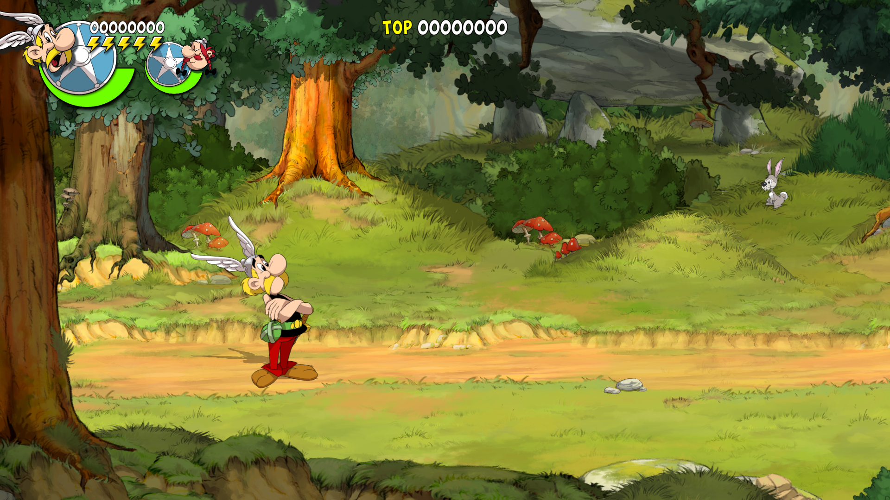
</p>

Reaches the title screen with no input at all, and a scripted route reaches the first forest level:
Asterix animating, dual character portraits with health and rage gauges, score and TOP counters, a
multi-layer parallax forest, a wandering rabbit and a correct ground shadow, at native 1920×1080.

A 150-second route produced **zero recompiler rejections, zero skipped dispatches and zero
unsupported formats** on completely unmodified master. The only stubs exercised are PSN telemetry
(UDS, WebApi2, SessionSignaling), all non-blocking.

The route is `prosper/scripts/asterix/reach-gameplay.pad`, and gameplay is guarded by the
`asterix-gameplay` snapshot. The level loads at about 45 s, settles by 49 s, and then holds unbroken
to the end of a 210-second profile — all 161 samples from 49.1 s onward measure 74,569-75,235
distinct colours with no black frame, fade or transition anywhere — which makes this the most stable
of the three routes by a wide margin. The route uses no directional input, so Asterix idles and the
score stays at zero; the guard's pixel-change requirement rests on the idle animation, the wandering
rabbit and the blinking `GO!` prompt.

Note this is a **different title** from *Asterix & Obelix: Babylon Mission* (`PPSA30490`), which is a
Unity 6 game currently at the research tier.

## Summer Sports Games — `PPSA03416`

<p align="center">
  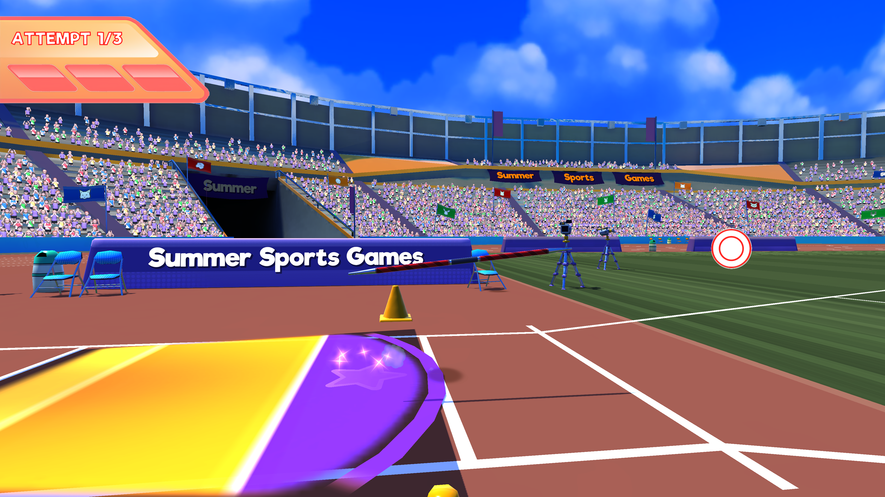
</p>

Mode select and live 3D athletics render at native 3840×2160 with no code changes: a full stadium
with animated crowd, banners, camera rigs and track markings, plus the `ATTEMPT 1/3` and `SPEED`
HUD and `FOUL!` / `POOR` result overlays.

Beyond the title itself this is a useful **3D** reference workload: it is deterministic, routed, and
runs with a 100% shader realization rate. `docs/RENDERER_PERFORMANCE_2026_07.md` records that the
remaining synchronous graphics/compute boundaries must be evaluated against a 3D workload rather
than against Messenger's 2D scene, and this is the first clean candidate for that.

The route is `prosper/scripts/summer-sports/reach-gameplay.pad`, and gameplay is guarded by the
`summer-sports-gameplay` snapshot. Three things about this title trap a guard built by metric alone.
Because it renders at 3840×2160, the snapshot scale of 4 produces **960×540** frames rather than the
480×270 every 1080p title gives, so `dims` must be read from a profile rather than assumed. Its
non-black coverage is exactly 1.0000 for *every* frame of the run, menus included, so coverage
discriminates nothing here. And the most metrically stable span of the whole route is the static
`JAVELIN THROW` standings overlay the game rests on after 144 s — settled from 150 s, where all 60
remaining samples measure 48,201-48,489 colours at 1.0000 coverage with SSIM 1.000 against itself —
so a window chosen by stability lands on a results screen. The guard samples 55-80 s instead, inside
the first live attempt, which was settled by opening the frames rather than by ranking them.

The window's right edge was pulled in from 85 s after measurement. The end-of-attempt `FOUL!`/`POOR`
banner at 85-86 s is drawn over the same stadium, but it scores only **0.6558** against the adopted
55-80 s references — below the 0.85 floor — and carries 96,000-102,000 colours against the attempt's
57,000-68,000. With 85 s as the edge it drifted in and out between runs, eating match margin and
swinging the window's richest frame by 1.5×. At 80 s the window is a single visual state.

## Nikoderiko: The Magical World — `PPSA23760`

<p align="center">
  
</p>

Renders its epilepsy warning, the Knights Peak publisher logo and the full title screen at native
3840×2160 on unmodified master, with no code changes. A scripted route continues into the legible
MY.GAMES EULA dialog.

The **3D world** is what is missing, and the cause is named. The original reading — that the 8-SGPR
`SRSRC` range is *computed inside the shader* and defeats descriptor provenance — was measured and
**falsified**; the fetch is the canonical bindless-dynamic form the recompiler already handles. The
real blocker is upstream, in graphics register state: for 11 of 13 traced vertex stages the user-data
block the guest most recently programmed is **larger** than the bound pipeline's user-SGPR window, so
the shader dereferences a V# tail as a pointer, the const-fold correctly refuses to invent a
descriptor, and 25 distinct `(es, ps)` pipelines are dropped. That is #305, for which this title is
the loudest reproduction. Status, evidence and the falsification list are in
[`prosper/docs/NIKODERIKO_STATUS.md`](prosper/docs/NIKODERIKO_STATUS.md); tracked on #1607 and #305.

## The Oregon Trail — `PPSA19244`

Boots cleanly and holds a steady ~50 fps frame loop — 5,957 frames in 120 s, with frames provably
advancing — but every one is uniformly black. There are **zero** recompiler rejections, zero
unresolved resources and zero skipped dispatches.

An offline capture shows the entire Unreal post-process chain intact (HDR scene colour, a bloom
pyramid from 960×540 down to 60×34, tonemap, a 32×32×32 LUT, front-buffer composite) and replays
byte-exactly. The decisive measurement is upstream of all of it: dumping the seed for the 1920×1080
HDR scene-colour target shows it is *already* uniformly black on entry. **The image is gone before
post-processing runs**, so the base pass is where to look.

Follow-up measurement moved the question out of the GPU subsystem entirely: prosper consumes the
whole command stream with no unrecognised opcodes and no unimplemented submit path, and **the guest
clears its 3840×2160 scene target every frame and then draws nothing into it** — about 23 decoded
draws per frame, which is a post-process chain with no world underneath. Prosper is faithful here;
the empty base-pass draw list is upstream, on the CPU side. Status, the four killed leads, and the
reproduction are in
[`prosper/docs/OREGON_TRAIL_STATUS.md`](prosper/docs/OREGON_TRAIL_STATUS.md); tracked on #1606 and
#1641.

## Syberia: Remastered — `PPSA30140`

<p align="center">
  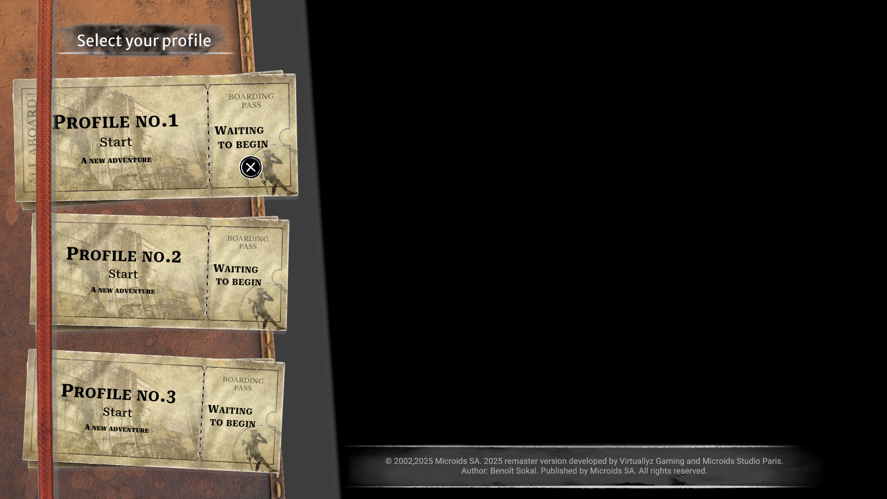
</p>

<p align="center">
  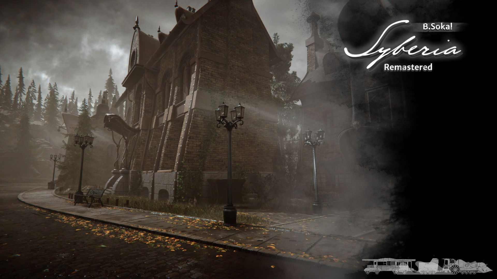
</p>

<p align="center">
  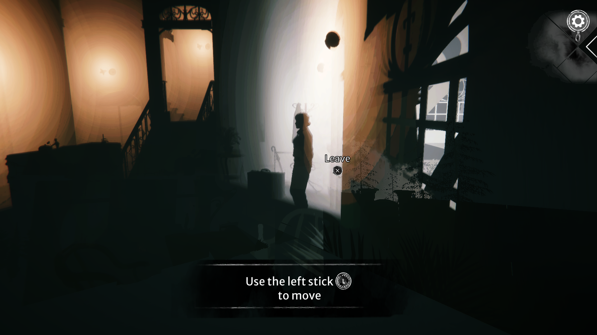
</p>

**Rung 3 — gameplay.** `prosper/scripts/syberia/reach-gameplay.pad` drives the profile-select menu
into the title screen (t≈280 s) and the first playable scene (t≈312 s onward): Kate Walker in the
Voralberg factory hall, the "Leave" interaction prompt, the "Use the left stick to move" tutorial and
the pause HUD. The composite is degraded — a translucent ghost of another scene is blended over the
middle of the frame and the image is over-dark — tracked with the menu defect on #1619.

On unmodified master this title **hard-hung** at boot: 7 submits, 2 flips, one present, frozen
forever. The cause was `sceAgcAcbWriteData` being unregistered and silently returning 0, so the
packet that *sets* a fence label was never built and Unity's main thread parked permanently in the
guest's own poll loop waiting for a value nothing would ever write.

Registering it against the shared DCB builder — the same treatment the five sibling ACB builders
already had — takes the boot to **523+ submits, 5,028+ draws and 88 flips**, rendering the autosave
notice with animated gears and then the profile-select menu with its boarding-pass save slots.

The right ~55% of the frame is black. That is now **established as a defect**, not art direction
(#1619): the menu renders a full 3D scene — 2048x2048 shadow cascades, `R11G11B10F` HDR targets and a
960x540 to 15x8 bloom pyramid — and the lit composite is **correct** at draw 465. It is then destroyed
by an in-place compute pass, so the whole scene layer composites black and only the UI survives. No
draw is scissored to the left; the animation does settle. Start from `prosper/docs/SYBERIA_STATUS.md`.

## Tales of Graces f Remastered — `PPSA19991`

<p align="center">
  
</p>
<p align="center">
  
</p>

Both logo screens above are direct, unmodified `screenshot` frontend captures at native 1920×1080
from a plain boot with no scripted input and no render acceleration.

Two fixes took this title from rendering nothing to rendering real frames. It first stalled in
`GameMain.SingletonInitializing`, because prosper linked a hard-coded plugin allowlist and this
title's `cri_ware_unity.prx` and `GameNative.prx` were not on it; the resulting
`DllNotFoundException`s were raised inside an async state machine, captured into a Task and never
printed, so a clean-looking 152-line boot log hid three failed registrations (#1656 now links
whatever `Media/Plugins/*.prx` a title actually ships). It then stalled on the APR read path:
CRI ADX2 binds its command buffer with a completion tag of literally **zero**, and prosper treated a
zero tag as "not really bound", so the completion event was never delivered and CRI's untimed
`sceKernelWaitEqueue` blocked forever (#1666).

With both fixed, the title loads 100+ asset bundles including its title-screen textures, and renders
the Bandai Namco and CRIWARE logos. It then goes black and stays black for the rest of the run
(58 of 60 sampled frames are byte-identical). The title screen is behind the opening movie and has
not been reached.

The movie was originally blocked at `sceVideodec2QueryDecoderMemoryInfo`, which failed with
`0x811d0200` so `criMvPly_AllocateWorkBufferWithWork` never got a decoder. **That cause is fixed**
(#1687): the sizing query no longer demands a compute-queue handle the guest cannot hold until after
sizing, and the title now creates an AVC decoder and feeds it real access units.

**The title does not advance visibly as a result, and the rung is unchanged at 1.** A 180 s A/B at
native 1920×1080 through the `screenshot` frontend — both arms in one session, identical parameters,
`#1687` against the exact base commit it forked from — settles it. Both arms render the Bandai Namco
and CRIWARE logos, pass through the same phase structure at the same time, and then hold one
unchanging frame for the remaining ~164 s of 30 samples. The **only** difference is the colour of
that held frame: the base commit holds **black**, #1687 holds **white**. Neither is the movie and
neither is the title screen. This is the expected outcome — decode produces no pictures (#1688) — and
it is recorded because "the gate opened and nothing behind it moved" is the result, not a gap in it.

**The held frame is black again on `3a473bca`**, which contains #1687: every sample from t=15 s to
t=200 s of the 2026-08-02 boot sweep measures one distinct colour over zero non-black pixels. Either
something merged after #1687 moved it back, or the colour was never as stable as one A/B could show;
one run cannot separate those. The usable conclusion is the narrow one — **do not use the held frame's
colour as the check for whether a change to this title's movie path did anything** (#1609).

One observation about the **base commit**, unrelated to this change and beyond what the logo
description above implies: master transiently renders the game's own **"Checking add-on…" dialog** —
real in-game UI in the title's art style, not a logo — at `t≈6 s`, before settling. Both arms sample
at 6 s intervals so a short-lived phase is caught by luck; whether #1687 also passes through it was
not established and would need a denser capture.

### Ruled out

- **Empty composite is a renderer fault** — falsified. Offline `gpu_replay --inspect-only` on a
  retained capture showed all 28 submitted draws were fullscreen post passes with no mesh draw at
  all, so prosper was faithfully rendering an empty scene (#1609).
- **Input gating** — falsified. A 200 s route mashing cross/circle/triangle/options left
  `draws_last=28` across all 99,427 submits.
- **An intro-movie *stall* at the AvPlayer layer** — falsified for `libSceAvPlayer`: tracing showed
  zero AvPlayer calls despite 20 imports. The movie path this title actually uses is CRI's own
  `criMvPly` over `sceVideodec2`, which is a different subsystem (#1658).
- **DLC / AppContent entitlement** — falsified. `AddContentsManager` is registration 29 and completes
  normally; it is not one of the three that faulted.
- **The `sceVideodec2` block is a missing or unimplemented entry point** — falsified. Every entry
  point `criMvPly` uses was implemented; the block was a single over-strict validation.
  `sceVideodec2QueryDecoderMemoryInfo` is a *pure sizing query* — the guest asks how large a decoder
  would be **before** building one — and prosper required a compute-queue handle the guest cannot
  possess until after sizing. The guest draws the line in exactly the same place prosper now does: it
  passes an identical codec config to both entry points, `compute_queue = 0` to the sizing query and
  the real allocated handle to `CreateDecoder` (#1687). With the requirement split, the title creates
  an AVC decoder and is fed real access units.
- **Reaching `sceVideodec2Decode` will produce a movie** — false by construction, and stated here so
  a black movie is not re-investigated as a defect. prosper's `Videodec2` decode is a deliberate
  no-picture implementation and there is no H.264 decoder in the tree; #705's `VideoBackend` is
  file/demux shaped and does not fit an access-unit interface. Scoped in #1688.
- **The decoded-draw drop from 27-31 to a single-digit count marks the title leaving the logo phase
  because of #1687** — falsified by the A/B that was run to check it. Both arms show the identical
  phase structure `27 → 28 → 31 → single digit` at `t≈15-16 s`, holding flat for the remaining
  ~164 s; the base commit drops to **7** and #1687 to **8**. The transition is normal behaviour of
  this title, not an effect of the change, and a one-draw difference is all that separates them. The
  hypothesis came from reading a `boot_trace` run against #1609's `screenshot`-frontend numbers —
  two different apparatus — and did not survive running both arms through one.

## The Pathless — `PPSA01826`

<p align="center">
  
</p>

**Rung 2.** A plain boot with no input renders the title screen — the wordmark plus `NEW GAME` and
`OPTIONS` — at native 2560×1440, and holds it for the rest of a 200-second run without stalling.

This supersedes the previous entry for this title. #1570 recorded rung 0 on 2026-07-31: every
presented frame a flat colour, with progression frozen at about 18 s. Neither symptom reproduces on
`3a473bca`. The frame is composited (not raw scanout), the front buffer changes resolution from
3840×2160 to 2560×1440 at t≈30 s as the menu comes up, and rendered frames keep advancing to the end
of the run. No fix was identified for this; it is reported as an observed change of state, and #1570
should be re-scoped from "flat colour" to "gameplay not reached" rather than closed on this evidence
alone.

## The Plucky Squire — `PPSA15319`

<p align="center">
  
</p>

**Rung 2.** A plain boot renders the All Possible Futures and Devolver Digital logos and then the
title screen (`PRESS ANY BUTTON`) at native 3840×2160, with no input and no code changes.

`prosper/scripts/plucky-squire/reach-first-gameplay.pad` continues past it: the `SAVE FILES` list and
the `PLAY STYLE` chooser both render legibly and in full colour. After the play-style selection the
composite collapses to a black loading screen carrying only the small book icon, and a 420-second run
never leaves it — 260 s of it holding the same near-empty frame. That loading phase is the frontier
for this title, not the menus. See #1390 and #1554.

## Bendy and the Ink Machine — `PPSA27616`

<p align="center">
  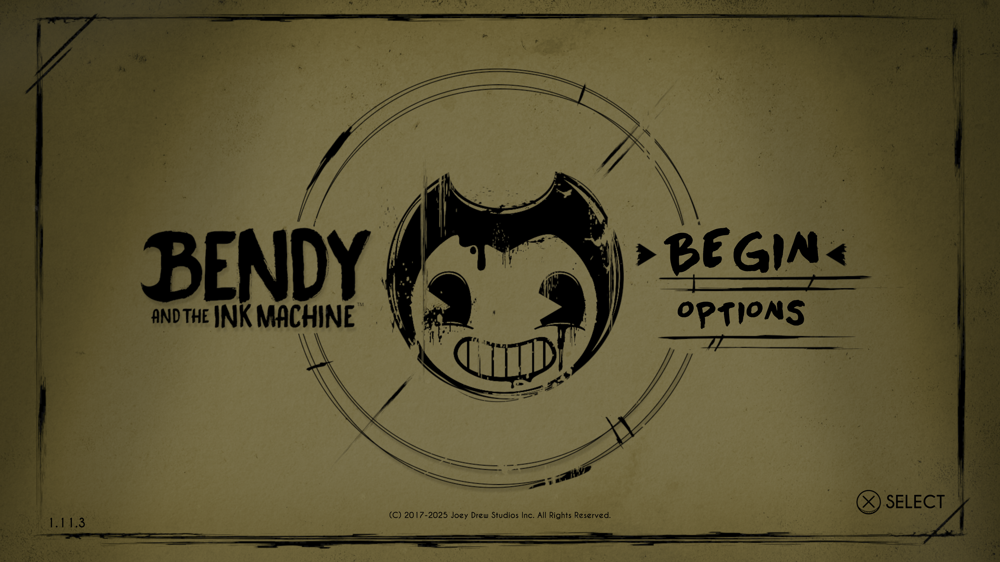
</p>
<p align="center">
  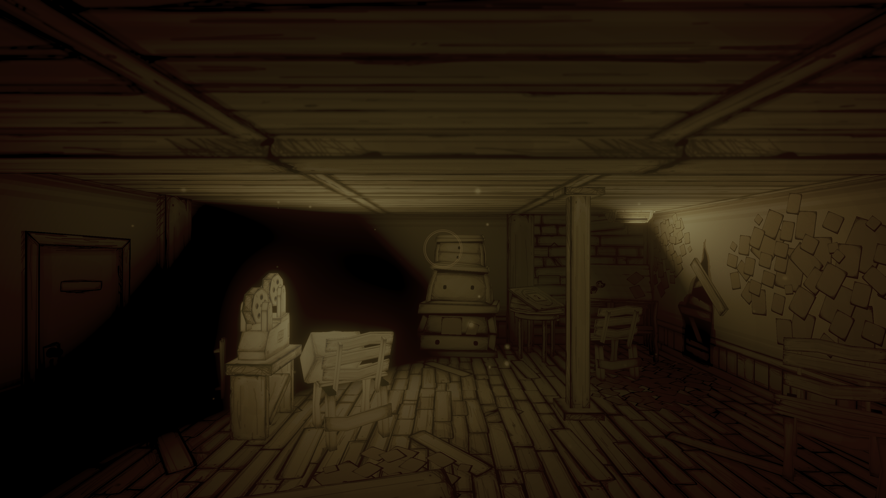
</p>

**Rung 3.** A plain boot reaches the loading screen and then the main menu (`BEGIN` / `OPTIONS`) at
native 3840×2160 in about 20 s. `prosper/scripts/bendy/reach-gameplay.pad` continues into first-person
Chapter 1: the workshop interior, its wooden structure, props, ink stains and lighting all render, and
the camera moves through the level over the run, so guest logic and input are healthy end to end.

The black in-game world recorded in #1164 does not reproduce. Neither does the throughput in #1177:
that issue reports about **0.75 fps**, while the 2026-08-02 sweep measured about **30 fps** on the
menu and about **8 fps** in the level, both at native 3840×2160 on RADV — a shared-GPU measurement, so
those are lower bounds. #1177 needs re-measuring before any work is planned from its number.
Boot remains intermittent (#1178).

## ArcRunner — `PPSA21406`

**Rung 0.** The title boots through UE4 initialisation and its `.pak` load, installs the renderer,
and submits real GPU work — but no frame is ever composited. Between about 8 and 14 s the guest's
`RenderThread 1` faults:

```text
WORKER-THREAD FAULT: sig=11 addr=0x30016000 rip=eboot+0x127e751
insn @rip: 48 8b 01            (mov rax,[rcx])   rcx=0x30016000
[fault] thread='RenderThread 1' on-guest-TCB=NO(host-%fs leak?)
```

`0x30016000` is far below the guest arena (`0x2000000000`–`0x9fc0000000`) and is read out of a
structure whose neighbouring fields are ordinary guest pointers, which matches the pool-pointer
corruption already tracked on #1226. The same fault site reproduces under three guest-argument
combinations. Note one apparatus detail: with `PROSPER_GUEST_ARGS=-force-gfx-direct` the process is
killed by the signal (exit 139) and prints **no** fault report at all, while the same fault is fully
reported with `PROSPER_GUEST_ARGS=` empty, or under `gdb` with `SIGSEGV` passed through.

## Asterix &amp; Obelix - Babylon Mission — `PPSA30490`

**Rung 0**, unchanged from #1599 and reproduced exactly: every presented frame over 200 s is a single
colour with the identical `crc=064567f8`, and renderer publication stops for good at frame 25122.

The sweep adds the cause of that stall, which #1599 recorded as not investigated. Publication stops in
the same second that a guest thread dies:

```text
[lazy-commit] mapped page=0x24030f0000 rip=0x4107cd844
tlsf_add_pool: Memory size must be between 0x28 and 0x100000000 bytes.      (×40)
guest thread ended: kind=2 detail=SIGSEGV at addr=0x28 rip=0x645ea4
```

The guest's own TLSF allocator rejects 40 consecutive pool additions as out-of-range, each preceded by
a lazily committed page from one `rip`, and a thread then faults at `0x28` — the offset a caller would
read from a null pool handle. So the black frames and the stall are two findings, not one: the stall
is an allocation failure, upstream of the MSAA `image_load` recompiler gap that #1599 identifies as
the reason the frames are black.
## Astro Bot — `PPSA21564`

<p align="center">
  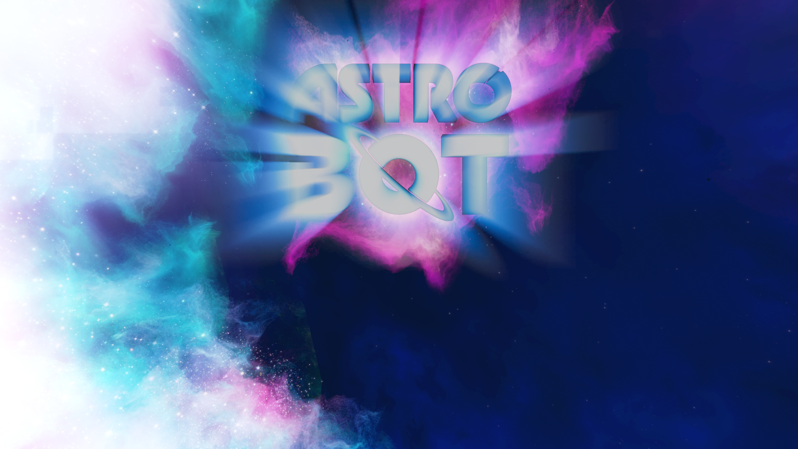
</p>
<p align="center">
  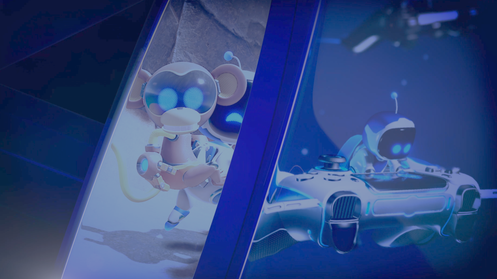
</p>
<p align="center">
  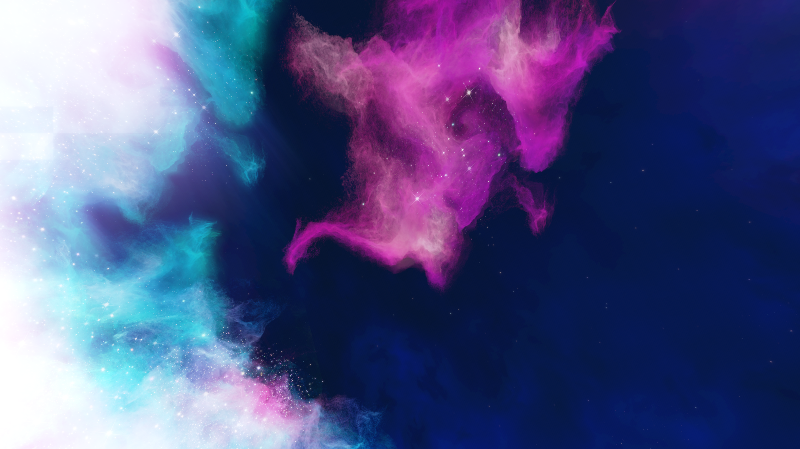
</p>

All three images are direct, unmodified `screenshot` frontend captures at native 3840×2160 (downscaled for
this page) on Linux / Vulkan / RADV, with no render acceleration. The first is from a run with a
flip-anchored route whose first pulse had not yet fired when the frame was taken; the other two are from a
plain boot with no scripted input at all.

The whole opening sequence renders: the *Sony Interactive Entertainment presents* card, the Astro cinematic
above, the PlayStation logo animation and the PlayStation Studios card. All 300 samples of that run came
from the live Vulkan renderer's composited output rather than the raw-scanout fallback, and none of them is
black. The blue mottling visible behind the foreground in the first image is a real composition defect and
is not corrected here. How much of this sequence is in-engine geometry versus decoded video is **not**
settled by these runs — prosper's AvPlayer logging is behind `PROSPER_AVPLOG`, so its silence is not
evidence either way, and `docs/screenshots/issue-825-astrobot-linux-sony-presents.png` records the opening
having been served by the video path before.

**The rung is 2.** The ASTRO BOT title card renders at 4K over the world-map nebula, with the wordmark and
its ringed-planet *O* legible. It is not correct: the logo is washed out towards white instead of its solid
metallic gradient, a grey rectangular panel sits behind and to the right of it, and the phase alternates
roughly every other published frame between this image and a near-black one. It is a real, unmodified
frontend capture of the title screen, and it is the milestone claimed here — nothing beyond it is.

Reaching it takes patience rather than a route: the card first appears about **380 seconds** into a rendered
run, at guest flip ~1214, and every previously committed route for this title finishes its input before flip
1210. That is why it had not been seen. The separate `title_controller_ship` level is *not* this screen —
the guest passes through that one in about 33 rendered frames on its way to the world map, publishing only
fully saturated white (#1731).

The world map is Astro Bot's hub — it is where levels are chosen — and it is where a rendered session
currently stops. In every rendered run it composites its nebula backdrop at 4K and nothing else: no planets,
no level nodes, no ship, no Astro, no HUD. Two checks designed to find hidden content came back empty —
auto-levelling the dark half of the frame recovers only more nebula, and differencing frames 92 seconds
apart with 20× amplification puts every changed pixel inside the slowly drifting nebula and leaves the rest
exactly zero.

That backdrop is itself recent progress. Before #1728 the world map published the same empty frame the run
shows during early boot, with 14 distinct colours; #1728 stopped `CB_COLOR_CONTROL.MODE=DISABLE` from
discarding the guest's explicit `CB_TARGET_MASK & CB_SHADER_MASK`, and the same rendered frame now carries
735k. The A/B is exact — one commit, one build, `PROSPER_LEGACY_CB_DISABLE_MASK=1` restoring the old
behaviour in place — and it is recorded on #1459.

**The hub is not broken; it is out of reach.** With `PROSPER_NO_COMPUTE=1` the guest runs the world map,
accepts a confirm, selects a level and loads `hub_crashsite_tutorial` — but the confirm that selects a level
only lands at guest flip **2705**, and the world map itself arrives at flip ~810. Every route in the tree
anchors in the `f730`–`f1210` window, where the hub has just appeared and is not yet interactive, so every
rendered arm spent its input before the hub was ready.

What makes flip 2705 unreachable in a rendered session is throughput, and it is **not** the renderer:
removing the live renderer entirely leaves the guest at ~3 flips/s, while `PROSPER_NO_COMPUTE=1` takes it to
~67. Guest compute is worth about **21×** on this title, which puts the level-select confirm ~17 minutes into
a normal run and the first level ~28 minutes in. That ratio, not world-map composition, is Astro Bot's real
frontier and is tracked on #1732. The world map's rendered content should be re-judged from a run that
actually reaches flip 2700+.

One instrument note worth carrying: **`GAME: Level has started: worldmap` never fires, even on a run that
provably passes through the world map into the first level.** Its absence is not a progression signal. Gate
on `Level has started: intro_next` and `SubLevelLocator … [hub_crashsite_tutorial]` instead.

Also open: from roughly 110 s into the world map the composite starts alternating between the real image and
a near-black publication, and by the title-card phase it is doing so on nearly every other frame (#1459).
And every long run so far has ended in a host SIGFPE inside the Vulkan driver on the guest's `DrawThread`,
three times, at guest flip ~1180–1320 — including once with no pad input having fired at all, so it is not
input-triggered (#1730).

Reusable input routes are documented in
[`prosper/scripts/astrobot/README.md`](prosper/scripts/astrobot/README.md).

## Requirements and scope

- Game files, keys, and copyrighted Sony code are not included. You must supply your own
  legally obtained dump.
- prosper currently requires unencrypted module segments and does not contain console decryption
  keys or circumvent Sony cryptography.
- Linux is the primary runtime target. Windows support is secondary and does not currently imply
  equivalent title validation.
- An unlisted title has no published compatibility result; the table is not an allowlist.
