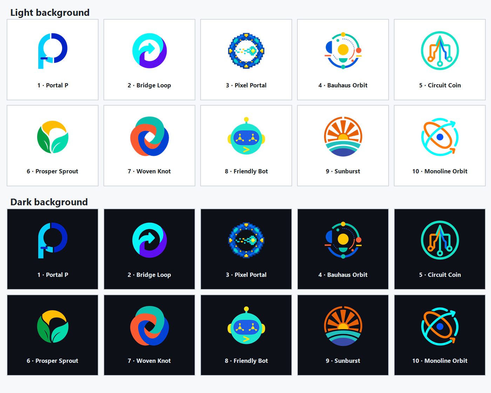
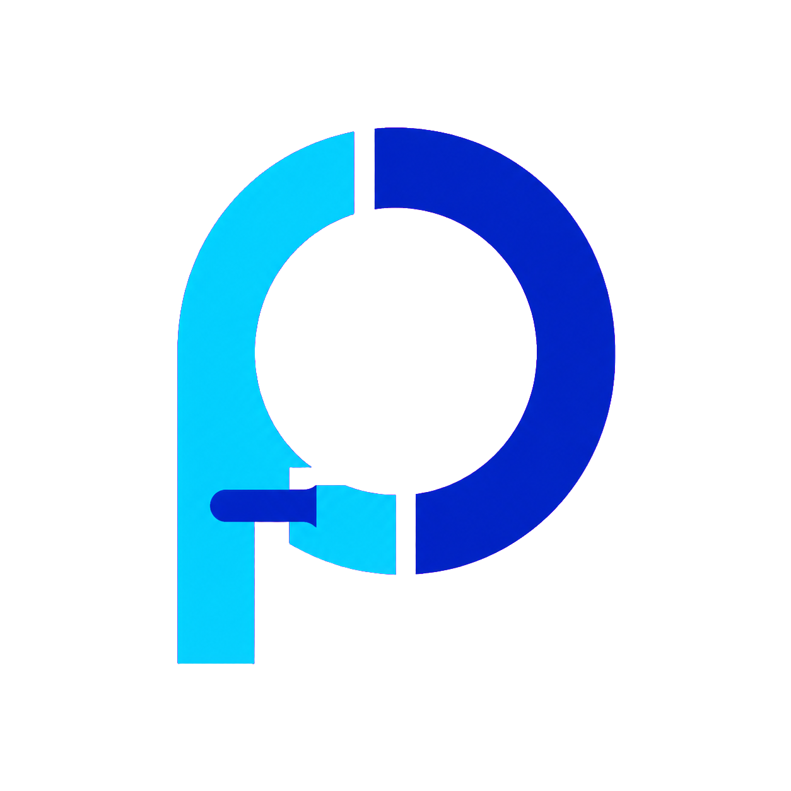
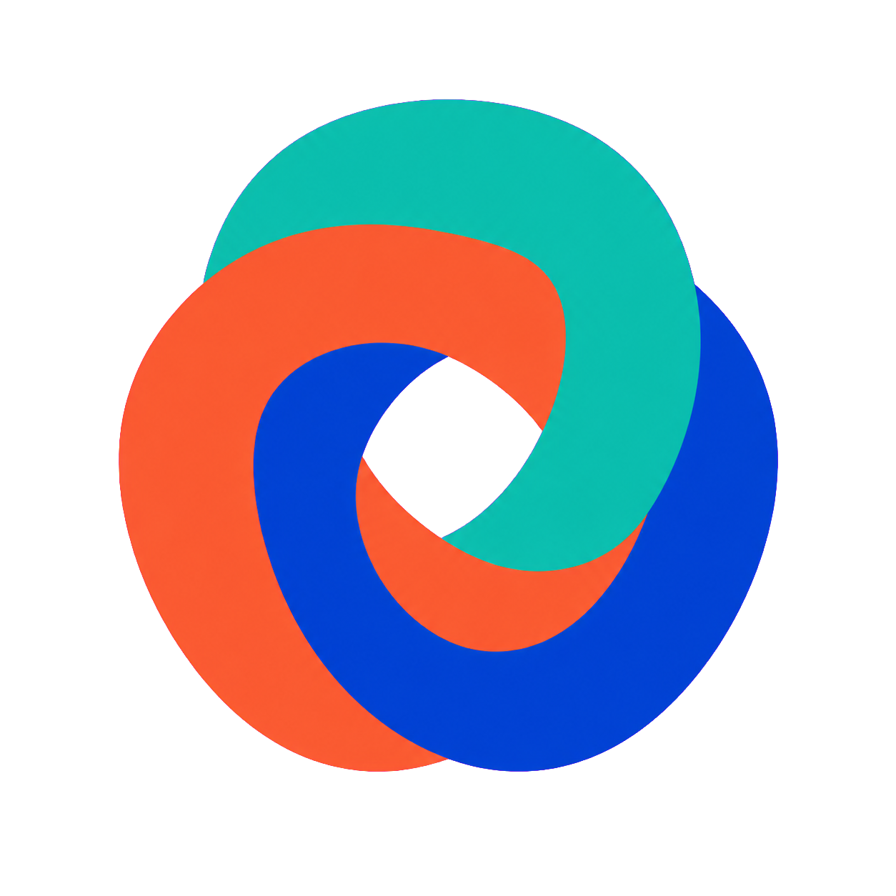

# Prosper logo options

All ten options are icon-first, roughly circular, and designed to stay inside common rounded-square
and circular app-launcher masks. Each source asset is a 1254×1254 transparent PNG with no baked-in
background, so the colors remain visible on GitHub's light and dark themes.

| Option | Transparent asset | Style |
| --- | --- | --- |
| **1 — Portal P** |  | Geometric monogram with a translation crossing |
| **2 — Bridge Loop** |  | Compact continuous-flow arrow |
| **3 — Pixel Portal** |  | Retro pixel-art data portal |
| **4 — Bauhaus Orbit** |  | Playful geometric orbital system |
| **5 — Circuit Coin** |  | Technical circuit-board seal |
| **6 — Prosper Sprout** |  | Organic growth and forward motion |
| **7 — Woven Knot** |  | Interlaced systems forming one path |
| **8 — Friendly Bot** |  | Friendly open-source mascot |
| **9 — Sunburst** |  | Mid-century progress badge |
| **10 — Monoline Orbit** |  | Minimal native-execution orbit |

## Selection

Choose an option by number in the pull request discussion. The current README logo remains unchanged
in this comparison PR; the selected icon can replace it after review.
