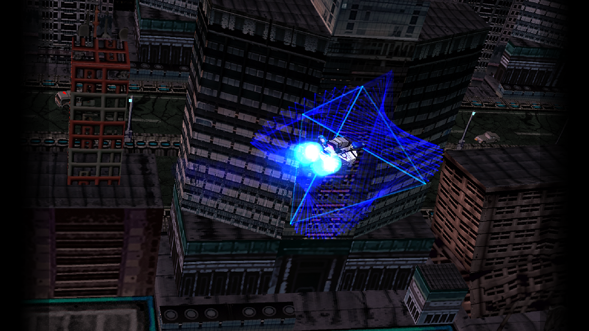

# Screenshots — newest first

<!--
    GENERATED FILE -- DO NOT EDIT BY HAND.
    Produced by prosper/tools/docs/gen_screenshot_feed.py from git history.
    Regenerate with:  python3 prosper/tools/docs/gen_screenshot_feed.py
    CI regenerates this file and fails if it differs from the committed copy.
-->

**Every screenshot checked into this repository, most recent first.** Read down from the top and stop when you reach one you have already seen.

**138 images**, most recent **2026-08-20**. Captions are the subject line of the commit that added each image, so they say what the change was rather than what the picture is.

This file is generated from git history by [`prosper/tools/docs/gen_screenshot_feed.py`](prosper/tools/docs/gen_screenshot_feed.py) and is regenerated and diffed in CI, so it cannot drift from the tree. [`COMPATIBILITY.md`](COMPATIBILITY.md) remains the per-title overview and [`PROGRESS_TRACKER.md`](PROGRESS_TRACKER.md) the per-title rung table; this is only a reverse-chronological index of the images themselves.

> A screenshot here is evidence of what rendered on the day its commit landed. It is not
> a claim about the title's current state — for that, read the tracker. An image is never
> removed from this feed when a title moves on, because the point of a feed is that it is
> a record of *when* things happened.

## 2026-08-20

### rtype-delta-stage1-gameplay.png

screenshot(rtype-delta): stage 1 gameplay renders at 83e3383a and NOT on current master (#2783)

`6fe7d80c` · [`assets/screenshots/rtype-delta-stage1-gameplay.png`](assets/screenshots/rtype-delta-stage1-gameplay.png)

### dragon-quest-vii-opening-chapter.png

feat(dq7): the route reaches the opening chapter in Estard, and Unreal titles get an IoStore package oracle (#2779)

`0ea7868c` · [`assets/screenshots/dragon-quest-vii-opening-chapter.png`](assets/screenshots/dragon-quest-vii-opening-chapter.png)

### bendy-dark-revival-gameplay.png

feat(bendy-dark-revival): rung 2 -> rung 3 — a route reaches the PPSA27624 Chapter 1 sections (#2769)

`5501dd45` · [`assets/screenshots/bendy-dark-revival-gameplay.png`](assets/screenshots/bendy-dark-revival-gameplay.png)

### tales-graces-f-gameplay-dialogue.png

feat(route): Tales of Graces f Remastered reaches gameplay -- the wall was two OPTIONS-button gates, not the renderer (#2763)

`f249929d` · [`assets/screenshots/tales-graces-f-gameplay-dialogue.png`](assets/screenshots/tales-graces-f-gameplay-dialogue.png)

### tales-graces-f-gameplay.png

feat(route): Tales of Graces f Remastered reaches gameplay -- the wall was two OPTIONS-button gates, not the renderer (#2763)

`f249929d` · [`assets/screenshots/tales-graces-f-gameplay.png`](assets/screenshots/tales-graces-f-gameplay.png)

### sonic-origins-sonic-team-logo.png

docs(compat): refresh the checked-in visual evidence, and repair two trackers that deny screenshots already on master (#2737)

`29f4db65` · [`assets/screenshots/sonic-origins-sonic-team-logo.png`](assets/screenshots/sonic-origins-sonic-team-logo.png)

### tales-graces-f-title-no-input.png

docs(compat): refresh the checked-in visual evidence, and repair two trackers that deny screenshots already on master (#2737)

`29f4db65` · [`assets/screenshots/tales-graces-f-title-no-input.png`](assets/screenshots/tales-graces-f-title-no-input.png)

### issue-2731-tales-graces-f-movie-chroma.png

docs(compat): refresh the checked-in visual evidence, and repair two trackers that deny screenshots already on master (#2737)

`29f4db65` · [`prosper/docs/screenshots/issue-2731-tales-graces-f-movie-chroma.png`](prosper/docs/screenshots/issue-2731-tales-graces-f-movie-chroma.png)

### issue-2734-little-nightmares-3-corrupt-save-modal.png

docs(compat): refresh the checked-in visual evidence, and repair two trackers that deny screenshots already on master (#2737)

`29f4db65` · [`prosper/docs/screenshots/issue-2734-little-nightmares-3-corrupt-save-modal.png`](prosper/docs/screenshots/issue-2734-little-nightmares-3-corrupt-save-modal.png)

### asterix-babylon-gameplay.png

bringup(asterix-babylon): a Triangle-aware input route reaches GAMEPLAY (rung 2 -> 3) (#2736)

`5404e173` · [`assets/screenshots/asterix-babylon-gameplay.png`](assets/screenshots/asterix-babylon-gameplay.png)

## 2026-08-19

### plucky-squire-chapter1-intro.png

docs(plucky): status doc — the chapter-one world renders, plus five falsified hypotheses (#2742)

`675ff2f6` · [`assets/screenshots/plucky-squire-chapter1-intro.png`](assets/screenshots/plucky-squire-chapter1-intro.png)

## 2026-08-08

### sonic-crossworlds-title.png

docs(crossworlds): rung 2 — the title screen renders completely, reproduced across two runs (#2360)

`a3a88356` · [`assets/screenshots/sonic-crossworlds-title.png`](assets/screenshots/sonic-crossworlds-title.png)

## 2026-08-07

### arcrunner-title-screen-default-route.png

ArcRunner: the per-fold account — the guest's builder is released mid-fold, and the contract that forbids it is version-gated off (#2219)

`a22cf8de` · [`assets/screenshots/arcrunner-title-screen-default-route.png`](assets/screenshots/arcrunner-title-screen-default-route.png)

## 2026-08-06

### sonic-frontiers-autosave-notice.png

fix(hle): sceSaveDataTransferringMountPs4 must report "no PS4 save", not SCE_OK — Sonic Frontiers reaches its title screen (#2208)

`7801a5bc` · [`assets/screenshots/sonic-frontiers-autosave-notice.png`](assets/screenshots/sonic-frontiers-autosave-notice.png)

### sonic-frontiers-main-menu.png

fix(hle): sceSaveDataTransferringMountPs4 must report "no PS4 save", not SCE_OK — Sonic Frontiers reaches its title screen (#2208)

`7801a5bc` · [`assets/screenshots/sonic-frontiers-main-menu.png`](assets/screenshots/sonic-frontiers-main-menu.png)

### sonic-frontiers-title-screen.png

fix(hle): sceSaveDataTransferringMountPs4 must report "no PS4 save", not SCE_OK — Sonic Frontiers reaches its title screen (#2208)

`7801a5bc` · [`assets/screenshots/sonic-frontiers-title-screen.png`](assets/screenshots/sonic-frontiers-title-screen.png)

### arcrunner-title-screen.png

docs(arcrunner): the title screen is behind the movie, and the throttle rescues by DELAY not by lock hold (#2205)

`40129122` · [`assets/screenshots/arcrunner-title-screen.png`](assets/screenshots/arcrunner-title-screen.png)

### sonic-origins-sega-logo.png

fix(savedata): sceSaveDataCreateTransactionResource must return a positive resource id (#2121)

`e404841c` · [`assets/screenshots/sonic-origins-sega-logo.png`](assets/screenshots/sonic-origins-sega-logo.png)

### arcrunner-default-route-logos.png

ArcRunner: the init-side generation census — the #1756 question answered, four falsifications, and real graphics off the throttle (#1226) (#2122)

`8c8e74f5` · [`assets/screenshots/arcrunner-default-route-logos.png`](assets/screenshots/arcrunner-default-route-logos.png)

### arcrunner-intro-city.png

ArcRunner renders its intro cinematic — the #1226 fault is a submit-timing race (follow-up to #2077) (#2086)

`0a6f82a8` · [`assets/screenshots/arcrunner-intro-city.png`](assets/screenshots/arcrunner-intro-city.png)

### arcrunner-intro-space-station.png

ArcRunner renders its intro cinematic — the #1226 fault is a submit-timing race (follow-up to #2077) (#2086)

`0a6f82a8` · [`assets/screenshots/arcrunner-intro-space-station.png`](assets/screenshots/arcrunner-intro-space-station.png)

### rtype-delta-force-select.png

fix(gpu): a saved-EXEC wave mask must survive the NGG fetch-index fold — R-Type Delta reaches its title screen (#2061)

`83e3383a` · [`assets/screenshots/rtype-delta-force-select.png`](assets/screenshots/rtype-delta-force-select.png)

### rtype-delta-title.png

fix(gpu): a saved-EXEC wave mask must survive the NGG fetch-index fold — R-Type Delta reaches its title screen (#2061)

`83e3383a` · [`assets/screenshots/rtype-delta-title.png`](assets/screenshots/rtype-delta-title.png)

### crisis-core-main-menu.png

Crisis Core (PPSA07809) reaches rung 2 — and its #1945 fault is a race the guest wins, not a late write (#2060)

`e311e6cd` · [`assets/screenshots/crisis-core-main-menu.png`](assets/screenshots/crisis-core-main-menu.png)

### crisis-core-title.png

Crisis Core (PPSA07809) reaches rung 2 — and its #1945 fault is a race the guest wins, not a late write (#2060)

`e311e6cd` · [`assets/screenshots/crisis-core-title.png`](assets/screenshots/crisis-core-title.png)

### crisis-core-voice-language.png

Crisis Core (PPSA07809) reaches rung 2 — and its #1945 fault is a race the guest wins, not a late write (#2060)

`e311e6cd` · [`assets/screenshots/crisis-core-voice-language.png`](assets/screenshots/crisis-core-voice-language.png)

### sonic-frontiers-middleware-credits.png

fix(present): publish the flipped VideoOut buffer when no pass ever targets it — with a real guest-authorship test and the composited-frame gate intact (#2068)

`33dac763` · [`assets/screenshots/sonic-frontiers-middleware-credits.png`](assets/screenshots/sonic-frontiers-middleware-credits.png)

### sonic-frontiers-sega-logo.png

fix(present): publish the flipped VideoOut buffer when no pass ever targets it — with a real guest-authorship test and the composited-frame gate intact (#2068)

`33dac763` · [`assets/screenshots/sonic-frontiers-sega-logo.png`](assets/screenshots/sonic-frontiers-sega-logo.png)

### rtype-delta-opening-movie-colour.png

fix(gpu): recognise an AvPlayer chroma plane declared as a one-layer 2D array (#2037)

`08d75128` · [`assets/screenshots/rtype-delta-opening-movie-colour.png`](assets/screenshots/rtype-delta-opening-movie-colour.png)

### issue-1946-health-warning-before-after.png

fix(agc): offer the render-target-0 blend key on every SDK version — The Oregon Trail's whole UI layer was unblended (#1946) (#2031)

`beeff2ab` · [`prosper/docs/screenshots/issue-1946-health-warning-before-after.png`](prosper/docs/screenshots/issue-1946-health-warning-before-after.png)

### issue-1946-slate-blend-before-after.png

fix(agc): offer the render-target-0 blend key on every SDK version — The Oregon Trail's whole UI layer was unblended (#1946) (#2031)

`beeff2ab` · [`prosper/docs/screenshots/issue-1946-slate-blend-before-after.png`](prosper/docs/screenshots/issue-1946-slate-blend-before-after.png)

### sonic-crossworlds-sega-logo.png

docs(crossworlds): Sonic Racing: CrossWorlds reaches rung 1 — the SEGA logo renders (#2039)

`f8b0f040` · [`assets/screenshots/sonic-crossworlds-sega-logo.png`](assets/screenshots/sonic-crossworlds-sega-logo.png)

### little-nightmares-3-eula.png

docs(little-nightmares-3): #2014 is a wrong background clear, not a channel map — plus the first input route (#2041)

`f811615a` · [`assets/screenshots/little-nightmares-3-eula.png`](assets/screenshots/little-nightmares-3-eula.png)

## 2026-08-05

### little-nightmares-3-title-screen.png

docs(little-nightmares-3): rung 2 — the title screen renders; land the ruled-out record (#2017)

`080263cf` · [`assets/screenshots/little-nightmares-3-title-screen.png`](assets/screenshots/little-nightmares-3-title-screen.png)

### rtype-delta-rung1-logo-and-opening-movie.png

docs(rtype): R-Type Delta reaches rung 1 — the #1746 startup race is host CPU speed, not a prosper defect (#2009)

`c3614f51` · [`assets/screenshots/rtype-delta-rung1-logo-and-opening-movie.png`](assets/screenshots/rtype-delta-rung1-logo-and-opening-movie.png)

### oregon-trail-title-screen.png

diag(fault): probe every guest-pointer register at a worker fault, not just rdx/rax (#1992)

`034f959a` · [`assets/screenshots/oregon-trail-title-screen.png`](assets/screenshots/oregon-trail-title-screen.png)

### oregon-trail-gameloft-splash.png

fix(hle): scePthread* must return libkernel-encoded errors — Oregon Trail advances three checkpoints (#1984)

`38619f29` · [`assets/screenshots/oregon-trail-gameloft-splash.png`](assets/screenshots/oregon-trail-gameloft-splash.png)

### oregon-trail-health-warning.png

fix(hle): scePthread* must return libkernel-encoded errors — Oregon Trail advances three checkpoints (#1984)

`38619f29` · [`assets/screenshots/oregon-trail-health-warning.png`](assets/screenshots/oregon-trail-health-warning.png)

### bendy-dark-revival-title.png

fix(avplayer): end a source nobody consumes on its own media clock (#1981)

`afe4a2b0` · [`assets/screenshots/bendy-dark-revival-title.png`](assets/screenshots/bendy-dark-revival-title.png)

### asterix-babylon-intro-cutscene.png

feat(avplayer): implement sceAvPlayerJumpToTime and honour the guest file-replacement reader (#1974)

`ff72e77c` · [`assets/screenshots/asterix-babylon-intro-cutscene.png`](assets/screenshots/asterix-babylon-intro-cutscene.png)

### asterix-babylon-title.png

feat(avplayer): implement sceAvPlayerJumpToTime and honour the guest file-replacement reader (#1974)

`ff72e77c` · [`assets/screenshots/asterix-babylon-title.png`](assets/screenshots/asterix-babylon-title.png)

### little-nightmares-3-boot-splash.png

fix(ajm): accept the config revision — Little Nightmares III reaches rung 1 (#1966)

`1fc8ece9` · [`assets/screenshots/little-nightmares-3-boot-splash.png`](assets/screenshots/little-nightmares-3-boot-splash.png)

### sonic-frontiers-opening-sequence.png

docs(sonic-frontiers): rung 1 — it renders; the rung-0 reading was a failure-only diagnostic (#1969)

`440d84d2` · [`assets/screenshots/sonic-frontiers-opening-sequence.png`](assets/screenshots/sonic-frontiers-opening-sequence.png)

### sonic-frontiers-sonic-team-logo.png

docs(sonic-frontiers): rung 1 — it renders; the rung-0 reading was a failure-only diagnostic (#1969)

`440d84d2` · [`assets/screenshots/sonic-frontiers-sonic-team-logo.png`](assets/screenshots/sonic-frontiers-sonic-team-logo.png)

## 2026-08-04

### oregon-trail-legal-popup.png

feat(oregon): reach rung 1 — the startup legal popup renders on a default launch (#1950)

`e92d2f7f` · [`assets/screenshots/oregon-trail-legal-popup.png`](assets/screenshots/oregon-trail-legal-popup.png)

### beneath-title.png

docs: record Beneath title screen

`0dafd22d` · [`assets/screenshots/beneath-title.png`](assets/screenshots/beneath-title.png)

### forgotten-city-title.png

docs: record first-run compatibility baselines

`1640bb30` · [`assets/screenshots/forgotten-city-title.png`](assets/screenshots/forgotten-city-title.png)

### tactics-ogre-hevc-movie.png

docs(tactics-ogre): record restored HEVC presentation

`0d2f9a9f` · [`assets/screenshots/tactics-ogre-hevc-movie.png`](assets/screenshots/tactics-ogre-hevc-movie.png)

### tactics-ogre-reborn-gameplay.png

Document Tactics Ogre tutorial battle

`038c166d` · [`assets/screenshots/tactics-ogre-reborn-gameplay.png`](assets/screenshots/tactics-ogre-reborn-gameplay.png)

## 2026-08-03

### tactics-ogre-reborn-opening-scene.png

Document Tactics Ogre opening scene

`4c8e3997` · [`assets/screenshots/tactics-ogre-reborn-opening-scene.png`](assets/screenshots/tactics-ogre-reborn-opening-scene.png)

### house-of-the-dead-2-remake-gameplay.png

Document House of the Dead 2 gameplay

`b01e057c` · [`assets/screenshots/house-of-the-dead-2-remake-gameplay.png`](assets/screenshots/house-of-the-dead-2-remake-gameplay.png)

### tactics-ogre-title.png

Add Tactics Ogre title milestone

`4d192dc1` · [`assets/screenshots/tactics-ogre-title.png`](assets/screenshots/tactics-ogre-title.png)

### house-of-the-dead-2-remake-title.png

Document newly tested game compatibility

`fbde2b4c` · [`assets/screenshots/house-of-the-dead-2-remake-title.png`](assets/screenshots/house-of-the-dead-2-remake-title.png)

### rtype-delta-movie-coordinate-progress.png

fix(gpu): honor unnormalized sample coordinates

`d4fa07a8` · [`assets/screenshots/rtype-delta-movie-coordinate-progress.png`](assets/screenshots/rtype-delta-movie-coordinate-progress.png)

### blue-prince-hall.png

Fix Blue Prince hall snapshot guard (#1813)

`730d434e` · [`assets/screenshots/blue-prince-hall.png`](assets/screenshots/blue-prince-hall.png)

## 2026-08-02

### earthion-title-menu.png

feat(earthion): route past the intro — the "missing picture" was a black text page (#1590) (#1775)

`3d1a7480` · [`assets/screenshots/earthion-title-menu.png`](assets/screenshots/earthion-title-menu.png)

### tales-graces-f-options.png

feat(talesgraces): routes to the title screen and the new-game Options screen (PPSA19991 rung 2) (#1759)

`30477a2d` · [`assets/screenshots/tales-graces-f-options.png`](assets/screenshots/tales-graces-f-options.png)

### tales-graces-f-title.png

feat(talesgraces): routes to the title screen and the new-game Options screen (PPSA19991 rung 2) (#1759)

`30477a2d` · [`assets/screenshots/tales-graces-f-title.png`](assets/screenshots/tales-graces-f-title.png)

### bendy-gameplay.png

docs(compat): boot sweep of fourteen titles on 3a473bca — corrected rungs, four new rows, and a frame-rate census (#1740)

`8fc79ca0` · [`assets/screenshots/bendy-gameplay.png`](assets/screenshots/bendy-gameplay.png)

### bendy-title.png

docs(compat): boot sweep of fourteen titles on 3a473bca — corrected rungs, four new rows, and a frame-rate census (#1740)

`8fc79ca0` · [`assets/screenshots/bendy-title.png`](assets/screenshots/bendy-title.png)

### pathless-title.png

docs(compat): boot sweep of fourteen titles on 3a473bca — corrected rungs, four new rows, and a frame-rate census (#1740)

`8fc79ca0` · [`assets/screenshots/pathless-title.png`](assets/screenshots/pathless-title.png)

### plucky-squire-title.png

docs(compat): boot sweep of fourteen titles on 3a473bca — corrected rungs, four new rows, and a frame-rate census (#1740)

`8fc79ca0` · [`assets/screenshots/plucky-squire-title.png`](assets/screenshots/plucky-squire-title.png)

### astro-bot-opening-cinematic.png

docs(astro): Astro Bot enters COMPATIBILITY.md at rung 2 — the title screen renders (#1736)

`6d7b69e9` · [`assets/screenshots/astro-bot-opening-cinematic.png`](assets/screenshots/astro-bot-opening-cinematic.png)

### astro-bot-title.png

docs(astro): Astro Bot enters COMPATIBILITY.md at rung 2 — the title screen renders (#1736)

`6d7b69e9` · [`assets/screenshots/astro-bot-title.png`](assets/screenshots/astro-bot-title.png)

### astro-bot-worldmap-background.png

fix(gpu): CB_COLOR_CONTROL.MODE must not override the guest's colour write mask (#1728)

`c8fe4afd` · [`assets/screenshots/astro-bot-worldmap-background.png`](assets/screenshots/astro-bot-worldmap-background.png)

## 2026-08-01

### tales-graces-f-criware.png

fix(hle): deliver the APR completion event for a zero-tag binding (#1666) (#1667)

`fa1f07b3` · [`assets/screenshots/tales-graces-f-criware.png`](assets/screenshots/tales-graces-f-criware.png)

### tales-graces-f-publisher.png

fix(hle): deliver the APR completion event for a zero-tag binding (#1666) (#1667)

`fa1f07b3` · [`assets/screenshots/tales-graces-f-publisher.png`](assets/screenshots/tales-graces-f-publisher.png)

### issue-1630-grid-after.png

feat(app): per-title background art and focus music in the library (#1647)

`7da42075` · [`prosper/docs/screenshots/issue-1630-grid-after.png`](prosper/docs/screenshots/issue-1630-grid-after.png)

### issue-1630-grid-before.png

feat(app): per-title background art and focus music in the library (#1647)

`7da42075` · [`prosper/docs/screenshots/issue-1630-grid-before.png`](prosper/docs/screenshots/issue-1630-grid-before.png)

### issue-1630-library-background-1.png

feat(app): per-title background art and focus music in the library (#1647)

`7da42075` · [`prosper/docs/screenshots/issue-1630-library-background-1.png`](prosper/docs/screenshots/issue-1630-library-background-1.png)

### issue-1630-library-background-2.png

feat(app): per-title background art and focus music in the library (#1647)

`7da42075` · [`prosper/docs/screenshots/issue-1630-library-background-2.png`](prosper/docs/screenshots/issue-1630-library-background-2.png)

### issue-1630-library-background-3.png

feat(app): per-title background art and focus music in the library (#1647)

`7da42075` · [`prosper/docs/screenshots/issue-1630-library-background-3.png`](prosper/docs/screenshots/issue-1630-library-background-3.png)

### syberia-gameplay.png

docs(syberia): validated route to gameplay, and localize the black scene to one format gap (#1622)

`5ee5e785` · [`assets/screenshots/syberia-gameplay.png`](assets/screenshots/syberia-gameplay.png)

### syberia-title.png

docs(syberia): validated route to gameplay, and localize the black scene to one format gap (#1622)

`5ee5e785` · [`assets/screenshots/syberia-title.png`](assets/screenshots/syberia-title.png)

### worms-armageddon-gameplay.png

fix(pad): scePadGetHandle looks up an open handle instead of fabricating one (#1623)

`823c9670` · [`assets/screenshots/worms-armageddon-gameplay.png`](assets/screenshots/worms-armageddon-gameplay.png)

## 2026-07-31

### syberia-profile.png

fix(agc): register sceAgcAcbWriteData — Syberia goes from hard hang to its profile menu (#1610)

`961a6cdd` · [`assets/screenshots/syberia-profile.png`](assets/screenshots/syberia-profile.png)

### nikoderiko-title.png

docs(compat): add Nikoderiko at title screen and The Oregon Trail at research tier (#1608)

`a933091d` · [`assets/screenshots/nikoderiko-title.png`](assets/screenshots/nikoderiko-title.png)

### greak-title.png

feat(recompiler): lower s_ttracedata — Greak and Rugrats reach gameplay (#1600)

`5a0eb7b6` · [`assets/screenshots/greak-title.png`](assets/screenshots/greak-title.png)

### greak.png

feat(recompiler): lower s_ttracedata — Greak and Rugrats reach gameplay (#1600)

`5a0eb7b6` · [`assets/screenshots/greak.png`](assets/screenshots/greak.png)

### rugrats-title.png

feat(recompiler): lower s_ttracedata — Greak and Rugrats reach gameplay (#1600)

`5a0eb7b6` · [`assets/screenshots/rugrats-title.png`](assets/screenshots/rugrats-title.png)

### rugrats.png

feat(recompiler): lower s_ttracedata — Greak and Rugrats reach gameplay (#1600)

`5a0eb7b6` · [`assets/screenshots/rugrats.png`](assets/screenshots/rugrats.png)

### asterix-slap-them-all.png

docs(compat): add Asterix Slap Them All and Summer Sports Games at gameplay (#1604)

`2421d503` · [`assets/screenshots/asterix-slap-them-all.png`](assets/screenshots/asterix-slap-them-all.png)

### summer-sports-games.png

docs(compat): add Asterix Slap Them All and Summer Sports Games at gameplay (#1604)

`2421d503` · [`assets/screenshots/summer-sports-games.png`](assets/screenshots/summer-sports-games.png)

### joe-mac-menu.png

docs(compat): record five newly triaged titles, two of them rendering (#1596)

`bb5a11a2` · [`assets/screenshots/joe-mac-menu.png`](assets/screenshots/joe-mac-menu.png)

### joe-mac.png

docs(compat): record five newly triaged titles, two of them rendering (#1596)

`bb5a11a2` · [`assets/screenshots/joe-mac.png`](assets/screenshots/joe-mac.png)

### worms-armageddon-title.png

docs(compat): record five newly triaged titles, two of them rendering (#1596)

`bb5a11a2` · [`assets/screenshots/worms-armageddon-title.png`](assets/screenshots/worms-armageddon-title.png)

### alex-kidd.png

test(snapshot): reviewed alexkidd-gameplay content guard — PPSA02664 reaches ladder rung 6 (#1582)

`a6d995fa` · [`assets/screenshots/alex-kidd.png`](assets/screenshots/alex-kidd.png)

### dragon-quest-vii-onboarding.png

docs: record Dragon Quest VII onboarding

`aeee4d48` · [`assets/screenshots/dragon-quest-vii-onboarding.png`](assets/screenshots/dragon-quest-vii-onboarding.png)

### dragon-quest-vii-name-confirmation.png

Document DQ7 name confirmation milestone

`d2fe1c66` · [`assets/screenshots/dragon-quest-vii-name-confirmation.png`](assets/screenshots/dragon-quest-vii-name-confirmation.png)

### dragon-quest-vii-name-entry.png

Document Dragon Quest name entry

`297ec493` · [`assets/screenshots/dragon-quest-vii-name-entry.png`](assets/screenshots/dragon-quest-vii-name-entry.png)

### space-adventure-cobra.png

fix(runtime): preserve guest TLS across write-watch faults

`82eadf58` · [`assets/screenshots/space-adventure-cobra.png`](assets/screenshots/space-adventure-cobra.png)

### gris.png

docs: record GRIS opening gameplay

`b08f0a94` · [`assets/screenshots/gris.png`](assets/screenshots/gris.png)

### issue-1459-astrobot-blue-fmv-gpu-present.png

docs: capture Astro Bot blue intro

`3f72a8ce` · [`prosper/docs/screenshots/issue-1459-astrobot-blue-fmv-gpu-present.png`](prosper/docs/screenshots/issue-1459-astrobot-blue-fmv-gpu-present.png)

## 2026-07-30

### issue-1471-library-empty.png

fix(app): address review findings on the library view

`44d1689d` · [`prosper/docs/screenshots/issue-1471-library-empty.png`](prosper/docs/screenshots/issue-1471-library-empty.png)

### issue-1471-library-scrolled.png

fix(app): address review findings on the library view

`44d1689d` · [`prosper/docs/screenshots/issue-1471-library-scrolled.png`](prosper/docs/screenshots/issue-1471-library-scrolled.png)

### issue-1471-library-grid.png

feat(app): draw the game library with Dear ImGui

`7cf767fe` · [`prosper/docs/screenshots/issue-1471-library-grid.png`](prosper/docs/screenshots/issue-1471-library-grid.png)

### issue-1459-astrobot-linux-indirect-title.png

gpu: execute AGC indirect work after producers

`e85c527c` · [`prosper/docs/screenshots/issue-1459-astrobot-linux-indirect-title.png`](prosper/docs/screenshots/issue-1459-astrobot-linux-indirect-title.png)

## 2026-07-29

### issue-1469-drop-messenger.png

docs(app): interactive-open evidence screenshots (#1469)

`3f7f9929` · [`prosper/docs/screenshots/issue-1469-drop-messenger.png`](prosper/docs/screenshots/issue-1469-drop-messenger.png)

### issue-1469-picker-messenger.png

docs(app): interactive-open evidence screenshots (#1469)

`3f7f9929` · [`prosper/docs/screenshots/issue-1469-picker-messenger.png`](prosper/docs/screenshots/issue-1469-picker-messenger.png)

### issue-1469-reject-not-a-title.png

docs(app): interactive-open evidence screenshots (#1469)

`3f7f9929` · [`prosper/docs/screenshots/issue-1469-reject-not-a-title.png`](prosper/docs/screenshots/issue-1469-reject-not-a-title.png)

### issue-1469-relaunch-blasphemous2.png

docs(app): interactive-open evidence screenshots (#1469)

`3f7f9929` · [`prosper/docs/screenshots/issue-1469-relaunch-blasphemous2.png`](prosper/docs/screenshots/issue-1469-relaunch-blasphemous2.png)

### issue-1459-astrobot-worldmap-current.png

docs: capture current Astro Bot world map

`2e83d1ea` · [`prosper/docs/screenshots/issue-1459-astrobot-worldmap-current.png`](prosper/docs/screenshots/issue-1459-astrobot-worldmap-current.png)

### issue-1466-astrobot-direct-tile.png

perf(gpu): tile mapped storage images directly

`1b8eeed6` · [`prosper/docs/screenshots/issue-1466-astrobot-direct-tile.png`](prosper/docs/screenshots/issue-1466-astrobot-direct-tile.png)

## 2026-07-26

### issue-1287-hall-live-fixed.png

docs: live Blue Prince gameplay at oracle parity (#1287 rung-5 evidence) (#1438)

`ffbb7d74` · [`prosper/docs/screenshots/issue-1287-hall-live-fixed.png`](prosper/docs/screenshots/issue-1287-hall-live-fixed.png)

### issue-1287-hall-live-vs-oracle.png

docs: live Blue Prince gameplay at oracle parity (#1287 rung-5 evidence) (#1438)

`ffbb7d74` · [`prosper/docs/screenshots/issue-1287-hall-live-vs-oracle.png`](prosper/docs/screenshots/issue-1287-hall-live-vs-oracle.png)

### issue-1287-manor-approach-live.png

docs: live Blue Prince gameplay at oracle parity (#1287 rung-5 evidence) (#1438)

`ffbb7d74` · [`prosper/docs/screenshots/issue-1287-manor-approach-live.png`](prosper/docs/screenshots/issue-1287-manor-approach-live.png)

### issue-1427-hall-geometry-restored.png

fix(render): upload a buffer binding's whole declared range, not the first 1 MiB (#1429)

`ad5a840a` · [`prosper/docs/screenshots/issue-1427-hall-geometry-restored.png`](prosper/docs/screenshots/issue-1427-hall-geometry-restored.png)

### issue-1427-oracle-before-after.png

fix(render): upload a buffer binding's whole declared range, not the first 1 MiB (#1429)

`ad5a840a` · [`prosper/docs/screenshots/issue-1427-oracle-before-after.png`](prosper/docs/screenshots/issue-1427-oracle-before-after.png)

### issue-1287-hall-materials-fixed.png

docs: Blue Prince hall with correct materials (#1287 milestone frame) (#1418)

`0f7d9310` · [`prosper/docs/screenshots/issue-1287-hall-materials-fixed.png`](prosper/docs/screenshots/issue-1287-hall-materials-fixed.png)

## 2026-07-25

### issue-1334-hall-default-tonemapped.png

fix(gpu): GPU-copy the MSAA resolve into the destination persistent image (#1382)

`6479cd5f` · [`prosper/docs/screenshots/issue-1334-hall-default-tonemapped.png`](prosper/docs/screenshots/issue-1334-hall-default-tonemapped.png)

### issue-1287-hall-bundle-tonemapped.png

docs: current Blue Prince hall frames for the #1287 oracle request (#1375)

`a3613436` · [`prosper/docs/screenshots/issue-1287-hall-bundle-tonemapped.png`](prosper/docs/screenshots/issue-1287-hall-bundle-tonemapped.png)

### issue-1287-hall-magenta-prosper.png

docs: current Blue Prince hall frames for the #1287 oracle request (#1375)

`a3613436` · [`prosper/docs/screenshots/issue-1287-hall-magenta-prosper.png`](prosper/docs/screenshots/issue-1287-hall-magenta-prosper.png)

### issue-1287-hall-night-prosper.png

docs: current Blue Prince hall frames for the #1287 oracle request (#1375)

`a3613436` · [`prosper/docs/screenshots/issue-1287-hall-night-prosper.png`](prosper/docs/screenshots/issue-1287-hall-night-prosper.png)

### issue-1287-hall-nobatch-live.png

docs: current Blue Prince hall frames for the #1287 oracle request (#1375)

`a3613436` · [`prosper/docs/screenshots/issue-1287-hall-nobatch-live.png`](prosper/docs/screenshots/issue-1287-hall-nobatch-live.png)

### issue-1287-vestibule-prosper.png

docs: current Blue Prince hall frames for the #1287 oracle request (#1375)

`a3613436` · [`prosper/docs/screenshots/issue-1287-vestibule-prosper.png`](prosper/docs/screenshots/issue-1287-vestibule-prosper.png)

### issue-1356-gris-title.png

feat: bring GRIS and Cobra to title with audio (#1368)

`8b37be95` · [`prosper/docs/screenshots/issue-1356-gris-title.png`](prosper/docs/screenshots/issue-1356-gris-title.png)

### issue-1356-space-adventure-cobra-title.png

feat: bring GRIS and Cobra to title with audio (#1368)

`8b37be95` · [`prosper/docs/screenshots/issue-1356-space-adventure-cobra-title.png`](prosper/docs/screenshots/issue-1356-space-adventure-cobra-title.png)

### dragon-quest-vii-title.png

docs: publish Dragon Quest VII title capture

`18abdf28` · [`assets/screenshots/dragon-quest-vii-title.png`](assets/screenshots/dragon-quest-vii-title.png)

### issue-1352-wall-shading-after.png

fix(gpu): DEPTH_CLEAR_ENABLE acts only through the enabled depth-write path (#1354)

`feb5822d` · [`prosper/docs/screenshots/issue-1352-wall-shading-after.png`](prosper/docs/screenshots/issue-1352-wall-shading-after.png)

### issue-1352-wall-shading-before.png

fix(gpu): DEPTH_CLEAR_ENABLE acts only through the enabled depth-write path (#1354)

`feb5822d` · [`prosper/docs/screenshots/issue-1352-wall-shading-before.png`](prosper/docs/screenshots/issue-1352-wall-shading-before.png)

## 2026-07-24

### blue-prince-title.png

Add Blue Prince and Terminator docs screenshots (#1342)

`5e11d900` · [`assets/screenshots/blue-prince-title.png`](assets/screenshots/blue-prince-title.png)

### terminator-title.png

Add Blue Prince and Terminator docs screenshots (#1342)

`5e11d900` · [`assets/screenshots/terminator-title.png`](assets/screenshots/terminator-title.png)

### terminator.png

Add Blue Prince and Terminator docs screenshots (#1342)

`5e11d900` · [`assets/screenshots/terminator.png`](assets/screenshots/terminator.png)

### gta5-main-menu.png

docs: show GTA V current renderer state (#1339)

`e6b8fb06` · [`assets/screenshots/gta5-main-menu.png`](assets/screenshots/gta5-main-menu.png)

### gta5-title.png

docs: show GTA V current renderer state (#1339)

`e6b8fb06` · [`assets/screenshots/gta5-title.png`](assets/screenshots/gta5-title.png)

### blasphemous2-title.png

docs: refresh public README + COMPATIBILITY with screenshots and current status

`958979f6` · [`assets/screenshots/blasphemous2-title.png`](assets/screenshots/blasphemous2-title.png)

### blasphemous2.png

docs: refresh public README + COMPATIBILITY with screenshots and current status

`958979f6` · [`assets/screenshots/blasphemous2.png`](assets/screenshots/blasphemous2.png)

### dead-cells-title.png

docs: refresh public README + COMPATIBILITY with screenshots and current status

`958979f6` · [`assets/screenshots/dead-cells-title.png`](assets/screenshots/dead-cells-title.png)

### dead-cells.png

docs: refresh public README + COMPATIBILITY with screenshots and current status

`958979f6` · [`assets/screenshots/dead-cells.png`](assets/screenshots/dead-cells.png)

### evergate-title.png

docs: refresh public README + COMPATIBILITY with screenshots and current status

`958979f6` · [`assets/screenshots/evergate-title.png`](assets/screenshots/evergate-title.png)

### evergate.png

docs: refresh public README + COMPATIBILITY with screenshots and current status

`958979f6` · [`assets/screenshots/evergate.png`](assets/screenshots/evergate.png)

### messenger-title.png

docs: refresh public README + COMPATIBILITY with screenshots and current status

`958979f6` · [`assets/screenshots/messenger-title.png`](assets/screenshots/messenger-title.png)

### messenger.png

docs: refresh public README + COMPATIBILITY with screenshots and current status

`958979f6` · [`assets/screenshots/messenger.png`](assets/screenshots/messenger.png)

## 2026-07-19

### issue-897-astrobot-linux-natural-opening-midfade.png

docs(astrobot): attach natural Linux graphics captures

`2a09b44d` · [`prosper/docs/screenshots/issue-897-astrobot-linux-natural-opening-midfade.png`](prosper/docs/screenshots/issue-897-astrobot-linux-natural-opening-midfade.png)

### issue-897-astrobot-linux-natural-opening-visible.png

docs(astrobot): attach natural Linux graphics captures

`2a09b44d` · [`prosper/docs/screenshots/issue-897-astrobot-linux-natural-opening-visible.png`](prosper/docs/screenshots/issue-897-astrobot-linux-natural-opening-visible.png)

## 2026-07-18

### issue-825-astrobot-windows-sony-presents.png

docs(astrobot): attach Windows progress captures

`815a84b2` · [`prosper/docs/screenshots/issue-825-astrobot-windows-sony-presents.png`](prosper/docs/screenshots/issue-825-astrobot-windows-sony-presents.png)

### issue-825-astrobot-windows-title.png

docs(astrobot): attach Windows progress captures

`815a84b2` · [`prosper/docs/screenshots/issue-825-astrobot-windows-title.png`](prosper/docs/screenshots/issue-825-astrobot-windows-title.png)

## 2026-07-17

### issue-825-astrobot-linux-sony-presents.png

docs(astrobot): attach Linux loading screenshot

`a1395e75` · [`prosper/docs/screenshots/issue-825-astrobot-linux-sony-presents.png`](prosper/docs/screenshots/issue-825-astrobot-linux-sony-presents.png)
