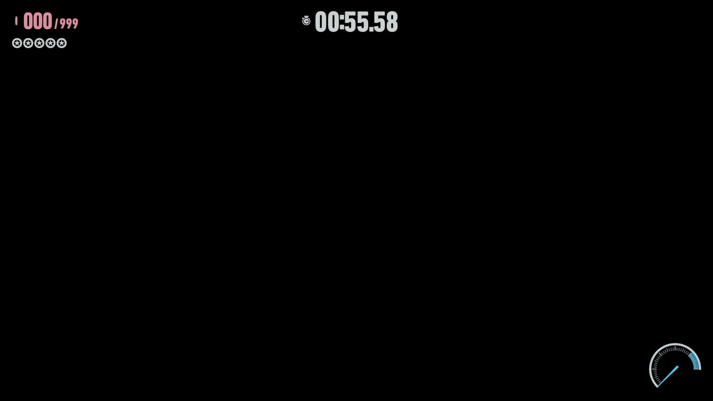
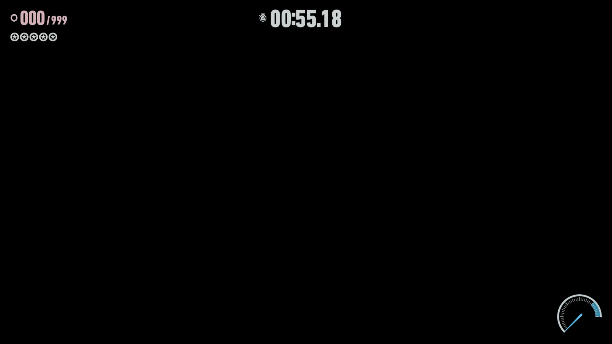
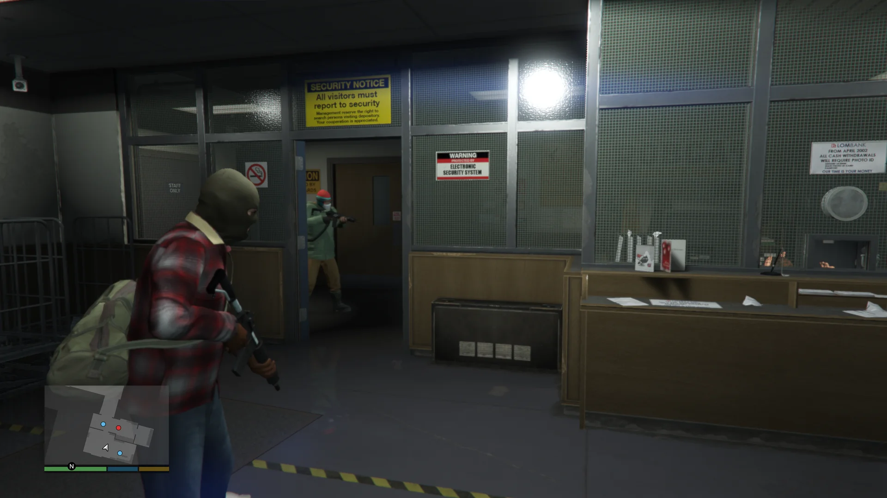

# Private hosted outputs and ordered writeback (2026-09)

Fix for #3619, found during #3407's next comparison investigation. The implementation is based
on remote main `9c2fb82c347479379f6e301411764b23be354ffa`, including #3618. Independent review found
no buffer-comparison change in that incoming PR; its shader uniformity fix means older game timings
are not a matched baseline for current main.

## The confirmed failure and fix

A private buffer can have no architectural address (`gpu_addr == 0`) while still exposing a valid
host destination. That destination can overlap another resource's hosted bytes. The old output
planner skipped private buffers entirely, so a later buffer/image's exact GPU comparison could find
its old result unchanged and skip publication after the earlier private output had overwritten it.
The comparison was correct; using it to skip that later write was wrong.

The planner now includes effective host ranges for those outputs, treating an absent architectural
address as absent rather than as an unknown range that conflicts with everything. It preserves
physical guest spans, ordered publication, allocation pins, host barriers, cache budgets and private
notification semantics. An earlier overlap forces the existing current-destination fallback.
Input-only image authority is separately tracked in #3620; this is not comprehensive private-alias
coherence. No live game regression has been attributed to the confirmed direct-resource failure.

The buffer guard executes eight cases: either owner private, both publication orders, and overlap
or disjoint backing. It checks the four last-writer words, the full untouched tail, subsequent
repair, GPU-skip counts and absence of private architectural notifications. Image guards check both
host and GPU baselines and read the resulting image with a real dependent GPU shader. Existing
unrelated-private-output, journal, overflow, failure and watch guards remain in the suite.

Restoring the original production planner while keeping the new tests fails both the buffer-word
and image-restoration assertions. Disjoint and opposite-order controls remain clean. This is an
executed negative control, not an inference from test names.

## Verification commands

Run in the configured build toolchain, with a real Vulkan device. Set `PROSPER_GAME_ROOT` and
`GAME_DUMP` so dump-gated tests do not silently disappear:

```sh
export PROSPER_GAME_ROOT=<DUMP_ROOT>
cmake -S prosper -B prosper/build-linux -G Ninja -DCMAKE_BUILD_TYPE=Release \
  -DPROSPER_APP=ON -DPROSPER_AUDIO_SDL3=ON -DGAME_DUMP=<DUMP_ROOT>/PPSA24651-app0
cmake --build prosper/build-linux -j8
ctest --test-dir prosper/build-linux --no-tests=error --output-on-failure
python3 prosper/tools/vkval/vk_validation_scan.py --build-dir prosper/build-linux --sync \
  --allowlist <EMPTY_ALLOWLIST> --ctest-arg=-R \
  --ctest-arg='^(compute_buffer_(hosted_overlap|timing_runtime|residency_runtime)|storage_output_conflicts.*|live_compute_host_read_barrier)$'
```

Captured implementation: `1d6bbde3c`. Full suite: **509/509**. The strict synchronization run
passes **9/9 checks** with **zero messages**, after proving layer insertion and detection of a deliberate hazard.

## Performance investigation: preserve the existing policy

This section records the decision at #3621. The subsequent
[complete-cache census and matched admission trials](COMPUTE_BUFFER_IDLE_RESIDENCY_2026_09.md)
resolve the missing-population question and establish the current 8 MiB default.

The older 16 MiB eligibility threshold came from neutral measurements at 8,355,840 bytes and
beneficial larger buffers; it did not establish neutrality for every size below 16 MiB. A fresh
Sonic run therefore tried the existing `PROSPER_COMPUTE_BUFFER_RESULT_MIN_MB=8` control while keeping
the 256 MiB budget. This was an admission experiment, not a proposed budget increase.

In its independently gated buffer rows, program `0x1c413fd58124b291` has:

| Buffer size | Owner rows | CPU result comparison | Outcome |
| --- | ---: | ---: | --- |
| 66,846,720 bytes | 114 | 162.352 ms | cache hit, unchanged, baseline refused by budget |
| 16,711,680 bytes | 76 | 32.117 ms | cache hit, unchanged, baseline refused by budget |

All these rows remain GPU-comparison-ineligible. Observed residency is 267,386,880 bytes (255 MiB).
The five active keys account for only 223.125 MiB of primary charges; active-window rows do not
identify the remaining cached owners. Do not infer that the difference is idle or reclaimable.

**Keep the default threshold unchanged.** This run never admitted the smaller baselines, so it
cannot establish their GPU performance tradeoff. Before another retention-policy experiment,
identify the other resident owners, their pins and reuse history. Do not repeat the rejected
uncharged large-reference or persistent-worker experiments.

A separate transient-thread batching prototype produced mixed timings across five alternating
pairs. It is not implemented in the backend and establishes no speedup. Its source, output and
last-byte mismatch controls are retained for future comparisons; it must not be confused with the
previous persistent-worker experiment.

## Captures and limits

All three captures completed, with complete F8/F9 artifacts, unchanged fixed inputs and no
foreign build/game/profiler observed by the retained process censuses. Sonic before/after both explicitly use the
8 MiB threshold control; GTA uses 16 MiB (the unchanged default). Both Sonic screenshots retain
the known black world/HUD (#2790), at 00:55.58 and 00:55.18; #2206's title issue remains separate.
GTA retains the lit bank and HUD on its Performance Story route. This is an after-fix GTA visual
check, not a matched GTA performance pair.

| Capture | F8 span | Presentations/s | Process CPU cores | Graphics / compute totals |
| --- | ---: | ---: | ---: | ---: |
| Sonic before (`9c2fb82c3474`) | 5.019821 s | 7.570 | 1.430 | 2,023.010 / 1,565.520 ms |
| Sonic after (`1d6bbde3c`) | 5.026288 s | 7.759 | 1.456 | 1,992.789 / 1,633.482 ms |
| GTA after (`1d6bbde3c`) | 5.016901 s | 6.179 | 1.460 | 2,684.165 / 1,181.038 ms |

Each F8 has 20 prehistory and 21 post-trigger samples. Renderer/compute record counts are
608/1,291, 630/1,359 and 800/2,150 respectively; these are not submission or new-frame counts.
All separately gated phase rows report success (1,063 / 1,120 / 1,095 rows). Supported `radeontop`
GPU samples average 21.5%, 15.5%, 15.5% in the separate earlier 20-sample profile windows;
unsupported counters are not used. Folded CPU stacks and flame graphs are retained.

Main-output audio demand advances throughout the observed bands. Sonic's cumulative shortfall
counts stay 2→2 before and 1→1 after. GTA's main output advances 1→2, including one additional
shortfall in 60–240 seconds; it stays flat in 295–307 and 345–355 seconds. GTA's separate early
output reaches 41 cumulative shortfalls and has no late-band coverage. These are per-output,
per-generation demand counters, not physical XRUNs or an audible-quality assessment.

Each run logs one `submit=-4` after shutdown begins. The existing closing gate can return that
status without calling the driver; these logs do not independently distinguish those sources.
No such pre-shutdown status was observed. Keep this limitation with the clean completion receipts.

Original F8 SHA256 identities (before Sonic, after Sonic, after GTA):

```text
bfe4ff7e2031f1f3eae665d195c5f41b1e1733e0b7f73ed8c8f0dc7abdc31d15
f575b7807b07b1f18efca678337087a1ef7cfb6c922977055c3d3426e3447fa3
c113457690db249bca68d7d5df4e8ebe704dd998d6338e1b4f90e13099099858
```

The captured executable SHA256 changes from
`ffad5968b47c862a19e1e7bb9e8d6092b7a1128f62b55ae32d5cde3d21145c09` to
`115e28d871a7eabb6f0988277bd81658cce6f601490e09f29c28bfd71423ca4f`.
The source delta is the reviewed planner fix and regression guards. Subsequent documentation and
image commits do not change the captured implementation.





Private evidence retains the first pre-launch refusal (an inherited SDL setting), the clean run,
all original F8/F9 data, profiles, per-output audio, source/binary/route identities, process censuses,
mutation source/logs and validation receipts. The capture driver removes the inherited
`SDL_VIDEO_MINIMIZE_ON_FOCUS_LOSS` setting explicitly for both measured processes; no system setting
changes. Its frozen helpers and manifests reproduce the route once private dump/toolchain paths
are adapted. Use the normal native window and immediate presentation, fresh save/cache directories,
Sonic's committed gameplay pad route, CPU/GPU profiling at 250–270 seconds, F8 at 300 seconds,
F9 at 330 seconds and stop at 380 seconds. GTA uses its committed Performance Story route, F9 at
310 seconds and stop at 360 seconds. Profilers finish before F8; foreign workloads invalidate runs.

Frame lineage is unavailable, so presentation counts are not newly rendered-frame FPS. No graphics
performance or audio improvement is claimed for this correctness change. #3407 remains open.
