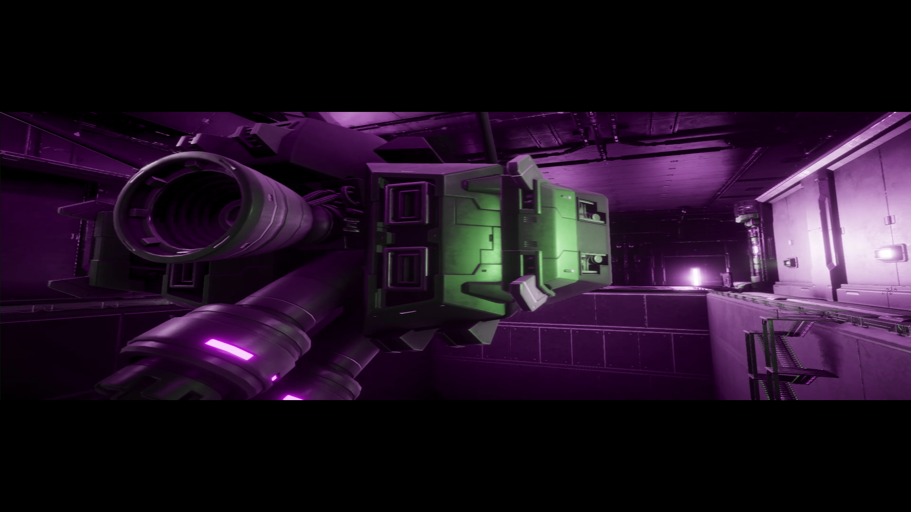
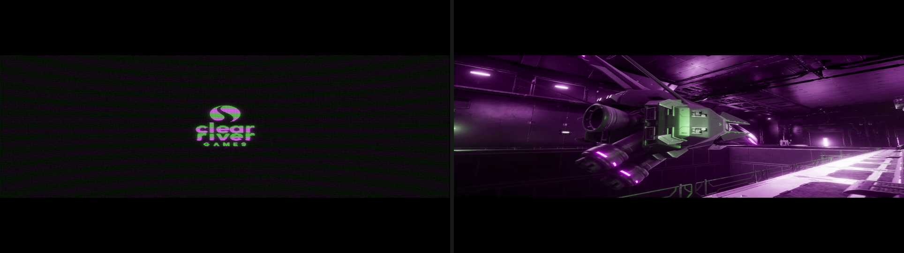

# R-Type Delta: HD Boosted status

`PPSA26414` is **rung 2** — the publisher logo, the whole opening movie, the **title screen** and the
attract-mode demonstration all render as real, full-colour frames from the live renderer, on an
unmodified binary and an unmodified guest. The green/magenta chroma cast the rung-1 frames carried is
fixed (#2005): the title declares both NV12 planes as one-layer 2D arrays, and the renderer's
AvPlayer chroma test required `DIM=2D`, so the chroma plane took the coverage broadcast. A default
launch must first win the title's own logged-in-user startup race (#1746); the supported way to do
that is to evict the dump from the host page cache with `tools/dropcache.py` before launching, which
is measured, deterministic, and changes nothing about how the title is run. That race is a product
decision rather than an open investigation. Start from **`## Rung 2 reached`** at the end of this
document, then **`## Host page-cache state decides the race`**, **`## Rung 1 reached`** and
**`## The chroma cast, solved`**; everything before those is the older movie-pipeline record (#1753,
#1807, both closed) and the #1746 investigation.

## Movie resource failure

The rejected fragment shader is `shader/movie_yuv_p.ags`. Its AGC metadata declares two direct
textures at user SGPRs 0 and 8, two direct samplers at SGPRs 16 and 20, and one constant buffer at
SGPR 24. The shader samples texture slot 1 / sampler slot 1 first at pc 52 (`T# s8`, `S# s20`), then
texture slot 0 / sampler slot 0 at pc 57. The pc-52 instruction is a supported 2D `IMAGE_SAMPLE`;
the failure is that texture slot 1 was never constructed.

Guest disassembly at `eboot+0x19d10` explains why:

1. The title reads `AvPlayerFrameInfoEx::video.height` at frame offset `0x1c` and `pitch` at `0x3c`.
2. It constructs the luma R8 T# using `pitch` as the descriptor width and `height` as its height.
3. It asks the guest AGC library for that descriptor's allocation size and requires it to equal
   `pitch * height`.
4. Prosper previously published a tight 1920-byte pitch. The AGC sampled-linear footprint is
   256-byte aligned, so the descriptor occupies `2048 * 1080 = 2,211,840` bytes while the title
   expects `1920 * 1080 = 2,073,600`. The title prints `unexpected y_texture size` and returns
   before constructing the chroma T# in texture slot 1.
5. The one-time initialization flag has already been cleared. Later frames bind the valid luma T#
   and the never-constructed chroma T#, so pc 52 cannot resolve SGPR 8.

The PS5 `AvPlayerVideoEx` ABI keeps physical and visible extents separate: crop offsets are four
32-bit pixel counts at offsets 20, 24, 28 and 32, followed by the physical pitch at offset 36.
Prosper now stages 1920 visible bytes into a 2048-byte physical row and publishes
`crop_right_offset=128`. R-Type's own movie code subtracts left/right crop from pitch when it builds
the visible quad, so the padding is not displayed.

This is also the cross-title contract needed by GRIS. Its PS5 video wrapper computes visible width
as `pitch - crop_left_offset - crop_right_offset`. The earlier experiment in #1393 that padded the
pitch but left all crop fields zero correctly removed the stride corruption, but exposed the
128-pixel tail as a right-edge strip. Padding and crop are one contract; testing only the first half
made the correct physical layout look invalid.

**`AvPlayerVideoEx.width` is the extent the crop offsets TRIM, not the visible picture** (#2011).
The Ex struct originally published the visible 1920 alongside `crop_right_offset=128`, which makes
the two ways a title can spell "visible width" disagree — and shipping titles use both. ArcRunner
(`PPSA21406`) computes it off `width` rather than off `pitch`, so it got `1920 - 0 - 128 = 1792` and
sized every movie surface 128 columns short. Since `pitch=2048` is pinned by R-Type's footprint
check and `crop_right=128` is pinned by GRIS's strip, `width` must be 2048 for both spellings to
land on 1920. Note that the basic non-Ex `AvPlayerVideo` has no pitch or crop field, so **its**
`width` is and must remain the visible extent; the two structs deliberately differ.

## CPU guard and mutation evidence

`test_avplayer` supplies a 1920x1080 NV12 frame with 2048-byte decoder strides and checks all of the
following without launching Vulkan:

- the callback-owned frame ring has 2048-byte luma and chroma rows;
- only 1920 visible bytes per row are copied and padding remains cleared;
- stream and frame metadata publish pitch 2048, crop right 128 and zero for the other crop offsets;
- luma and chroma guest addresses preserve exact 2048-byte layout provenance;
- the R-Type descriptor footprint equals `pitch * height`;
- the GRIS visible-width expression evaluates back to 1920.

Two mutations prove the checks exercise both failure mechanisms. Restoring `pitch=width` makes the
named R-Type footprint check fail. Keeping pitch 2048 but forcing crop right to zero leaves the
R-Type footprint check green and makes the named GRIS right-edge-strip check fail.

## Live validation

Candidate `4114391c` was run for 60 seconds through the bounded #1746 startup diagnostic. The three
byte patches applied at the expected addresses, AvPlayer opened `CRG.mp4`, allocated two 3,317,760
byte guest texture buffers, returned those buffers alternately, and advanced timestamps. All #1753
failure signals were absent: no `unexpected y_texture size`, no pc-52 `mimg-unresolved` from SGPR 8,
no pc-52 `recompile-reject` for `f080030a`, and no execution reject for fragment program
`0x2011c0d700`. No other shader/resource rejection appeared. This proves the upstream descriptor
construction and shader-resolution defect is fixed.

It does **not** establish a visual milestone. All 49 retained 1920x1080 frames were inspected. Early
and late samples were solid clears; the only non-flat interval contained 2--75 colours per frame and
showed broad diagonal purple/grey gradients rather than recognizable movie imagery. There is no
screenshot because incorrect diagnostic output is not progression evidence. The remaining movie
sampling/content frontier is tracked separately in #1807.

The same candidate completed the GRIS cross-title route with 45 source-distinct and 42 pixel-distinct
frames, maximum pixel staleness 1.0 seconds, and status `ok`. All 45 frames were inspected. The
Nomada/Devolver opening logos and title screen have no 128-pixel right strip, horizontal stride
corruption, or U/V colour cast. This verifies that the padded-pitch/crop contract does not regress
the known consumer that exposed the earlier half-fix.

## Movie sampler-coordinate recovery

An F9 capture of present 1740 retained the next submit as a replayable two-draw frame. The first
draw uses fragment program `0x2011c0d700` and samples the staged movie planes at the exact AvPlayer
addresses: an R8 2048x1080 luma plane and an RG8 1024x540 chroma plane. Both resources are complete
and non-flat. Converting those captured bytes as padded NV12 on the CPU produces a sharp,
full-colour movie frame, while replaying the same submit on unmodified `dad8f518` produces the
purple diagonal gradient (`c87261d44cd4426b`). That separates decoder/staging correctness from the
downstream sampling failure without another title boot.

Both direct S# descriptors set `FORCE_UNNORMALIZED`, and the vertex shader supplies pixel/texel
coordinates rather than normalized UVs. The descriptor decoder already preserved that bit, but no
renderer consumer applied it. Treating coordinates such as 1920 as ordinary normalized values made
the sampler wrap or clamp almost the whole quad onto a few edge texels; the triangle-strip primitive
boundary made the resulting alias appear as a hard diagonal.

The generic lowering keeps the ordinary Vulkan sampler, preserving the guest's wrap modes and LOD
state, and scales only spatial sample coordinates and explicit gradients by the corresponding
resource extent in the shader recompiler. Array layers, DREF, LOD/bias, packed texel offsets and
integer image loads keep their established meanings. Because the reciprocal extents are embedded in
SPIR-V, the compiled-shader cache key includes the unnormalized contract and its dimensions.

Recompiling every retained raw shader on `2240551d` changes the exact replay hash to
`51d9511c303d9182` and recovers recognizable, detailed movie content. Disabling only the coordinate
lowering returns byte-for-byte to `c87261d44cd4426b`; the focused live-renderer mutation likewise
keeps its named pixel check executing and makes only that check fail. This is real detail recovery,
but the replay is not a live visual oracle. Its strong green/purple cast is an apparatus artifact:
the capture stores both plane payloads but records `linear_row_pitch_bytes=0`, and replay has no
process-local AvPlayer pitch registry. The renderer therefore cannot recognize the two-channel
chroma contract and deliberately takes its legacy narrow-texture coverage path, broadcasting U as
both U and V. An independent BT.709 model with `(U,U)` matches the replay at 42.17 dB / 0.9816 SSIM;
the correct `(U,V)` model does not. Live chroma correctness remains unverified, not known broken.

The replay also preserves the captured movie quad's 1920x608 placement with top/bottom bars. No
hardware or live-product oracle establishes whether that placement is intended, so it is recorded
without calling it a defect. The coordinate fix does not bypass the default-launch startup race
(#1746), and retained replay evidence does not change the compatibility rung.

<p align="center">
  <br>
  <sub>Intermediate retained-frame replay: detail recovery is real; the green/purple cast is a replay-provenance artifact, and live chroma/placement correctness remains unverified.</sub>
</p>

## The shell state machine, decoded to guest symbol names

Earlier notes described the pre-graphics shell dispatcher (`eboot+0x1080`, called once per iteration
from `eboot+0x17c0`) with placeholder stage names. The dispatcher is fully decoded now, and the names
are the title's own:

`eboot+0x1950(sceneId, phase)` is `sceKernelDlsym(moduleHandle[sceneId], phaseName[phase - 1])`.
The handle array is `eboot+0x4e4530`; the name table is `eboot+0x3e9860` and holds exactly six
entries — `DLLInit`, `DLLMain`, `DLLExit`, `DLLLoadStart`, `DLLLoadCheck`, `DLLLoadEnd`. The
`phase - 1` index comes from `shl rsi,0x20 / add / sar rax,0x1e` at `eboot+0x1980..0x199c`. The
state word is `eboot+0x4e0658`, initialized to 1 at `eboot+0x17a8`; the jump table is
`eboot+0x3e97b0`.

| State | Handler | Calls | Transition |
| --- | --- | --- | --- |
| 1 | `eboot+0x10f0` | `DLLLoadStart` | → 2 |
| 2 | `eboot+0x12dc` | `DLLLoadCheck` | stays while it returns 0; → 3 on nonzero |
| 3 | `eboot+0x11a8` | `DLLInit` | → 4 (written *before* the call) |
| 4 | `eboot+0x11d9` | `DLLMain` | stays while it returns nonzero |
| 5 | `eboot+0x118d` | — | counts `eboot+0x4e065c` (set to 8 at `eboot+0x1371`) down to 0, → 1 |

`eboot+0x1080` calls the common app update `eboot+0xa970` at `eboot+0x1586` on **every** iteration,
whatever the state. That update is where the fault happens, so the mapping is directly checkable
against a boot: `PROSPER_SYNCLOG=1` logs every resolved `sceKernelDlsym`, and a default boot shows
exactly `1 × DLLLoadStart`, `80–86 × DLLLoadCheck`, `1 × DLLInit`, and **zero** `DLLMain`,
`DLLExit` or `DLLLoadEnd` — which independently confirms both the state mapping and the existing
record that state 4 is never reached. Because the dispatcher re-resolves the symbol on every
iteration, that dlsym count is a free, non-invasive iteration counter for the pre-graphics loop.

The faulting branch is gated by `app+0x20c0` (`eboot+0x4e66b0`, read at `eboot+0xc275`) becoming
non-NULL. Its only writer is the one-instruction virtual setter `eboot+0xa100`
(`mov [rdi+0x20c0], rdx ; ret`, vtable slot `eboot+0x4108a8`). With that setter armed,
`PROSPER_HWBP=0xa100 PROSPER_HWBP_ALLTHREADS=1` records exactly one hit, with
`ret=runtime-prx+0x99c` — the title's own `title_Release.prx` queues the request from inside
`DLLInit`, on the main thread. The same dispatcher iteration then reaches `eboot+0xc2b3` →
`eboot+0x24030` → `users.front()` and faults at `eboot+0x24055`.

## The load-completion gate, decoded

`DLLLoadCheck` (`title_Release.prx+0x17b0`) is three instructions of substance:

```text
17b4:  rdi = [prx+0x3e318]         ; the shell object DLLLoadStart was handed
17bb:  esi = 0x7d0                 ; 2000
17c3:  call [rax+0x4f8]            ; shell->poll(2000)
17c9:  test eax,eax ; je 0x1836    ; zero -> "still loading", return 0
```

The shell object's vtable is **`eboot+0x4124e8`**, so slot `+0x4f8` is `eboot+0x3c760`. It lazily
constructs a process-global at `eboot+0x6f5df8` and calls `eboot+0x507a0(set, key)`, which is an
ordinary balanced-tree `lower_bound`: it walks nodes comparing `[node+0x20]` against the key, takes
the value at `[node+0x28]`, and returns `1` only when that job's outstanding counter `[value+0x3c]`
is zero (`-1` when the tree is empty, `-2` when the key is absent, `0` while work remains). So
`0x7d0` is a **job-group key, not a time budget**, and the load finishes when group 2000's counter
drains. Two `TRDid` worker threads do the reading (45 `pread`s of `title_tga.bin`, 19 of the fonts).

Recovering that vtable statically is ambiguous — this eboot is built without RTTI, so vtables have no
typeinfo boundary and a contiguous run of relative relocations spans several of them. The reliable
route is one HWBP on the **PRX side** of the virtual call, because `rax` there *is* the vtable
pointer, and `PROSPER_HWBP` prints `rax`. `PROSPER_HWBP` adds the eboot base, so a PRX address is
reached by passing `prx_addr - eboot_base`:

```bash
# title_Release.prx loads at 0x800000000; eboot base is 0x410000000
PROSPER_HWBP=0x3F00017C3 PROSPER_HWBP_MAX=3 PROSPER_HWBP_ALLTHREADS=1 ./build/boot_trace <DUMP_ROOT>/PPSA26414-app0
# [hwbp] #1 rip=runtime-prx+0x17c3 rax=0x4104124e8 ...   -> vtable = eboot+0x4124e8
```

## The race is decided by host single-thread CPU speed (proven, with an executed positive arm)

Measured on `bffa5e25` with a low-volume timeline (`PROSPER_SYNCLOG=1` plus **both**
`PROSPER_SYNCLOG_SEMA_ONLY=1` and `PROSPER_SYNCLOG_COND_ONLY=1`, which suppresses the sema/cond flood
while keeping `[thread] create` and `[dlsym]` — 153 lines total, so it does not itself move the race):

| Event | live renderer | no GPU backend | 1 logical CPU + 3 spinners |
| --- | --- | --- | --- |
| `[thread] create … name=INPUT` | 0.1154 s | 0.0644 s | 0.2622 s |
| its 400 ms sleep expires | 0.5154 s | 0.4644 s | 0.6622 s |
| `DLLLoadStart` | 0.1304 s | 0.0788 s | 0.3381 s |
| `DLLInit` (load complete) | 0.3709 s | 0.3324 s | **1.4711 s** |
| load duration | 244 ms | 254 ms | **1133 ms** |
| outcome | SIGSEGV `+0x24055` | SIGSEGV `+0x24055` | **no fault, 3,323 `DLLMain`** |

The deficit on an unthrottled host is **95–145 ms** across routes. Throttling *single-thread* CPU to
roughly a quarter of one core stretches the load 4.5× and the title **wins its own race and boots** —
the first time this title has passed `eboot+0x24055` without patching guest bytes or capping a guest
sleep. That is the positive arm the earlier analyses lacked: the race is decided by how fast the host
executes the title's own loader, and a PS5's Zen 2 core is slower than this host's, which is why the
title ships working.

Two apparatus corrections belong with that table, because both produced wrong answers first:

- **CPU affinity is not a CPU throttle.** `taskset -c 0` and `taskset -c 0,1` change the load
  duration by under 10 % (254 → 281 ms), because a single runnable thread still gets a whole logical
  CPU no matter how few are in the mask. Any "not CPU-bound" conclusion drawn from an affinity mask
  alone is **void**; the throttle has to be *contention* (competing spinners on the same CPU) or a
  cgroup quota.
- **A high-volume diagnostic changes the outcome.** `PROSPER_PREADLOG=1` piped through a
  line-flushing consumer added ~180 ms and the title *survived*; `PROSPER_FRAME_DUMPS=1` (24 MB BMP
  per frame) moved the fault from 0.386 s to 0.780 s. Any startup-timing number for this title taken
  with a verbose log is worthless — measure with the low-volume combination above.

## Why the user list is empty: it has exactly one producer, and no Sony API can reach it

The first hypothesis any reader forms about #1746 is that prosper answers a **synchronous**
user-service query wrongly: a PS5 has a user signed in before the title launches, so if the guest can
only learn about that user by draining an event queue, the identical race would exist on hardware and
the title could not ship. That reading is wrong for this title, and it is worth writing down *why*
rather than re-deriving it, because the answer is a property of the guest binary that cannot change.

**The eboot imports exactly three `libSceUserService` functions.** `self_dump --symbols` names all of
them, and the 3.20 firmware database resolves them:

| NID | function | prosper handler | what prosper answers |
| --- | --- | --- | --- |
| `j3YMu1MVNNo` | `sceUserServiceInitialize` | `s_ok` | 0 |
| `CdWp0oHWGr0` | `sceUserServiceGetInitialUser` | `s_user_initial` | writes user id 1, returns 0 |
| `yH17Q6NWtVg` | `sceUserServiceGetEvent` | `s_user_getevent` | one `LOGIN(user 1)`, then `NO_EVENT` |

`sceUserServiceGetLoginUserIdList`, `…GetUserName`, `…GetUserNumber`, `…GetForegroundUser` and the
rest of the library are **not imported at all** — not by the eboot, and not by any of the title's 24
PRXs, every one of which imports only `libc` and `libkernel`. No answer prosper could give them can
reach this title.

**The list is a `std::vector<User*>` at `eboot+0x6f41a8`** (`_M_start`; `_M_finish` at `+0x6f41b0`,
`_M_end_of_storage` at `+0x6f41b8`, and the container object the reallocation helper `eboot+0x246b0`
takes as `this` starts at `+0x6f41a0`). Every reference to those four addresses, enumerated with
`tools/re/xref.py` **and cross-checked against a full linear disassembly of the text segment**
(`xref.py` does not decode `sub reg,[rip+d]`, `add [rip+d], imm8`, `cmp reg,[rip+d]` or an AVX store,
and all four forms occur here — #2025):

- **one producer** — `eboot+0x23690`, which `operator new`s a 0x78-byte user object, stores the
  incoming user id at `[obj+0]`, opens a pad for it (`eboot+0x240a0` → `scePadOpen` at `+0x240c5`,
  handle to `[obj+0x60]`), and push-backs the pointer at `eboot+0x237b0`. Its **only** caller is
  `eboot+0x23def`, the `eventType == 0` (LOGIN) arm of the drain loop at `eboot+0x23dd0`, whose event
  source is the `sceUserServiceGetEvent` PLT stub at `eboot+0x3509e0`.
- **three ways to remove** and none to add — `InputSystem::Init`'s clear at `eboot+0x23640`
  (`_M_finish = _M_start`), the erase-by-id helper `eboot+0x237e0` (`pop_back` at `+0x23834`), and
  the `eventType == 1` (LOGOUT) arm inside `eboot+0x23860` (`pop_back` at `+0x23dac`).
- **one static constructor** — `eboot+0x24790` (registered at `eboot+0x461200`) zeroes the whole
  32-byte container with a single `vmovups`, which is why `_M_start` is NULL rather than stale.
- **consumers** everywhere else, including `eboot+0x24030`, the faulting one.

`_M_start` itself (`eboot+0x6f41a8`) is *written* by exactly two things: that static constructor, and
the reallocation helper `eboot+0x246b0` — whose only two call sites are both **inside the producer**
`eboot+0x23690`. So the faulting load at `eboot+0x2404e` cannot observe a non-NULL pointer until a
LOGIN event has been drained. That is the whole argument, and it is a property of the binary.

The drain loop runs on exactly one thread. `eboot+0x23860` (containing it) is called only from
`eboot+0x49190`, which is called from `eboot+0x49070` — the INPUT worker body — and from
`eboot+0x49130`, which is **dead code**: no call or jump targets it in a full linear disassembly of
the text segment, no relocation carries it as an addend, and neither the 4- nor the 8-byte
little-endian encoding of `0x49130` occurs anywhere in the 7.6 MB image. `eboot+0x49070`'s first two
actions are `vtbl[0](this)` and `vtbl[8](this, 0x190)`; vtable slot `eboot+0x411048` holds
`eboot+0x23210` = `Sleep(ms)` → `eboot+0x19e0` → `sceKernelUsleep(ms * 1000)`. The thread entry
`eboot+0x22f10` reaches that body immediately (four instructions, no branch), so the 400 ms clock
starts within microseconds of the `[thread] create … name=INPUT` line.

So the vector cannot be non-empty before the worker's first drain, **whatever any Sony API returns**.
That is a statement about the guest's call graph, not a measurement.

`InputSystem::Init` (`eboot+0x23640`) is where the synchronous query actually goes, and it is
decoded now:

```
users.clear();                                   // _M_finish = _M_start
if (sceUserServiceInitialize(NULL) != 0) return; // eboot+0x3509b0
if (scePadInit() != 0)             return;       // eboot+0x3509c0 (hv1luiJrqQM)
return sceUserServiceGetInitialUser(&g_initialUser);   // eboot+0x3509d0, g_initialUser = eboot+0x6f419c
```

The initial user id is stored in `eboot+0x6f419c` — a **different** global from the vector. Its 24
references live in eight functions, and the two that identify themselves take it exactly where a
user id belongs: `eboot+0x248f0` is the save-data path (`sceSaveDataDirNameSearch`, `sceSaveDataMount3`,
`sceSaveDataUmount2`, `sceSaveDataDialogInitialize/Open`) and `eboot+0x29ab0` is the NP/UDS path
(`sceNpUniversalDataSystemInitialize/Terminate`). None of the five touches the vector.

Three live confirmations, all on `4d7a2ded` (master `278c9b1f`) with the default CPU-only route:

- A gdb breakpoint census over a whole boot: **`sceUserServiceGetInitialUser` is called exactly once,
  with `out=0x4106f419c`** — the eboot base plus the `0x6f419c` predicted above — and
  `sceUserServiceGetLoginUserIdList` **zero** times. Prosper answers it, and the answer goes where the
  static decode says it goes. (That census is itself a positive arm for the timing story: breakpoint
  overhead slowed the boot enough that the title *won* the race and went on to call
  `sceUserServiceGetEvent` 49,702 times without faulting.)
- `PROSPER_SVCLOG=1` on a default boot logs **no `sceUserServiceGetEvent` at all** before the fault
  at 0.4222 s. The consumer runs before the producer's first opportunity, every time.
- The fault report itself: `rip=eboot+0x24055 … rax=0x0`. `rax` is `_M_start`, so the vector has
  never allocated — it is empty, not stale or corrupt. Its call chain, from the same report, is
  `eboot+0xc2b8 ← +0x158b ← +0x17c9 ← +0x306e1 ← +0x23465 ← +0x22a5b`, and `eboot+0x22a5b` is the
  return address of the shell main loop call that `InputSystem::Init` at `eboot+0x22a47` precedes —
  independent proof that the synchronous query had already run and been answered when the fault
  happened.

## Host page-cache state decides the race

The remaining hypothesis is that prosper's guest-visible I/O is unrealistically fast, because guest
reads are served from the **host page cache** while a PS5 reads from its SSD. The syscall-time census
above (~17 ms inside a 244 ms load) appears to close it, but that census — and every other timing
number in this document — was taken with the dump already resident. That mechanism is
real, and it is worth more than the deficit: evicting *only this dump's* pages makes the same
unmodified binary, on the same host, **boot**. `tools/dropcache.py` is the instrument —
`posix_fadvise(POSIX_FADV_DONTNEED)` over the named tree, unprivileged, and touching nothing *outside*
those files (unlike `/proc/sys/vm/drop_caches`, which drops the whole machine's cache). It is **not**
free of cross-lane effects: the page cache is global, so evicting a shared dump evicts it for every
process on the host, and pointing it at a tree another lane is timing silently invalidates their run.
Say what you are evicting first. It reports `mincore(2)` residency **before and after** so a cold arm
can prove it was cold.

Every arm below is `boot_trace`, default route (`PROSPER_GUEST_ARGS=-force-gfx-direct`),
low-volume timeline (`PROSPER_SYNCLOG=1` +
`PROSPER_SYNCLOG_SEMA_ONLY=1` + `PROSPER_SYNCLOG_COND_ONLY=1`), unmodified binary and unmodified
guest, on `4d7a2ded` (master `278c9b1f`). The host was shared with 8–9 other agent lanes, so the
1-minute load average is reported for every arm — the point of the table is that the two populations
**do not overlap while their load ranges do**.

| arm | page cache | `name=INPUT` | `DLLLoadStart` | `DLLInit` | load | INPUT→`DLLInit` | outcome | load avg |
| --- | --- | --- | --- | --- | --- | --- | --- | --- |
| warm A | warm | 0.0819 | 0.0984 | 0.3711 | 273 ms | **289 ms** | SIGSEGV 0.3754 | 33.9 |
| warm B | warm | 0.0740 | 0.0886 | 0.3961 | 308 ms | **322 ms** | SIGSEGV 0.4005 | 34.0 |
| warm C | warm | 0.0789 | 0.0961 | 0.3964 | 300 ms | **318 ms** | SIGSEGV 0.4004 | 34.2 |
| warm D | warm | 0.0864 | 0.1037 | 0.4482 | 345 ms | **362 ms** | SIGSEGV 0.5046 | 42.9 |
| warm E | warm (119.7 MB resident) | 0.0776 | 0.0961 | 0.4195 | 324 ms | **342 ms** | SIGSEGV 0.4246 | **13.4** |
| cold A | evicted | 0.6077 | 1.0616 | 1.7656 | 704 ms | **1158 ms** | no fault, 1211 `DLLMain` | 33.2 |
| cold B | evicted | 0.5073 | 0.8095 | 1.4161 | 607 ms | **909 ms** | no fault, 1219 `DLLMain` | 36.2 |
| cold C | evicted | 2.4297 | 2.5677 | 3.2270 | 659 ms | **797 ms** | no fault, ran 94 s | 51.4 |
| cold D | 179.0 → 0.0 MB resident | 0.4066 | 0.6341 | 1.1857 | 552 ms | **779 ms** | no fault, 778 `DLLMain` | 26.5 |
| cold E | 119.7 → 0.0 MB resident | 0.4117 | 0.6932 | 1.4119 | 719 ms | **1000 ms** | no fault, 736 `DLLMain` | **14.7** |

The threshold is the title's own: the INPUT worker drains 400 ms after it is created, and the shell
faults on the first common update after `DLLInit`. Five warm arms land at 289–362 ms and **all five
fault**; five cold arms land at 779–1158 ms and **none does**. The deficit on a contended host is
**38–111 ms**; the CPU-contention section above measured **95–145 ms** on an idle one.

**What makes this an A/B rather than a coincidence** is that the arms were interleaved, the two
populations do not overlap at all (289–362 ms against 779–1158 ms), and the outcome agrees with the
population in 10 of 10 runs. CPU contention is the standing confound for this title — a passing run
under load may be passing because a peer lane is compiling — and it is ruled out in the same
direction: the least-loaded warm arm (E, load 13.4) faulted while the least-loaded cold arm (E, load
14.7) booted, i.e. the cold arm that booted was the *more* contended of the two. Treat that pair as
supporting rather than decisive — a **1-minute** load average cannot resolve contention over a 300 ms
window, and 13.4 against 14.7 is a 10 % difference on a lagging metric. Cold D and E additionally
carry `mincore` proof that the pages really were gone (179.0 → 0.0 MB and 119.7 → 0.0 MB, printed by
`tools/dropcache.py` immediately before each run) and were pulled back from storage by the run itself
(119.7 MB resident again afterwards); cold A–C predate that instrument and rest on the eviction call
alone.

**This does not mean prosper's I/O is faster than the hardware it emulates, and it is not a licence to
add a storage-latency model.** The cold arm's extra ~360 ms is this box reading ~101 MB from the
**external USB SSD** the dumps live on, at roughly 0.25 GB/s under concurrent load. A PS5 reads the
same 101.4 MB from its internal SSD at a published 5.5 GB/s raw — **~18 ms, against the ~17 ms of
file-I/O syscall time the warm arm already spends**, so a PS5-faithful model at spec adds about a
millisecond and changes nothing. The break-even is worth stating rather than hand-waving a margin:
the deficit is 38–111 ms, so a storage model would have to spend **~55 ms** on this load (≈1.8 GB/s
effective) to flip the narrowest warm arm and **~128 ms** (≈0.8 GB/s) to flip the widest. Both are far
below what PS5 storage does, which is why this is not the missing fidelity — but the conclusion does
rest on the console being near its published rate for this access pattern (443 reads, mostly 64 KB),
and this repository has no measured console. `CONFIDENCE: HIGH` that the cold arm is not a hardware
model; `MED` on the PS5 number itself. What the A/B
proves is narrower and more useful: the pre-`DLLInit` interval, not any one API answer, is the whole
question. The section above and this one are two levers on that same interval — host CPU speed and
host cache state — and neither is *the* decider on its own; what decides the outcome is whether their
sum clears the title's 400 ms.

It also has two immediate practical consequences:

- **Any startup-timing number for this title is void unless the page-cache state is recorded.** Two
  runs of the same binary on the same host differ by 2–4× here (779/362 comparing the closest arms of
  the two populations, 1158/289 comparing the extremes). The same applies to whether the title
  boots at all: a user's first launch after a reboot may well work and the second may not.
- Evicting the dump is the cheapest known way to get this title past #1746 **without touching the
  binary, the guest, or any guest sleep**:

  ```bash
  python3 tools/dropcache.py <DUMP_ROOT>/PPSA26414-app0     # prints resident MB before -> after
  PROSPER_GUEST_ARGS=-force-gfx-direct ./build/boot_trace <DUMP_ROOT>/PPSA26414-app0
  ```

  It is a measurement aid, not a fix, and it is one-shot: the run it enables re-warms the cache, so
  the next launch faults again unless the eviction is repeated.

## Ruled out

| Hypothesis | Verdict and evidence | Source |
|---|---|---|
| pc-52 `IMAGE_SAMPLE` is an unsupported shader opcode | **Falsified.** The opcode/dimension/dmask are already implemented. The exact shader metadata resolves pc 52 to direct texture slot 1 at SGPR 8 and sampler slot 1 at SGPR 20; the missing texture is upstream. | #1753, this doc |
| SGPR 8 is a bindless or dynamically indexed resource that needs a new resolver | **Falsified.** `movie_yuv_p.ags` declares direct texture offsets 0 and 8 and direct sampler offsets 16 and 20. The title explicitly binds texture slots 0 and 1. | this doc |
| The chroma bind packet is lost by Prosper | **Falsified.** The title returns before constructing the chroma descriptor, then later binds that uninitialized slot itself. There is no valid descriptor for a packet decoder to recover. | guest `eboot+0x19d10`, this doc |
| AvPlayer output must remain tight because padded output caused GRIS's right-edge strip | **Falsified.** GRIS subtracts the ABI crop offsets from pitch. The prior padded experiment left crop right zero; the missing crop, not the physical padding, exposed the strip. | #1393, GRIS `eboot+0xf6d5ab`, this doc |
| Reporting pitch 2048 while retaining tight rows is sufficient | **Falsified by construction.** The title advances plane addresses by the published physical extent. The CPU fixture verifies row-by-row storage and both plane bases, not metadata alone. | `test_avplayer` |
| Publishing the VISIBLE width in `AvPlayerVideoEx.width` is compatible with a non-zero `crop_right_offset` | **Falsified.** It double-counts the padding for any consumer that subtracts the crops from `width` rather than from `pitch`, and both spellings ship. ArcRunner (`PPSA21406`) rendered every movie frame into a `1792x1080` surface (= `1920 - 128`); publishing `width == pitch` moved it to `1920x1080` with zero `1792x1080` surfaces remaining, and left GRIS's `pitch - crops` and R-Type's `pitch * height` footprint identical. | #2011, #2032 |
| Moving the published `width` from 1920 to 2048 could move R-Type's own plane extents — in particular a chroma plane sized `width/2` going 960 -> 1024 and flipping the resource layer's narrow-texture path selection, which is #2005's leading suspect | **Falsified by direct A/B on the live route.** `PROSPER_AVPCHROMA_LOG=1` on the deterministic `tools/dropcache.py` route, with the one-line `width` change and nothing else between the arms: luma T# `2048x1080` and chroma T# `1024x540` in **both** arms, both verdicts `CHROMA matched-registered-pitch`, identical down to the guest allocation addresses. R-Type derives **both** NV12 plane descriptors from `pitch`, never from `width`, so its chroma extent is 1024 before and after and was never 960. A #2005 before/after taken across this commit is therefore uncontaminated by it. | #2005, #2032 |
| The pitch padding may be filled with `0`, because zero is black | **Falsified — `Y=0, U=V=0` is mid GREEN**, roughly `(0, 136, 0)` under BT.601 or BT.709, limited or full range. Limited-range black is `Y=0x10, U=V=0x80`, which is what the decoders themselves emit (measured on ArcRunner's intro movie with `PROSPER_DUMP_RAWTEX`). With `width` published as the coded extent, a consumer that reads `width` and ignores the crop offsets samples the padded columns, so zero-filled padding would draw a 128-column green stripe down the right edge of every movie frame. The staging fill is now limited-range black in both the decoded and the synthetic path, at identical cost. | #2011, #2032 |
| The pc-52 resource rejection was the only movie-visual blocker | **Falsified live.** The size mismatch and all shader/resource rejects are gone, but retained frames contain only flat clears and low-colour gradients. The downstream frontier is #1807. | bounded `4114391c` run, #1807 |
| The decoded/staged movie planes contain the low-colour gradient | **Falsified.** The exact captured R8/RG8 bytes produce a sharp full-colour frame through an independent CPU NV12 conversion; only Prosper's replay of the same bytes collapses to the gradient. | present 1740 capture, #1807 |
| Vulkan's native unnormalized-coordinate sampler can apply `FORCE_UNNORMALIZED` directly | **Falsified against the live S#.** R-Type combines the bit with wrap addressing (`CLAMP_X/Y=0`) and `maxLod=15.9961`; Vulkan requires clamp addressing and zero LOD for an unnormalized sampler. The native candidate correctly became fail-visible but could not represent the guest contract. | retained submit 1741, #1807 |
| The diagonal proves the fullscreen strip's topology or interpolation is wrong | **Falsified by the coordinate-only A/B.** Recompiling the same raw VS/FS and changing only texel-to-normalized lowering recovers detailed content and removes the diagonal; disabling only that lowering reproduces the exact old hash. | hashes `51d9511c303d9182` / `c87261d44cd4426b`, #1807 |
| The corrected replay's green/purple cast proves live chroma upload or shader conversion is wrong | **Falsified as a replay claim.** Captured U/V bytes are distinct in 494,043/552,960 pairs, T# swizzle `(X,Y,0,1)` and the shader's BT.709 component flow are correct, and a forced `(U,U)` CPU model matches replay at 42.17 dB / 0.9816 SSIM. Capture reports row pitch zero, so replay misses the AvPlayer contract and intentionally broadcasts the first narrow channel. Live output has not passed the startup race and remains unverified. | submit 1741 capture metadata, #1807 |
| The first state-3 renderer completion poll or `sceVideoOutLatencyControlWaitBeforeInput` should delay startup until the LOGIN pump runs | **Falsified.** Both double-buffered completion qwords are initialized to 2, and an armed breakpoint recorded zero hits at the poll while the sole downstream VideoOut call proved execution crossed it before the ordinary fault. Available implementations allow the latency-control hint to return OK immediately, so adding a guessed delay has no oracle. The remaining #1746 frontier is an unidentified generic scheduling contract, if one exists. | `eboot+0x1acb0/+0x1acca`, CPU-only `cb7602b7` run, #1746 |
| The shell's fixed 512-update state-4 delay causes the default startup race | **Falsified by reachability.** State 3 calls `DLLMain(1)`, writes shell state 4, and calls the common app update in the same invocation; that update faults on the empty user vector before the dispatcher can enter state 4 and perform its first `DLLMain(2)` poll. The 512-update counter exists only downstream, after the input worker has already won. Post-#1837 HWBP correctly reports zero hits at the unreachable state-4 test; the merged guest-entry boundary is not missing this execution. | guest `eboot+0x11a8..0x11ef`, fault return `eboot+0x158b`, #1746 |
| A prosper Pad/UserService HLE side effect makes the pending pad-vibration request non-NULL earlier than hardware would, so the faulting branch is prosper-induced | **Falsified.** `app+0x20c0`'s only writer is the setter `eboot+0xa100`. Armed on every thread it records exactly one hit, from `ret=runtime-prx+0x99c`: the title's own runtime PRX queues the request from inside `DLLInit`. No prosper call sets it, and both consumer branches (`eboot+0x23ee0` and `eboot+0x24030`) dereference the user vector, so suppressing either branch would not help. | `PROSPER_HWBP=0xa100`, default route on `9dcb6c4b`, #1746 |
| Pacing the guest's pre-graphics loop at the display rate, as hardware does, delays `DLLInit` past the INPUT worker's 400 ms sleep | **Falsified by a lever-verified A/B.** A local diagnostic that pads only the main thread's per-iteration `sceKernelDlsym` by 16 ms moved the `DLLLoadCheck` count from 83–86 to **12** — the lever demonstrably worked — and the identical fault still occurred at `eboot+0x24055`. The live-render route independently gives 31 iterations and the same fault. The title's loader completes on wall clock in its own worker, so a slower dispatcher only reduces the poll count; it does not postpone `DLLInit`. Pacing made the load *finish sooner* (12 × 16 ms ≈ 0.19 s), because the free-running loop had been contending with the loader worker for CPU. | CPU-only and render routes on `9dcb6c4b`, #1746 |
| Faithful (slower) guest-visible I/O timing is the lever that lets the title win its own race — a PS5 loading the same assets from its own storage takes longer than 400 ms | **Falsified quantitatively; it points the wrong way.** A default boot reads **101.4 MB** before the fault: `data/sound/sound.bnk` 26.05 MB in 398 reads (all of them *before* the first `DLLLoadCheck`), `data/tex/title_tga.bin` 56.68 MB in 45 preads inside the poll window, and ~18 MB of `data/font/*.tga`. Prosper's effective pre-fault rate is roughly 0.3 GB/s; PS5 storage is an order of magnitude faster, so faithful storage timing would *shorten* the window the INPUT worker needs. No *PS5-faithful* storage model makes 101 MB take 400 ms. (Corrected 2026-08-05: the original last sentence said "no storage model", which is measurably false for a **host** cold cache — evicting the dump's pages makes the same read take ~600–700 ms from this box's external USB SSD and the title then boots. The direction argument survives untouched, because a PS5's internal SSD is far faster than that drive. See § Host page-cache state.) | `PROSPER_FILELOG=1` byte census on `9dcb6c4b`, #1746 |
| The title's loader is frame-budgeted (a fixed streaming quota per `DLLLoadCheck`), so the iteration count is the governor | **Falsified.** The count is not invariant: 80, 83, 86, 86 across identical commands, 103 with `PROSPER_FILELOG=1`, 31 on the render route and 12 under a 16 ms dispatcher pad — it tracks loop speed, not work quanta. All 398 `sound.bnk` reads also complete before the first poll, so the bulk of the load is not streamed across polls at all. | dlsym census, five routes on `9dcb6c4b`, #1746 |
| prosper's `sceKernelUsleep` has a units or timebase error that manufactures the 400 ms window | **Falsified.** `eboot+0x19e0` is `imul edi,edi,0x3e8 ; jmp sceKernelUsleep`, so the guest's `Sleep(0x190)` really requests 400,000 µs, and `k_usleep` (`hle_kernel_time.cpp`) nanosleeps exactly that. The window is the title's own, at the requested length. | guest `eboot+0x19e0`/`+0x23210`, `hle_kernel_time.cpp:401`, #1746 |
| The INPUT worker is created late under prosper, so its 400 ms window starts too late | **Falsified.** `[thread] create … name=INPUT` appears at `PROSPER_SYNCLOG` line 66 of a default boot, roughly 2,150 lines before the `DLLLoadStart` dlsym that begins the load. The worker is created and asleep long before the load starts. | `PROSPER_SYNCLOG=1` default boot on `9dcb6c4b`, #1746 |
| A missing UserService event-delivery behavior can populate the title's user vector before the crash | **Falsified by the guest call graph and live call census.** The vector's only producer is the title's LOGIN handler, reached only when its input worker calls `sceUserServiceGetEvent` after a deliberate 400 ms sleep. Default launch makes zero `GetEvent` calls before `users.front()` faults. `Initialize` and `GetInitialUser` can report service state and a user id, but cannot invoke that title-owned handler; doing so would require a title-memory mutation or scheduling shim rather than an API implementation. Prosper's process-global delivery flag and no-op `Initialize`/`Terminate` leave a separate generic lifecycle question, but the repository has no PS5 hardware oracle for its correct transitions. That unproven lifecycle contract cannot cause or repair this fresh-launch ordering defect. | guest `eboot+0x23690`, `+0x23860`, `+0x49070`; service trace; #1746 |
| The load's completion is gated on GPU-side work that prosper retires early or never performs (the standing "next hypothesis to test") | **Falsified by a backend A/B.** The load takes 244 ms with the live Vulkan renderer and 254 ms with `PROSPER_NO_COMPUTE=1` and no renderer at all — the progression-only no-op backend is the positive control that the GPU really was absent. A duration that is *unchanged* when every GPU submit disappears cannot be paced by GPU completion. | `bffa5e25`, low-volume timeline, #1746 |
| Guest-visible file I/O timing is a material part of the load, in either direction | **Falsified by syscall time, not by byte count.** `strace -f -c` over a complete pre-fault boot (same run reproduced the fault, and its 68 `pread64` calls match the standalone trace) charges **9.1 ms to 68 `pread64` and 8.1 ms to 1,599 `read`** — ~17 ms of file I/O inside a 244 ms load. The earlier byte census argued about direction; this measures the time and shows the term is negligible either way. **Narrowed by #2019: that 17 ms is a *warm page cache*, not a property of prosper.** With the same dump evicted, the load takes 552–719 ms and the title boots — so the row holds for the machine state every repeat run is in, and only for that state. It does not license a storage-latency model either (a PS5's internal SSD is faster than the drive the cold arm reads from), but it does mean the cache state has to be recorded with the number. See § Host page-cache state. | `strace -f -c` on `bffa5e25`; cold/warm A/B on `4d7a2ded`, #1746 |
| The load is bound by wall-clock waits the title requests, so it would take the same time on hardware | **Falsified.** Per-thread `clock_nanosleep` census during the load: the reading worker sleeps only `usleep(0)` × 78, the main thread `1 µs` × 173 and `1 ms` × 45; the 5 ms × 55 and 20 ms × 14 loops belong to the audio threads and run regardless. Guest-requested sleep on the threads that gate the load totals ~56 ms of a 244 ms window, and CPU contention stretches that window 4.5×, which a wall-clock wait could not do. | `strace -f -tt -T -e trace=pread64,clock_nanosleep`, spinner arm, #1746 |
| Prosper answers some call in the 13–24 ms between the INPUT worker's creation and `DLLLoadStart` (`sceKernelLoadStartModule`, the NP/Scream/audio initialisations) ~140 ms too fast, and that is where the fidelity gap lives | **Not supported, and no longer needed.** It was the leading candidate once I/O and GPU were excluded, but the CPU-contention arm accounts for the entire deficit inside the *load* itself, and it does so with an executed positive outcome. Recorded so the next reader does not chase a module-load latency model for which this repository has no oracle. | this doc, #1746 |
| The chroma cast in the corrected movie replay is only a capture-provenance artifact, so live output may be correct | **Falsified live.** With the race won by host CPU contention, the unmodified default route renders the publisher logos and the whole opening movie with the *same* green/magenta cast as the replay. Live chroma is now verified broken, not merely unverified. Tracked in #2005. | throttled `screenshot` route on `bffa5e25`, #2005 |
| A **synchronous** user-service API should report the already-signed-in user immediately, and prosper answering it empty/zero/error is the real defect | **Falsified by the import census, the call graph and a live breakpoint census.** The eboot imports exactly three UserService NIDs — `sceUserServiceInitialize`, `sceUserServiceGetInitialUser`, `sceUserServiceGetEvent` — and `title_Release.prx` imports none (only 21 libc + 2 libkernel). `GetLoginUserIdList`/`GetUserName`/`GetUserNumber`/`GetForegroundUser` are never imported, so their answers are unreachable. `GetInitialUser` **is** called, exactly once, and prosper answers it correctly: a gdb census records the single call with `out=0x4106f419c`, the global `eboot+0x6f419c` that `InputSystem::Init` passes it, which is read by the save-data and NP/UDS paths and never copied into the vector. The vector at `eboot+0x6f41a8` has one producer (`eboot+0x23690`) with one caller (the LOGIN arm at `eboot+0x23def`) fed by one source (`sceUserServiceGetEvent`) on one thread (`eboot+0x49070`, after its own `Sleep(400)`); the alternative caller `eboot+0x49130` is unreferenced dead code. No API answer can populate it earlier. | `self_dump --symbols`, `tools/re/xref.py`, gdb census on `4d7a2ded`, #1746 |
| The post-movie phase submits no draws, or its correctly rendered pass is published at the wrong extent and dropped | **Falsified by the captured flat frame.** The submit carries **1,781 draws and 3 dispatches**, and the 1600×960 scene target it fills is complete, recognizable content (13,765 distinct colours). No `PUBLISH DROPPED` / `PRESENT SOURCE EXTENT MISMATCH` fires. Only the final composite draw collapses. | bundle at present 2857, `--inspect-only`, #2006 |
| The composite samples a blank render target — the guest bytes for `0x20148b0000` are all zero (`nz=0`), so prosper never resolves it to the live RTT | **Falsified.** `PROSPER_RESOURCE_HASH_DIM=1600x960` reports `rtt=1 rgb_nonblack=840369 alpha_nonzero=843710` at both composite draws; the zero guest bytes are just an RTT prosper never writes back. The source was always correct. | replay of submit 2858 on `c9e2588e`, #2006 |
| The `FORCE_UNNORMALIZED` texel-coordinate lowering landed for the movie (#1807) also collapses the post-movie composite | **Falsified byte-for-byte.** `PROSPER_NO_UNNORMALIZED_COORD_NORMALIZE=1` reproduces the flat frame at the identical replay hash `1f521f254fbb8b83`; the composite's S# does not set the bit. | replay A/B on `c9e2588e`, #2006 |
| The flat composite is a wrong sampler LOD, a wrong image view, or a degenerate/uncovered quad | **Falsified.** `PROSPER_GEOM_PROBE=1780` returns a correct full-screen quad (6/6 vertices on-screen, clip bbox exactly ±1), and `PROSPER_FS_TAP=1780:12/:13` shows the interpolated coordinate is constant at the source rect's own origin — the sample location never varies, so nothing downstream of it can be the cause. | `gpu_replay` probes on `c9e2588e`, #2006 |
| The post-movie collapse shares #2005's cause (the AvPlayer chroma plane declared as a one-layer 2D array) | **Falsified before the fix, by a lane that landed #2037 and re-measured.** With the chroma fix on the branch the movie reaches 315,101 distinct colours while the post-movie phase stayed at exactly 1 colour for 39 consecutive samples. Two independent defects. | #2037 branch route on `e58d387c`, #2006 |
| Prosper's guest reads are unrealistically fast because they come from the host page cache, so a storage-latency model is the missing fidelity | **Half true, and it still is not the fix.** Page-cache state really does decide this race: with only the dump's pages evicted, INPUT→`DLLInit` is 779–1158 ms across five arms and the title **boots** every time, against 289–362 ms and five SIGSEGVs warm — and the least-contended pair points the same way (warm at load 13.4 faults, cold at load 14.7 boots), so it is not peer CPU load. But the cold arm is this box's **external USB SSD** at ~0.25 GB/s, not a PS5: a PS5 internal SSD delivers the same 101.4 MB in tens of ms, i.e. it behaves like the *warm* arm. A PS5-faithful storage model would therefore add almost nothing and cannot be justified by this race. The measurable consequence is an instrument rule, not a fix: **no startup-timing number for this title is valid unless the page-cache state is recorded.** | cold/warm A/B on `4d7a2ded`, § Host page-cache state, #1746 |

## Next frontier

**The #1746 investigation is finished as an investigation.** Its cause is measured and its causal
chain has an executed positive arm (see the CPU-contention section above), and the whole space of
mechanisms prosper could plausibly own — I/O timing in either direction, GPU-paced uploads,
display-rate pacing of the guest loop, a fixed shell poll budget, a UserService lifecycle or
event-delivery contract, guest-requested wall-clock waits, and a module-load latency model — is now
falsified in `## Ruled out`, each with the evidence that killed it. What remains is **not** an
engineering question with a hidden answer; it is a product decision, and it is the project owner's:

> R-Type Delta races its own 400 ms user-event delay against its own asset load. It wins on a PS5
> because a PS5's core is slower than a modern desktop's. prosper is *correct* here — every guest
> sleep is honoured to the nanosecond and every service answer is faithful — and the title still
> dies, because being correct and fast is enough to lose this race. Any fix is therefore a
> deliberate, titled compatibility decision (the class of thing Proton's per-game fixes and DXVK's
> app profiles are), not a defect repair. Do not implement one without that decision.

Two later findings (#2019) sharpen that decision rather than reopen it. The user-service side is
closed **by construction** and no longer rests on a measurement — § *Why the user list is empty*
shows the vector has one producer, fed by one API, on one thread, behind the title's own 400 ms
sleep. And the pre-`DLLInit` interval is **page-cache-dependent**: § *Host page-cache state* swings it
289 ms → 1158 ms on one host, with the outcome flipping, which narrows the syscall-time row above —
"~17 ms of file I/O" is a warm-cache figure, not a property of prosper. Neither finding changes the
product decision above; the second means every future timing number for this title must record its
cache state.

Do not re-open this as a search for a generic contract. If a future reader believes one exists, the
bar is a mechanism that survives the backend A/B, the syscall-time census, and the CPU-contention arm
in the two sections above — not a new guess — and any timing it rests on has to state its page-cache
state.

## Rung 1 reached (2026-08-05, `bffa5e25`)

With the race won by host CPU contention — **unmodified binary, unmodified guest, no patched bytes,
no capped guest sleep, standard `tools/screenshot` frontend, default route** — the title boots and
runs its frame loop for minutes. A 75 s route sampled every 3 s returned **25 of 25 source-distinct
and 25 of 25 pixel-distinct** 1920×1080 frames, up to 38,964 distinct colours each, reaching guest
frame 2,162: the Clear River Games publisher logo, then the full opening movie (the R-9 fighter in
its hangar) as sharp, recognizable, letterboxed 1920×608 content. That clears rung 1 — real frames
from the live renderer, not black and not diagnostic-only. The route is reproducible with 12 busy
loops pinned to the same four logical CPUs as prosper:

```bash
for i in $(seq 1 12); do taskset -c 0-3 bash -c 'while :; do :; done' & done
PROSPER_GUEST_ARGS=-force-gfx-direct PROSPER_RENDER=1 \
  taskset -c 0-3 ./build/screenshot <DUMP_ROOT>/PPSA26414-app0 --seconds 3 --count 25 --out <dir>
```

<p align="center">
  <br>
  <sub>Rung 1, <code>tools/screenshot</code>, default route on <code>bffa5e25</code>, unmodified binary and guest, host CPU contended so the title wins its own #1746 startup race. Left: Clear River Games logo (sample 03, guest frame ~250). Right: opening movie (sample 17, guest frame 1660). Both carry the live chroma cast — greys render green, the image is magenta-tinted.</sub>
</p>

Two things are visible in those frames and both are real, live defects rather than apparatus:

- **The movie's chroma is wrong** — greys render green and the whole image carries a magenta cast,
  the same signature the #1807 replay showed and attributed to missing capture provenance. It is now
  reproduced on the live path, so that attribution was incomplete. Tracked in #2005 — **fixed; see
  `## The chroma cast, solved` below.** The screenshot above is retained as the historical rung-1
  evidence and still shows the cast; the corrected capture is
  `assets/screenshots/rtype-delta-opening-movie-colour.png`.
- Software H.264 fallback: `No support for codec h264 profile 77` / `Failed setup for format vaapi`.
  The movie decodes and plays anyway; worth checking whether VAAPI should have taken profile 77.

**Rung 2 (title screen) is not reached, and the reason is now bounded.** A 272 s continuation of the
same route (34 samples, 8 s apart) watched the movie end and the title enter its next phase. Samples
00–07 (to 64 s) carry movie content — 6,559 to 38,682 distinct colours each — and then **every one of
the remaining 26 samples, 72 s through 272 s, guest frames 2,451 → 5,088, has exactly one distinct
colour**: the dark blue-grey `(11,13,28)` the earlier `PROSPER_USLEEP_MAX_US` diagnostic also saw,
fading toward black. The frame loop keeps running the whole time (frames advance ~15/s) and the
presented extent stays 1920×1080, so this is a content defect in the post-movie screens, not a hang
and not a present failure. That is the rung-1 → rung-2 blocker and it is now separable from #1746:
the race no longer hides it. Tracked in #2006.

Two apparatus notes for whoever picks that up:

- **`tools/screenshot` prints `status=ok` after the guest thread has died** (#2007). On the
  unthrottled default route it wrote 25 PNGs and reported `status=ok` while the log also carried
  `[shot] guest thread ended: kind=2 detail=SIGSEGV … +0x24055`. The tells are
  `source-distinct=1 pixel-distinct=1` and `max-*-stale` equal to the whole route. Read the
  `guest thread ended` line before believing any `status=ok`, or pass `--min-pixel-distinct-frames`.
- The flat post-movie colour is *not* the same value as the pre-fault black (`crc=064567f8`); the two
  are distinguishable by CRC, which makes them separable in a route manifest.

## The chroma cast, solved: the chroma plane was never recognised (2026-08-05, #2005)

The cast is **not** a YUV conversion, a plane order, a stride, a range or a coefficient problem. Its
signature says so before any code is read, and the signature is measurable from the committed rung-1
screenshot alone. Recovering per-pixel `(Cb, Cr)` from the rendered RGB and taking the principal axis
of that scatter gives:

| Quantity | Rung-1 frames (broken) | After the fix |
|---|---|---|
| minor/major eigenvalue ratio of the `(Cb, Cr)` scatter | **0.00007** | 0.34 |
| per-pixel mean \|Cr − Cb\| | **0.0010** (below 8-bit quantisation) | 0.098 |
| `Cr/Cb` slope of the principal axis | **+0.998** | — |

Chroma confined to the line `Cr = Cb` is exactly one thing: **one value broadcast into both chroma
components**. It is also why the picture looks the way it does. `Cr = Cb = c` moves colour along
`(+1.5748, −0.6554, +1.8556)`, a single **green ↔ magenta** axis through grey — greys where the true
`Cb` sits below 128 go green, everything above goes magenta, and luma, detail and geometry stay
perfectly correct. A U/V swap, a plane-order swap, NV12-vs-I420, or a full/limited-range or
BT.601-vs-709 mismatch all leave grey grey and none of them collapse chroma to a line.

**The planes were never wrong.** `PROSPER_AVPCHROMA_DUMP` (added with this work) writes each plane's
exact guest bytes at its resolved pitch. A mid-movie sample of the live 2048×1080 R8 and 1024×540 RG8
planes has **4,736 distinct `(U,V)` pairs** with U ≠ V in **94.6 %** of texels, and an independent CPU
BT.709 conversion of those exact bytes produces a sharp, full-colour hangar frame with **112,736
distinct colours**. Forcing `(U,U)` on the same bytes reproduces the live cast exactly. So decode and
staging were correct and the defect was entirely in how the renderer *consumed* the chroma plane.

The renderer has a deliberate AvPlayer chroma test, because the alternative is the legacy narrow
coverage path that broadcasts a narrow surface's first byte to all four channels. The live verdict
log (`PROSPER_AVPCHROMA_LOG`) named the failing clause immediately:

```
[avpchroma] addr=2051400600 2048x1080 fmt=9 ncomp=1 tile=0 dim=5 depth=1 ... swz=4,0,0,1
[avpchroma] addr=205161c600 1024x540  fmt=9 ncomp=2 tile=0 dim=5 depth=1 ... swz=4,5,0,1
                                                          ^^^^^  -> not-narrow-linear-rg8
```

`dim=5` is `2D_ARRAY`. **R-Type declares both NV12 planes as one-layer 2D arrays, not as `DIM=2D`**,
and the test required `img_dim == 1`. Everything else about the planes was exactly as expected —
linear, Unorm8, `(R,G,0,1)` DST_SEL, a registered 2048-byte AvPlayer pitch, and the chroma allocation
starting precisely `pitch × height` after the luma one — so the test failed on the single field that
carries no layout meaning here. A one-layer 2D-array descriptor is byte-identical to a 2D image; the
project already says so in `shader_resource_uses_ordinary_2d_image`, and the rest of this same path
already admits `img_dim == 5` (the padded-linear row read, the sampled-2D source address, and the
`VK_IMAGE_VIEW_TYPE_2D` view it creates). Only this one test disagreed.

The luma plane is declared the same way and survived by luck: rejected, it takes the coverage
broadcast to `(Y,Y,Y,Y)` and the shader reads `.x`, which is still Y. Only the two-channel plane
loses information.

The fix admits a one-layer 2D array (`depth == 1`, no layer stride, no layer mip offset) and keeps
rejecting real multi-layer arrays, whose slices are not one contiguous plane. `depth` is tested for
**equality** with 1, not `<= 1`: the descriptor decoder emits `depth = LAST_ARRAY - BASE_ARRAY + 1`
for an array type and **zero** when `LAST_ARRAY < BASE_ARRAY`, so zero is a malformed inverted array
range rather than a single layer and must keep failing visibly. The classification
moved to `frontends/shared/avplayer_plane_policy.hpp` with a unit test whose primary arm is R-Type's
exact live descriptors; reverting the predicate to `img_dim == 1` fails 11 of its checks, and
loosening `depth == 1` to `depth <= 1` fails the three `depth == 0` rejections.

Live result on the deterministic `tools/dropcache.py` default route (#2019), `tools/screenshot`,
unmodified binary and guest, 45 samples over 180 s: the opening movie renders in full natural colour
across samples 00-05, at **8,584 to 315,101 distinct colours** per 1920×1080 frame against a pre-fix
maximum of **38,682**. (An earlier figure of 405,267 in this section came from the superseded
CPU-contention arm, not from this route; the numbers above are the route this document now
describes.)

<p align="center">
  <br>
  <sub>The opening movie after the fix, on the deterministic <code>tools/dropcache.py</code> route.
  <code>tools/screenshot</code> frontend, <strong>default route with no CPU-contention hack</strong>,
  unmodified binary and guest, no diagnostic environment. Sample 05 of a 180 s / 45-sample run, guest
  frame 1,954, native 1920×1080. The cool blue-white ceiling lights, the red hull accents, the magenta
  engine strip and the neutral grey panels are all present and none of them are green; the frame
  carries 146,322 distinct colours (peak 315,101 over the run).</sub>
</p>

The reproduction is now the page-cache route rather than CPU contention, which removes the confound
that made the old workaround unreliable as an acceptance condition:

```bash
python3 tools/dropcache.py <DUMP_ROOT>/PPSA26414-app0
PROSPER_GUEST_ARGS=-force-gfx-direct PROSPER_RENDER=1 \
  ./build/screenshot <DUMP_ROOT>/PPSA26414-app0 --seconds 4 --count 45 --out <dir>
```

**#2006 does not share this cause, measured on that same route.** After the fix the movie occupies
samples 00–05 (8,584 to 315,101 distinct colours each) and then **every one of the remaining 39
samples, 24 s through 176 s, has exactly one distinct colour**, while the frame loop keeps advancing
to guest frame 7,768. The chroma fix moves the movie from wrong-colour to right-colour and does not
touch the post-movie phase at all. #2006 remains the rung-1 → rung-2 blocker, and **rung 2 is not
reached**: no title screen appears.

## Ruled out (chroma)

| Hypothesis | Verdict and evidence | Source |
|---|---|---|
| The live cast is a YUV plane-order, stride, NV12-vs-I420, range or BT.601-vs-709 error | **Falsified by the chroma geometry, before reading code.** Every one of those leaves grey grey and leaves chroma two-dimensional. The rung-1 frames' chroma lies on the single line `Cr = Cb` (eigen ratio 7e-5, mean \|Cr−Cb\| 0.0010), which only a broadcast of one value into both components produces. | screenshot analysis, #2005 |
| The decoded/staged NV12 planes are wrong on the live path | **Falsified.** A mid-movie live dump has 4,736 distinct `(U,V)` pairs, U ≠ V in 94.6 % of texels, and an independent CPU BT.709 conversion of the exact bytes gives a sharp 112,736-colour frame. | `PROSPER_AVPCHROMA_DUMP`, #2005 |
| The renderer has no AvPlayer chroma contract on the live path (only replay lacks it) | **Falsified.** The contract exists and is reached; it *rejected* the plane. The live verdict log names the clause: `dim=5 -> not-narrow-linear-rg8`. | `PROSPER_AVPCHROMA_LOG`, #2005 |
| Requiring `DIM=2D` for an AvPlayer plane is safe because planes are 2D surfaces | **Falsified by the title's own descriptors.** R-Type declares both planes `DIM=2D_ARRAY` with one layer — byte-identical to 2D, and already treated as such by the padded-row read, the source-address computation and the created 2D image view in the same function. | live `[avpchroma]` census, #2005 |
| The `(U,U)` broadcast seen in the #1807 replay was only a capture-provenance artifact | **Superseded.** The replay's missing row-pitch provenance was real, but it was not the only way to reach the broadcast: live rendering reached it through the `img_dim` clause with full provenance present. Two independent causes, one signature. | #1807, #2005 |

## Rung 2 reached (2026-08-06): the post-movie flat colour was a lost NGG saved-EXEC wave mask

The title screen renders. `#2006`'s single-colour post-movie phase was **not** a missing draw, a
dropped publish, or a blank composite source: the phase renders its whole scene correctly into an
offscreen 1600×960 target and only the final upscale/composite draw collapses.

<p align="center">
  <br>
  <sub>Rung 2 — <code>tools/screenshot</code>, default route, unmodified binary and guest, page cache
  evicted with <code>tools/dropcache.py</code>. Sample 07 of 22 on <code>71b38ca4</code> + this fix.</sub>
</p>

<p align="center">
  <br>
  <sub>The attract sequence that follows, same route and run, sample 13 of 22.</sub>
</p>

### How the frame was dissected

`PROSPER_CAPTURE_BUNDLE_TRIGGER_FILE` grabbed one flat present (submit 2858) once a lightweight
sample proved the phase, and every step below is offline `gpu_replay` on that one bundle:

| Question | Answer |
| --- | --- |
| Does the phase submit draws? | **1,781 draws + 3 dispatches** in the captured frame. |
| Where do they go? | 1,779 → `0x20148b0000` (1600×960), then one → `0x20155d0000`, one → the 1920×1080 scanout. |
| Is the scene target real? | `--output-target-after 1778:0x20148b0000` renders the complete "DEMONSTRATION" attract screen — 13,765 distinct colours, 25,616 sampled pixels above 64. |
| Is the composite's source bound? | `PROSPER_RESOURCE_HASH_DIM=1600x960` reports `rtt=1 rgb_nonblack=840369` for the sampled resource at both composite draws. |
| So what does the composite compute? | `PROSPER_FS_TAP=1780:12` / `:13` — the interpolated texture coordinate is **constant across the whole quad**, at exactly `(0, 16/960)`, the source rect's own origin. |
| And the geometry? | `PROSPER_GEOM_PROBE=1780` — a correct full-screen quad, `(-1,1)…(1,-1)`, 6 of 6 vertices on-screen. |

A constant varying over a correct quad means the value the VS exported never varied, so the whole
1920×1080 output sampled one texel of a fully-rendered scene.

### The mechanism

R-Type's AGC fetch prologue is a merged-NGG one. For each attribute it selects between the ABI's
vertex-id (`v5`) and instance-id (`v8`) VGPRs with a wave-uniform pair:

```
s_mov_b64    s[16:17], exec          ; saved ONCE, at the top of the prologue
...
s_cmp_lg_u32 0, s106                 ; s106 = bit 26 of this attribute's control word
s_cselect_b64 s[4:5], s[16:17], 0    ; <- the saved copy, not `exec` by name
v_cndmask_b32_e64 v3, v8, v5, s[4:5]
buffer_load_format_x v3, v3, s[0:3], s106 idxen
```

`resolve_dynamic_fetch`'s NGG index-provenance fold (`gpu_executor.cpp`) tracked a wave mask through
`s_cselect_b64` and `v_cndmask_b32`, but **`s_mov_b64 sDST, exec` is not a scalar-data move**, so it
took the generic fail-closed pair erase — which also cleared `mask_state`. The `s_cselect_b64` then
folded to `Unknown`, and the attribute was published as `VertexFetchIndexMode::Shader`.

That single misclassification breaks the fetch twice over, which is why each half alone still reads
zero and the defect looked like a blank source:

1. The recompiler keeps the shader's own VADDR for `Shader` mode — and that VADDR is now the
   *instance* index, i.e. 0 for every vertex of a one-instance draw.
2. `Shader` mode also keeps the instruction's address terms, and the **runtime `SOFFSET` is wrong**.
   The load is `buffer_load_format_x v3, v3, s[0:3], s106 idxen` (`e0002000,6a000303`): its inst
   `OFFSET` field is **0**, so `SOFFSET` is the only additive term. `s106` is *not* the width-1
   vertex-rate flag it held at pc 263 — it is overwritten at pc 273, then at pc 279 with
   `s_and_b32 s106, s3, 0xfff80000` and at pc 282 with `s_or_b32 s106, s106, s20`, so its live value
   at the load is the top 13 bits of `s3`. Adding that leaves the descriptor's 96 bytes and
   `robustBufferAccess` returns 0.

Both were confirmed by lever-verified A/B on the captured submit before the fix was written, and the
second lever names the exact term:

| Arm | Replay hash | Distinct colours |
| --- | --- | --- |
| baseline (stored SPIR-V, and `--recompile-raw`) | `1f521f254fbb8b83` | 1 |
| (a) force `v8 = gl_VertexIndex` only | `1f521f254fbb8b83` | 1 |
| (c) drop **`SOFFSET`** only | `1f521f254fbb8b83` | 1 |
| **(a) + (c)** | **`40575baeea3a5b74`** | **16,410** |

`PROSPER_SHADER_TAP=296` reads the fetched index directly and agrees arm for arm: `0,0,0,0,0,0` for
(a) alone and for (c) alone, and `0,1,2,1,3,2` — the correct per-vertex indices — for (a)+(c). So
neither arm is a silent no-op, and neither term alone is the defect.

**The fold's own offset is zero, so this is not double-counting** — and the reason the two disagree
is a *constant*, not a memory read. Comparing the bound descriptor before and after the fix,
`unshifted_desc.base` and `with_off(desc).base` are the same address (`0x2011c0a690`), i.e. the fold
resolves `fetch_off = 0`. That is because the fold seeds the merged-wave-info SGPR as
`set_value(3, 1u)` for **every** NGG stage (`gpu_executor.cpp:1942`, in `resolve_dynamic_fetch`), and
`1 & 0xfff80000 == 0`.

The recompiler seeds the same register differently. `rs.sreg[3] = 1` runs only under
`exact_ngg_projection` (`rdna2_to_spirv.cpp:16246`, in `recompile_vertex`), which is
`ngg && is_astro_bot_ngg_one_lane_wrapper(code, dwords)` (`:16072`) — and that predicate
(`is_astro_bot_ngg_one_lane_wrapper`, `:15733`) is a whitelist of **seven exact
(program-dword-count, FNV-1a hash) pairs** from Astro Bot (`:15742-15751`). R-Type's composite VS is
not one of them, so the else arm at `:16336` runs:
`rs.sreg[3] = 0x40004040u | (wave << 24)`. And `0x40004040 & 0xfff80000` is **`0x40000000`** —
**1,073,741,824 bytes**. The shader adds a gigabyte to a 96-byte descriptor and
`robustBufferAccess` returns 0.

So half 2 is **two unreconciled shell models of `s3`**, not the SMEM divergence in #2069, and it is
cross-title: any non-Astro NGG prologue that reads `s3` into an address gets the same ~1 GiB term
while the fold believes the offset is 0. Tracked separately in **#2072**. #2069 remains the *first*
half — the `s_load_dword s18, s[14:15], 0x4` / `s_bfe_u32` vertex-rate bit, which really is an SMEM
read the fold and the shader evaluate differently.

This fix repairs neither divergence. It removes the shader's address expression from the path for
**every attribute the fold classifies `Vertex` or `Instance`, whatever prologue produced it** —
`folded_vfetch` is set only when `fetch_index_mode != Shader`, and that path computes exactly
`element * stride`, skipping the inst offset, the `offen` VGPR and `val(in.src[2])` entirely. Every
attribute the fold legitimately classifies `Shader` still carries both.

The fix restores the mask lifetime on `s_mov_b64 sDST, exec` (and propagates it through a further
`s_mov_b64 sDST, sSRC`), which makes the attribute classify as `Vertex` and take the ordinary
`gl_VertexIndex * stride` path with the offset-folded base — identical to every other attribute in
the same shader. `test_dynfetch_fold` asserts both polarities plus the copy chain; without the fix two
of the three checks fail.

### Live result

`tools/screenshot`, default route, page cache evicted, unmodified binary and guest, on `71b38ca4`
plus this fix — 88 s / 22 samples 4 s apart: **22 of 22 source-distinct and pixel-distinct**
1920×1080 frames, 344–50,692 distinct colours each, guest frame 4,374, and **no `guest thread ended`
line**. There is no flat frame anywhere in the run. The route reaches the Clear River Games logo, the
full opening movie, the title screen with its `PRESS` prompt, then the attract-mode demonstration and
the Force-device screen.

The `dropcache` route is not yet a *guaranteed* win of the #1746 race on a shared host: of two
consecutive attempts at this exact head, one booted (above) and one still faulted at
`eboot+0x24055` after a verified 98.2 → 0.0 MB eviction. That is the same product decision recorded
above, unchanged by this fix — retry the launch. Note that the losing run still printed
`status=ok` (#2007); read the `guest thread ended` line, not the status.

Rung 3 (gameplay with real GPU draws) is the next step and needs an input route: the title screen
waits on a button press.
