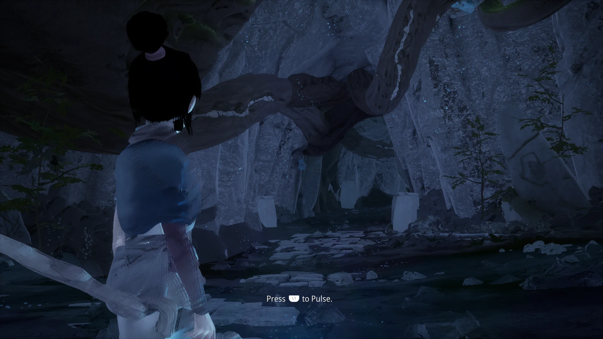

# Kena: Bridge of Spirits (`PPSA01802`) — status

Unreal Engine 4 (Ember Lab), one 28.5 GB `kena-ps5.pak` (no IoStore), Wwise, SDK `0x03000000`. Tracker
[#3787](https://github.com/mattias800/prosper/issues/3787). Brought up on Windows 11 / RTX 4090;
Linux/AMD title-menu investigations are recorded below.

## The point-light shadow cubes are drawn: one replay per depth slice (2026-10-09, #3135)

Measured on Linux/RADV:
- `prosper-app` in a visible window, `PROSPER_NULL_PAGE=1`;
- `scripts/kena/linux-reach-pulse.pad`, 640-900 s per run.

**What changed.** The culling VS draws from the entry below are depth-only into a 6-slice depth array. They are now admitted. Each draw is replayed once per slice of `DB_DEPTH_VIEW`:
- replay k draws only the primitives whose layer is k;
- it is drawn into the backend's single-layer image of guest slice `SLICE_START + k`, which is exactly the shape a face-by-face cube render already takes;
- the layer is selected at draw time (`gl_InstanceIndex`, through each run's `firstInstance`), so all six replays share one module and one pipeline.

Two neighbouring shapes are refused by name, `ngg-layer-attachments-mixed`: a one-slice colour target beside a depth array, and a layered colour volume beside any bound depth/stencil. Neither shape occurs on this route.

**Dropped draws, same-binary A/B.** The control arm is the same tree with the replay refused.

| run | arm | `ngg-layer-target-not-single-slice` | vertex draws dropped (fired alarm windows) | NGG draws dropped in the backend |
|---|---|---|---|---|
| ctl1 | control | refused (128 shape lines) | 65,682 | 0 |
| ld4 | replay | none | 29,976 | 0 |
| ld7 | replay | none | 18,846 | 0 |

What remains is `ngg-abi-read-v4` (#4746).

**Picture.**
- After the first pulse, the replay and control frames match apart from animation. The mean luminance is 32.5 against 32.3, and the difference image is Kena's outline only.
- This view does not show these lights' shadows distinctly.
- There is no PS5 oracle of this scene, so whether the shadows are now right is **not established**.

**Two first versions failed. Both are recorded because each looked plausible.**
1. The first version compiled one vertex variant per slice. It thrashed the pipeline cache: 6.6k evictions in a run. The route never left the level load in 820 s.
2. The expansion was first placed at the two direct `g_live(...)` calls. The ordered executor is handed `g_live` as a function object, so most submits bypassed it, and only slice 0 was ever written (`[cube-depth] ... slices ever VALID=0x01`). The expansion now wraps the renderer once, at registration.

**Not caused by this work: #4775.** Some runs show a black world at the first Pulse prompt until the first L1 press. The world is black apart from Kena, whose outline is stair-stepped. The same blocky black mask appears over parts of the opening cutscene. The control arm shows both, so neither comes from the replay.

**Cost, still open.** Every replay re-runs the shell dispatch, so a cube costs six shell dispatches and six pass segments. A shell dispatched once and drawn six times is the next step.

## Exposure is the guest's own; the cave's excess light is ambient (2026-10-08)

**Read this first.** Measured on Linux/RADV with `prosper-app` in a visible window and
`PROSPER_NULL_PAGE=1`, using two routes:
- the title route, `scripts/kena/linux-reach-level-load.pad`, snap at pad flip 420;
- the cave route, `scripts/kena/linux-reach-pulse.pad`, snaps from flip 1700, after the Pulse.
  That route is not on `main` yet; it is commit `cc3c6552a` on `gpu/kena-post-load-refusals`.

| frame | mean luminance | PS5 oracle |
|---|---|---|
| title menu, `main` | 67.5 | 44.4 (title screenshot, [#3781](https://github.com/mattias800/prosper/issues/3781#issuecomment-5785053219)) |
| title menu, this PR | 66.6 (mean abs diff 3.7, from animated leaves) | 44.4 |
| cave after the Pulse, `main` | 32.4 | 3.5 (the owner's after-L1 screenshot, [#3781](https://github.com/mattias800/prosper/issues/3781#issuecomment-6059040004)) |
| cave after the Pulse, this PR | 32.1 (mean abs diff 1.3) | 3.5 |
| cave, `main`, both ambient passes skipped (diagnostic) | 5.5 | 3.5 |

The `main` and PR runs are not on the same base: `7a4636d7d` against `39d2e600f`.

- **Exposure is settled, and it is not the defect.** `PROSPER_TEXLOG` on the title route gives the
  eye-adaptation draw (`0x5009a20000`) one T#: a guest 1×1 `IMG_FMT 56` (8_8_8_8_UNORM) at
  `0x500f0c0000`, raw dword1 `0x03800000`. The 1×1 targets it ping-pongs (`0x509afe0000`,
  `0x505cb70000`) are `IMG_FMT 77` (32_32_32_32_FLOAT). prosper's two formats are the guest's own.
  - The program loops over 64 histogram buckets, using `image_load` at `x = i/4`, and reads the
    previous exposure at (0, 1).
  - Every one of those loads hits the 1×1 dummy, so the result is a function of constants. It is
    2.0 on the title menu and 1.189 (2^0.25) in the cave. The cave is the darker exposure, and it
    is still about 9× too bright.
  - Reading the dummy as UE4's histogram eye adaptation with the histogram turned off (fixed exposure)
    is `CONFIDENCE: MED`. The T# formats are measured.
- **The cave's excess is ambient light.** Mean scene luminance of a RenderDoc capture, per stage,
  inside the 2240×1260 view:

  | stage | mean luminance |
  |---|---|
  | base pass (no static lighting: GBufferC.a = 237 is material AO) | 0.0001 |
  | ambient-cubemap pass `0x5009a60000` | +0.0089 |
  | deferred lights | +0.006 |
  | reflection and sky pass `0x5008750000` | +0.022 |

  On the walls, essentially all the light is the two ambient passes. Skipping both programs
  (`PROSPER_SKIP_DRAW_PROGRAM`, a diagnostic) takes the frame to 5.5 against the oracle's 3.5: dark
  walls and blue markers, as on PS5. But Kena becomes a silhouette, so PS5's ambient there is small
  rather than zero.
- **Sky occlusion is missing.** In a fully dynamic UE4 scene, distance-field AO occludes the sky. Its
  bent normals are length 0.003 at every pixel (#4766).
- **Fix: a MUBUF format store writes only its V# format's components.** The clamp applied to MTBUF
  only. So `buffer_store_format_xyzw` through a one-component 32-bit V# wrote four dwords per lane, and
  each lane overwrote its three neighbours.
  - UE4's typed-buffer clear is such a store. On `main`, Kena's AO cone buffer kept the clear value
    in 1% of its elements, all at multiples of 64. With the fix it is written everywhere.
  - The cone trace that follows still changes almost nothing, so the picture did not move (#4766).
- **Found on the way, filed, not fixed.**
  - A cube **array** samples face 5 of its first cube (#4767). Kena's reflection captures are a
    four-cube BC7 array.
  - The sky light's GPU-written RGBA16F cube is decoded from guest memory and reads as noise (#4768).
- **Kena's hair is unlit, not mis-shaded so far.** Hair pixels are shading model 7 (GBufferB.a
  `0xA7`). The head's median HDR is 0.0007. Both ambient passes give hair about 20× less than lit
  rock. At a sampled head pixel, every light draw covering it fails its depth or depth-bounds test,
  because those lights are elsewhere. So the hair branch of the deferred light was not reached at
  that pixel. The next probe is a light whose bounds contain Kena's depth (0.032).
- **Route timing.** The cave route is seconds-anchored, and its flip rate varies by run. One fix run
  sat at the Pulse prompt at flip 1700. Check the frame before quoting a cave number. A RenderDoc
  capture run with the fix was perturbed by owner input at 19:05Z, so it is used only for the
  buffer-level DFAO measurements above.
- **Rung.** Unchanged; the picture did not move.

## Past the load: the dropped vertex draws are point-light shadow passes (2026-10-08, #3135 P7)

Measured on Linux/RADV:
- `prosper-app` in a visible window, `PROSPER_NULL_PAGE=1`, empty `PROSPER_GUEST_ARGS`;
- `scripts/kena/linux-reach-pulse.pad`, about 900 s, past the Pulse prompt.

**Which refusals cost the draws.** A per-program view of the dropped-draw census (`PROSPER_DROPPED_DRAW_CENSUS=1`, `[dropped-draw-program]`) counted about 155k dropped vertex draws in one run:

| refusal | dropped draws |
|---|---|
| ten NGG VS-only culling programs, `mbcnt-cross-lane` | ~86k (55%) |
| `11562c72` (merged), `ngg-abi-read-v4` | ~42k (27%) |
| `52c7e8ff` (merged), `ngg-layer-target-not-layered` | ~1.1k |
| pixel `b8e8f38e`, image descriptor | ~0.9k |

**What the VS-only programs are.**
- They are NGG primitive shaders with no GS (`VGT_SHADER_STAGES_EN` 0x2000). They read the merged launch layout: s3 counts, v0/v1 vertex offsets scaled by ITEMSIZE 4, v5 VertexID and v8 InstanceID.
- They cull and compact primitives with a wave-wide DPP OR ladder, `v_permlanex16` and `v_mbcnt`.
- Every one of their draws is **depth-only** (`CB_TARGET_MASK` 0) into a **6-slice depth array** (`DB_DEPTH_VIEW` slices 0..5), with the layer exported in POS1.z. These are cube shadow maps.

**What changed (#3135 P7).** VS-only NGG draws now reach the subgroup shell:
- output topology from the input (`VGT_GS_OUT_PRIM_TYPE` is 0 on them);
- a VS-only partition;
- the program run alone, without a fetch prolog;
- the bounded DPP OR ladder in the shell's dispatcher.

Four of them (`8642d737`, `db6b0a64`, `399ec700`, `ffbabd0c`) pass the ABI analysis and compile.

They are **not drawn yet**. A layered draw is admitted only when every bound attachment is proven to be one slice, and a 6-slice depth array is not. So they are refused by name, `ngg-layer-target-not-single-slice`. An earlier revision admitted them on colour target 0's proof alone, and the raster commit then culled every primitive outside slice 0 (`layer-culled` in the `[ngg-backend]` lines). That was shadow geometry lost silently, so it was withdrawn.

**What the frame shows.** Nothing changes yet: no new draw is admitted on this route. While the earlier revision admitted the draws, about half of them were also dropped at the backend (`ngg-backend-readback-split`, about 52k), because they share multi-target passes.

**Next.**
- Render NGG draws into a layered depth array, so the layer lands in its slice.
- Let a multi-target pass split around an NGG draw on the GPU.
- The `read-v4` lane-subset proof: #4746, about 59k draws.

**The black cutscene face** seen in one run is not this work. It goes with the intermittent descriptor refusal of compute `de7035c2` (#4700), which also produced blue vertical streaks in another run. The face renders correctly at this branch's head:
- confirmed by the owner, watching the run live;
- snapshots in the PR.

**The level load sometimes sits idle for minutes** before it resumes. Every guest thread is blocked; the game thread is in an untimed `sceKernelWaitEventFlag`. See #4745.

## Depth of field works: two general fixes; exposure still open (2026-10-08)

**Read this first.** Measured on Linux/RADV with `prosper-app` in a visible window,
`PROSPER_NULL_PAGE=1`, an empty `PROSPER_GUEST_ARGS`, `scripts/kena/linux-reach-level-load.pad`,
snapshots at pad flip 420 and RenderDoc captures at pad flip 430. `main` is `6089081de`.

| frame at pad flip 420 | mean luminance | foreground gradient | near-black pixels | mean \|L − oracle\| |
|---|---|---|---|---|
| `main` | 65.6 | 5.77 | 0.01% | 26.3 |
| fix 2 alone (narrow FP16) | 64.5 | 5.60 | 1.38% | 25.9 |
| both fixes (PR head) | 66.7 | 3.34 | 0.01% | 26.6 |
| PS5 oracle (#3781, 1.04) | 44.4 | 2.49 | 4.61% | — |

The foreground gradient is the mean horizontal luminance step in the lower quarter left of the
version text, so lower means blurrier. The oracle's camera and version differ, so the last column is
indicative only.

- **The DOF chain ran and produced nothing.** UE4's Diaphragm DOF is all compute. Its setup pass
  writes a valid signed circle of confusion (−13.1 to 2.6). But all four gather passes wrote exactly
  zero, so the recombine left the scene unchanged (mean |ΔL| 0.00037).
- **Fix 1: the descriptor fold lost a branch-exclusive restore.**
  - The gather (`0x500a7f0000`) opens by loading its OUTPUT T# into `s[0:7]` on a skip arm that
    stores zeros and exits with `s_branch`. Its gather block is entered only from the earlier
    branch, opens with `v_cvt`, and samples its INPUT T#, which is still in `s[0:7]` from user data.
  - The fold restores the branch's state at such a target (#2132). It required a retained
    instruction AT the target, but the compacted fold stream drops the VALU. So the skip arm's load
    stood, and all 162 samples were bound to the gather's own output.
  - The fold now accepts a gap of compacted instructions when exactly one edge, a forward one,
    enters [gap, target] (`fold_control_plan.hpp`). It declines for the whole program when it
    holds branches it cannot count: debug branches, subvector loops, or a branch into code past
    the first `s_endpgm` that is not proven closed. The gather then samples the reduce pyramid
    (`0x509dac0000`, 1600×904).
  - The same fix removed the 16 `[t8-dropped] ... reason=words-unknown` T#s of the TAA draw
    `0x500a480000` (16 → 0 in a run).
- **Fix 2: narrow FP16 was sampled as RGBA8.**
  - Live compute converted guest-backed 2D FP16 textures to RGBA8 UNORM, which clamps to [0, 1].
    The DOF tiles keep the foreground CoC, which is negative, in RG16F. Converted, every tile read
    "no blur" and every gather took its skip arm.
  - One- and two-channel FP16 now samples natively (`shared/compute/sampled_float16_view.hpp`).
    Guest-backed RGBA16F keeps the conversion, which avoids the 7× native cost measured on
    Astro Bot but still clamps HDR or signed RGBA16F data (#4738).
  - Alone, this fix ran the gathers against the wrong input and left black tile holes (1.38% of
    pixels). With fix 1 the holes are gone and the foreground and the cat statues blur as on PS5.
- **Exposure: open, and it matters (the frame is 66.7 against the oracle's 44.4).**
  - The eye-adaptation draw (`0x5009a20000`) does 18 `ImageFetch`es, all from one 1×1 image that
    reads (0, 0, 0, 0). RenderDoc lists that image (capture-local id 141) as a `2D Color
    Attachment` created at startup, also bound by draw `0x5007cd0000`, in **`R8G8B8A8_UNORM`**.
  - The eye-adaptation targets in the same frame are different images in a different format:
    the 1×1 the draw writes (22118) and the previous frame's (27865), which the DOF temporal
    pass, the DOF reduce, TAA and a 1×1 copy dispatch read, are **`R32G32B32A32_FLOAT`**.
  - So the format discriminator points at UE4's 8-bit `BlackDummy`, not at an eye-adaptation
    target. The written value stays (2, 2, 1, 2) on every arm.
  - Not settled, because prosper's renderer format for a colour target comes from its own
    mapping of the guest `CB_COLOR` format. That was not cross-checked against the guest register
    for 141; a float target folded to RGBA8 would look exactly like this.
  - Next step: log `CB_COLOR*_INFO` for the pass that clears 141, and the T# format the exposure
    draw fetches through (`PROSPER_TEXLOG` limited to that draw).
  - Settled later the same day; see the section above. The guest T# is itself a 1×1 8_8_8_8_UNORM.
- **The white flowers are not localised.**
  - The title route has no `[ngg-refused]` lines and no `dropped-draws` alarm.
  - A per-draw census of the first base pass found many draws that change no pixel of one MRT,
    including the fern draws, which visibly render later. That census has no positive control and
    proves nothing about flowers.
- **Rung.** Still 2.

## The level-load device loss was a loop counter the recompiler never carried (2026-10-08)

The Vulkan device loss at the first level load is fixed. Past it, the opening cutscene plays (pad flip 1450) and the route reaches the first gameplay prompt, *"Press … to Pulse"*, and **the world draws behind it**: Kena, the cave, its roots, ferns and stone path. It is degraded: Kena's hair is black and the scene is dim and blue.



That is a gameplay scene a person would recognise, degraded, which is the bar for rung 3. The tracker records the rung.

Measured on Linux/RADV:
- `prosper-app` in a visible window, `PROSPER_NULL_PAGE=1`, empty `PROSPER_GUEST_ARGS`;
- `scripts/kena/linux-reach-level-load.pad`, 820 s per run.

| build | runs | device lost |
|---|---|---|
| `main` before the fix | 3 that ran 640 s or longer | 3: two `VK_ERROR_DEVICE_LOST` (hard recovery), one `GPU hang detected` under `RADV_DEBUG=hang` |
| this branch (1 run on `6089081de`, 4 on `c87c98239`, the last after the review fixes) | 5 | 0; every run reached pad time 766 s |

**Where the GPU stopped.**
- The RADV hang dump's `vm_fault.log` is empty. The GPU hung; it did not fault on an address.
- `PROSPER_GPU_BREADCRUMBS=1` stopped in ordinary draws of pixel program `0x5007ad0000`.

**Why it hung.** That program's outer loop (pc 197..866) keeps its counter in a `v_writelane` spill slot:
- before the loop, `v_writelane v20, s69, 40` (the counter) and `v_writelane v20, s19, 16` (the count);
- at the header, `v_readlane s17, v20, 40`, then `s_cmp_lt_i32 s17, s16`;
- at the latch, reload, `s_add_u32 s16, s16, 1`, then `v_writelane v20, s16, 40`.

The structured loop emitters gave registers, SCC, VCC, EXEC and saved masks a header phi, but never the spill slots. So the header read the preheader counter on every trip. The recompiled exit test was `OpSLessThan 0, count`, which never exits.

**The fix** (`rdna2_lane_slot_carry`) applies to every title, not just Kena:
- loop headers get a phi per spill slot written in the loop;
- a loop exit takes the value the exit edge carried;
- if merges phi the slot.

The same omission also let a loop exit, or an if merge, use an SSA id that does not dominate the merge, and an if/else lost the then arm's slot writes.

On this branch the dumped module validates (`spirv-val`). Its exit test reads `OpPhi %uint %uint_0 <preheader> <latch>`.

**Unchanged elsewhere.**
- **Dragon Quest VII** (`reach-title-screen.pad`, one run per arm): frames at pad flips 1000, 1500 and 2000 are pixel-identical between `main` and the branch.
- **Kena's title route:** flips 500 and 650 land on different screens in the two arms, because the time-based route ran under another lane's build. They compare nothing.

**What the level shows next.** Over one 820 s run, the `dropped-draws` alarm counted 166,557 vertex draws and 480 fragment draws, almost all after the load. The run's refused-program index has 26 entries:
- by reject mode, 11 `unresolved-operand` and 10 `unsupported-in-stage reason=mbcnt-cross-lane`;
- three merged-NGG pairs stop at `ngg-abi-read-v4`, `ngg-abi-read-undefined-sgpr` and `ngg-layer-target-not-layered` (#3135).

Which of these the dropped vertex draws belong to is not counted per program.

## The indexed producer for `f1d1baa8` is admitted; `11562c72` stops at a lane-subset proof (2026-10-08, #3135)

Measured on Linux/RADV:
- `prosper-app` in a visible window, `PROSPER_NULL_PAGE=1`, empty `PROSPER_GUEST_ARGS`;
- `scripts/kena/linux-reach-level-load.pad`, 660 s per run.

Before is `main` `0fe02a520`, which includes P6; after is the `gpu/ngg-downstream` branch. All runs reached the level-load device loss at about 301 s of pad time, and counts stop there.

| program pair | `main` | after |
|---|---|---|
| `b77161c6` + `0ff40cdf` (18 idx × 41, pixel `f1d1baa8`) | `ngg-compile-rejected`, prolog pc 55 | **admitted**: `[ngg-indexed] ... instances=41 subgroups=41`, recorded by the backend |
| `11562c72` + `2fc43332` (6 idx, 64 slices) | `ngg-abi-read-s0-s1` pc 154 | `ngg-abi-read-v4` pc 810 |

Merged-NGG programs refused before the loss: 2 on `main`, 1 after.

**What each fix was.**
- **pc 55** is `s_load_dwordx4 s[8:11], s[16:17], vcc_lo`. VCC_LO is `(s38 << 4) & 0x1f0`, and s38 comes from `s_load_dword s38, s[18:19], 0x4`.
  - The memory-fed register-offset machinery (#3979, #4578) already covers this shape. But it admitted only an immediate-ZERO source, in three places: the proof, the fold and the emitter.
  - The fold already observes the bytes at the effective address. The emitter now reads the source snapshot from index zero.
  - Aligned non-negative immediates are now admitted.
- **s0:s1** at merged ES+GS entry is the GS user-data address (`SPI_SHADER_USER_DATA_ADDR_LO/HI_GS`).
  - `2fc43332` reloads its user SGPRs with `s_load_dwordx8 s[8:15], s[0:1], 0`.
  - The linked fold now seeds s0:s1 the way the fused-GS fold does.
  - Live admission pushes the address after the user SGPRs.
- **Nested EXEC saves.** After s0:s1, `11562c72` refused `ngg-abi-read-v6-v7` at pc 548.
  - Its main saves the loop EXEC in s[4:5] and the inner EXEC in s[6:7].
  - The ABI analysis tracked a single saved pair, so the inner save evicted the outer one.
  - It now keeps four.

**What `11562c72` needs next (not done).** At pc 810 it stores v4, which a `ds_read_b128 v[4:7]` at main pc 588 wrote under the EXEC `s[0:1] = (tid < 240)`. The store runs under an EXEC narrowed by `v_cmpx` to `tid < 220`.
- Proving the read lanes are a subset of the written lanes needs a lane-predicate model: thresholds on the same thread-id VGPR, v51. The MUST analysis does not have one.
- Pruning `s_cbranch_execz` under a full EXEC was tried and does not reach it, because EXEC is not full there. The commit was dropped.

**Is `f1d1baa8`'s draw visible?** Not yet observable:
- The admitted draw is recorded about 1 s before the device loss.
- A `PROSPER_GPU_BREADCRUMBS=1` run stopped the GPU inside ordinary draws of pixel program `0x5007ad0000` (submit 26138, draws 114-117), not in an NGG segment.
- The loss happens at the same pad time on `main`.

**`dropped-draws` before the loss:** `main` fired 1 window (fragment 3, #4700's intermittent refusal); the final branch run fired 0.

**Unchanged elsewhere.**
- **Title route:** title-menu frames at pad flips 500 and 650 differ main vs branch by mean |diff| 3.8 and 3.5, against 3.2 and 3.1 between two branch runs (animated foliage).
- **Dragon Quest VII:** see the PR.

**After the loss (not counted).**
- `4324d9f3` (USER_SGPR 12, user-data range 0..24, 23-27 instances) is no longer refused `ngg-user-sgpr-count`. RSRC2's count is now what admission uses, and the program stops at `ngg-abi-read-undefined-sgpr`.
- `52c7e8ff` stays `ngg-layer-target-not-layered`: it exports a layer (`PA_CL_VS_OUT_CNTL` 0x01240000) into a 2D colour target. What the hardware does with a layer on a non-array target is not established, so it is recorded on #3135, not modelled.

## The fog gets its shadows and the foliage draws: two general fixes (2026-10-08)

**Read this first.** Measured on Linux/RADV with `prosper-app` in a visible window,
`PROSPER_NULL_PAGE=1`, an empty `PROSPER_GUEST_ARGS`, `scripts/kena/linux-reach-level-load.pad`,
snapshots at pad flip 420 (`PROSPER_SNAP_AT_FLIPS`) and RenderDoc captures at pad flip 430. `main`
is `debe081ed`.

| frame at pad flip 420 | mean luminance | foreground p90 | foreground green-dominant | mean \|L − oracle\| |
|---|---|---|---|---|
| `main` | 102.2 | 160.0 | 42.7% | 61.6 |
| fix 1 (shadow depth reaches compute) | 76.1 | 153.7 | 43.5% | 38.1 |
| fixes 1 + 2 (and `POS_W_FLOAT`) | 67.3 | 128.7 | 58.6% | 27.8 |
| PS5 oracle (#3781, 1.04) | 44.4 | 86.5 | 81.0% | — |

The foreground band is the lower quarter, left of the version text. The oracle is version 1.04 at
a slightly different camera, so the per-pixel column is indicative only.

- **Fix 1: the haze was the volumetric fog, lit without shadows.**
  - The one draw that doubles the frame's brightness is UE4's height fog applying the volumetric-fog
    volume (program `0x5006ab0000`). It takes mean scene luminance from 0.116 to 0.237 on `main`,
    and the 5th percentile from 0.014 to 0.056. The translucent draws after it add nothing measurable.
  - That volume is integrated from a light-scattering volume (compute `0x5008e80000`, 140×79×64).
    On `main` the scattering had no shadow structure at all: a smooth phase-function gradient and
    one local light.
  - The scattering dispatch reads the CSM shadow atlas through a 6144×2048 **one-component
    UNORM16** T#, which is how GFX10 samples a Z16 depth plane. Live compute imported a
    renderer-owned depth image only for a Float32 or Uint32 view. So it read the guest bytes,
    which hold the clear: 1.0 at every texel. The renderer's D32 atlas holds the casters (cascade
    means 0.55, 0.76 and 0.9995). Every froxel therefore saw the sun.
  - Compute now imports the depth plane for a UNORM16 view as well. The rule for which
    one-component views read a retained depth plane is `frontends/shared/rtt/depth_plane_view.hpp`,
    which live compute calls. The renderer's importer serves a plane only when its guest width
    (from `DB_Z_INFO.FORMAT`) matches the view, so a UNORM16 view of a Z32 plane, or an R16
    texture at a recycled depth address, is never handed depth. In the fix capture the dispatch binds the D32
    atlas directly, and the scattering volume shows canopy shadows and lit gaps. The fog draw now
    adds 0.062 instead of 0.121. Light shafts appear.
- **Fix 2: the foliage drew, then discarded itself.**
  - The fern draws (program `0x5053500000`, 2–12 instances each) are submitted, rasterized and
    never refused. At pixel (1000, 778) each delivers 19–39 fragments, and RenderDoc reports every
    one `shaderDiscarded`. Across the whole frame, one draw changed 1 GBuffer pixel and another 35.
  - The pixel shader's test is `opacity × (fade + dither − 0.5) < 0.333`, with
    `fade = saturate((POS_W − 100) / 50)`. The constants at binding 39 are 100, 50 and 1. This is
    UE4's dithered near-camera fade, in centimetres of view depth.
  - GFX10 loads clip-space w into `POS_W_FLOAT`, and the guest uses the VGPR with no reciprocal.
    The recompiler handed it SPIR-V's `FragCoord.w`, which is 1/w (about 0.002 here), so the fade
    was 0 and almost every fragment failed.
  - `SpirvCompute::guest_pixel_position_component` now returns 1/`FragCoord.w` for W. Both the
    fragment shell and the raster-quad collector use it, since the collector's words seed guest
    VGPRs on the packet path. Ferns, grass, undergrowth and the tree canopy now draw.
- **Still wrong:**
  - The frame is still brighter than the oracle (67 against 44), and stones and the shrine are
    paler and less saturated.
  - The white foreground flowers are absent.
  - The 1×1 exposure target reads (2.0, 2.0, 1.0, 2.0) on every arm. Its draw (`0x5009a20000`)
    binds only the 1×1 placeholder texture in every slot, so this looks like a fixed exposure from
    constants rather than a failed luminance measurement. Not established.
- **Instruments.**
  - **XWayland window mapping hung** on this desktop: even `prosper-app --test-pattern` blocks in
    `X11_ShowWindow` under `SDL_VIDEODRIVER=x11`, so the frontend never reached its capture setup
    while the guest ran on.
  - **Under native Wayland the RenderDoc layer refuses the present instance**, with
    `VK_ERROR_EXTENSION_NOT_PRESENT`: this RenderDoc build has no Wayland WSI. A local,
    uncommitted patch cleared `ENABLE_VULKAN_RENDERDOC_CAPTURE` around the present instance's
    `vkCreateInstance` only. The guest renderer's device, which is the one captured, keeps the
    layer. That made the captures in this entry work in a visible Wayland window.
  - Capture analysis ran through RenderDoc 1.45's Python module in the container with
    `/usr/bin/python3.12`. Pixel debugging declined these fragments, so the discard condition was
    read from the disassembled SPIR-V.
- **Rung.** Still 2: the title menu, not gameplay.

## Indexed merged-NGG draws are admitted; ABI and fold refusals come next (2026-10-08, #3135 P6)

Measured on Linux/RADV:
- `prosper-app` in a visible window, default launch with `PROSPER_NULL_PAGE=1` and an empty `PROSPER_GUEST_ARGS`;
- `PROSPER_DROPPED_DRAW_CENSUS=1`;
- the route `scripts/kena/linux-reach-level-load.pad`, 660 s per run.

Before is `main` `debe081ed`. After is the P6 branch at two commits:
- indexed admission alone;
- indexed admission plus the EXEC save/restore rule.

Counts stop at the Vulkan device loss at the first level load. That loss predates this work, and all three runs reached it at about 300 s of pad time.

| program pair (refused-index hashes) | shape | `main` | indexed admission | + EXEC restore |
|---|---|---|---|---|
| `11562c72` + `2fc43332` | 6 indices, 1 instance, 64 slices (three addresses) | `ngg-indexed` | `ngg-abi-read-s0-s1` pc 154 | `ngg-abi-read-s0-s1` pc 154 |
| `b77161c6` + `0ff40cdf` (pixel `f1d1baa8`) | 18 indices, 41 instances, 64 slices | `ngg-indexed` | `ngg-abi-read-v6-v7` pc 121 | `ngg-compile-rejected`, prolog pc 55 |

- **No `ngg-indexed` refusal remains.** Before: 2 programs (4 draw shapes). After: 0. Both programs now pass index fetch, planning and admission, and are refused further on:
  - **`11562c72` reads s0** at linked pc 154. s0 is the user-data address (`SPI_SHADER_USER_DATA_ADDR_LO_GS`). The shell supplies it only when the caller knows it, and live admission never does.
  - **`b77161c6`'s v7 read at pc 121 was a false positive** of the ABI analysis, fixed in the same PR:
    - v7 is written at pc 8 under the ES EXEC;
    - EXEC is saved with `s_mov_b64 s[36:37], exec` at pc 20 and restored with `s_mov_b64 exec, s[36:37]` at pc 104;
    - the `ds_write_b32` at pc 121 reads v7 only on the lanes that wrote it.

    The program then reaches its compile and is refused at prolog pc 55, `s_load_dwordx4 s[8:11], s[16:17], vcc_lo`. That is a descriptor load at a register offset read from a constant-buffer word at pc 5, and the linked fold leaves it unresolved (`unresolved-operand`). **So `f1d1baa8`'s draw still does not render.**
- **After the device loss** (not counted, and not comparable between arms), two more indexed programs show up:
  - `52c7e8ff` is refused `ngg-layer-target-not-layered`: it reads the layer but draws into a 2D target;
  - `4324d9f3` (26–27 instances) is refused `ngg-user-sgpr-count`.
- **`dropped-draws` before the loss:** 4 windows on `main`, all `shader-recompile/fragment` (197). They come from `ps 0x504b9b0000`, which is #4700's intermittent refusal. The two branch runs had 1 window and 0.
- **The title route is unchanged.**
  - No merged-NGG refusal occurs before New Game on any arm.
  - Title-menu frames at pad flip 500 differ by mean |diff| 5.6 and 3.9 between `main` and the two branch runs, and by 5.5 between the two branch runs themselves (animated foliage and light).
- **Cross-title check: Dragon Quest VII**, `scripts/dragon-quest-vii/reach-title-screen.pad`, 150 s, two arms of each binary.
  - The adventure-log frames at pad flips 1000, 1500, 2000 and 2500 are byte-identical between `main` and the branch.
  - The title frame at flip 600 differs by mean |diff| 3.8 between `main` and the branch, and by 3.9 between two branch runs (the animated sea).
  - A first, cold `main` run reached the title later and is excluded from the comparison. Its frames are a different screen, not a different picture.

## The sun lights the title-menu scene again (2026-10-07, #4703)

**Read this first.** Measured on Linux/RADV with `prosper-app` in a visible window,
`PROSPER_NULL_PAGE=1`, an empty `PROSPER_GUEST_ARGS`, `scripts/kena/linux-reach-level-load.pad`,
F9 frame at 222 s and a RenderDoc capture at pad flip 430. Main is `01911ba7f`; the fix is the
#4703 branch on the same base.

- **What #4703 was.** UE4's stencil-to-lighting-channel copy writes an R16_UINT target through a
  compressed `UINT16_ABGR` export (`SPI_SHADER_COL_FORMAT=0x7`). prosper decoded every compressed
  export as two f16 halves, declared every output float, and folded R16_UINT into RGBA8 UNORM, so
  channel value 1 became 5.96e-8 and was stored as 0. The deferred directional light ANDs its
  channel mask with that texture and discards every lane whose result is 0. The recompiler now
  decodes each compressed format as `SPI_SHADER_COL_FORMAT` says and declares uvec4/ivec4 outputs
  for integer targets, and the backend keeps every integer colour format as an integer attachment.
- **The mechanism, measured in the RenderDoc captures:**

  | | `main` | #4703 |
  |---|---|---|
  | lighting-channel target (writer eid 6330/6331) | RGBA8 UNORM, 100% of 71,200 view samples are 0 | R16_UINT, 99.5% are 1 and 0.5% are 3, none 0 |
  | the light draw that reads it (eid 8406/8407), sunlit pixel (1050, 1160) | `PASS shaderOut [0, 0, 0]` | `PASS shaderOut [0.241, 0.367, 0.061]` |

- **What the frame shows.** A sunlit patch of grass and leaf shadows now draw on the ground in
  front of the shrine, which was black on `main`. Over the foreground band (the lower quarter, left
  of the version text), the 90th-percentile luminance rises from 74.6 to 161.7 and green-dominant
  pixels from 0.0% to 18.4%; the PS5 oracle has 94.4 and 71.1%. The whole frame got brighter, from
  mean luminance 92.1 to 99.7, while the oracle's is 44.4. So the exposure is still far off, and the
  ferns, flowers, light shafts and darker grade are still missing. What this changes is that the
  sun contributes at all.
- **Rung.** Still 2.

## The sun adds nothing: the lighting-channel texture is all zero (2026-10-07, #4703)

**Read this first.** Measured on Linux/RADV with `prosper-app` in a visible window, `PROSPER_NULL_PAGE=1`,
`scripts/kena/linux-reach-level-load.pad`, at the title menu. The builds were `main` `156714914` and the
depth-bounds branch below. The instruments were RenderDoc captures of three guest frames
(`PROSPER_RENDERDOC_AT_PAD_FLIP=430`, `PROSPER_GPU_LABELS=1`) and two short register probes that were
never committed. The F9 bundle still aborts on this title (#3807: binding 32, address
`0xf00000000000`, declared `0xffffffff`), so there is no `.prgbundle` to replay.

- **The directional light contributes exactly 0.** The deferred sun pass (program `0x500aed0000`)
  adds 0.0000 luminance to the scene colour in the regions its own shadow mask calls lit, shadowed
  and partial (12,742 / 60,371 / 5,427 samples). RenderDoc pixel history at a sunlit path pixel
  shows the draw passing with `shaderOut [0,0,0,0]` in all three frames. The lit scene is ambient
  light only, which is why the world looks flat and grey next to the oracle (#3781).
- **Why: the lighting-channel test fails at every pixel.** At pc 43–47 the light ANDs its
  lighting-channel mask with an `image_load` of UE4's lighting-channel texture, then kills every lane
  whose result is 0. That texture is 0 at 100% of view pixels.
  - Its writer (program `0x5008fa0000`, the stencil-to-lighting-channels copy) renders an
    `R16_UINT` target (`CB_COLOR0_INFO=0x00050408`) through a UINT16_ABGR compressed export
    (`SPI_SHADER_COL_FORMAT=0x7`).
  - prosper unpacks every compressed export as FP16 and has no `R16_UINT` colour target, so the
    value 1 is stored as FP16 bits `0x0001` = 6e-8 in an `R8G8B8A8_UNORM` image, which rounds to 0.
  - This is a general gap, filed as **#4703** with the evidence and a suggested fix.
- **The shadow-cascade projections covered every pixel (fixed by #4704).** UE4 restricts each
  CSM cascade's projection to its depth slice with the depth-bounds test
  (`DB_DEPTH_CONTROL=0x8`, bounds [0.0005, 0.0016], [0.0015, 0.0065] and [0.0059, 1.0]). The local
  light volumes use it too (`0x6a`), and so does a near/far pair split at depth 0.00125.
  - prosper never decoded `DEPTH_BOUNDS_ENABLE`, and bound no depth attachment for a draw that only
    bounds-tests. Each cascade therefore wrote the whole mask, and the last one drawn won.
  - With the test implemented, the three cascades partition the screen in the capture.
  - The test is applied only against depth the guest produced: a retained plane that was valid when
    the pass began, or one an earlier draw of the same pass wrote. A bounds-only draw with no depth
    surface, or with a plane nothing has written, runs untested (logged once). It never marks the
    plane valid. Comparing against prosper's cleared 1.0 would delete reverse-Z slices (#4704 review).
  - The title frame changes in 0.12% of pixels: the sun the mask feeds still adds 0 (above).
- **Not yet localised:** the light shafts, the foliage and the grade.
  - The shafts plausibly need the sun. Auto-exposure brightening a sunless scene would also wash it
    out. Neither link is measured.
  - The GBuffer has no grass or fern geometry, and the ground under it is the landscape's dark
    albedo. The grass pass has not been found.
- **Instrument note.** The RenderDoc run (and only it) refused three fragment programs
  (`0x505b7f0000`, `0x5040eb0000`, `0x5040890000`: `shader-recompile/fragment:12046` dropped draws).
  The default run on the same binary refused none in 46 windows. The RenderDoc frame's final image
  matches the default run's F9 screenshot, so the measurements above stand. The cause of the
  difference is unknown.

## Past New Game: two refusals fixed; the rest are image descriptors, indexed NGG and one fragment mask (2026-10-07, #4706)

Measured on Linux/RADV with `prosper-app` in a visible window, default launch
(`PROSPER_NULL_PAGE=1`, `scripts/kena/linux-reach-level-load.pad`), 660 s per arm. Before is `main`
`74e97be0` plus the `reject=` index field below; after is the #4706 branch. Both arms lose the
Vulkan device at the first level load (compute program `0x500a380000`, the loss this route already
records), so the counts below are the programs refused **before** that loss. Program addresses are
run-local; hashes are stable. The "#4706" arm also carried the fragment scalar-pair projection.
That projection has since been split out of #4706 (see below), so without it the pixel
count is 7, not 6: `f1d1baa8` refuses again.

| | `main` | #4706 |
|---|---|---|
| refused pixel programs | 8 | 6 |
| refused compute programs | 7 | 6 |
| refused vertex draws (merged NGG) | 2 | 2 |

- **The `v_writelane_b32` in `index.txt` was the census, not the refusal.** `first_bad_op=0x361` is
  the compute-safe coverage pass. The fragment translator already handles both programs'
  constant-lane spills. `index.txt` and the `[refused-shader]` line now carry the translator's own
  `reject="..."`, so a default run says why without `PROSPER_DBG`.
- **Fixed in #4706, all general:**
  - pixel `e8a1ce3b` (2009 dwords): `v_ldexp_f32 v12, v12, -2 clamp` at pc1951. CLAMP on
    `v_ldexp_f32` is now the ordinary float saturate.
  - compute `0x5008dc0000` (1504): s14 still carried the entry-M0 token from `s_mov_b32 s14, m0` at
    pc85 when pc491 read it as a loop counter. The dispatcher's token now dies where the Wave64 MUST
    analysis proves a data write on every path. The program now refuses later, at pc577, on an
    image descriptor (next bullet).
- **Not fixed in #4706: pixel `f1d1baa8` (1361).** It refuses at pc308,
  `s_and_b64 s[30:31], s[30:31], s[36:37]`:
  - s[30:31] is a compare mask written at pc226, spilled with `v_writelane` at pc252/262 and
    reloaded with `v_readlane` at pc295/297. The `s_buffer_load_dwordx2` into s[30:31] at pc219 is
    overwritten by those reloads.
  - s[36:37] is a fresh compare mask.
  - The fragment stage refuses to project a scalar data pair onto the lane bit. That stays the case
    until the projection can prove the pair is definitely assigned (`RECOMPILER_REMAINING.md`,
    #2790's row). #4711's review found four routes by which a fabricated zero still reached the
    projection, so it moved to its own PR.
  - `eb07b9cf` (1471) has the same instruction shape at pc326; its operands were not traced.
- **What remains before the device loss:**
  - six pixel and six compute programs refused at an image instruction whose descriptor the fold
    cannot resolve (`pc_res=null`). The set is the same on both arms and in 3 of 3 runs. #4710.
  - two indexed merged-NGG draws (`refusal=ngg-indexed`): 6 or 18 16-bit indices, up to 41
    instances, into 64-slice volumes. This is #3135 P6, recorded there and not started. With the
    fragment projection, the `b77161c6` draw reaches this refusal; without it, its pixel program
    `f1d1baa8` is refused first.
- **After the device loss** compute is off for the process. About ten NGG VS-only programs are
  refused on `mbcnt-cross-lane` (#4427's class), alongside more image-descriptor refusals. Neither
  arm's post-loss counts are comparable.
- `[perf-alarm] summary` over each whole run, so including the post-loss part: `dropped-draws`
  `shader-recompile/fragment` 22,952 → 872, `shader-recompile/vertex` 50,544 → 18,615.
  `skipped-dispatches` `shader-recompile` 411 → 184. The arms reached the device loss at different
  times, so read these as direction, not size. The after arm also carried the split-out fragment
  projection.
- **No picture change is claimed.** The route does not reach gameplay on either arm. Frames at host
  frame 1100 land on different scenes (the brightness screen on #4706, the loading screen on
  `main`), so they compare nothing.
## Three refused pixel programs in one run: descriptor words, not opcodes, and intermittent (2026-10-07, #4700)

One run on `main` `156714914` refused three pixel programs from t=16 s: `prosper-app` inside the
`ps5ys` container, RenderDoc layer active, capture scheduled at pad flip 430,
`scripts/kena/linux-reach-level-load.pad`. `dropped-draws` fired in 30 of 35 windows, all
`shader-recompile/fragment` (12,046 draws). Five other runs did not reproduce it.

| run (all `linux-reach-level-load.pad`) | the three refusals |
|---|---|
| visuals lane, container, RenderDoc layer + capture | **yes** |
| visuals lane, container, default | no |
| this lane, container, RenderDoc layer + capture, 240 s (×2) | no, 0 `dropped-draws` windows |
| this lane, container, default, 473 s span (past New Game) | no |

- **Not an opcode gap.** `index.txt`'s `first_bad_fmt=4 op=0x8/0x7` is the compute-safe generic
  census: SOPP `s_cbranch_execz` / `s_cbranch_vccnz`, which the fragment structurizer lowers. Each
  program refused at an `image_sample_b` with `[mimg-unresolved] ... pc_res=null sgpr_res=cbuf`.
  The T# slots are AGC `ro[]` entries declared `size=0`. In that run the V# shape test claimed them
  as buffers; on default runs it does not.
- **The words changed, and V#-shaped words are not a T#.** The V# claim reads only the slot's
  first four words, so its firing in that run and not on default runs shows the words themselves
  were different. V#-shaped words decode to T# TYPE 0, which the texture checks refuse. Leading
  hypothesis: another stage's V#s (#305's shape). #4592 recorded this program's `s[8:15]` ending in
  `0004dfac`, the V# `dword3` constant RESOURCE_BINDING.md names. Not established: that the fold's
  own publication failed on the words rather than on provenance or its early return.
- **What landed:** the `[t8-dropped]` line prints the eight words and the failed gate, once per
  (program, pc, reason), for every image-use decline in the fold's T# admission and every skip in
  its texture publication. It does not cover the fold's whole-program early return (checked source
  no longer current). It was silent in the runs above with the first version of this build. The next
  reproduction keeps the evidence.
- **Whether the RenderDoc layer matters is undecided.** 1 of 3 layer runs reproduced (the visuals
  lane's, on `156714914`) against 0 of 2 default runs; this lane's two layer runs were on a
  different binary. It has only ever appeared with the layer active.
- **What these programs draw** is not established. They account for ~12–57 draws per flip from t=16 s,
  with NGG vertex programs `0x50409e0000` / `0x5040860000`, and sample one or two textures.
- **Title menu unchanged.** An F9 screenshot at 222 s on the default run matches
  `assets/screenshots/kena-title-menu-world.webp` apart from the falling leaf.
- **Separate, after New Game** (default 473 s run): `ps 0x5052b20000` and `0x5008cc0000` (first
  unsupported VOP3 `0x361`, `v_writelane_b32`), one compute program and two NGG vertex programs
  (`refusal=ngg-indexed`) are refused, 38 fragment draws in 3 of 61 windows. Investigated by #4706
  (entry above).

## No refused fragment programs remain (2026-10-07, #4680)

Measured on Linux/RADV with `prosper-app` in a visible window, `PROSPER_NULL_PAGE=1`,
`PROSPER_DBG=1`, `PROSPER_DROPPED_DRAW_CENSUS=1`, `scripts/kena/linux-reach-level-load.pad`, 260 s.
Before is `main` `a6453028c`; after is the #4680 branch.

| | before | after |
|---|---|---|
| `dropped-draws` reasons | `volume-multi-target:7943`, `ngg-subgroup:3666`, `shader-recompile/fragment:717` | `volume-multi-target:6045`, `ngg-subgroup:2790` |
| `unsupported-wave64-shaders` alarm | 47 of 48 windows, `fragment/recompile:717` | did not fire |
| refused programs (`refused_shaders_*/index.txt`) | 2 fragment | none |

The `shader-recompile/fragment` count was **two unrelated causes**, not the one program
(`0x505c3d0000`) the entry below names. Program addresses are run-local.

- **AGC helper rectangles with an inherited pixel shader.** These were most of the count. Every
  draw had the helper's vertex program (`es=0x5007020000`). The helper binds no pixel shader, so it
  runs with whatever the previous draw left bound, and the refused program changed from run to run
  (295 dwords in one run, 182 in the next).
  - The stale pixel user data held `00000092 00fff000 05000000` at `s[24:27]`, which the fold
    cannot publish as a V#.
  - Kena's helpers have no depth/stencil effect (`DB_DEPTH_CONTROL=0x70`). Their colour is
    suppressed (#4610), so they were "no effect" anyway; the decision just came after the pixel
    shader compile.
  - The executor now decides it before any shader work. The census reports these draws as
    `no-effect(agc-helper)`.
- **A counted loop counting in VCC_HI** (140 dwords). It appears after New Game. Its header is
  `s_cmp_lt_i32 vcc_hi, s34`, so VCC_HI is the induction variable. The counted-loop emitter now
  closes VCC's mask phi with a placeholder when the mask is provably unread from the header. The
  program compiles live (5,442 words, wave64).
- **The title-menu picture does not change.** An F9 frame at 222 s matches
  `assets/screenshots/kena-title-menu-world.webp`, apart from the falling leaf. That is expected:
  the helper draws had no effect to lose, and the loop program draws after the menu. The
  foliage, light shafts and grading are still missing. The other two drop classes,
  volume-multi-target and ngg-subgroup, went to zero with #4643 (next entry) without restoring them.

## The translucency-lighting volumes draw; the fog and the foliage are not theirs (2026-10-07, #4643)

**Read this first.** Measured on Linux/RADV with `prosper-app` in a visible window, default launch
(`PROSPER_NULL_PAGE=1`, `scripts/kena/linux-reach-level-load.pad`, 260 s), branch
`fix/issue-4643-multitarget-volume` against `main` at `a6453028`.

- **What #4643 was.** Kena's translucency-lighting injection writes two 64³ RGBA16F volumes from one
  layered pass: one in MRT0, one in MRT1. The backend refused every volume pass with more than one
  colour target, so all of its draws were dropped. The merged-NGG producer in the same passes was
  dropped too (`ngg-backend-readback-split`), because a split of an MRT pass carried its slots by
  readback. The backend now attaches every slot's own volume through a 2D-array view of its slice
  range (`tests/fixtures/render_volume_slots.h`). A split of such a pass carries every slot by LOAD,
  with no readback.
- **Result.** Dropped draws over 260 s, from the `[perf-alarm] summary` breakdown:

  | | `main` | #4643 |
  |---|---|---|
  | `backend/volume-multi-target` | 9,984 | **0** |
  | `backend/ngg-subgroup` | 4,608 | **0** |
  | `shader-recompile/fragment` | 915 | 713 |

  The `PROSPER_DUMP_PERSISTENT=ms:215000` census lists six populated 64³ volumes
  (`0x50132f0000` … `0x50146f0000`, every texel non-zero, no non-finite value). `main` lists one,
  `0x5013ef0000`, whose bytes differ in 1,641,440 of 2,097,152 bytes between the two runs.
- **The picture barely changes.** F9 frames at 225 s differ in 0.7% of pixels by more than 30/765,
  around candle flames, lanterns and particles. Part of that is animation. The fog, the washed-out
  grading, the missing foliage and the missing light shafts are unchanged. So neither drop class was
  the cause of those defects (see `## Ruled out`). What remained in the drop census was the refused
  Wave64 fragment program, since removed by #4680 (entry above).
- **Cost.** The four-volume clear (`0x5007bc0000`) now publishes four claimed volumes per frame
  instead of one. Surface readbacks rise from 2 to 5 per flip, each a fenced CPU wait. #4652 already
  tracks avoiding that wait; this makes it four times as valuable on Kena.
- **Rung.** Still 2.

## The title-menu world renders on `main` (2026-10-07, #3835)

**Read this first.** Measured on Linux/RADV with `prosper-app` in a visible window, default launch
(`PROSPER_NULL_PAGE=1`, no input), `main` at `97917c5f`.

- **The shrine and forest draw behind the title menu.** An F9 screenshot at 235 s shows the Kena
  wordmark, the `New Game / Load Game / Options` menu and `Version 1.16` over the 3D scene, 95% of
  the frame non-black. A RenderDoc capture of three guest frames at 215 s shows the same scene in
  all three. In those three frames, no 1600×900 RGBA16F target holds a NaN or Inf, and no draw
  reads a fragment input that its vertex program does not write (every draw from the scene pass to
  the scanout was checked). `tools/evidence/prerender_check.py` finds no dump asset that explains
  the frame.
- **The NaN half image came from AGC's helper rectangle.** #3835's 2026-10-06 chain was measured on
  `feat/ngg-live-p5` and `fix/issue-4625-compute-renderer-volume`. Neither branch contains #4610,
  which landed on `main` the same day.
  - The half target's writer was ES `0x3007060000`, a 112-byte vertex program that exports only
    the primitive and the position. That is Kena's compile of AGC's helper rectangle, whose words
    are `kKenaRect` in `tests/gpu/execute/test_efc_helper_program.cpp`.
  - The pixel shader on that draw is the one the previous draw left bound. It is
    `0x30096e0000`/`0x50096a0000`, a 132-dword program that reads five flat PARAM inputs and
    samples one 32×32 texture four times. Its own vertex program, `0x5009660000`, exports
    PARAM0–6.
  - That helper is a metadata operation (here AGC's "Decompress Htile") that writes no colour, so
    the inherited pixel shader's output must not reach the target. #4610 recognises the helper by
    its program family and draws it with no colour write. Live, it reports
    `helper rectangle recognised by family: vs=0x5007020000 … op=decompress-htile`.
- **The A/B.** Both arms used one scratch binary: `main` plus a local switch that skips only
  the helper's colour suppression. The switch was never committed. Each arm took one F9 frame at
  235 s:

  | arm | runs | F9 frame non-black |
  |---|---|---|
  | suppression on (`main`'s behaviour) | 2 (one on this binary, one on the `main` build) | 95.2%, 95.1%: world and menu |
  | suppression skipped | 2 | 0.0%, 0.0%: the whole frame is black, menu text included |

  With suppression skipped, a draw-program census shows the helper drawing with several inherited
  pixel shaders. Two of those draws target the scanout at `0xbfc0000000`.
- **What is still wrong.** Compared with the 1.04 oracle (#3781), the grass, ferns and flowers in
  the foreground are missing, so the ground is black. The light shafts are missing, and the scene
  is foggier and less saturated.
  - The run's `dropped-draws` alarm fires in 42 of 43 windows. Its reasons are
    `backend/volume-multi-target:7722` (#4643), `backend/ngg-subgroup:3564` and
    `shader-recompile/fragment:595`. The fragment count is one refused Wave64 program,
    `0x505c3d0000`. (Superseded by the entry above: it was two causes, and both are fixed.)
  - The volume passes are a likely cause of the fog and the missing light shafts, and the NGG
    subgroup drops of the missing foliage. Neither link has been checked per draw. **Superseded by
    the #4643 entry above: both drop classes are now zero and none of those defects moved.**
  - The refused fragment program was logged on a draw whose vertex program is the helper
    (`es=0x5007020000`), so some of those 595 uses may be helper draws that write nothing anyway.
- **The lit scene filling only the top-left two thirds of its target is not a defect.** The scene
  target is 3200×1800, and the complete view covers about 2133×1200 of it. The next pass writes a
  full-frame 3200×1800 image from it, and the final 3840×2160 frame is correct. This is UE4's
  screen-percentage rendering followed by an upscale.
- **Rung.** The title screen's 3D layer now renders, which is still rung 2. Gameplay was not
  reached on Linux.
  - `scripts/kena/reach-first-gameplay-prompt.pad` does not carry over. Linux polls the pad
    quickly during boot, so all seven of its pad-read anchors fire within the first 40 s, long
    before the menu appears at about 200 s.
  - The new `scripts/kena/linux-reach-level-load.pad` uses seconds anchors held for 1 s. It reaches
    "Choose Difficulty", seen on screen at pad flip 1000, and then the first level load.
  - **The level load then loses the Vulkan device, in 2 of 2 runs**, at about 500 s and 640 s.
    RADV reports `context is guilty of a hard recovery`. The first failing submit is compute
    `0x500a380000`, dispatch 22. That only names the submit that saw the loss, not the work that
    hung. In those runs, 13 vertex, 4 vertex-main, 9–14 fragment and 4 compute programs were
    refused. The next run should arm `PROSPER_GPU_BREADCRUMBS=1` or `RADV_DEBUG=hang`. **This is
    the gameplay blocker on Linux.**

## The volume clear runs; the next blocker is #3835's NaN half image (2026-10-06, #4625)

**The 2026-10-07 entry above supersedes this one's conclusion.** The NaN half image below was AGC's
helper rectangle drawing with a pixel shader the previous draw left bound. These runs were on
branches without #4610, and `main` no longer writes colour for that draw. Measured on Linux/RADV,
stacked on #3135 P5 (`feat/ngg-live-p5`). The runs were `prosper-app` default launches
(`PROSPER_NULL_PAGE=1`, no input, 260 s) and one `tools/screenshot` run (26 samples, 10 s apart).

- **What #4625 was.** Compute `0x5007bc0000` is a clear: four 64×64×64 RGBA16F storage volumes, 16³
  groups of 4×4×4 threads, all writes zero. Once the NGG producer drew into one of the volumes, the
  renderer claimed it and the clear was skipped on every frame. The fix publishes a claimed volume
  to guest memory before a compute binding reads guest bytes. It reads the retained image back,
  tiles it in the producer's native layout, and releases the claim
  (`src/gpu/execute/renderer_volume_publication`).
- **Result.** The `skipped-dispatches` alarm went from 41 of 45 windows (`backend-declined:336`) to
  1 of 33, 1 of 39 and 1 of 45 windows, with `backend-declined:1` in each run. That one skip is a
  different program: `0x5008be0000` binds a 512³ R32 volume, which exceeds the 512 MiB backend
  bound. **The menu world is still black.** The menu text appears in 23 of 26 samples, and every
  sample is black behind it (`tools/screenshot`).
- **Where the picture is lost.** These measurements come from a RenderDoc capture of one menu
  frame on this build, and they reproduce #3835's 2026-09-25 chain:
  - The lit scene target is present. It is 3200×1800 R11G11B10, 100% non-zero, mean 0.12, and
    shows the shrine and forest.
  - The 1600×900 RGBA16F half target is the problem. The pass that writes it (#3835's PS with five
    unexported PARAM inputs) outputs NaN at 100% of pixels. PixelHistory shows `shaderOut = NaN`,
    so blending is not the cause.
  - Compute `0x500a1b0000` combines the lit scene with that NaN image. The R11 scene colour it
    writes is 49% non-finite and 51% zero.
  - The 3200×1800 RGBA16F scene image that compute `0x500b220000` writes back is all zero at its
    next reader. The R11 image that reader writes is zero too.
  - The final compositor samples zero scene and zero bloom, so it outputs zero. Its 32³ LUT is
    populated (99.8% non-zero, mean 0.74).
- **Also seen, not investigated:** the lit scene target looks tiled. The complete view fills about
  the top-left two-thirds, and the right and bottom bands repeat parts of it.

## The merged-NGG LUT producer runs (2026-10-06, #3135 P5)

**Read this first.** Measured on Linux/RADV with `prosper-app` and the default launch
(`PROSPER_NULL_PAGE=1`, no input, `PROSPER_DBG=1`), 260 s, on branch `feat/ngg-live-p5`. The
merged ES+GS LUT producer (`es 0x5009440000`, chain `0x5009470000`) now runs through the
subgroup shell instead of being dropped.

| | before (same branch, producer refused) | after |
|---|---|---|
| refused vertex programs | 1 (the merged chain) | **0** |
| `dropped-draws` alarm | 46 of 48 windows; `shader-recompile/vertex:16874` | **did not fire** |
| `skipped-dispatches` alarm | 1 of 48 windows; `backend-declined:1` | 44 of 45 windows; `backend-declined:398` (#4625) |
| 32³ LUT `0x509cff0000` | never written | **131,072 bytes, 90,212 non-zero** |
| title-menu world | black | **still black** |

- **The LUT matches #3857's.** #3857's layered fallback read back 131,072 bytes with 90,212
  non-zero, byte-identical across its two arms. This path reads back the same size and the same
  non-zero count (`PROSPER_DUMP_PERSISTENT=ms:190000 PROSPER_DUMP_PERSISTENT_EXTENT=32x32`, which
  now reads volumes). The count was compared, not the bytes: #3857 kept no copy of its LUT.
- **Two things had to change for the chain to run live.**
  - The resource table is folded over the LINKED program. The prolog's own analysis stops at
    its `s_setpc` link, so it could not prove the raw register-offset V# loads at pc 33 and 66.
    On the linked program they are entry- and register-proven.
  - The shell's guest bindings are the ones it accesses. The direct V# at s8 is declared but
    never read.
- **The world is still black, so something downstream is also wrong.** One candidate: compute
  program `0x5007bc0000` binds the now renderer-written 64³ volume `0x5013f30000` as a storage
  image, and every such dispatch is skipped (#4625). Before P5 it ran over guest bytes no prosper
  draw had written.

## Linux/AMD shader refusals (2026-10-06)

**Read this first.** Counts are distinct refused programs (vertex / fragment / compute), all on Linux/RADV with `prosper-app`, a default launch, `PROSPER_NULL_PAGE=1`, no input and `PROSPER_DBG=1`. Runs are 260 s unless noted, and each row is its own run or runs, measured on that fix's branch. The counts vary from run to run with what the title streams: the vertex column reads 6 or 8 for the same code. The title picture is unchanged, the menu over a black world, which is the zero colour LUT (#3135).

| build | refused programs | what changed |
|---|---|---|
| main `9b223e64` (1 run, 240 s) | 26 / 25 / 5 | — |
| #4576 (3 runs, 240 s) | 6 / 6 / 2, 6 / 6 / 2, 11 / 12 / 4 | `sceAgcCbBranch` targets used to be folded at record time and paired with the previous fold's pipeline; the branch now runs in-stream |
| #4584 (1 clean run) | 8 / 0 / 2 | a V# read at two PCs under a clashed key left the second consumer without a resource (`unresolved-cbuf`). #4588 closes the unclashed variant and was not measured on Kena |
| #4587 (1 run, without #4584) | 6 / 5 / 2 | an `s_load_dwordx2` index pair as the source of a raw-wide register offset; vertex dropped draws per 5 s window fell from 4,294 to about 800 |
| main `b295a17a`, all of the above (2 runs) | 6 / 2 / 2, 6 / 1 / 2 | the fragment refusals are a new class, a base-0 T# in a direct sharp slot (#4592), absent from the earlier runs' scenes |

What remains (each run's refused shaders are dumped under `PROSPER_CAPTURE_DIR/refused_shaders_*`):
- **Fragment:** #4592.
- **Vertex**, diagnosed 2026-10-06; shares are of about 650 dropped vertex draws per 5 s:
  - **About 61%:** the merged ES+GS NGG chain (a 102-dword prolog linked to a 413-dword main). It is the same program as #3857's strip-layer producer, and it is refused at the main's `v_mbcnt` over a ballot mask, with LDS and `GS_ALLOC_REQ`. No proof rule fixes it; it needs the merged-NGG launch (#3135).
  - **About 28%:** a 1,526-dword program (three copies). Its register-offset wide load's pointer pair is rewritten after the load, which the whole-program pointer-stability rule refuses.
  - **About 11%:** two large NGG programs (pc 326/330). They hit the same pointer rule, plus the x1/x2 source proof refusing any branch before the source.
- **Compute**, diagnosed 2026-10-06:
  - **388 dwords:** a counted-loop route claims the program and refuses on a prelude EXEC do-while instead of falling back to the general CFG route.
  - **2,060 dwords:** three stacked CFG-dispatcher gaps (entry-M0 save over an ambiguous pair; a spill slot classified mask program-wide; a mask reassembled from two spilled halves). With all three applied in a scratch build, it compiles and passes `spirv-val`.

## Handoff to Linux/AMD (2026-10-05)

**The sections below predate the 2026-10-06 entry above.** Measured on Windows/RTX 4090 with the normal
`prosper-app` at 25% volume, one 150 s title-screen run per arm (needs `PROSPER_NULL_PAGE=1`). The
title menu still renders over a black world.

- **The largest dropped-draw cause is now vertex recompile, not Wave64.** After #4010's proven-vote
  lowering, fragment `subgroup-contract` refusals fell from 37,118 to 11,636 uses over comparable runs.
  `shader-recompile/vertex` became the top reason, at 26,211 draws on the pre-#4425 run.
- **#4425 (main `0ebb929b`) removed two phantom raw-wide refusals.** One counted image reads as guest
  writes; the other stopped the VCC walk at any VALU. Distinct refused NGG vertex programs went from
  45 to 23. The world is still black.
- **The remaining 23 are tracked in #4427.** 10 are blocked by the forward-only raw-wide proof (loops);
  13 pass every code-side proof but are refused live for an untraced reason. Triage with
  `shader_inspect <refused vs .bin> --raw-wide-proof`.
- **Linux/AMD goes first** (maintainer decision), because native Wave64 removes the NVIDIA emulation
  confound. The Windows-only Wave64 draft (#4384) is parked at `d23d963e`.
- **Open alongside:** #4426 (`PROSPER_DBG=1` stalls Kena at startup on Windows) and #4419
  (`DB_DEPTH_CONTROL` colour-on-depth bits are not applied).

## Current state — rung 2, gameplay reached with the world absent (2026-09-23)

On `main` (which has both crash fixes, [#3817](https://github.com/mattias800/prosper/pull/3817) and
[#3814](https://github.com/mattias800/prosper/pull/3814)), `screenshot.exe` with the route
`prosper/scripts/kena/reach-first-gameplay-prompt.pad` reaches, in order:

| t (one 540 s run) | what renders |
| --- | --- |
| 0-70 s | black (the Ember Lab logo movie is decoded and delivered to the guest but never visible — open) |
| ~80 s | **main menu** — `New Game / Load Game / Options`, `Version 1.16`, over black |
| ~160 s | **Choose Difficulty** |
| ~170-220 s | **brightness calibration** (the map art and slider render) |
| ~240 s | loading spinner — the first level loads |
| ~270-330 s | **intro narration** (*"Unique wooden masks are carved to honor the dead…"*), legible, with the blue *Spirit Guides* highlight |
| ~410-540 s | the first gameplay prompt, *"Press … to Pulse"* — **over a black world** |

The guest is in the game loop and asking for gameplay input, but the scene behind the prompt does not draw
(6,817 non-black pixels of 8.3 M per sample, all of them the prompt). Under the ladder that is **rung 2**, not rung 3.

**Likely cause of the black world, not yet established per draw:** the title's fragment shaders need wave64.
The run logs `[render] skip draw=... fragment shader requires subgroup size 64 (device range 32..32 ...)` for 402
distinct shaders (400 `why=0x2 wave-any`, two `lane-id`), and an NVIDIA device is 32-wide, so every one of those
draws is skipped — the cross-title gap [#2147](https://github.com/mattias800/prosper/issues/2147). The main menu's
missing animated background is probably the same thing. Confirming it needs either a 64-wide (AMD) run or a
census of which draws in a gameplay frame are skipped; neither has been done.

Every menu frame also alternates with a fully black composited frame in about half the samples; not investigated.

### Linux/AMD title-menu boundary (2026-09-24)

The live menu still shows its wordmark and UI over black. A retained 1600×900 RGBA16F target on the normal
render path contains nonzero scene data (one observed target has every RGB channel at half-float maximum), while
the later 3200×1800 compositor output is black. Other same-extent retained images contain recognizable forest
content. The saturated target is not by itself evidence of the correct scene: raw half-float values and converted
BMP previews have different meanings. The ordered submit capsule is explicitly **unverified** because it was not
matched to its own presented frame; its draw/dispatch lineage is useful for localization, not a visual oracle.

In that capsule, the final compositor samples a zero 32³ LUT at PS binding 39. The immediately preceding LUT
producer is unrealized because its merged-NGG vertex chain hits the existing wave/mesh gate
[#3135](https://github.com/mattias800/prosper/issues/3135). A corrected **one-draw-only** live bracket
confirms the boundary on current main: the final compositor's retained scene and half-resolution inputs have
visible content, its bound LUT has 0/131,072 nonzero decoded bytes, and the executed draw turns its 3200×1800
target black. Replacing only that draw's LUT sample with a constant or its final output with its existing scene
sample makes the menu endpoint nonblack. Those are diagnostic interventions, not rendering fixes: the constant
produces an almost white image, and the direct sample is a distorted gradient. The earlier saved-module override
changed over a hundred draws and its black result was not an isolated LUT experiment.

A fresh same-binary v58 ordered capture of the missing producer records **4 vertices × 32 instances**. The
old capture omitted failed-draw instance count and now reports it as unknown when opened by current replay.
The producer's terminal PARAM output is transformed after shared-memory reads, so prosper's proven no-GS
per-vertex shortcut rejects it. A mesh/workgroup execution path must preserve its cross-lane and LDS behavior;
lifting the vertex `v_mbcnt` gate would not do that. The ordered captures remain unverified against their own
presented frame. The live same-draw bracket establishes the bound zero LUT and black output independently.

The compile-only four-wave NGG probe now offers a raw VGPR value plus execution-hit trace at a selected linked
instruction. On a **speculative** one-subgroup input for this producer, it exposed a bounded DPP reduction bug
in the probe's native Wave64 dispatcher: a `BOUND_CTRL` marker was passed as part of the lane shift, so the
reduction never collected neighboring lanes. With that corrected, the same input changes from zero to 32
nonzero raw PRIM records. A byte-matched two-instruction synthetic test guards the reduction and wave isolation.
The referenced vertex slots clarify those records: their packed indices cover 96 distinct slots, with
nondegenerate clip-space triangles and two candidate triangles on each of layers 0–15. Supplying instance
indices 16–31 to a second otherwise-identical offline subgroup produces the corresponding layers 16–31;
changing only the proposed primitive IDs leaves the readback byte-identical. The earlier count of just six
POS1.z values examined only lanes carrying PRIM records and missed the vertex records they reference.
These are still **supplied** launch inputs, not validated hardware subgroups, primitives, pixels, or a title
fix. The captured blobs are callback-time copies and the live renderer still rejects the producer. #3135
remains open.

The LUT fragment program has a separate missing input. A live exact-program trace records
`SPI_PS_INPUT_ENA=SPI_PS_INPUT_ADDR=0x2020`, enabling fields 5 and 13. Its first vector instruction,
`v_bfe_u32 v3, v2, 16, 11`, extracts the array index from the ancillary VGPR (v2 after field 5's
two VGPRs). The fragment recompiler previously reserved that register but left it at zero, and a
private execution of the exact live fragment module with supplied full-screen geometry produced
32 byte-identical LUT slices. A controlled fragment `Layer` input and view-base specialization
produced 32 distinct slices in that fixture; neither result establishes the correct guest LUT.

The four eight-slice batches were **fixture-only**, not production behavior. Live Kena passes one
32-slice view to the backend, which refuses mesh draws exceeding this device's
`maxMeshOutputLayers`; live draw construction does not yet wire the guest NGG chain into MeshEXT.
Partitioning will need a proved mapping for guest workgroups, primitive layer output and side
effects. The guest view's starting slice and an internal host batch offset must remain distinct;
the fixture's base values cannot be copied into production without that contract.

A targeted live state log for that same producer records `SPI_SHADER_PGM_RSRC2_GS=0x008b0000`
(2,176 LDS dwords, 8.5 KiB), `VGT_GS_ONCHIP_CNTL=0x10020040`
(64 ES vertices, 64 GS primitives and 64 instanced primitives per subgroup using the
[gfx10 register layout](https://chromium.googlesource.com/chromiumos/third_party/mesa/+/refs/heads/stabilize-13982.70.B-chromeos-amd/src/amd/registers/gfx10.json)),
`GE_NGG_SUBGRP_CNTL=1`, `VGT_GS_MAX_VERT_OUT=3`,
`CB_COLOR0_VIEW=0x00040000`, and `CB_COLOR0_ATTRIB3=0x4606c01f`. The latter's
`MIP0_DEPTH=31` encodes 32 slices and its resource-type field is 2; the immediately following
consumer binds the same address as a 32³ texture. PR #3842 added a generic retained 3D color-target
path; the shader and draw launch still need to produce valid layered output for it. The slice-max
register is recorded raw rather than interpreted as a layer count until its boundary convention is
established. On this AMD host, a standalone mesh draw rendered 32 layers in four eight-layer batches
with Khronos validation loaded and no reported errors. This proves only that the host API route exists:
the guest wave/primitive mapping and correct LUT values still need implementation and game verification.

An exact-program-and-output-shape live witness on the 32×32, 32-instance LUT draw reported the same
state eight times: `SPI_SHADER_PGM_RSRC1_GS=0x622c0047`, `RSRC2_GS=0x008b0000`,
`VGT_GS_ONCHIP_CNTL=0x10020040`, `VGT_ESGS_RING_ITEMSIZE=4`, and `GE_NGG_SUBGRP_CNTL=1`.
The `GS_VGPR_COMP_CNT` and `ES_VGPR_COMP_CNT` fields are both 3, so the hardware loads v0–v3 and
v5–v8. `VGT_SHADER_STAGES_EN=0x2030` has `GS_W32_EN=0`, selecting Wave64. The separately guessed
packed GS offsets use units of four, matching this programmed ring item size; this does not validate
the exact lane allocation. An independent review found the first logger wrongly read `GE_CNTL` and
`VGT_PRIMITIVE_TYPE` from the context file: both are **UCONFIG** registers. A corrected live run
records `GE_CNTL=0x00008040` (both programmed group-size fields are 64),
`VGT_PRIMITIVE_TYPE=6` (the capture reports Vulkan triangle strip),
`GE_MAX_OUTPUT_PER_SUBGROUP=0x000000c0` (192), `VGT_GS_MAX_VERT_OUT=3`, and raw
`VGT_GS_OUT_PRIM_TYPE=2`, all present. These are programmed bounds and types, not proof of the
actual subgroup split. The original program-only diagnostic filled its eight-line cap on other
draws using the same shader, which is why the extent/instance filter is needed.

An offline raster check follows the 9-bit indices of every PRIM record in the two **supplied**
16-instance groups. It finds two opposite-winding, full-screen triangles on each candidate layer
0–31, with no uncovered 32×32 pixel sample centers and PARAM.xy matching the normalized screen
coordinates at every referenced vertex. The captured failed draw has `raster=0/0/0` (no culling,
CCW front, fill), so the opposite windings do not by themselves discard half the lookup. A
wrong packed-offset input fails this checker with mixed-layer primitives. This is candidate
geometry only: the actual hardware launch, fragment output, and live title pixels are still
unverified. The raster-field print is included for failed draws in `gpu_replay --inspect-only`,
which previously printed it only for realized draws (#3135).

The input-default probe logged changes to earlier fragment programs `0x3007c60000` and `0x3007c80000`
paired with vertex program `0x3007060000`; it did **not** change the final compositor's input wiring.
A separate pair trace of `0x3007060000` with fragment `0x30096e0000` found five guest-programmed
`SPI_PS_INPUT_CNTL_0..4=0` values and header-derived constant defaults. The guest writes these registers
through indirect **physical** offsets (17,420 observed writes, none through the virtual AGC bank).
That vertex program exports PRIM/POS0 without PARAM exports; it is a fused front shader, with no hidden
linked back/chain body. This traced pair is also **not** the final compositor. The captured compositor
vertex SPIR-V stores Locations 0–3. Trace the exact earlier pass changed by the probe and establish its
PS5 input contract before changing generic interpolation semantics.

## Reproduction

```bash
PROSPER_NULL_PAGE=1 PROSPER_GUEST_ARGS= \
PROSPER_SAVE0=<FRESH>/save0 PROSPER_SAVEDATA_DIR=<FRESH>/savedata \
PROSPER_PAD_SCRIPT=@scripts/kena/reach-first-gameplay-prompt.pad PROSPER_PAD_SCRIPT_LOG=1 \
  ./build-mingw-app/screenshot.exe <DUMP_ROOT>/PPSA01802-app0 --seconds 10 --count 54 --timeout 560 --out <OUT>
```

`PROSPER_NULL_PAGE=1` and an empty `PROSPER_GUEST_ARGS` are the UE4 recipe (`DRAGON_QUEST_STATUS.md`). The route's
anchors are pad reads — see `prosper/scripts/kena/README.md`. `tools/dump_hygiene.py` on the dump is clean; its
`_original_files/` (the untouched encrypted originals) is retained and never read.

The launch hang before the first frame (no raw scanout either; recorded here as "about 2 in 12", measured
6 of 28 on 2026-10-05) is fixed on Windows — see item 4 below. So is the boot-time crash that took about 1 launch
in 5 down 5-10 s in with `0xC0000005` and nothing in stderr — item 5.

## What was fixed to get here

1. **`sceAvPlayerStartEx` was unregistered** ([#3781](https://github.com/mattias800/prosper/issues/3781), merged
   as [#3788](https://github.com/mattias800/prosper/pull/3788)). The title adds its logo movie with
   `auto_start = 0` and starts it only through this call; the dispatcher's `return 0` answered `SCE_OK` without
   starting anything, and the title waited forever on a black screen. 0 of 2 → 2 of 2 runs reach the menu.
2. **A fixed `sceKernelBatchMap` MAP_DIRECT failed over pages prosper had lazily committed**
   ([#3812](https://github.com/mattias800/prosper/issues/3812), PR [#3814](https://github.com/mattias800/prosper/pull/3814),
   Windows only). Host-side reads first-touched unmapped pages of the guest's own reservation; the VEH replaced
   those placeholder pieces with private memory, and `MapViewOfFile3` cannot place a view over them. The guest got
   ENOMEM and UE4 aborted (`sceKernelBatchMap failed with error code: 0x8002000c`) 50-65 s in, 5 of 6 runs. A fixed
   map now releases the range's guest-owned contents first, as `mmap(MAP_FIXED)` does on Linux.
3. **The recompiler emitted invalid SPIR-V for a fragment `s_bfm_b64`**
   ([#3816](https://github.com/mattias800/prosper/issues/3816), PR [#3817](https://github.com/mattias800/prosper/pull/3817)).
   Its lane test used `linear_localid`, which is id 0 in a fragment module; NVIDIA's driver dereferenced it while
   compiling the pipeline and the process died inside `nvoglv64.dll` on the first level load, 4 of 4 runs.
4. **The launch hang: the host's own allocations sat inside the guest's address window**
   ([#4426](https://github.com/mattias800/prosper/issues/4426), Windows only). Every prosper executable was
   linked with `HIGH_ENTROPY_VA`, under which Windows draws the base of the process's bottom-up allocations
   (stacks, heaps, every later `VirtualAlloc(NULL)`) from the low terabyte — the guest's window. UE4's 512 GiB
   MallocBinned3 arena has to cover `[0x7c00000000, 0xa000000000)` wherever it lands, so a host allocation there
   got it refused with ENOMEM; the title then re-entered `FMemory::GCreateMalloc` with `GMalloc` null and
   blocked forever on that function's own `__cxa_guard`, before its first print. 6 of 28 launches as built,
   0 of 12 with only that header bit cleared in the same binary. Executables that boot a guest are now linked
   without the flag and steer their later allocations into `[4 GiB, 16 GiB)`, best effort
   (`docs/platforms/WINDOWS_PORT_HANDOFF.md` § Gotchas); the refusal is reported (`[memhle] reserve FAILED …`)
   instead of silent. This applies to every UE4 title, not this one.
5. **The boot crash: prosper delivered an APR completion counter below one already delivered**
   ([#4504](https://github.com/mattias800/prosper/issues/4504)). UE4's listener walks `last+1 ..= cnt` and then
   stores `last := cnt` unconditionally, so a late lower counter rewinds it and the next event completes a token
   a second time; its tracking entry is gone and the guest dereferences null (`eboot+0x16bd26b`). Two deferred
   posts could read the ring's high-water mark as N and N+1 and post them in the opposite order. Reading the
   mark and posting it are now one step. Before: 12 of 64 launches died this way (the 64 include launches that
   hung first, so the rate among booted launches was higher). With the fix: 0 of 21 booted launches faulted, and
   a detector built for that measurement (not in the tree) saw no out-of-order post in any of them, against 4 of
   12 with the ordering removed. Shared code: any UE4 title using this listener.

## Ruled out

- **The exposure pass reads an 8-bit texture because prosper's view format differs from the guest's**
  — false. `PROSPER_TEXLOG` shows the guest T# itself is a 1×1 `IMG_FMT 56` (8_8_8_8_UNORM) at
  `0x500f0c0000`, and the 1×1 targets it writes are `IMG_FMT 77` (32_32_32_32_FLOAT), as prosper
  renders them (2026-10-08, #4773).
- **The cave is about 9× too bright because its exposure does not adapt** — false. The exposure is a
  constant-driven 1.189 in the cave against 2.0 on the title menu. The light comes from two ambient
  passes; skipping them gives 5.5 against the oracle's 3.5 (2026-10-08, #4766).
- **prosper's BC6H decoder brightens Kena's ambient cubemap** — false. On 256 random blocks it matches
  Pillow's independent BC6H decode to within 1 of 255 (2026-10-08, #4773).
- **Fixing the typed-buffer clear restores the distance-field AO** — false. With every element of the
  cone buffer now written, the cone trace still leaves it almost unchanged, and the bent normals stay
  at length 0.003 (2026-10-08, #4766).
- **Kena's culling NGG VS draws can be admitted into a one-slice 2D colour target and their layer culled** — false. They are depth-only (`CB_TARGET_MASK` 0) into a 6-slice depth array (`DB_DEPTH_VIEW` 0..5), so the layer is real. Admitting them on colour target 0's proof culled shadow geometry (`layer-culled` counted on every frame). They were refused, `ngg-layer-target-not-single-slice` (2026-10-08, #3135 P7), and are now replayed once per slice (2026-10-09).
- **The black world at the first Pulse prompt comes from the layered-depth replay** — false. A control build with the replay refused shows it too (run ctl1, flips 1400-1600). So does the blocky black mask over the opening cutscene (run ctl2). One earlier run blamed a partial cube; that was the same intermittent defect (#4775, 2026-10-09).
- **Every submit reaches the renderer through the two `g_live(...)` call sites** — false. The ordered executor is handed `g_live` as a function object. An expansion placed at those two calls missed most submits, and only depth slice 0 was ever written. Wrap the renderer at `set_submit_renderer` instead (2026-10-09, #3135).
- **The black cutscene face is caused by admitting NGG draws** — false. The run that showed it admitted none beyond `main`. It goes with the intermittent refusal of compute `de7035c2` (#4700), and the same build rendered the face correctly in other runs (2026-10-08).
- **The level-load device loss is an out-of-bounds access or a bad descriptor** — false. The RADV hang dump's `vm_fault.log` is empty, so the GPU hung rather than faulted. The hang is pixel program `0x5007ad0000`'s outer loop, whose spill-slot counter the recompiled loop never advanced (2026-10-08).
- **`b77161c6`'s pc-55 refusal means prosper has no register-offset descriptor-load support for NGG** — false. The memory-fed raw-offset machinery (#3979, #4578) covers the shape. Its source proof, fold and emitter were limited to an immediate-ZERO x1/x2 source, and Kena reads its selector at +4 (2026-10-08, #3135).
- **The level-load device loss is the newly admitted indexed NGG draw** — false. A `PROSPER_GPU_BREADCRUMBS=1` run stopped the GPU in ordinary draws of pixel program `0x5007ad0000`, and `main`, without the draw, loses the device at the same pad time (2026-10-08, #3135).
- **Pruning `s_cbranch_execz` under a full EXEC unblocks `11562c72`'s v4 read** — false. EXEC at main pc 582 is `s[0:1]` (tid < 240), not all-ones. The read is a lane-subset question (tid < 220 inside tid < 240) (2026-10-08, #3135).
- **The foreground is sharp because the DOF passes do not run or the CoC is 0 everywhere** —
  false. All DOF dispatches run, and the setup pass writes a signed CoC from −13.1 to 2.6. The
  gathers wrote zero because their tile input was clamped to [0, 1] and their colour input was
  their own output (2026-10-08).
- **The DOF gather's black tile holes come from its tile data** — false. They appeared only once
  narrow FP16 sampled natively, and came from the gather sampling its own output descriptor; with
  the fold fix they are gone (2026-10-08).
- **The gathers sample the reduce pyramid only after a renderer-target invalidation fix** — false.
  The reduce pass writes `0x509dac0000`, not the setup output's range. The gather's samples were
  attributed to the wrong descriptor by the fold, not served a stale target (2026-10-08).
- **Indexed merged-NGG draws need the subgroup shell to take per-lane vertex indices** — false. Every lane's launch values already come from per-lane records that the CPU writes:
  - v5 = `first_vertex + es_vertex[t]`, and v8 is the instance;
  - the P1 planner already deduplicated `es_vertex` by value.

  An indexed draw is a planner input. The shell, the backend and the capture record are unchanged (2026-10-08, #3135 P6).
- **`b77161c6` reads the undefined ES user VGPR v7 at pc 121** — false. It writes v7 at pc 8 under the ES EXEC, saves and restores that EXEC through `s[36:37]`, and stores v7 only on those lanes. The ABI analysis lost the definition at the restore (2026-10-08, #3135 P6).
- **The volumetric-fog haze comes from the RGBA8 materialization of the integrated scattering
  volume** — false. The fog draw samples a 140×79×64 RGBA8 copy where UE4 writes RGBA16F, but its
  values match the RGBA16F volume slice by slice. The haze came from the light-scattering input,
  whose shadow atlas read the guest clear (2026-10-08).
- **The haze is added by the translucent draws that follow the fog** — false. Measured per draw,
  the 16 translucent draws after the height fog add 0.0003 mean scene luminance in total; the
  height-fog draw alone adds 0.121 (2026-10-08).
- **The foliage is missing because its draws are refused or never submitted** — false. The fern
  draws are submitted, instanced (2–12 instances) and rasterized, with no `[ngg-refused]` and no
  `dropped-draws` on the title route. Every fragment was discarded by the shader's distance fade,
  which read 1/w as `POS_W_FLOAT` (2026-10-08).
- **The foliage's opacity-mask texture is empty** — false. The fern's BC3 alpha has 31% fully
  opaque and 61% fully transparent blocks, a normal frond mask (2026-10-08).
- **A compute dispatch that samples a retained depth plane revokes it for the next dispatch** —
  false in production; an artifact of a test fixture. A guest write the mapping topology cannot
  place (a host heap address) conservatively revokes every retained plane. Real compute
  writebacks land in guest mappings, and the fix capture binds the D32 atlas directly (2026-10-08).
- **The washed-out, over-bright grade is auto-exposure brightening a scene with no sun** — false.
  Restoring the sun (#4703) made the title-menu frame brighter, not darker: mean luminance 92.1 on
  `main`, 99.7 with the fix, 44.4 on the PS5 oracle (2026-10-07, #4703).
- **The ground in front of the shrine is black only because its foliage is not drawn** — false in
  part. With the sun restored a sunlit grass patch and leaf shadows draw on that ground, so it was
  also unlit. The ferns and flowers above it are still missing (2026-10-07, #4703).
- **The missing sunlight comes from the shadow projection shadowing every pixel** — false as the
  cause. The projection did cover every pixel (the unimplemented depth-bounds test, fixed by
  #4704). With the cascades partitioned, the sun pass still adds exactly 0,
  because its lighting-channel test fails (#4703, 2026-10-07).
- **The CSM PCF reads the wrong texels because the gather offsets decode wrongly** — false. The
  recompiled SPIR-V decodes offsets 0x3e00, 0x3e3e, 0x3e02, 62, 2, 0x23e, 0x200 and 0x202 to the
  standard (−2..2) 3×3 PCF grid. The shadow atlas holds casters (cascade 0 median depth 0.468)
  (2026-10-07).
- **The deferred lights skip the scene because the GBuffer shading-model bits are lost** — false.
  GBufferB alpha is 177 (DefaultLit, id 1) on 97% of view pixels at the light draw. The early-out
  is the lighting-channel AND, not the shading model (#4703, 2026-10-07).
- **Kena's post-New-Game pixel programs `0x5052b20000` / `0x5008cc0000` need `v_writelane_b32` in
  fragment programs** — false. `index.txt`'s `first_bad_op=0x361` came from the compute-safe
  coverage census. The fragment translator accepts both programs' constant-lane spills. The real
  rejects were `v_ldexp_f32 ... clamp` (pc1951, fixed by #4706) and `s_and_b64` of a reloaded
  mask spill with a VOPC mask (pc308, still refused: the fragment scalar-pair projection needs a
  definite-assignment proof first) (2026-10-07, #4706).
- **The image-descriptor refusals at the first level load are caused by the F9 bundle capture** —
  false. A run with `PROSPER_GRAB_BUNDLE_AFTER_MS` refused them all inside the capture window, but
  a run with no capture and a `main` run refused the same set (2026-10-07, #4710).
- **Kena's three refused pixel programs of 2026-10-07 (`0x505b7f0000`, `0x5040eb0000`,
  `0x5040890000`) contain instructions the recompiler cannot translate** — false. Their
  `first_bad_fmt=4 op=0x8/0x7` is the generic census's SOPP branches, which the fragment path lowers.
  The refusal was an unresolved `image_sample_b` descriptor (#4700).
- **Keeping a V#-claimed `size=0` T# slot a texture when the code reads it only as an image fixes
  them** — false for V#-shaped words, which is what the claim firing shows they were: they decode to
  T# TYPE 0 and the texture loop rejects them. Implemented, proven on the three dumps, and withdrawn.
  Not established for a valid T# whose fold publication failed on provenance or the early return
  (`docs/gpu/RESOURCE_BINDING.md` § Ruled out, #4700).
- **The `shader-recompile/fragment` drops are one refused Wave64 program that needs a recompiler
  feature** — false. Most were AGC helper rectangles compiling the pixel shader the previous draw
  left bound, against that draw's stale user data. The refused program changed from run to run
  (295 dwords, then 182) and was always on `es=0x5007020000`. The helper has no depth/stencil
  effect, so the draws had nothing to lose. The remainder was a separate counted-loop VCC_HI
  refusal (2026-10-07, #4680).
- **The fog, the washed-out grading, the missing light shafts or the missing foliage come from the
  dropped multi-target volume passes or the dropped merged-NGG producer** — false. With #4643 both
  `backend/volume-multi-target` (9,984 per 260 s on `main`) and `backend/ngg-subgroup` (4,608) are
  zero, six 64³ volumes hold content, and the title-menu frame changes in 0.7% of pixels (candle
  glow and particles). The fog, the grading and the missing foliage are unchanged (2026-10-07, #4643).
- **#3835's all-NaN 1600×900 half image is a float-semantics or interpolant defect in the
  recompiled pixel shader** — false as the cause of the black title world. It was AGC's helper
  rectangle drawn with the pixel shader the previous draw left bound. That shader reads PARAMs the
  helper never exports, and hardware writes no colour for that draw. #4610 suppresses the
  helper's colour. With that suppression skipped in one scratch binary, 2 of 2 frames are black;
  with it on, 2 of 2 show the world. What this leaves open: the value hardware returns for a
  selected PARAM that was never exported. No draw in a current title frame depends on it
  (2026-10-07, #3835, #4610).
- **The lit scene being "tiled" (the view filling the top-left two thirds of its target) corrupts
  the picture** — false. It is UE4's screen percentage: the next pass upscales the view to a
  full-frame 3200×1800 image, and the final frame is correct (2026-10-07, #3835).
- **Kena's black frames from about t=100 s under #4610 (first-gameplay route) are caused by the BOOL64
  polarity** — false. They came from Kena's own compile of AGC's helper rectangle. #1588's exact list did not
  recognise it, so the eliminate-fast-clear pass painted the inherited pixel shader over the finished scanout.
  With the rectangle recognised, the forest loading art renders through 320 s on the same polarity (#4610).
  What this does NOT show: whether the polarity is right for Kena. A recognised helper writes nothing under
  either polarity, so this result is polarity-blind. Kena's predicate words were not traced, and no per-helper
  lever was run on Kena.
- **The skipped translucency-lighting clear (#4625) blacks out the title world** — false. With
  the claimed volume published and the clear running every frame, `skipped-dispatches` fell from
  `backend-declined:336` to `backend-declined:1` (a different 512³ program), and the world is still
  black (2026-10-06, #4625).
- **The scene is never lit, or the black comes from the compositor or its LUT** — false on this
  build. In a RenderDoc capture the lit 3200×1800 R11 scene shows the forest and the compositor's
  LUT is populated. The loss comes earlier: a 1600×900 half target is NaN at every pixel
  (`shaderOut = NaN`, so not blending), and it is mixed into the scene colour (#3835, #4625).
- **The black title-menu world is the zero colour LUT alone** — false. With the merged-NGG
  producer running and the 32³ LUT read back live at 131,072 bytes / 90,212 non-zero (#3857's
  figures), the world is still black (#3135 P5, 2026-10-06).
- **The live chain's prolog-only resource table is enough for the subgroup shell** — false. The
  shell refused at prolog pc 6 (`unresolved-operand`) and, with pc 6 supplied, at pc 33. The
  raw register-offset V# loads at pc 33/66 are provable only on the linked program, which is now
  what the NGG candidate's table is folded over (#3135 P5).
- **The black pre-menu screen is a renderer failure** — false. The composite was black because the logo movie was
  never started (unregistered `sceAvPlayerStartEx`, #3781); registering it reaches the menu with no renderer change.
- **The BatchMap ENOMEM is #2424's too-small free placeholder** — false. `VirtualQuery` on the failing range shows
  `MEM_COMMIT | MEM_PRIVATE` pages in 16 KiB pieces with non-64 KiB allocation bases, and the registry holds
  **0** free placeholders at that moment; it is prosper's own lazy commit, not a placeholder size mismatch (#3812).
- **The guest mapped or touched the failing range before the fatal map** — false. `PROSPER_MEMLOG=1` shows no guest
  map, flexible map or unmap of that range before the fatal MAP_DIRECT, and a RIP-tagged log of every VEH lazy
  commit (5,120+ in 145 s; the first 60 and every 1024th logged, 65 lines) found **all 65** in a host
  system DLL's copy routine and none in guest code (#3812).
- **The level-load crash is an NVIDIA driver bug** — false as the root cause. Of all 11,710 graphics SPIR-V
  modules created in a crashing run, `spirv-val` rejects exactly one — the last one created — and its only
  defect is an operand naming id 0 emitted by prosper's `s_bfm_b64` lowering (#3816). The driver crashing on
  invalid SPIR-V rather than rejecting it is a driver robustness gap, not the cause.
- **`PROSPER_DBG=1` stalls this title at startup** — false. In an interleaved series the stall and the crash
  both occur without it (control 1 stall + 1 crash of 8; `PROSPER_DBG=1` 2 + 2 of 8), and the stall happens
  before any code that reads the variable runs. The three consecutive stalls that prompted #4426 were a small
  sample of two unrelated intermittent defects (items 4 and 5 above).
- **The UE4 arena landing at `0x2000000000` instead of `0x7c00000000` is caused by `PROSPER_DBG`** — false.
  Control runs land at both. It is the reservation's whole-window fallback, taken when a host allocation
  occupies the top band; the same cause as the launch hang, one notch less severe (#4426).
- **Seconds-anchored pad pulses are enough for this title's menus** — false. An 11-press seconds-based route
  delivered 2 presses, because the guest reads the pad about once a second there and a 300 ms pulse mostly falls
  between reads; pad-read anchors (`pN`) deliver every press.
- **Any nonzero 3D LUT makes the title oracle-correct** — false. An exact one-draw constant-LUT control changes
  the live compositor and menu endpoint, but the result is nearly white. Directly outputting the already bound
  scene sample instead gives a distorted gradient. The LUT producer is a real blocked dependency; the scene
  feeding it is also spatially wrong, so both paths need separate repairs (#3135, #3835).
- **The traced earlier fragment inputs are zero because virtual AGC register translation dropped their writes**
  — false for the traced `0x30096e0000` pair. A path-labelled register watch observed 17,420 direct physical
  indirect-array writes to the controls and zero virtual-bank writes (#3835).
- **The traced earlier vertex program's missing PARAM stores are in an unlinked back half** — false for its
  `0x30096e0000` pair. Exact-pair logging names one fused front program, no chain, and no linked second body;
  its decoded entry ends without a PARAM export. This says nothing about the separate final compositor pair (#3835).

## Next

- Confirm that the black gameplay world (and the menu background) is the wave64 skip, on a 64-wide device or with
  a per-draw skip census of a gameplay frame; if it is, the title waits on #2147.
  A Linux lane has since traced the menu scene ([#3813](https://github.com/mattias800/prosper/pull/3813)): the
  forest is present in a retained MRT3 image that a one-block fragment shader samples at binding 37 — so on Linux
  the background scene is rendered somewhere. The Linux title-menu boundary above now narrows the later loss;
  do not assume the Windows black background is solely the wave64 skip. Resolve the generic missing-PARAM
  contract and merged-NGG LUT producer separately, then compare a live default-path image with the oracle.
- Host-side renderer reads of never-mapped guest memory (#3820), and `SCE_KERNEL_MAP_NO_OVERWRITE` (#3819).
- The invisible logo movie: 150 frames decoded and delivered, none visible; delivered at ~2x real time.
- The early-boot hang (about 2 in 12 launches).
- Derive the actual ES/GS subgroup allocation and every per-wave `s3`/v0..v8 value for the 4×32 draw.
  The current source-bounded **candidate** uses two 64-ES/32-GS subgroups and produces two offline triangles
  on each of 32 candidate layers. An output pattern that fits the target is not a hardware launch oracle;
  require a wrong-partition control and independent ABI evidence before live shader admission (#3135, #2072).
- Lower the proved output into MeshEXT with the existing retained 3D target path, preserving the 96 indexed
  vertex slots and 32 primitive records **per candidate subgroup**, then compare the live default-path
  title frame with the oracle. Devices without the optional subgroup/mesh features must continue to decline
  safely. The separate scene/interpolation defect (#3835) may still affect visual correctness.
