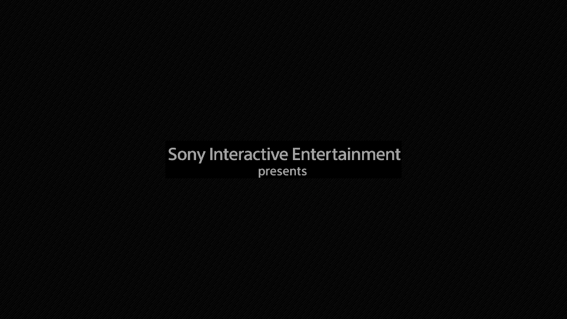

# Astro Bot routes

Reusable `PROSPER_PAD_SCRIPT` routes for Astro Bot (`PPSA21564`). Run tools from
`prosper/` so the relative paths below resolve.

## First-level headless checkpoint

`reach-first-level.pad` advances a fresh boot through `ps_logo`,
`title_controller_ship`, and `worldmap`, then selects the opening level. The
checkpoint is reached when the guest reports both:

```text
GAME: Level has started: intro_next
PLAY: SubLevelLocator sublevel_locator_hub [hub_crashsite_tutorial], state changed 1->4
```

### Route pacing is frontend-sensitive

`reach-first-level.pad` mixes wall-time pulses (60-96 s) with flip-anchored pulses at `f3800`+. Under
`boot_trace` the wall-time pulses are all spent by 96 s while the run is only near frame 1100, so
`f3800` is never reached and the guest stalls at `title_controller_ship`. That route is calibrated for
a frontend that flips far more slowly per wall-second than headless `boot_trace` does.

To reach the **world map** under `boot_trace`, use a flip-anchored route in the f730-960 window
instead; that is the pacing the retained world-map captures were produced with. Check
`PROSPER_PAD_SCRIPT_LOG=1` output against the observed frame counter before assuming a route applies
to a new frontend.

`boot_trace` frame BMPs are opt-in because 3840x2160 output reaches gigabytes over a multi-minute
route. Set `PROSPER_FRAME_DUMPS=1` only when the periodic images are needed; bundle-only capture runs
write no BMP sequence by default.

## The opening needs no route at all

Verified 2026-08-02 on master `3a473bca`. With **no** `PROSPER_PAD_SCRIPT`, the guest advances on its own
through `ps_logo` -> `title_controller_ship` -> `worldmap` and stops there:

```sh
cd prosper
PROSPER_GUEST_ARGS=-force-gfx-direct PROSPER_VULKAN_LIB=libvulkan.so.1 \
  ../build-app/screenshot <DUMP_ROOT>/PPSA21564-app0 \
    --seconds 1 --count 300 --timeout 600 --out ~/astro-run
```

This is the route to use for anything about the opening, the title card or the world-map backdrop, because
it removes route drift as an explanation when two arms are compared. `reach-worldmap-boot-trace.pad` still
matters when the world map must be *poked*, though its pulses all land before the hub is interactive — see
below.

At native 3840x2160 the phases land at roughly: 19-57 s the *Sony Interactive Entertainment presents* card,
60-145 s the opening cinematic, 150-166 s the PlayStation logo animation and PlayStation Studios card,
167-170 s a fully saturated white handoff (#1731), 171 s onward the world-map backdrop, and — the part that
had been missed — the **ASTRO BOT title card from about 380 s**, at guest flip ~1214.

## Capturing the title screen

The title card is not behind a button; it is behind ~380 seconds of rendered run, which is why no committed
route had produced it. Sample sparsely and run long:

```sh
cd prosper
PROSPER_GUEST_ARGS=-force-gfx-direct PROSPER_VULKAN_LIB=libvulkan.so.1 \
  ../build-app/screenshot <DUMP_ROOT>/PPSA21564-app0 \
    --seconds 20 --count 40 --timeout 1200 --out ~/astro-title
```

The card phase alternates roughly every other published frame between the real image and a near-black one
(#1459), so pick the sample with the highest `distinct_rgb_colors` in the manifest — around 885,000 against
~270 for its neighbours. Expect the run to end in the #1730 SIGFPE shortly after; the title frames are
already written by then, and the symptom is a frozen `pixel_crc32` while `present_count` keeps rising.

## The world map is not interactive until flip ~2700 — every older route stops before that

This is the single most expensive thing to not know about this title.

`reach-first-level.pad`, `reach-worldmap-boot-trace.pad` and `reach-first-level-windows.pad` all anchor
their world-map pulses in the `f730`-`f1210` window. The world map *arrives* around flip 810, but it does
not accept input there. Measured on a `PROSPER_NO_COMPUTE=1` run that goes all the way through:

```text
LevelDocument Loaded: worldmap [worldmap]              # around flip 810
[pad-script] elapsed=42.003 frame=2705  buttons=cross  # THIS is the press that selects a level
LevelDocument Loaded: intro_next [intro]
GAME: Level has started: intro_next                    # around flip 4400
PLAY: SubLevelLocator sublevel_locator_hub [hub_crashsite_tutorial], state changed 1->4
```

So a route that stops at `f1210` spends every pulse before the hub is ready, and the run looks like a hung
world map when nothing is wrong with it.

**`GAME: Level has started: worldmap` never fires** — not even on the run quoted above, which reaches the
first-level hub. Do not gate on it, and do not read its absence as a stall. The usable checkpoints are
`Level has started: intro_next` and the `SubLevelLocator ... [hub_crashsite_tutorial]` line.

## Guest pacing: budget in flips, not wall clock

prosper runs this title at about **3 guest flips per second** with guest compute enabled, and about **67**
with `PROSPER_NO_COMPUTE=1`. Headless `boot_trace` is no faster than the rendered `screenshot` frontend, so
the guest is not renderer-bound — see #1732.

The practical consequence: flip 2705 is ~42 s away under `PROSPER_NO_COMPUTE=1` and **~17 minutes** away in
a normal rendered run, and the first level is ~28 minutes in. Size the run accordingly, and do the
flips-to-wall-clock arithmetic before concluding that the guest failed to do something.

One operational note: `timeout N ../build-app/boot_trace ...` did **not** stop a run at N here — one
observed run was still alive at 703 s under `timeout 420` and needed `kill -9`. Check for a leftover process
before starting the next run rather than assuming the timeout collected it.

## Captures

These are unmodified frontend captures from the documented routes. The incomplete rendering is
visible in the images and is not presented as renderer-completeness evidence.

Linux app, real decoded opening movie:



Windows app, Media Foundation/DXVA opening movie and title screen:


On a host without a usable VA-API device, explicitly enable the bounded synthetic
video fallback for control-flow testing:

```sh
PROSPER_GUEST_ARGS=-force-gfx-direct \
PROSPER_NO_COMPUTE=1 \
PROSPER_AVP_SYNTH_FRAMES=120 \
PROSPER_PAD_SCRIPT=@scripts/astrobot/reach-first-level.pad \
PROSPER_PAD_SCRIPT_LOG=1 \
  timeout 180 ./build-linux/boot_trace /path/to/PPSA21564-app0
```

Synthetic video is not video-decode acceptance evidence. On a VA-API-capable
Linux host, omit `PROSPER_AVP_SYNTH_FRAMES`; on Windows, the Media Foundation
backend decodes the real H.264 stream. Keep `PROSPER_PAD_SCRIPT_LOG=1` enabled
when validating a new frontend because the flip and wall-time recovery windows
can overlap.

## Native Windows

Use `reach-first-level-windows.pad` for native Windows hardware-decode runs.
Without full-resolution frame dumping, the unskipped reference DXVA path reaches
`title_controller_ship` between about 167 and 273 seconds depending on decoder
throughput, then finishes loading `worldmap` about 13-17 seconds later. The route waits until 80 seconds—after the
hardware decoder has delivered its first frame—then repeats released
Cross/Cross/Options pulses across the logo/title transition. A second recovery
sequence covers the late unskipped-movie window because native Windows pad
polling becomes sparse once the world-map load is idle. Long Cross holds after
720 seconds cover screenshot runs where writing 3840x2160 frame dumps reduces
guest pad polling to roughly 1-2 Hz. The route also retains the validated
flip-anchored Linux sequence:

```powershell
$env:PROSPER_GUEST_ARGS = '-force-gfx-direct'
$env:PROSPER_NO_COMPUTE = '1'
$env:PROSPER_PAD_SCRIPT = '@C:/path/to/prosper/scripts/astrobot/reach-first-level-windows.pad'
$env:PROSPER_PAD_SCRIPT_LOG = '1'
prosper/build-mingw-app/boot_trace.exe C:\path\to\PPSA21564-app0
```

Do not set `PROSPER_AVP_SYNTH_FRAMES` for Windows acceptance. The log must report
`decoder=hardware DXVA MFT` before the title/first-level state markers. The
earlier 60-second mixed-clock route exposed the backend-frame lifetime bug
tracked in #855; this Windows route begins later so the log retains direct DXVA
evidence before it skips the remainder of the movie.
